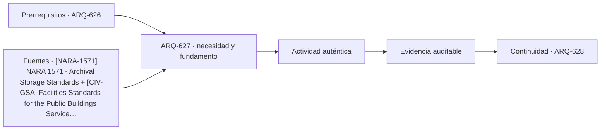

# ARQ-627 · Archivos y edificios de custodia

**Parte 63 · Clase desarrollada · Incorporada en v0.34.**

Material educativo con casos ficticios. No sustituye proyecto, normativa, habilitación profesional, evaluación de seguridad ni autorización de operación.

## Pregunta central

¿Cómo puede un archivo proteger documentos durante décadas y al mismo tiempo permitir consulta, trabajo técnico y crecimiento de la colección?

## Resultado de aprendizaje y continuidad

Diferenciarás almacenamiento, procesamiento, consulta, cuarentena, digitalización y soporte. Construirás un balance de capacidad que incorpore crecimiento y reserva sin confundir volumen físico con calidad de conservación.

## 1. Tipología y función

Un archivo no es una bodega ordinaria. El valor de la colección depende de identidad, procedencia, condiciones ambientales, seguridad, control de plagas, fuego, agua y capacidad de recuperar información.

## 2. Programa y relaciones

NARA 1571 reúne estándares para almacenamiento archivístico dentro de su ámbito, incluyendo ambiente, seguridad y preservación. La referencia se usa para ordenar preguntas; un archivo chileno requiere revisar legislación y criterios propios.

## 3. Personas, flujos y operación

Las zonas públicas de consulta deben separarse de depósitos sin impedir un flujo controlado de documentos entre ambos. Procesamiento, digitalización y cuarentena pueden requerir rutas distintas para evitar introducir riesgos al almacenamiento.

## 4. Sistemas e interfaces

El crecimiento importa desde el inicio. Diseñar depósitos llenos al 100 % el día de apertura obliga a reorganizaciones tempranas y dificulta movimientos. La reserva debe expresarse como hipótesis y revisarse con la política de colección.

## 5. Tiempo, cambio y límites

La carga estructural, incendios y agua exigen coordinación especializada. Una estantería más densa puede aumentar capacidad y simultáneamente modificar demandas de piso, accesos y mantenimiento.

## Caso trabajado: crecimiento de colección

Un depósito ficticio dispone de 8.000 metros lineales de estantería, de los cuales 6.000 están ocupados. La colección crece 240 m lineales por año. La reserva es 2.000 m; bajo crecimiento constante se agotaría en 8,33 años. Si se quiere conservar una reserva mínima de 800 m, la capacidad disponible para crecimiento es 1.200 m, equivalente a 5 años. No es una predicción: crecimiento, descarte, digitalización y reconfiguración pueden cambiar.

## Errores frecuentes y revisión crítica

No confundas una suma correcta con una decisión de proyecto completa; no conviertas capacidad nominal en aforo, disponibilidad, seguridad o calidad; no traslades referencias extranjeras como normativa local; no ocultes estados desconocidos. Cada resultado debe conservar unidad, frontera, tiempo y supuestos.

## Práctica independiente

Calcula la reserva de un archivo con 5.000 m lineales, 3.900 ocupados y crecimiento hipotético de 150 m/año. Luego propone qué espacios necesita además del depósito para consulta y procesamiento.

## Solución razonada

La solución obtiene 1.100 m de reserva y unos 7,33 años bajo crecimiento constante; debe declarar la hipótesis y no convertir digitalización en eliminación automática de originales.

## Autoevaluación y enlace

Puedes avanzar cuando distingues programa, operación y evidencia, reconstruyes el caso sin copiar la respuesta y puedes nombrar al menos una condición que el cálculo no resuelve. ARQ-628 abstrae las capas de control de acceso sin revelar tácticas ni vulnerabilidades.

<!-- pedagogia-2026:inicio -->
## Decisión pedagógica y posición curricular

### Por qué existe

Esta clase existe para resolver una necesidad concreta del recorrido: ¿Cómo puede un archivo proteger documentos durante décadas y al mismo tiempo permitir consulta, trabajo técnico y crecimiento de la colección?

### Por qué está exactamente aquí

Ocupa el lugar 7 de la Parte 63. Se estudia después de ARQ-626 · Prisiones: seguridad, dignidad y operación porque usa esa base para responder «¿Cómo puede un archivo proteger documentos durante décadas y al mismo tiempo permitir consulta, trabajo técnico y crecimiento de la colección?». Se ubica antes de ARQ-628 · Control de acceso y capas de seguridad porque la evidencia producida aquí debe estar disponible para ese paso.

- **Prerrequisitos:** `ARQ-626`
- **Capacidad que introduce:** Diferenciarás almacenamiento, procesamiento, consulta, cuarentena, digitalización y soporte. Construirás un balance de capacidad que incorpore crecimiento y reserva sin confundir volumen físico con calidad de conservación.
- **Clases o experiencias que dependen de ella:** `ARQ-628`

El diagrama permite comprobar una relación que el texto lineal oculta con facilidad: esta clase recibe capacidades previas, toma decisiones apoyadas por fuentes, exige una experiencia y produce evidencia que habilita trabajo posterior. No representa un procedimiento de obra.

## Resultado observable, evidencia y evaluación

1. Identificar y delimitar las condiciones necesarias para responder la pregunta central de archivos y edificios de custodia.
2. Producir y comprobar la evidencia declarada por la clase: Diferenciarás almacenamiento, procesamiento, consulta, cuarentena, digitalización y soporte. Construirás un balance de capacidad que incorpore crecimiento y reserva sin confundir volumen físico con calidad de conservación.
3. Justificar una decisión de archivos y edificios de custodia mediante fuentes, supuestos, alternativas y límites explícitos.

## Actividad, evidencia y criterio de aceptación

**Actividad:** Calcula la reserva de un archivo con 5.000 m lineales, 3.900 ocupados y crecimiento hipotético de 150 m/año. Luego propone qué espacios necesita además del depósito para consulta y procesamiento.

**Evidencia mínima:** Diferenciarás almacenamiento, procesamiento, consulta, cuarentena, digitalización y soporte. Construirás un balance de capacidad que incorpore crecimiento y reserva sin confundir volumen físico con calidad de conservación.

**Archivo sugerido:** `evidence/ARQ-627/evidencia.md`.

**Criterio de aceptación:** la entrega se acepta cuando:

- La entrega responde explícitamente a la pregunta: ¿Cómo puede un archivo proteger documentos durante décadas y al mismo tiempo permitir consulta, trabajo técnico y crecimiento de la colección?
- La actividad conserva las fronteras del caso y permite reconstruir el procedimiento: Calcula la reserva de un archivo con 5.000 m lineales, 3.900 ocupados y crecimiento hipotético de 150 m/año. Luego propone qué espacios necesita además del depósito para consulta y procesamiento.
- Cada afirmación externa puede seguirse hasta una fuente, su alcance consultado y su límite.
- La evidencia deja disponible una entrada comprobable para ARQ-628.
- No confundas una suma correcta con una decisión de proyecto completa; no conviertas capacidad nominal en aforo, disponibilidad, seguridad o calidad; no traslades referencias extranjeras como normativa local; no ocultes estados desconocidos. Cada resultado debe conservar unidad, frontera, tiempo y supuestos.

La [rúbrica común](../../docs/RUBRICA_COMUN.md) complementa estos criterios; no los reemplaza. Una entrega puede superar un promedio y continuar pendiente si oculta una condición crítica.

## Trazabilidad de las decisiones

| # | Decisión o fundamento | Fuente utilizada | Aplicación y límite en esta clase |
|---:|---|---|---|
| 1 | Condiciones de almacenamiento, preservación, seguridad y control ambiental de archivos. No se trasladan umbrales sin revisar su ámbito. | [[NARA-1571] NARA 1571 - Archival Storage Standards](https://www.archives.gov/foia/directives/nara1571) | Consulta: Alcance consultado no documentado; debe completarse antes de ampliar la conclusión. Límite: Condiciones de almacenamiento, preservación, seguridad y control ambiental de archivos. No se trasladan umbrales sin revisar su ámbito. |
| 2 | Referencia de edificios públicos, desempeño, accesibilidad, coordinación y ciclo de vida. Ámbito federal estadounidense; no sustituye normativa chilena. | [[CIV-GSA] Facilities Standards for the Public Buildings Service (P100)](https://www.gsa.gov/real-estate/facilities-standards-for-the-public-buildings-service) | Consulta: Alcance consultado no documentado; debe completarse antes de ampliar la conclusión. Límite: Referencia de edificios públicos, desempeño, accesibilidad, coordinación y ciclo de vida. Ámbito federal estadounidense; no sustituye normativa chilena. |

La tabla permite auditar las relaciones; la explicación, el caso y la práctica de la clase siguen siendo la documentación principal.

## Autoevaluación, recuperación y continuidad

### Errores diagnósticos

Antes de avanzar, comprueba si puedes reconstruir cada resultado sin mirar la solución, señalar qué evidencia lo sostiene y nombrar una condición que obligaría a revisar tu decisión. Conserva la primera versión, la objeción recibida y la revisión.

**Conexión siguiente:** La continuidad inmediata es ARQ-628 · Control de acceso y capas de seguridad; conserva el método y vuelve a verificar datos y límites.
<!-- pedagogia-2026:fin -->

## Fuentes y alcance de uso

- [NARA-1571] NARA 1571 - Archival Storage Standards — U.S. National Archives and Records Administration. https://www.archives.gov/foia/directives/nara1571

Uso y límite: Condiciones de almacenamiento, preservación, seguridad y control ambiental de archivos. No se trasladan umbrales sin revisar su ámbito.

- [CIV-GSA] Facilities Standards for the Public Buildings Service (P100) — U.S. General Services Administration. https://www.gsa.gov/real-estate/facilities-standards-for-the-public-buildings-service

Uso y límite: Referencia de edificios públicos, desempeño, accesibilidad, coordinación y ciclo de vida. Ámbito federal estadounidense; no sustituye normativa chilena.
