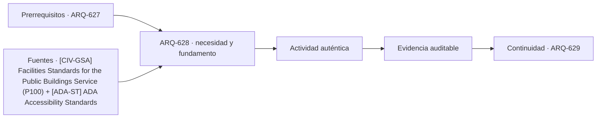

# ARQ-628 · Control de acceso y capas de seguridad

**Parte 63 · Clase desarrollada · Incorporada en v0.34.**

Material educativo con casos ficticios. No sustituye proyecto, normativa, habilitación profesional, evaluación de seguridad ni autorización de operación.

## Pregunta central

¿Cómo integrar control de acceso en arquitectura sin convertirlo en obstáculo universal ni depender de una única barrera?

## Resultado de aprendizaje y continuidad

Estudiarás capas funcionales de acceso, identidad, autorización, operación y registro. El resultado será una matriz de estados, no un diseño de seguridad explotable.

## 1. Tipología y función

Controlar acceso significa relacionar personas, actividades, horarios y zonas. No todas las áreas necesitan el mismo nivel de control, y aplicar la medida más restrictiva en todas partes puede perjudicar servicio, accesibilidad y evacuación.

## 2. Programa y relaciones

Una capa puede verificar identidad, otra autorización y otra estado físico. Que una credencial sea válida no significa que la puerta esté operativa; que una puerta esté abierta no significa que exista autorización. Mantener esas variables separadas ayuda a revisar el sistema.

## 3. Personas, flujos y operación

El diseño debe prever visitantes, entregas, mantenimiento y personas que necesitan asistencia. Excepciones improvisadas suelen aparecer cuando el proceso formal no corresponde a la operación real.

## 4. Sistemas e interfaces

La arquitectura también necesita coordinar salida, incendio y continuidad. Un control que funciona en estado ordinario no puede evaluarse sin considerar estados de emergencia y pérdida de energía.

## 5. Tiempo, cambio y límites

Por seguridad, no se describen tecnologías, configuraciones de sensores, vulnerabilidades ni procedimientos para superar controles. La clase se limita a relaciones funcionales, accesibilidad y continuidad.

## Caso trabajado: estados independientes

Un acceso ficticio requiere tres condiciones: autorización A, dispositivo operativo D y ruta interior disponible R. En cuatro escenarios se registran: (1,1,1), (1,0,1), (1,1,0), (0,1,1). Solo el primero completa la cadena. El 75 % de casillas positivas del conjunto no implica 75 % de accesos exitosos; las condiciones son conjuntivas.

## Errores frecuentes y revisión crítica

No confundas una suma correcta con una decisión de proyecto completa; no conviertas capacidad nominal en aforo, disponibilidad, seguridad o calidad; no traslades referencias extranjeras como normativa local; no ocultes estados desconocidos. Cada resultado debe conservar unidad, frontera, tiempo y supuestos.

## Práctica independiente

Define una cadena para un visitante, otra para personal y otra para mantenimiento en un edificio público. Marca condiciones necesarias y estados desconocidos sin explicar mecanismos físicos de seguridad.

## Solución razonada

La solución debe mostrar que una falla necesaria interrumpe la cadena y que un dato desconocido permanece pendiente. No se deben promediar estados para declarar seguridad.

## Autoevaluación y enlace

Puedes avanzar cuando distingues programa, operación y evidencia, reconstruyes el caso sin copiar la respuesta y puedes nombrar al menos una condición que el cálculo no resuelve. ARQ-629 amplía el análisis desde acceso a continuidad de funciones institucionales.

<!-- pedagogia-2026:inicio -->
## Decisión pedagógica y posición curricular

### Por qué existe

Esta clase existe para resolver una necesidad concreta del recorrido: ¿Cómo integrar control de acceso en arquitectura sin convertirlo en obstáculo universal ni depender de una única barrera?

### Por qué está exactamente aquí

Ocupa el lugar 8 de la Parte 63. Se estudia después de ARQ-627 · Archivos y edificios de custodia porque usa esa base para responder «¿Cómo integrar control de acceso en arquitectura sin convertirlo en obstáculo universal ni depender de una única barrera?». Se ubica antes de ARQ-629 · Continuidad institucional y emergencias porque la evidencia producida aquí debe estar disponible para ese paso.

- **Prerrequisitos:** `ARQ-627`
- **Capacidad que introduce:** Estudiarás capas funcionales de acceso, identidad, autorización, operación y registro. El resultado será una matriz de estados, no un diseño de seguridad explotable.
- **Clases o experiencias que dependen de ella:** `ARQ-629`

El diagrama permite comprobar una relación que el texto lineal oculta con facilidad: esta clase recibe capacidades previas, toma decisiones apoyadas por fuentes, exige una experiencia y produce evidencia que habilita trabajo posterior. No representa un procedimiento de obra.

## Resultado observable, evidencia y evaluación

1. Identificar y delimitar las condiciones necesarias para responder la pregunta central de control de acceso y capas de seguridad.
2. Producir y comprobar la evidencia declarada por la clase: Estudiarás capas funcionales de acceso, identidad, autorización, operación y registro. El resultado será una matriz de estados, no un diseño de seguridad explotable.
3. Justificar una decisión de control de acceso y capas de seguridad mediante fuentes, supuestos, alternativas y límites explícitos.

## Actividad, evidencia y criterio de aceptación

**Actividad:** Define una cadena para un visitante, otra para personal y otra para mantenimiento en un edificio público. Marca condiciones necesarias y estados desconocidos sin explicar mecanismos físicos de seguridad.

**Evidencia mínima:** Estudiarás capas funcionales de acceso, identidad, autorización, operación y registro. El resultado será una matriz de estados, no un diseño de seguridad explotable.

**Archivo sugerido:** `evidence/ARQ-628/evidencia.md`.

**Criterio de aceptación:** la entrega se acepta cuando:

- La entrega responde explícitamente a la pregunta: ¿Cómo integrar control de acceso en arquitectura sin convertirlo en obstáculo universal ni depender de una única barrera?
- La actividad conserva las fronteras del caso y permite reconstruir el procedimiento: Define una cadena para un visitante, otra para personal y otra para mantenimiento en un edificio público. Marca condiciones necesarias y estados desconocidos sin explicar mecanismos físicos de seguridad.
- Cada afirmación externa puede seguirse hasta una fuente, su alcance consultado y su límite.
- La evidencia deja disponible una entrada comprobable para ARQ-629.
- No confundas una suma correcta con una decisión de proyecto completa; no conviertas capacidad nominal en aforo, disponibilidad, seguridad o calidad; no traslades referencias extranjeras como normativa local; no ocultes estados desconocidos. Cada resultado debe conservar unidad, frontera, tiempo y supuestos.

La [rúbrica común](../../docs/RUBRICA_COMUN.md) complementa estos criterios; no los reemplaza. Una entrega puede superar un promedio y continuar pendiente si oculta una condición crítica.

## Trazabilidad de las decisiones

| # | Decisión o fundamento | Fuente utilizada | Aplicación y límite en esta clase |
|---:|---|---|---|
| 1 | Referencia de edificios públicos, desempeño, accesibilidad, coordinación y ciclo de vida. Ámbito federal estadounidense; no sustituye normativa chilena. | [[CIV-GSA] Facilities Standards for the Public Buildings Service (P100)](https://www.gsa.gov/real-estate/facilities-standards-for-the-public-buildings-service) | Consulta: Alcance consultado no documentado; debe completarse antes de ampliar la conclusión. Límite: Referencia de edificios públicos, desempeño, accesibilidad, coordinación y ciclo de vida. Ámbito federal estadounidense; no sustituye normativa chilena. |
| 2 | Accesibilidad de edificios, tribunales, detención, alojamiento temporal y áreas públicas. No se presenta como norma chilena. | [[ADA-ST] ADA Accessibility Standards](https://www.access-board.gov/ada/) | Consulta: Alcance consultado no documentado; debe completarse antes de ampliar la conclusión. Límite: Accesibilidad de edificios, tribunales, detención, alojamiento temporal y áreas públicas. No se presenta como norma chilena. |

La tabla permite auditar las relaciones; la explicación, el caso y la práctica de la clase siguen siendo la documentación principal.

## Autoevaluación, recuperación y continuidad

### Errores diagnósticos

Antes de avanzar, comprueba si puedes reconstruir cada resultado sin mirar la solución, señalar qué evidencia lo sostiene y nombrar una condición que obligaría a revisar tu decisión. Conserva la primera versión, la objeción recibida y la revisión.

**Conexión siguiente:** La continuidad inmediata es ARQ-629 · Continuidad institucional y emergencias; conserva el método y vuelve a verificar datos y límites.
<!-- pedagogia-2026:fin -->

## Fuentes y alcance de uso

- [CIV-GSA] Facilities Standards for the Public Buildings Service (P100) — U.S. General Services Administration. https://www.gsa.gov/real-estate/facilities-standards-for-the-public-buildings-service

Uso y límite: Referencia de edificios públicos, desempeño, accesibilidad, coordinación y ciclo de vida. Ámbito federal estadounidense; no sustituye normativa chilena.

- [ADA-ST] ADA Accessibility Standards — U.S. Access Board. https://www.access-board.gov/ada/

Uso y límite: Accesibilidad de edificios, tribunales, detención, alojamiento temporal y áreas públicas. No se presenta como norma chilena.
