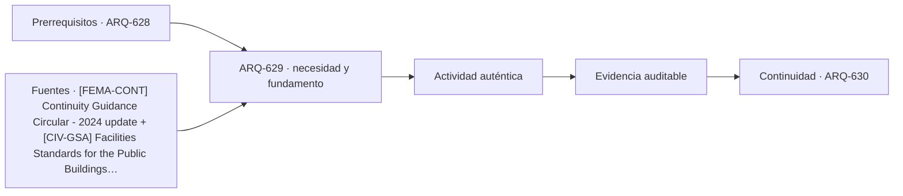

# ARQ-629 · Continuidad institucional y emergencias

**Parte 63 · Clase desarrollada · Incorporada en v0.34.**

Material educativo con casos ficticios. No sustituye proyecto, normativa, habilitación profesional, evaluación de seguridad ni autorización de operación.

## Pregunta central

¿Cómo puede un edificio público conservar funciones esenciales cuando parte de sus espacios, sistemas o comunicaciones dejan de estar disponibles?

## Resultado de aprendizaje y continuidad

Construirás una red de dependencias entre función, espacio, personal, información y utilidades. Diferenciarás continuidad organizacional de mera supervivencia del edificio.

## 1. Tipología y función

La continuidad no consiste solo en disponer de un generador o una sala alternativa. Una función puede depender de personas, datos, energía, comunicaciones, acceso y proveedores. La pérdida de cualquiera de ellos puede impedir el servicio.

## 2. Programa y relaciones

La Continuity Guidance Circular de FEMA organiza la continuidad alrededor de funciones esenciales, flexibilidad y resiliencia. En el curso se usa para formular dependencias; no se aplica como obligación legal chilena.

## 3. Personas, flujos y operación

El edificio puede apoyar continuidad mediante redundancia espacial, posibilidad de operación parcial, documentación, conexiones alternativas y mantenimiento. Pero duplicar un espacio no duplica automáticamente todos sus sistemas y recursos.

## 4. Sistemas e interfaces

Es importante distinguir función esencial, nivel mínimo de servicio y condición de retorno. Un edificio puede reabrir antes de recuperar toda su capacidad o puede estar físicamente intacto pero sin información necesaria para operar.

## 5. Tiempo, cambio y límites

Las pruebas de continuidad deben conservar escenarios y resultados. Un ejercicio favorable no prueba todos los eventos ni justifica eliminar una dependencia que no fue ensayada.

## Caso trabajado: red de dependencias

Una función F necesita espacio S, datos D y energía E. S tiene alternativa S2 y E dispone de respaldo, pero D se almacena en un único servicio. En el grafo, perder S1 no interrumpe F; perder E principal tampoco, si el respaldo opera; perder D sí interrumpe la función. El caso muestra que dos redundancias no compensan un punto único de dependencia en otra capa.

## Errores frecuentes y revisión crítica

No confundas una suma correcta con una decisión de proyecto completa; no conviertas capacidad nominal en aforo, disponibilidad, seguridad o calidad; no traslades referencias extranjeras como normativa local; no ocultes estados desconocidos. Cada resultado debe conservar unidad, frontera, tiempo y supuestos.

## Práctica independiente

Construye una red de una atención municipal con local, personal, datos y comunicación. Propón un escenario de operación mínima y marca qué dependencias siguen sin alternativa.

## Solución razonada

La solución debe identificar funciones esenciales, no simplemente listar equipos. También debe distinguir disponibilidad nominal y evidencia de funcionamiento real.

## Autoevaluación y enlace

Puedes avanzar cuando distingues programa, operación y evidencia, reconstruyes el caso sin copiar la respuesta y puedes nombrar al menos una condición que el cálculo no resuelve. ARQ-630 integra servicio público, justicia, custodia documental y continuidad en un proyecto cívico complejo.

<!-- pedagogia-2026:inicio -->
## Decisión pedagógica y posición curricular

### Por qué existe

Esta clase existe para resolver una necesidad concreta del recorrido: ¿Cómo puede un edificio público conservar funciones esenciales cuando parte de sus espacios, sistemas o comunicaciones dejan de estar disponibles?

### Por qué está exactamente aquí

Ocupa el lugar 9 de la Parte 63. Se estudia después de ARQ-628 · Control de acceso y capas de seguridad porque usa esa base para responder «¿Cómo puede un edificio público conservar funciones esenciales cuando parte de sus espacios, sistemas o comunicaciones dejan de estar disponibles?». Se ubica antes de ARQ-630 · Proyecto cívico de alta complejidad porque la evidencia producida aquí debe estar disponible para ese paso.

- **Prerrequisitos:** `ARQ-628`
- **Capacidad que introduce:** Construirás una red de dependencias entre función, espacio, personal, información y utilidades. Diferenciarás continuidad organizacional de mera supervivencia del edificio.
- **Clases o experiencias que dependen de ella:** `ARQ-630`

El diagrama permite comprobar una relación que el texto lineal oculta con facilidad: esta clase recibe capacidades previas, toma decisiones apoyadas por fuentes, exige una experiencia y produce evidencia que habilita trabajo posterior. No representa un procedimiento de obra.

## Resultado observable, evidencia y evaluación

1. Identificar y delimitar las condiciones necesarias para responder la pregunta central de continuidad institucional y emergencias.
2. Producir y comprobar la evidencia declarada por la clase: Construirás una red de dependencias entre función, espacio, personal, información y utilidades. Diferenciarás continuidad organizacional de mera supervivencia del edificio.
3. Justificar una decisión de continuidad institucional y emergencias mediante fuentes, supuestos, alternativas y límites explícitos.

## Actividad, evidencia y criterio de aceptación

**Actividad:** Construye una red de una atención municipal con local, personal, datos y comunicación. Propón un escenario de operación mínima y marca qué dependencias siguen sin alternativa.

**Evidencia mínima:** Construirás una red de dependencias entre función, espacio, personal, información y utilidades. Diferenciarás continuidad organizacional de mera supervivencia del edificio.

**Archivo sugerido:** `evidence/ARQ-629/evidencia.md`.

**Criterio de aceptación:** la entrega se acepta cuando:

- La entrega responde explícitamente a la pregunta: ¿Cómo puede un edificio público conservar funciones esenciales cuando parte de sus espacios, sistemas o comunicaciones dejan de estar disponibles?
- La actividad conserva las fronteras del caso y permite reconstruir el procedimiento: Construye una red de una atención municipal con local, personal, datos y comunicación. Propón un escenario de operación mínima y marca qué dependencias siguen sin alternativa.
- Cada afirmación externa puede seguirse hasta una fuente, su alcance consultado y su límite.
- La evidencia deja disponible una entrada comprobable para ARQ-630.
- No confundas una suma correcta con una decisión de proyecto completa; no conviertas capacidad nominal en aforo, disponibilidad, seguridad o calidad; no traslades referencias extranjeras como normativa local; no ocultes estados desconocidos. Cada resultado debe conservar unidad, frontera, tiempo y supuestos.

La [rúbrica común](../../docs/RUBRICA_COMUN.md) complementa estos criterios; no los reemplaza. Una entrega puede superar un promedio y continuar pendiente si oculta una condición crítica.

## Trazabilidad de las decisiones

| # | Decisión o fundamento | Fuente utilizada | Aplicación y límite en esta clase |
|---:|---|---|---|
| 1 | Continuidad de funciones esenciales, resiliencia y planificación organizacional. Referencia estadounidense. | [[FEMA-CONT] Continuity Guidance Circular - 2024 update](https://www.fema.gov/sites/default/files/documents/fema_continuity-guidance-circular_082024.pdf) | Consulta: Alcance consultado no documentado; debe completarse antes de ampliar la conclusión. Límite: Continuidad de funciones esenciales, resiliencia y planificación organizacional. Referencia estadounidense. |
| 2 | Referencia de edificios públicos, desempeño, accesibilidad, coordinación y ciclo de vida. Ámbito federal estadounidense; no sustituye normativa chilena. | [[CIV-GSA] Facilities Standards for the Public Buildings Service (P100)](https://www.gsa.gov/real-estate/facilities-standards-for-the-public-buildings-service) | Consulta: Alcance consultado no documentado; debe completarse antes de ampliar la conclusión. Límite: Referencia de edificios públicos, desempeño, accesibilidad, coordinación y ciclo de vida. Ámbito federal estadounidense; no sustituye normativa chilena. |

La tabla permite auditar las relaciones; la explicación, el caso y la práctica de la clase siguen siendo la documentación principal.

## Autoevaluación, recuperación y continuidad

### Errores diagnósticos

Antes de avanzar, comprueba si puedes reconstruir cada resultado sin mirar la solución, señalar qué evidencia lo sostiene y nombrar una condición que obligaría a revisar tu decisión. Conserva la primera versión, la objeción recibida y la revisión.

**Conexión siguiente:** La continuidad inmediata es ARQ-630 · Proyecto cívico de alta complejidad; conserva el método y vuelve a verificar datos y límites.
<!-- pedagogia-2026:fin -->

## Fuentes y alcance de uso

- [FEMA-CONT] Continuity Guidance Circular - 2024 update — Federal Emergency Management Agency. https://www.fema.gov/sites/default/files/documents/fema_continuity-guidance-circular_082024.pdf

Uso y límite: Continuidad de funciones esenciales, resiliencia y planificación organizacional. Referencia estadounidense.

- [CIV-GSA] Facilities Standards for the Public Buildings Service (P100) — U.S. General Services Administration. https://www.gsa.gov/real-estate/facilities-standards-for-the-public-buildings-service

Uso y límite: Referencia de edificios públicos, desempeño, accesibilidad, coordinación y ciclo de vida. Ámbito federal estadounidense; no sustituye normativa chilena.
