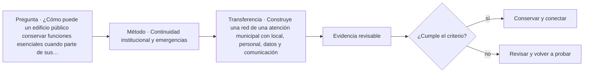

# ARQ-629 · Continuidad institucional y emergencias

**Parte 63 · Clase desarrollada · Incorporada en v0.34.**

Material educativo con casos ficticios. No sustituye proyecto, normativa, habilitación profesional, evaluación de seguridad ni autorización de operación.

## Pregunta central

¿Cómo puede un edificio público conservar funciones esenciales cuando parte de sus espacios, sistemas o comunicaciones dejan de estar disponibles?

## Resultado de aprendizaje y continuidad

Construirás una red de dependencias entre función, espacio, personal, información y utilidades. Diferenciarás continuidad organizacional de mera supervivencia del edificio.

## 1. Tipología y función

La continuidad no consiste solo en disponer de un generador o una sala alternativa. Una función puede depender de personas, datos, energía, comunicaciones, acceso y proveedores. La pérdida de cualquiera de ellos puede impedir el servicio.

## 2. Programa y relaciones

La Continuity Guidance Circular de FEMA organiza la continuidad alrededor de funciones esenciales, flexibilidad y resiliencia. En el curso se usa para formular dependencias; no se aplica como obligación legal chilena.

## 3. Personas, flujos y operación

El edificio puede apoyar continuidad mediante redundancia espacial, posibilidad de operación parcial, documentación, conexiones alternativas y mantenimiento. Pero duplicar un espacio no duplica automáticamente todos sus sistemas y recursos.

## 4. Sistemas e interfaces

Es importante distinguir función esencial, nivel mínimo de servicio y condición de retorno. Un edificio puede reabrir antes de recuperar toda su capacidad o puede estar físicamente intacto pero sin información necesaria para operar.

## 5. Tiempo, cambio y límites

Las pruebas de continuidad deben conservar escenarios y resultados. Un ejercicio favorable no prueba todos los eventos ni justifica eliminar una dependencia que no fue ensayada.

## Caso trabajado: red de dependencias

Una función F necesita espacio S, datos D y energía E. S tiene alternativa S2 y E dispone de respaldo, pero D se almacena en un único servicio. En el grafo, perder S1 no interrumpe F; perder E principal tampoco, si el respaldo opera; perder D sí interrumpe la función. El caso muestra que dos redundancias no compensan un punto único de dependencia en otra capa.

## Errores frecuentes y revisión crítica

No confundas una suma correcta con una decisión de proyecto completa; no conviertas capacidad nominal en aforo, disponibilidad, seguridad o calidad; no traslades referencias extranjeras como normativa local; no ocultes estados desconocidos. Cada resultado debe conservar unidad, frontera, tiempo y supuestos.

## Práctica independiente

Construye una red de una atención municipal con local, personal, datos y comunicación. Propón un escenario de operación mínima y marca qué dependencias siguen sin alternativa.

## Solución razonada

La solución debe identificar funciones esenciales, no simplemente listar equipos. También debe distinguir disponibilidad nominal y evidencia de funcionamiento real.

## Autoevaluación y enlace

Puedes avanzar cuando distingues programa, operación y evidencia, reconstruyes el caso sin copiar la respuesta y puedes nombrar al menos una condición que el cálculo no resuelve. ARQ-630 integra servicio público, justicia, custodia documental y continuidad en un proyecto cívico complejo.

<!-- pedagogia-2026:inicio -->
## Mapa visual de aprendizaje

El diagrama representa el ciclo de aprendizaje de esta clase, no una secuencia de obra ni un procedimiento profesional.

## Resultado observable, evidencia y evaluación

**Tipo de clase:** proyectual.

**Evidencia mínima:** lámina o expediente con alternativas, representación pertinente, decisión argumentada, revisión y asuntos pendientes.

**Archivo sugerido:** `evidence/ARQ-629/evidencia.md`.

| Criterio | Evidencia observable |
|---|---|
| Precisión y representación · 20 % | Los conceptos, unidades y convenciones se usan de forma coherente y pueden ser reconstruidos por otra persona. |
| Evidencia y trazabilidad · 25 % | Cada afirmación importante se vincula con dato, cálculo, observación o fuente; hipótesis y desconocidos permanecen visibles. |
| Decisión y alternativas · 25 % | La decisión responde a la pregunta, compara al menos una alternativa y declara qué condición la haría cambiar. |
| Integración y ciclo de vida · 20 % | Se identifica una interfaz y una consecuencia para construcción, uso, mantenimiento, adaptación o fin de vida. |
| Comunicación, ética y límites · 10 % | El alcance se entiende sin explicación oral adicional y no se atribuyen permisos, competencias o certezas inexistentes. |

**Criterio de aceptación:** 80/100 y ningún criterio bajo 60 %. Una entrega genérica que podría reutilizarse sin cambios en otra clase no demuestra dominio. Si existe una condición crítica de seguridad, accesibilidad, evidencia o responsabilidad sin resolver, la entrega permanece pendiente aunque el promedio supere 80.

### Errores diagnósticos

En esta clase conviene vigilar especialmente: comparar alternativas con alcances distintos; defender la imagen antes que el servicio; borrar las huellas de la revisión.

## Autoevaluación, recuperación y continuidad

Antes de avanzar, responde sin consultar la solución:

1. ¿Qué decisión concreta puedes tomar ahora que no podías justificar antes?
2. ¿Qué evidencia de tu entrega es comprobada y cuál continúa siendo una hipótesis?
3. ¿Qué cambio de contexto invalidaría la transferencia realizada?

Revisa la entrega a las 24–48 horas y nuevamente al cerrar la parte. Conserva la primera versión, la crítica recibida y la versión revisada: el aprendizaje se demuestra también mediante el cambio entre versiones.
<!-- pedagogia-2026:fin -->

## Fuentes y alcance de uso

- [FEMA-CONT] Continuity Guidance Circular - 2024 update — Federal Emergency Management Agency. https://www.fema.gov/sites/default/files/documents/fema_continuity-guidance-circular_082024.pdf

Uso y límite: Continuidad de funciones esenciales, resiliencia y planificación organizacional. Referencia estadounidense.

- [CIV-GSA] Facilities Standards for the Public Buildings Service (P100) — U.S. General Services Administration. https://www.gsa.gov/real-estate/facilities-standards-for-the-public-buildings-service

Uso y límite: Referencia de edificios públicos, desempeño, accesibilidad, coordinación y ciclo de vida. Ámbito federal estadounidense; no sustituye normativa chilena.
