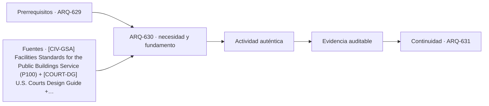

# ARQ-630 · Proyecto cívico de alta complejidad

**Parte 63 · Clase desarrollada · Incorporada en v0.34.**

Material educativo con casos ficticios. No sustituye proyecto, normativa, habilitación profesional, evaluación de seguridad ni autorización de operación.

## Pregunta central

¿Cómo integrar múltiples servicios públicos, un tribunal, archivo y funciones comunitarias sin que la suma de programas destruya legibilidad, accesibilidad y continuidad?

## Resultado de aprendizaje y continuidad

Elaborarás un anteproyecto conceptual con programa, flujos, interfaces y estados de operación. Defenderás decisiones y pendientes en vez de producir una planta supuestamente definitiva.

## 1. Tipología y función

El caso integrador reúne tipologías distintas bajo una misma estrategia urbana. El primer paso es no fusionarlas indiscriminadamente: cada una conserva actividades, responsabilidades y condiciones propias.

## 2. Programa y relaciones

Las áreas públicas pueden compartir plaza, vestíbulo o servicios, pero los flujos internos no necesariamente lo hacen. El proyecto debe justificar cada interfaz y mostrar cómo cambia durante horario extendido, mantenimiento o contingencia.

## 3. Personas, flujos y operación

La expresión cívica no se evalúa mediante un estilo obligatorio. Se estudia si el edificio resulta comprensible, acogedor, durable y capaz de representar su función sin sacrificar accesibilidad o desempeño.

## 4. Sistemas e interfaces

Archivo, salas de audiencia, atención y espacios comunitarios imponen exigencias distintas de acústica, ambiente, seguridad y soporte. La coordinación debe ocurrir antes de convertir cada especialidad en un documento independiente.

## 5. Tiempo, cambio y límites

El expediente final distingue comprobado, propuesto y pendiente. Ninguna tabla de áreas sustituye revisión legal, estructural, de seguridad, incendios, accesibilidad o tecnología.

## Caso trabajado: programa y área compartida

Un complejo ficticio tiene 2.400 m² programáticos: 900 de atención municipal, 700 de tribunal, 500 de archivo y 300 de salas comunitarias. Se propone compartir 180 m² de vestíbulo que inicialmente estaban incluidos por separado como 80, 60 y 40 m² en tres sectores. Si se eliminan esas duplicaciones y se introduce el vestíbulo común de 180 m², el total programático no cambia: 2.400 -180 +180 = 2.400. La ganancia no es área; es coordinación potencial. Si el vestíbulo común obliga a aumentar controles, recorridos o soporte, el balance puede cambiar.

## Errores frecuentes y revisión crítica

No confundas una suma correcta con una decisión de proyecto completa; no conviertas capacidad nominal en aforo, disponibilidad, seguridad o calidad; no traslades referencias extranjeras como normativa local; no ocultes estados desconocidos. Cada resultado debe conservar unidad, frontera, tiempo y supuestos.

## Práctica independiente

Diseña una matriz de interfaces para este complejo: acceso, información, circulación, archivo, sala comunitaria y tribunal. Selecciona dos interfaces críticas y explica qué evidencia falta.

## Solución razonada

La solución debe mantener identidades funcionales, demostrar cualquier suma de superficies y registrar al menos una condición de continuidad y otra de accesibilidad.

## Autoevaluación y enlace

Puedes avanzar cuando distingues programa, operación y evidencia, reconstruyes el caso sin copiar la respuesta y puedes nombrar al menos una condición que el cálculo no resuelve. ARQ-631 cambia a hospitalidad y alojamiento temporal, manteniendo métodos de programa y operación.

<!-- pedagogia-2026:inicio -->
## Decisión pedagógica y posición curricular

### Por qué existe

Esta clase existe para resolver una necesidad concreta del recorrido: ¿Cómo integrar múltiples servicios públicos, un tribunal, archivo y funciones comunitarias sin que la suma de programas destruya legibilidad, accesibilidad y continuidad?

### Por qué está exactamente aquí

Cierra la Parte 63: integra lo producido en ARQ-629 · Continuidad institucional y emergencias para responder «¿Cómo integrar múltiples servicios públicos, un tribunal, archivo y funciones comunitarias sin que la suma de programas destruya legibilidad, accesibilidad y continuidad?». La transición hacia ARQ-631 · Hotel: habitación, pasillo y servicio transfiere el método y la disciplina de evidencia, no los datos o parámetros particulares de esta parte.

- **Prerrequisitos:** `ARQ-629`
- **Capacidad que introduce:** Elaborarás un anteproyecto conceptual con programa, flujos, interfaces y estados de operación. Defenderás decisiones y pendientes en vez de producir una planta supuestamente definitiva.
- **Clases o experiencias que dependen de ella:** `ARQ-631`

El diagrama permite comprobar una relación que el texto lineal oculta con facilidad: esta clase recibe capacidades previas, toma decisiones apoyadas por fuentes, exige una experiencia y produce evidencia que habilita trabajo posterior. No representa un procedimiento de obra.

## Resultado observable, evidencia y evaluación

1. Identificar y delimitar las condiciones necesarias para responder la pregunta central de proyecto cívico de alta complejidad.
2. Producir y comprobar la evidencia declarada por la clase: Elaborarás un anteproyecto conceptual con programa, flujos, interfaces y estados de operación. Defenderás decisiones y pendientes en vez de producir una planta supuestamente definitiva.
3. Justificar una decisión de proyecto cívico de alta complejidad mediante fuentes, supuestos, alternativas y límites explícitos.

## Actividad, evidencia y criterio de aceptación

**Actividad:** Diseña una matriz de interfaces para este complejo: acceso, información, circulación, archivo, sala comunitaria y tribunal. Selecciona dos interfaces críticas y explica qué evidencia falta.

**Evidencia mínima:** Elaborarás un anteproyecto conceptual con programa, flujos, interfaces y estados de operación. Defenderás decisiones y pendientes en vez de producir una planta supuestamente definitiva.

**Archivo sugerido:** `evidence/ARQ-630/evidencia.md`.

**Criterio de aceptación:** la entrega se acepta cuando:

- La entrega responde explícitamente a la pregunta: ¿Cómo integrar múltiples servicios públicos, un tribunal, archivo y funciones comunitarias sin que la suma de programas destruya legibilidad, accesibilidad y continuidad?
- La actividad conserva las fronteras del caso y permite reconstruir el procedimiento: Diseña una matriz de interfaces para este complejo: acceso, información, circulación, archivo, sala comunitaria y tribunal. Selecciona dos interfaces críticas y explica qué evidencia falta.
- Cada afirmación externa puede seguirse hasta una fuente, su alcance consultado y su límite.
- La evidencia deja disponible una entrada comprobable para ARQ-631.
- No confundas una suma correcta con una decisión de proyecto completa; no conviertas capacidad nominal en aforo, disponibilidad, seguridad o calidad; no traslades referencias extranjeras como normativa local; no ocultes estados desconocidos. Cada resultado debe conservar unidad, frontera, tiempo y supuestos.

La [rúbrica común](../../docs/RUBRICA_COMUN.md) complementa estos criterios; no los reemplaza. Una entrega puede superar un promedio y continuar pendiente si oculta una condición crítica.

## Trazabilidad de las decisiones

| # | Decisión o fundamento | Fuente utilizada | Aplicación y límite en esta clase |
|---:|---|---|---|
| 1 | Referencia de edificios públicos, desempeño, accesibilidad, coordinación y ciclo de vida. Ámbito federal estadounidense; no sustituye normativa chilena. | [[CIV-GSA] Facilities Standards for the Public Buildings Service (P100)](https://www.gsa.gov/real-estate/facilities-standards-for-the-public-buildings-service) | Consulta: Alcance consultado no documentado; debe completarse antes de ampliar la conclusión. Límite: Referencia de edificios públicos, desempeño, accesibilidad, coordinación y ciclo de vida. Ámbito federal estadounidense; no sustituye normativa chilena. |
| 2 | Organización funcional de tribunales, recorridos diferenciados y soporte operativo. Ámbito de tribunales federales de EE. UU. | [[COURT-DG] U.S. Courts Design Guide](https://www.uscourts.gov/administration-policies/judiciary-policies/us-courts-design-guide) | Consulta: Alcance consultado no documentado; debe completarse antes de ampliar la conclusión. Límite: Organización funcional de tribunales, recorridos diferenciados y soporte operativo. Ámbito de tribunales federales de EE. UU. |
| 3 | Condiciones de almacenamiento, preservación, seguridad y control ambiental de archivos. No se trasladan umbrales sin revisar su ámbito. | [[NARA-1571] NARA 1571 - Archival Storage Standards](https://www.archives.gov/foia/directives/nara1571) | Consulta: Alcance consultado no documentado; debe completarse antes de ampliar la conclusión. Límite: Condiciones de almacenamiento, preservación, seguridad y control ambiental de archivos. No se trasladan umbrales sin revisar su ámbito. |
| 4 | Continuidad de funciones esenciales, resiliencia y planificación organizacional. Referencia estadounidense. | [[FEMA-CONT] Continuity Guidance Circular - 2024 update](https://www.fema.gov/sites/default/files/documents/fema_continuity-guidance-circular_082024.pdf) | Consulta: Alcance consultado no documentado; debe completarse antes de ampliar la conclusión. Límite: Continuidad de funciones esenciales, resiliencia y planificación organizacional. Referencia estadounidense. |

La tabla permite auditar las relaciones; la explicación, el caso y la práctica de la clase siguen siendo la documentación principal.

## Autoevaluación, recuperación y continuidad

### Errores diagnósticos

Antes de avanzar, comprueba si puedes reconstruir cada resultado sin mirar la solución, señalar qué evidencia lo sostiene y nombrar una condición que obligaría a revisar tu decisión. Conserva la primera versión, la objeción recibida y la revisión.

**Conexión siguiente:** La continuidad inmediata es ARQ-631 · Hotel: habitación, pasillo y servicio; conserva el método y vuelve a verificar datos y límites.
<!-- pedagogia-2026:fin -->

## Fuentes y alcance de uso

- [CIV-GSA] Facilities Standards for the Public Buildings Service (P100) — U.S. General Services Administration. https://www.gsa.gov/real-estate/facilities-standards-for-the-public-buildings-service

Uso y límite: Referencia de edificios públicos, desempeño, accesibilidad, coordinación y ciclo de vida. Ámbito federal estadounidense; no sustituye normativa chilena.

- [COURT-DG] U.S. Courts Design Guide — Administrative Office of the U.S. Courts. https://www.uscourts.gov/administration-policies/judiciary-policies/us-courts-design-guide

Uso y límite: Organización funcional de tribunales, recorridos diferenciados y soporte operativo. Ámbito de tribunales federales de EE. UU.

- [NARA-1571] NARA 1571 - Archival Storage Standards — U.S. National Archives and Records Administration. https://www.archives.gov/foia/directives/nara1571

Uso y límite: Condiciones de almacenamiento, preservación, seguridad y control ambiental de archivos. No se trasladan umbrales sin revisar su ámbito.

- [FEMA-CONT] Continuity Guidance Circular - 2024 update — Federal Emergency Management Agency. https://www.fema.gov/sites/default/files/documents/fema_continuity-guidance-circular_082024.pdf

Uso y límite: Continuidad de funciones esenciales, resiliencia y planificación organizacional. Referencia estadounidense.
