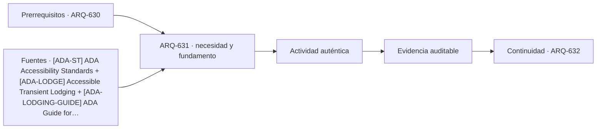

# ARQ-631 · Hotel: habitación, pasillo y servicio

**Parte 64 · Clase desarrollada · Incorporada en v0.34.**

Material educativo con casos ficticios. No sustituye proyecto, normativa, habilitación profesional, evaluación de seguridad ni autorización de operación.

## Pregunta central

¿Cómo se convierte una colección de habitaciones en un hotel que pueda alojar, orientar, limpiar, mantener y servir a personas con necesidades distintas?

## Resultado de aprendizaje y continuidad

Analizarás habitación, baño, circulación, housekeeping, instalaciones y accesibilidad como un sistema. Construirás una mezcla de habitaciones sin confundir ocupación comercial con capacidad física.

## 1. Tipología y función

El hotel combina estancia privada y servicio intensivo. La habitación no puede estudiarse separada de pasillos, ascensores, limpieza, lavandería, mantenimiento, recepción y evacuación.

## 2. Programa y relaciones

La accesibilidad requiere habitaciones con características apropiadas y, además, cadenas accesibles hacia recepción, comedor, salas y otros servicios. Las referencias ADA/ABA ayudan a identificar esa lógica, pero no sustituyen regulación chilena.

## 3. Personas, flujos y operación

La distribución vertical afecta tanto huéspedes como operación. Si housekeeping depende de los mismos ascensores en horas punta, pueden aparecer conflictos aunque la capacidad total parezca suficiente.

## 4. Sistemas e interfaces

El módulo de habitación condiciona fachada, estructura, instalaciones y repetición. Una pequeña variación de ancho puede multiplicarse por decenas de habitaciones y modificar largo del edificio o cantidad de módulos.

## 5. Tiempo, cambio y límites

La operación también incluye estados de habitación: disponible, ocupada, en limpieza, bloqueada por mantenimiento. El inventario comercial cambia durante el día y no equivale al número físico de puertas.

## Caso trabajado: mezcla de habitaciones

Un hotel ficticio tiene 120 habitaciones: 84 dobles, 24 individuales y 12 suites. Si la ocupación hipotética es dos personas por doble, una por individual y tres por suite, la ocupación máxima del escenario es 84×2 +24 +12×3 = 228 personas. Si 10 habitaciones están fuera de servicio, no basta restar 10 personas: depende de qué tipos se retiraron. El cálculo de ocupación necesita conservar la mezcla.

## Errores frecuentes y revisión crítica

No confundas una suma correcta con una decisión de proyecto completa; no conviertas capacidad nominal en aforo, disponibilidad, seguridad o calidad; no traslades referencias extranjeras como normativa local; no ocultes estados desconocidos. Cada resultado debe conservar unidad, frontera, tiempo y supuestos.

## Práctica independiente

Propón una planta tipo con 30 habitaciones y dos núcleos de servicio. Explica recorridos de huésped y housekeeping sin asignar dimensiones normativas inventadas.

## Solución razonada

La solución debe distinguir inventario físico, mezcla de habitaciones y ocupación. Debe mantener accesibilidad y soporte como condiciones propias, no como “habitaciones especiales” aisladas.

## Autoevaluación y enlace

Puedes avanzar cuando distingues programa, operación y evidencia, reconstruyes el caso sin copiar la respuesta y puedes nombrar al menos una condición que el cálculo no resuelve. ARQ-632 lleva la experiencia al lobby, restaurante y espacios comunes.

<!-- pedagogia-2026:inicio -->
## Decisión pedagógica y posición curricular

### Por qué existe

Esta clase existe para resolver una necesidad concreta del recorrido: ¿Cómo se convierte una colección de habitaciones en un hotel que pueda alojar, orientar, limpiar, mantener y servir a personas con necesidades distintas?

### Por qué está exactamente aquí

Abre la Parte 64 porque plantea primero el problema «¿Cómo se convierte una colección de habitaciones en un hotel que pueda alojar, orientar, limpiar, mantener y servir a personas con necesidades distintas?». La transición desde ARQ-630 · Proyecto cívico de alta complejidad conserva métodos de evidencia y límites, pero no traslada parámetros del bloque anterior. Establece la pregunta y el producto base que ARQ-632 · Lobby, restaurante y espacios comunes desarrollará a continuación.

- **Prerrequisitos:** `ARQ-630`
- **Capacidad que introduce:** Analizarás habitación, baño, circulación, housekeeping, instalaciones y accesibilidad como un sistema. Construirás una mezcla de habitaciones sin confundir ocupación comercial con capacidad física.
- **Clases o experiencias que dependen de ella:** `ARQ-632`

El diagrama permite comprobar una relación que el texto lineal oculta con facilidad: esta clase recibe capacidades previas, toma decisiones apoyadas por fuentes, exige una experiencia y produce evidencia que habilita trabajo posterior. No representa un procedimiento de obra.

## Resultado observable, evidencia y evaluación

1. Identificar y delimitar las condiciones necesarias para responder la pregunta central de hotel: habitación, pasillo y servicio.
2. Producir y comprobar la evidencia declarada por la clase: Analizarás habitación, baño, circulación, housekeeping, instalaciones y accesibilidad como un sistema. Construirás una mezcla de habitaciones sin confundir ocupación comercial con capacidad física.
3. Justificar una decisión de hotel: habitación, pasillo y servicio mediante fuentes, supuestos, alternativas y límites explícitos.

## Actividad, evidencia y criterio de aceptación

**Actividad:** Propón una planta tipo con 30 habitaciones y dos núcleos de servicio. Explica recorridos de huésped y housekeeping sin asignar dimensiones normativas inventadas.

**Evidencia mínima:** Analizarás habitación, baño, circulación, housekeeping, instalaciones y accesibilidad como un sistema. Construirás una mezcla de habitaciones sin confundir ocupación comercial con capacidad física.

**Archivo sugerido:** `evidence/ARQ-631/evidencia.md`.

**Criterio de aceptación:** la entrega se acepta cuando:

- La entrega responde explícitamente a la pregunta: ¿Cómo se convierte una colección de habitaciones en un hotel que pueda alojar, orientar, limpiar, mantener y servir a personas con necesidades distintas?
- La actividad conserva las fronteras del caso y permite reconstruir el procedimiento: Propón una planta tipo con 30 habitaciones y dos núcleos de servicio. Explica recorridos de huésped y housekeeping sin asignar dimensiones normativas inventadas.
- Cada afirmación externa puede seguirse hasta una fuente, su alcance consultado y su límite.
- La evidencia deja disponible una entrada comprobable para ARQ-632.
- No confundas una suma correcta con una decisión de proyecto completa; no conviertas capacidad nominal en aforo, disponibilidad, seguridad o calidad; no traslades referencias extranjeras como normativa local; no ocultes estados desconocidos. Cada resultado debe conservar unidad, frontera, tiempo y supuestos.

La [rúbrica común](../../docs/RUBRICA_COMUN.md) complementa estos criterios; no los reemplaza. Una entrega puede superar un promedio y continuar pendiente si oculta una condición crítica.

## Trazabilidad de las decisiones

| # | Decisión o fundamento | Fuente utilizada | Aplicación y límite en esta clase |
|---:|---|---|---|
| 1 | Accesibilidad de edificios, tribunales, detención, alojamiento temporal y áreas públicas. No se presenta como norma chilena. | [[ADA-ST] ADA Accessibility Standards](https://www.access-board.gov/ada/) | Consulta: Alcance consultado no documentado; debe completarse antes de ampliar la conclusión. Límite: Accesibilidad de edificios, tribunales, detención, alojamiento temporal y áreas públicas. No se presenta como norma chilena. |
| 2 | Habitaciones, baños, áreas comunes y servicios accesibles en alojamiento temporal. Ámbito ADA/ABA. | [[ADA-LODGE] Accessible Transient Lodging](https://www.access-board.gov/webinars/2023/07/06/accessible-transient-lodging/) | Consulta: Alcance consultado no documentado; debe completarse antes de ampliar la conclusión. Límite: Habitaciones, baños, áreas comunes y servicios accesibles en alojamiento temporal. Ámbito ADA/ABA. |
| 3 | Acceso equitativo a servicios de alojamiento y orientación a huéspedes con discapacidad visual. Ámbito estadounidense. | [[ADA-LODGING-GUIDE] ADA Guide for Places of Lodging](https://www.ada.gov/resources/lodging-guide/) | Consulta: Alcance consultado no documentado; debe completarse antes de ampliar la conclusión. Límite: Acceso equitativo a servicios de alojamiento y orientación a huéspedes con discapacidad visual. Ámbito estadounidense. |

La tabla permite auditar las relaciones; la explicación, el caso y la práctica de la clase siguen siendo la documentación principal.

## Autoevaluación, recuperación y continuidad

### Errores diagnósticos

Antes de avanzar, comprueba si puedes reconstruir cada resultado sin mirar la solución, señalar qué evidencia lo sostiene y nombrar una condición que obligaría a revisar tu decisión. Conserva la primera versión, la objeción recibida y la revisión.

**Conexión siguiente:** La continuidad inmediata es ARQ-632 · Lobby, restaurante y espacios comunes; conserva el método y vuelve a verificar datos y límites.
<!-- pedagogia-2026:fin -->

## Fuentes y alcance de uso

- [ADA-ST] ADA Accessibility Standards — U.S. Access Board. https://www.access-board.gov/ada/

Uso y límite: Accesibilidad de edificios, tribunales, detención, alojamiento temporal y áreas públicas. No se presenta como norma chilena.

- [ADA-LODGE] Accessible Transient Lodging — U.S. Access Board. https://www.access-board.gov/webinars/2023/07/06/accessible-transient-lodging/

Uso y límite: Habitaciones, baños, áreas comunes y servicios accesibles en alojamiento temporal. Ámbito ADA/ABA.

- [ADA-LODGING-GUIDE] ADA Guide for Places of Lodging — U.S. Department of Justice. https://www.ada.gov/resources/lodging-guide/

Uso y límite: Acceso equitativo a servicios de alojamiento y orientación a huéspedes con discapacidad visual. Ámbito estadounidense.
