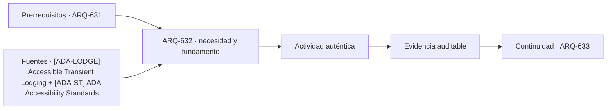

# ARQ-632 · Lobby, restaurante y espacios comunes

**Parte 64 · Clase desarrollada · Incorporada en v0.34.**

Material educativo con casos ficticios. No sustituye proyecto, normativa, habilitación profesional, evaluación de seguridad ni autorización de operación.

## Pregunta central

¿Cómo dimensionar conceptualmente espacios comunes de hotel sin confundir capacidad de asiento, demanda de paso, espera y calidad de estancia?

## Resultado de aprendizaje y continuidad

Diferenciarás permanencia, circulación y procesamiento. Construirás un escenario punta para recepción y restaurante, conservando horarios y denominadores.

## 1. Tipología y función

El lobby puede ser simultáneamente vestíbulo, orientación, espera, encuentro, circulación y extensión de otros usos. Medir únicamente área por persona oculta estas funciones superpuestas.

## 2. Programa y relaciones

La recepción procesa llegadas y salidas en picos que no coinciden necesariamente con el uso del restaurante o salones. Una estrategia espacial robusta analiza simultaneidades en vez de sumar máximos de días distintos.

## 3. Personas, flujos y operación

Los espacios comunes deben permitir orientación sin depender exclusivamente de personal. Visuales, señalización, iluminación y acústica participan en la experiencia, especialmente para quienes no conocen el idioma o tienen discapacidades sensoriales.

## 4. Sistemas e interfaces

El restaurante conecta público, cocina, almacenamiento, residuos y entregas. Las circulaciones de servicio pueden cruzarse con el lobby si no se prevé una lógica de back-of-house.

## 5. Tiempo, cambio y límites

La flexibilidad exige almacenar mobiliario, permitir cambios de configuración y revisar evacuación. Una sala vacía no es automáticamente flexible si sus instalaciones, puertas o acústica limitan los usos.

## Caso trabajado: recepción y restaurante

En una hora ficticia llegan 90 huéspedes. Cinco posiciones de recepción atienden 20 huéspedes/h cada una: capacidad nominal 100/h. El margen es solo 10/h. Al mismo tiempo, el restaurante tiene 80 asientos y una rotación hipotética de 1,5 usos por asiento durante dos horas, equivalente a 120 servicios en ese periodo. Ambas cifras describen procesos distintos y no deben sumarse como “220 personas de capacidad”.

## Errores frecuentes y revisión crítica

No confundas una suma correcta con una decisión de proyecto completa; no conviertas capacidad nominal en aforo, disponibilidad, seguridad o calidad; no traslades referencias extranjeras como normativa local; no ocultes estados desconocidos. Cada resultado debe conservar unidad, frontera, tiempo y supuestos.

## Práctica independiente

Construye un diagrama horario de lobby, desayuno y check-out para un hotel de 100 habitaciones. Marca qué funciones se superponen y cuáles requieren soporte separado.

## Solución razonada

Una respuesta correcta conserva unidad y tiempo de cada indicador. No transforma capacidad de proceso en aforo ni asientos en demanda de evacuación.

## Autoevaluación y enlace

Puedes avanzar cuando distingues programa, operación y evidencia, reconstruyes el caso sin copiar la respuesta y puedes nombrar al menos una condición que el cálculo no resuelve. ARQ-633 entra al back-of-house, donde la arquitectura depende de suministros, limpieza y residuos.

<!-- pedagogia-2026:inicio -->
## Decisión pedagógica y posición curricular

### Por qué existe

Esta clase existe para resolver una necesidad concreta del recorrido: ¿Cómo dimensionar conceptualmente espacios comunes de hotel sin confundir capacidad de asiento, demanda de paso, espera y calidad de estancia?

### Por qué está exactamente aquí

Ocupa el lugar 2 de la Parte 64. Se estudia después de ARQ-631 · Hotel: habitación, pasillo y servicio porque usa esa base para responder «¿Cómo dimensionar conceptualmente espacios comunes de hotel sin confundir capacidad de asiento, demanda de paso, espera y calidad de estancia?». Se ubica antes de ARQ-633 · Back-of-house y logística hotelera porque la evidencia producida aquí debe estar disponible para ese paso.

- **Prerrequisitos:** `ARQ-631`
- **Capacidad que introduce:** Diferenciarás permanencia, circulación y procesamiento. Construirás un escenario punta para recepción y restaurante, conservando horarios y denominadores.
- **Clases o experiencias que dependen de ella:** `ARQ-633`

El diagrama permite comprobar una relación que el texto lineal oculta con facilidad: esta clase recibe capacidades previas, toma decisiones apoyadas por fuentes, exige una experiencia y produce evidencia que habilita trabajo posterior. No representa un procedimiento de obra.

## Resultado observable, evidencia y evaluación

1. Identificar y delimitar las condiciones necesarias para responder la pregunta central de lobby, restaurante y espacios comunes.
2. Producir y comprobar la evidencia declarada por la clase: Diferenciarás permanencia, circulación y procesamiento. Construirás un escenario punta para recepción y restaurante, conservando horarios y denominadores.
3. Justificar una decisión de lobby, restaurante y espacios comunes mediante fuentes, supuestos, alternativas y límites explícitos.

## Actividad, evidencia y criterio de aceptación

**Actividad:** Construye un diagrama horario de lobby, desayuno y check-out para un hotel de 100 habitaciones. Marca qué funciones se superponen y cuáles requieren soporte separado.

**Evidencia mínima:** Diferenciarás permanencia, circulación y procesamiento. Construirás un escenario punta para recepción y restaurante, conservando horarios y denominadores.

**Archivo sugerido:** `evidence/ARQ-632/evidencia.md`.

**Criterio de aceptación:** la entrega se acepta cuando:

- La entrega responde explícitamente a la pregunta: ¿Cómo dimensionar conceptualmente espacios comunes de hotel sin confundir capacidad de asiento, demanda de paso, espera y calidad de estancia?
- La actividad conserva las fronteras del caso y permite reconstruir el procedimiento: Construye un diagrama horario de lobby, desayuno y check-out para un hotel de 100 habitaciones. Marca qué funciones se superponen y cuáles requieren soporte separado.
- Cada afirmación externa puede seguirse hasta una fuente, su alcance consultado y su límite.
- La evidencia deja disponible una entrada comprobable para ARQ-633.
- No confundas una suma correcta con una decisión de proyecto completa; no conviertas capacidad nominal en aforo, disponibilidad, seguridad o calidad; no traslades referencias extranjeras como normativa local; no ocultes estados desconocidos. Cada resultado debe conservar unidad, frontera, tiempo y supuestos.

La [rúbrica común](../../docs/RUBRICA_COMUN.md) complementa estos criterios; no los reemplaza. Una entrega puede superar un promedio y continuar pendiente si oculta una condición crítica.

## Trazabilidad de las decisiones

| # | Decisión o fundamento | Fuente utilizada | Aplicación y límite en esta clase |
|---:|---|---|---|
| 1 | Habitaciones, baños, áreas comunes y servicios accesibles en alojamiento temporal. Ámbito ADA/ABA. | [[ADA-LODGE] Accessible Transient Lodging](https://www.access-board.gov/webinars/2023/07/06/accessible-transient-lodging/) | Consulta: Alcance consultado no documentado; debe completarse antes de ampliar la conclusión. Límite: Habitaciones, baños, áreas comunes y servicios accesibles en alojamiento temporal. Ámbito ADA/ABA. |
| 2 | Accesibilidad de edificios, tribunales, detención, alojamiento temporal y áreas públicas. No se presenta como norma chilena. | [[ADA-ST] ADA Accessibility Standards](https://www.access-board.gov/ada/) | Consulta: Alcance consultado no documentado; debe completarse antes de ampliar la conclusión. Límite: Accesibilidad de edificios, tribunales, detención, alojamiento temporal y áreas públicas. No se presenta como norma chilena. |

La tabla permite auditar las relaciones; la explicación, el caso y la práctica de la clase siguen siendo la documentación principal.

## Autoevaluación, recuperación y continuidad

### Errores diagnósticos

Antes de avanzar, comprueba si puedes reconstruir cada resultado sin mirar la solución, señalar qué evidencia lo sostiene y nombrar una condición que obligaría a revisar tu decisión. Conserva la primera versión, la objeción recibida y la revisión.

**Conexión siguiente:** La continuidad inmediata es ARQ-633 · Back-of-house y logística hotelera; conserva el método y vuelve a verificar datos y límites.
<!-- pedagogia-2026:fin -->

## Fuentes y alcance de uso

- [ADA-LODGE] Accessible Transient Lodging — U.S. Access Board. https://www.access-board.gov/webinars/2023/07/06/accessible-transient-lodging/

Uso y límite: Habitaciones, baños, áreas comunes y servicios accesibles en alojamiento temporal. Ámbito ADA/ABA.

- [ADA-ST] ADA Accessibility Standards — U.S. Access Board. https://www.access-board.gov/ada/

Uso y límite: Accesibilidad de edificios, tribunales, detención, alojamiento temporal y áreas públicas. No se presenta como norma chilena.
