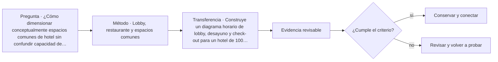

# ARQ-632 · Lobby, restaurante y espacios comunes

**Parte 64 · Clase desarrollada · Incorporada en v0.34.**

Material educativo con casos ficticios. No sustituye proyecto, normativa, habilitación profesional, evaluación de seguridad ni autorización de operación.

## Pregunta central

¿Cómo dimensionar conceptualmente espacios comunes de hotel sin confundir capacidad de asiento, demanda de paso, espera y calidad de estancia?

## Resultado de aprendizaje y continuidad

Diferenciarás permanencia, circulación y procesamiento. Construirás un escenario punta para recepción y restaurante, conservando horarios y denominadores.

## 1. Tipología y función

El lobby puede ser simultáneamente vestíbulo, orientación, espera, encuentro, circulación y extensión de otros usos. Medir únicamente área por persona oculta estas funciones superpuestas.

## 2. Programa y relaciones

La recepción procesa llegadas y salidas en picos que no coinciden necesariamente con el uso del restaurante o salones. Una estrategia espacial robusta analiza simultaneidades en vez de sumar máximos de días distintos.

## 3. Personas, flujos y operación

Los espacios comunes deben permitir orientación sin depender exclusivamente de personal. Visuales, señalización, iluminación y acústica participan en la experiencia, especialmente para quienes no conocen el idioma o tienen discapacidades sensoriales.

## 4. Sistemas e interfaces

El restaurante conecta público, cocina, almacenamiento, residuos y entregas. Las circulaciones de servicio pueden cruzarse con el lobby si no se prevé una lógica de back-of-house.

## 5. Tiempo, cambio y límites

La flexibilidad exige almacenar mobiliario, permitir cambios de configuración y revisar evacuación. Una sala vacía no es automáticamente flexible si sus instalaciones, puertas o acústica limitan los usos.

## Caso trabajado: recepción y restaurante

En una hora ficticia llegan 90 huéspedes. Cinco posiciones de recepción atienden 20 huéspedes/h cada una: capacidad nominal 100/h. El margen es solo 10/h. Al mismo tiempo, el restaurante tiene 80 asientos y una rotación hipotética de 1,5 usos por asiento durante dos horas, equivalente a 120 servicios en ese periodo. Ambas cifras describen procesos distintos y no deben sumarse como “220 personas de capacidad”.

## Errores frecuentes y revisión crítica

No confundas una suma correcta con una decisión de proyecto completa; no conviertas capacidad nominal en aforo, disponibilidad, seguridad o calidad; no traslades referencias extranjeras como normativa local; no ocultes estados desconocidos. Cada resultado debe conservar unidad, frontera, tiempo y supuestos.

## Práctica independiente

Construye un diagrama horario de lobby, desayuno y check-out para un hotel de 100 habitaciones. Marca qué funciones se superponen y cuáles requieren soporte separado.

## Solución razonada

Una respuesta correcta conserva unidad y tiempo de cada indicador. No transforma capacidad de proceso en aforo ni asientos en demanda de evacuación.

## Autoevaluación y enlace

Puedes avanzar cuando distingues programa, operación y evidencia, reconstruyes el caso sin copiar la respuesta y puedes nombrar al menos una condición que el cálculo no resuelve. ARQ-633 entra al back-of-house, donde la arquitectura depende de suministros, limpieza y residuos.

<!-- pedagogia-2026:inicio -->
## Mapa visual de aprendizaje

El diagrama representa el ciclo de aprendizaje de esta clase, no una secuencia de obra ni un procedimiento profesional.

## Resultado observable, evidencia y evaluación

**Tipo de clase:** proyectual.

**Evidencia mínima:** lámina o expediente con alternativas, representación pertinente, decisión argumentada, revisión y asuntos pendientes.

**Archivo sugerido:** `evidence/ARQ-632/evidencia.md`.

| Criterio | Evidencia observable |
|---|---|
| Precisión y representación · 20 % | Los conceptos, unidades y convenciones se usan de forma coherente y pueden ser reconstruidos por otra persona. |
| Evidencia y trazabilidad · 25 % | Cada afirmación importante se vincula con dato, cálculo, observación o fuente; hipótesis y desconocidos permanecen visibles. |
| Decisión y alternativas · 25 % | La decisión responde a la pregunta, compara al menos una alternativa y declara qué condición la haría cambiar. |
| Integración y ciclo de vida · 20 % | Se identifica una interfaz y una consecuencia para construcción, uso, mantenimiento, adaptación o fin de vida. |
| Comunicación, ética y límites · 10 % | El alcance se entiende sin explicación oral adicional y no se atribuyen permisos, competencias o certezas inexistentes. |

**Criterio de aceptación:** 80/100 y ningún criterio bajo 60 %. Una entrega genérica que podría reutilizarse sin cambios en otra clase no demuestra dominio. Si existe una condición crítica de seguridad, accesibilidad, evidencia o responsabilidad sin resolver, la entrega permanece pendiente aunque el promedio supere 80.

### Errores diagnósticos

En esta clase conviene vigilar especialmente: comparar alternativas con alcances distintos; defender la imagen antes que el servicio; borrar las huellas de la revisión.

## Autoevaluación, recuperación y continuidad

Antes de avanzar, responde sin consultar la solución:

1. ¿Qué decisión concreta puedes tomar ahora que no podías justificar antes?
2. ¿Qué evidencia de tu entrega es comprobada y cuál continúa siendo una hipótesis?
3. ¿Qué cambio de contexto invalidaría la transferencia realizada?

Revisa la entrega a las 24–48 horas y nuevamente al cerrar la parte. Conserva la primera versión, la crítica recibida y la versión revisada: el aprendizaje se demuestra también mediante el cambio entre versiones.
<!-- pedagogia-2026:fin -->

## Fuentes y alcance de uso

- [ADA-LODGE] Accessible Transient Lodging — U.S. Access Board. https://www.access-board.gov/webinars/2023/07/06/accessible-transient-lodging/

Uso y límite: Habitaciones, baños, áreas comunes y servicios accesibles en alojamiento temporal. Ámbito ADA/ABA.

- [ADA-ST] ADA Accessibility Standards — U.S. Access Board. https://www.access-board.gov/ada/

Uso y límite: Accesibilidad de edificios, tribunales, detención, alojamiento temporal y áreas públicas. No se presenta como norma chilena.
