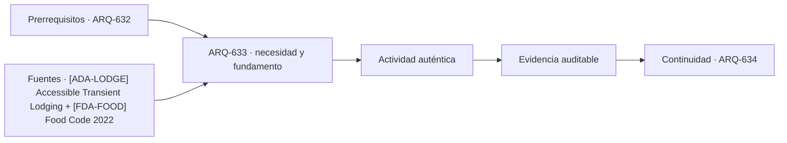

# ARQ-633 · Back-of-house y logística hotelera

**Parte 64 · Clase desarrollada · Incorporada en v0.34.**

Material educativo con casos ficticios. No sustituye proyecto, normativa, habilitación profesional, evaluación de seguridad ni autorización de operación.

## Pregunta central

¿Cómo puede la arquitectura de servicio sostener la experiencia del huésped sin ocupar recorridos públicos ni quedar relegada a espacios residuales?

## Resultado de aprendizaje y continuidad

Organizarás recepción de suministros, housekeeping, ropa limpia/sucia, residuos, personal y mantenimiento. Harás un balance de carros y recorridos.

## 1. Tipología y función

El back-of-house conecta el hotel con proveedores y permite que las habitaciones cambien de estado. Es una red productiva: entrega, almacenamiento, preparación, distribución, retorno y residuos.

## 2. Programa y relaciones

La separación entre limpio y sucio puede ser espacial, temporal o procedimental según la actividad. El diseño debe registrar qué estrategia adopta y cómo evita cruces no controlados.

## 3. Personas, flujos y operación

Housekeeping necesita depósitos distribuidos, carros, agua, residuos y acceso a habitaciones. Centralizar todo puede reducir duplicación de stock pero aumentar recorridos y uso de ascensores.

## 4. Sistemas e interfaces

La recepción de alimentos, ropa, mobiliario y repuestos no tiene idénticas condiciones. Una bahía de carga compartida necesita programación y zonas de transferencia, no solo superficie suficiente.

## 5. Tiempo, cambio y límites

El personal también requiere vestuarios, descanso, servicios y rutas dignas. Ocultar todo servicio “detrás” no justifica recorridos innecesarios ni condiciones inferiores.

## Caso trabajado: recorrido de housekeeping

Una planta ficticia tiene 40 habitaciones distribuidas en un corredor de 80 m. Un solo depósito está en un extremo. Si una camarera atiende diez habitaciones repartidas uniformemente, parte del recorrido repetido puede acercarse a cientos de metros durante una ronda. Un segundo depósito a mitad de planta puede reducir trayectos, pero añade stock, control y superficie. El ejercicio obliga a comparar distancia y operación, no solo área.

## Errores frecuentes y revisión crítica

No confundas una suma correcta con una decisión de proyecto completa; no conviertas capacidad nominal en aforo, disponibilidad, seguridad o calidad; no traslades referencias extranjeras como normativa local; no ocultes estados desconocidos. Cada resultado debe conservar unidad, frontera, tiempo y supuestos.

## Práctica independiente

Compara un esquema con depósito único y otro con dos depósitos. Define qué información necesitarías para valorar la decisión: frecuencias, stock, ascensores y personal.

## Solución razonada

La solución debe reconocer que menor recorrido no implica automáticamente menor costo total y que el stock duplicado es otra variable.

## Autoevaluación y enlace

Puedes avanzar cuando distingues programa, operación y evidencia, reconstruyes el caso sin copiar la respuesta y puedes nombrar al menos una condición que el cálculo no resuelve. ARQ-634 amplía la hospitalidad al territorio mediante resort, paisaje y servicios distribuidos.

<!-- pedagogia-2026:inicio -->
## Decisión pedagógica y posición curricular

### Por qué existe

Esta clase existe para resolver una necesidad concreta del recorrido: ¿Cómo puede la arquitectura de servicio sostener la experiencia del huésped sin ocupar recorridos públicos ni quedar relegada a espacios residuales?

### Por qué está exactamente aquí

Ocupa el lugar 3 de la Parte 64. Se estudia después de ARQ-632 · Lobby, restaurante y espacios comunes porque usa esa base para responder «¿Cómo puede la arquitectura de servicio sostener la experiencia del huésped sin ocupar recorridos públicos ni quedar relegada a espacios residuales?». Se ubica antes de ARQ-634 · Resort y relación con paisaje porque la evidencia producida aquí debe estar disponible para ese paso.

- **Prerrequisitos:** `ARQ-632`
- **Capacidad que introduce:** Organizarás recepción de suministros, housekeeping, ropa limpia/sucia, residuos, personal y mantenimiento. Harás un balance de carros y recorridos.
- **Clases o experiencias que dependen de ella:** `ARQ-634`

El diagrama permite comprobar una relación que el texto lineal oculta con facilidad: esta clase recibe capacidades previas, toma decisiones apoyadas por fuentes, exige una experiencia y produce evidencia que habilita trabajo posterior. No representa un procedimiento de obra.

## Resultado observable, evidencia y evaluación

1. Identificar y delimitar las condiciones necesarias para responder la pregunta central de back-of-house y logística hotelera.
2. Producir y comprobar la evidencia declarada por la clase: Organizarás recepción de suministros, housekeeping, ropa limpia/sucia, residuos, personal y mantenimiento. Harás un balance de carros y recorridos.
3. Justificar una decisión de back-of-house y logística hotelera mediante fuentes, supuestos, alternativas y límites explícitos.

## Actividad, evidencia y criterio de aceptación

**Actividad:** Compara un esquema con depósito único y otro con dos depósitos. Define qué información necesitarías para valorar la decisión: frecuencias, stock, ascensores y personal.

**Evidencia mínima:** Organizarás recepción de suministros, housekeeping, ropa limpia/sucia, residuos, personal y mantenimiento. Harás un balance de carros y recorridos.

**Archivo sugerido:** `evidence/ARQ-633/evidencia.md`.

**Criterio de aceptación:** la entrega se acepta cuando:

- La entrega responde explícitamente a la pregunta: ¿Cómo puede la arquitectura de servicio sostener la experiencia del huésped sin ocupar recorridos públicos ni quedar relegada a espacios residuales?
- La actividad conserva las fronteras del caso y permite reconstruir el procedimiento: Compara un esquema con depósito único y otro con dos depósitos. Define qué información necesitarías para valorar la decisión: frecuencias, stock, ascensores y personal.
- Cada afirmación externa puede seguirse hasta una fuente, su alcance consultado y su límite.
- La evidencia deja disponible una entrada comprobable para ARQ-634.
- No confundas una suma correcta con una decisión de proyecto completa; no conviertas capacidad nominal en aforo, disponibilidad, seguridad o calidad; no traslades referencias extranjeras como normativa local; no ocultes estados desconocidos. Cada resultado debe conservar unidad, frontera, tiempo y supuestos.

La [rúbrica común](../../docs/RUBRICA_COMUN.md) complementa estos criterios; no los reemplaza. Una entrega puede superar un promedio y continuar pendiente si oculta una condición crítica.

## Trazabilidad de las decisiones

| # | Decisión o fundamento | Fuente utilizada | Aplicación y límite en esta clase |
|---:|---|---|---|
| 1 | Habitaciones, baños, áreas comunes y servicios accesibles en alojamiento temporal. Ámbito ADA/ABA. | [[ADA-LODGE] Accessible Transient Lodging](https://www.access-board.gov/webinars/2023/07/06/accessible-transient-lodging/) | Consulta: Alcance consultado no documentado; debe completarse antes de ampliar la conclusión. Límite: Habitaciones, baños, áreas comunes y servicios accesibles en alojamiento temporal. Ámbito ADA/ABA. |
| 2 | Modelo de seguridad alimentaria para retail y servicios de comida. No se convierte en reglamentación chilena. | [[FDA-FOOD] Food Code 2022](https://www.fda.gov/food/fda-food-code/food-code-2022) | Consulta: Alcance consultado no documentado; debe completarse antes de ampliar la conclusión. Límite: Modelo de seguridad alimentaria para retail y servicios de comida. No se convierte en reglamentación chilena. |

La tabla permite auditar las relaciones; la explicación, el caso y la práctica de la clase siguen siendo la documentación principal.

## Autoevaluación, recuperación y continuidad

### Errores diagnósticos

Antes de avanzar, comprueba si puedes reconstruir cada resultado sin mirar la solución, señalar qué evidencia lo sostiene y nombrar una condición que obligaría a revisar tu decisión. Conserva la primera versión, la objeción recibida y la revisión.

**Conexión siguiente:** La continuidad inmediata es ARQ-634 · Resort y relación con paisaje; conserva el método y vuelve a verificar datos y límites.
<!-- pedagogia-2026:fin -->

## Fuentes y alcance de uso

- [ADA-LODGE] Accessible Transient Lodging — U.S. Access Board. https://www.access-board.gov/webinars/2023/07/06/accessible-transient-lodging/

Uso y límite: Habitaciones, baños, áreas comunes y servicios accesibles en alojamiento temporal. Ámbito ADA/ABA.

- [FDA-FOOD] Food Code 2022 — U.S. Food and Drug Administration. https://www.fda.gov/food/fda-food-code/food-code-2022

Uso y límite: Modelo de seguridad alimentaria para retail y servicios de comida. No se convierte en reglamentación chilena.
