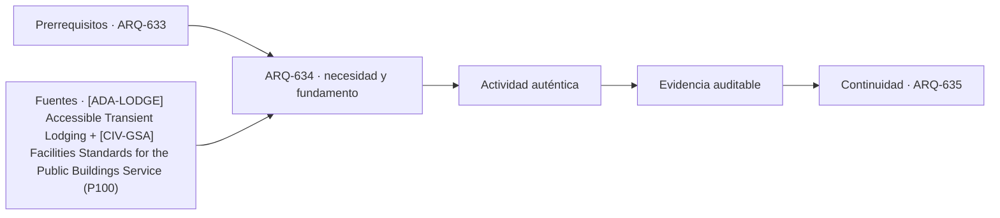

# ARQ-634 · Resort y relación con paisaje

**Parte 64 · Clase desarrollada · Incorporada en v0.34.**

Material educativo con casos ficticios. No sustituye proyecto, normativa, habilitación profesional, evaluación de seguridad ni autorización de operación.

## Pregunta central

¿Cómo coordinar alojamiento disperso, paisaje, servicios y movilidad interna sin tratar el terreno como fondo escénico?

## Resultado de aprendizaje y continuidad

Analizarás implantación, recorridos, vistas, agua, energía, mantenimiento y operación distribuida. Diferenciarás ocupación del suelo de intensidad de uso.

## 1. Tipología y función

Un resort puede distribuir habitaciones, villas, restaurantes y recreación en un territorio amplio. Esa dispersión modifica movilidad, mantenimiento, redes y relación con ecosistemas.

## 2. Programa y relaciones

La orientación hacia vistas no puede ser el único criterio. Pendiente, drenaje, exposición climática, vegetación, acceso de mantenimiento y privacidad necesitan aparecer en el mismo análisis.

## 3. Personas, flujos y operación

Los recorridos peatonales y de servicio pueden compartir tramos o separarse. Distancias mayores aumentan energía y tiempos operativos; vehículos internos también requieren infraestructura y seguridad.

## 4. Sistemas e interfaces

Agua y energía deben estudiarse por usos y momentos. Una piscina, riego, lavandería y habitaciones tienen perfiles diferentes; sumar consumos diarios no explica picos ni calidad necesaria.

## 5. Tiempo, cambio y límites

El paisaje es un sistema vivo. La intervención necesita considerar biodiversidad, suelo, agua y mantenimiento, y no utilizar “natural” como sinónimo de bajo impacto.

## Caso trabajado: dispersión y recorridos

Tres grupos de habitaciones están a 200, 450 y 700 m del edificio de servicios. Si una ruta de mantenimiento visita cada grupo dos veces al día y regresa al origen, solo esos desplazamientos suman 2×2×(200+450+700)=5.400 m/día. Reubicar un punto de apoyo intermedio podría reducir recorrido, pero añade construcción, stock y servicios. La cuenta no selecciona automáticamente una solución.

## Errores frecuentes y revisión crítica

No confundas una suma correcta con una decisión de proyecto completa; no conviertas capacidad nominal en aforo, disponibilidad, seguridad o calidad; no traslades referencias extranjeras como normativa local; no ocultes estados desconocidos. Cada resultado debe conservar unidad, frontera, tiempo y supuestos.

## Práctica independiente

Propón dos implantaciones de 30 unidades en un terreno ficticio: una concentrada y otra dispersa. Compara huella de caminos, recorrido de servicio y privacidad sin declarar superioridad general.

## Solución razonada

La solución debe conservar clima, agua, topografía y operación como criterios independientes. Una mejor vista no compensa una restricción de riesgo o acceso.

## Autoevaluación y enlace

Puedes avanzar cuando distingues programa, operación y evidencia, reconstruyes el caso sin copiar la respuesta y puedes nombrar al menos una condición que el cálculo no resuelve. ARQ-635 estudia alojamiento compacto y compartido, donde privacidad y servicios comunes cambian el problema.

<!-- pedagogia-2026:inicio -->
## Decisión pedagógica y posición curricular

### Por qué existe

Esta clase existe para resolver una necesidad concreta del recorrido: ¿Cómo coordinar alojamiento disperso, paisaje, servicios y movilidad interna sin tratar el terreno como fondo escénico?

### Por qué está exactamente aquí

Ocupa el lugar 4 de la Parte 64. Se estudia después de ARQ-633 · Back-of-house y logística hotelera porque usa esa base para responder «¿Cómo coordinar alojamiento disperso, paisaje, servicios y movilidad interna sin tratar el terreno como fondo escénico?». Se ubica antes de ARQ-635 · Hostales y alojamiento compacto porque la evidencia producida aquí debe estar disponible para ese paso.

- **Prerrequisitos:** `ARQ-633`
- **Capacidad que introduce:** Analizarás implantación, recorridos, vistas, agua, energía, mantenimiento y operación distribuida. Diferenciarás ocupación del suelo de intensidad de uso.
- **Clases o experiencias que dependen de ella:** `ARQ-635`

El diagrama permite comprobar una relación que el texto lineal oculta con facilidad: esta clase recibe capacidades previas, toma decisiones apoyadas por fuentes, exige una experiencia y produce evidencia que habilita trabajo posterior. No representa un procedimiento de obra.

## Resultado observable, evidencia y evaluación

1. Identificar y delimitar las condiciones necesarias para responder la pregunta central de resort y relación con paisaje.
2. Producir y comprobar la evidencia declarada por la clase: Analizarás implantación, recorridos, vistas, agua, energía, mantenimiento y operación distribuida. Diferenciarás ocupación del suelo de intensidad de uso.
3. Justificar una decisión de resort y relación con paisaje mediante fuentes, supuestos, alternativas y límites explícitos.

## Actividad, evidencia y criterio de aceptación

**Actividad:** Propón dos implantaciones de 30 unidades en un terreno ficticio: una concentrada y otra dispersa. Compara huella de caminos, recorrido de servicio y privacidad sin declarar superioridad general.

**Evidencia mínima:** Analizarás implantación, recorridos, vistas, agua, energía, mantenimiento y operación distribuida. Diferenciarás ocupación del suelo de intensidad de uso.

**Archivo sugerido:** `evidence/ARQ-634/evidencia.md`.

**Criterio de aceptación:** la entrega se acepta cuando:

- La entrega responde explícitamente a la pregunta: ¿Cómo coordinar alojamiento disperso, paisaje, servicios y movilidad interna sin tratar el terreno como fondo escénico?
- La actividad conserva las fronteras del caso y permite reconstruir el procedimiento: Propón dos implantaciones de 30 unidades en un terreno ficticio: una concentrada y otra dispersa. Compara huella de caminos, recorrido de servicio y privacidad sin declarar superioridad general.
- Cada afirmación externa puede seguirse hasta una fuente, su alcance consultado y su límite.
- La evidencia deja disponible una entrada comprobable para ARQ-635.
- No confundas una suma correcta con una decisión de proyecto completa; no conviertas capacidad nominal en aforo, disponibilidad, seguridad o calidad; no traslades referencias extranjeras como normativa local; no ocultes estados desconocidos. Cada resultado debe conservar unidad, frontera, tiempo y supuestos.

La [rúbrica común](../../docs/RUBRICA_COMUN.md) complementa estos criterios; no los reemplaza. Una entrega puede superar un promedio y continuar pendiente si oculta una condición crítica.

## Trazabilidad de las decisiones

| # | Decisión o fundamento | Fuente utilizada | Aplicación y límite en esta clase |
|---:|---|---|---|
| 1 | Habitaciones, baños, áreas comunes y servicios accesibles en alojamiento temporal. Ámbito ADA/ABA. | [[ADA-LODGE] Accessible Transient Lodging](https://www.access-board.gov/webinars/2023/07/06/accessible-transient-lodging/) | Consulta: Alcance consultado no documentado; debe completarse antes de ampliar la conclusión. Límite: Habitaciones, baños, áreas comunes y servicios accesibles en alojamiento temporal. Ámbito ADA/ABA. |
| 2 | Referencia de edificios públicos, desempeño, accesibilidad, coordinación y ciclo de vida. Ámbito federal estadounidense; no sustituye normativa chilena. | [[CIV-GSA] Facilities Standards for the Public Buildings Service (P100)](https://www.gsa.gov/real-estate/facilities-standards-for-the-public-buildings-service) | Consulta: Alcance consultado no documentado; debe completarse antes de ampliar la conclusión. Límite: Referencia de edificios públicos, desempeño, accesibilidad, coordinación y ciclo de vida. Ámbito federal estadounidense; no sustituye normativa chilena. |

La tabla permite auditar las relaciones; la explicación, el caso y la práctica de la clase siguen siendo la documentación principal.

## Autoevaluación, recuperación y continuidad

### Errores diagnósticos

Antes de avanzar, comprueba si puedes reconstruir cada resultado sin mirar la solución, señalar qué evidencia lo sostiene y nombrar una condición que obligaría a revisar tu decisión. Conserva la primera versión, la objeción recibida y la revisión.

**Conexión siguiente:** La continuidad inmediata es ARQ-635 · Hostales y alojamiento compacto; conserva el método y vuelve a verificar datos y límites.
<!-- pedagogia-2026:fin -->

## Fuentes y alcance de uso

- [ADA-LODGE] Accessible Transient Lodging — U.S. Access Board. https://www.access-board.gov/webinars/2023/07/06/accessible-transient-lodging/

Uso y límite: Habitaciones, baños, áreas comunes y servicios accesibles en alojamiento temporal. Ámbito ADA/ABA.

- [CIV-GSA] Facilities Standards for the Public Buildings Service (P100) — U.S. General Services Administration. https://www.gsa.gov/real-estate/facilities-standards-for-the-public-buildings-service

Uso y límite: Referencia de edificios públicos, desempeño, accesibilidad, coordinación y ciclo de vida. Ámbito federal estadounidense; no sustituye normativa chilena.
