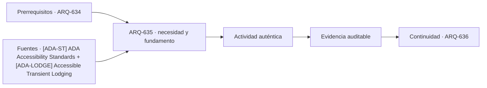

# ARQ-635 · Hostales y alojamiento compacto

**Parte 64 · Clase desarrollada · Incorporada en v0.34.**

Material educativo con casos ficticios. No sustituye proyecto, normativa, habilitación profesional, evaluación de seguridad ni autorización de operación.

## Pregunta central

¿Cómo diseñar alojamiento compacto sin reducir el proyecto a maximizar camas por metro cuadrado?

## Resultado de aprendizaje y continuidad

Relacionarás camas, almacenamiento, privacidad, baños, cocina común, accesibilidad y convivencia. Distinguirás densidad de capacidad de servicio.

## 1. Tipología y función

Hostales, residencias temporales y alojamientos compactos concentran más actividades compartidas que un hotel convencional. La calidad depende de dormir, guardar pertenencias, cambiarse, cocinar, socializar y descansar sin interferencias excesivas.

## 2. Programa y relaciones

La cama es solo una parte del módulo. Circulación, equipaje y aproximación necesitan espacio. Añadir camas sin revisar esas áreas puede aumentar capacidad nominal y reducir funcionalidad.

## 3. Personas, flujos y operación

Los servicios compartidos se evalúan por demanda y operación. Un baño o cocina puede atender a varias personas a lo largo del tiempo, pero una capacidad horaria no equivale a experiencia satisfactoria.

## 4. Sistemas e interfaces

La accesibilidad no debe aparecer únicamente en una habitación aislada si los espacios comunes resultan inaccesibles. La cadena completa incluye entrada, dormitorio, baño, cocina y áreas de estancia pertinentes.

## 5. Tiempo, cambio y límites

La convivencia necesita reglas espaciales: zonas tranquilas, sociales y de apoyo. El diseño puede ofrecer gradientes de privacidad en vez de imponer una única condición a todo el alojamiento.

## Caso trabajado: camas y servicios

Un hostal ficticio tiene 48 camas. Dos cocinas de uso común pueden atender 8 preparaciones simultáneas cada una: 16 posiciones. Si el 50 % de los huéspedes intenta usar cocina durante un mismo intervalo, la demanda es 24 y aparece una diferencia de 8 posiciones. Eso no implica que deban existir 24 puestos: horarios, duración y patrones de uso deben estudiarse.

## Errores frecuentes y revisión crítica

No confundas una suma correcta con una decisión de proyecto completa; no conviertas capacidad nominal en aforo, disponibilidad, seguridad o calidad; no traslades referencias extranjeras como normativa local; no ocultes estados desconocidos. Cada resultado debe conservar unidad, frontera, tiempo y supuestos.

## Práctica independiente

Diseña una mezcla de dormitorios para 40 camas con cuartos de 4 y 8 camas. Añade almacenamiento, baños y una zona común; explica qué datos faltan para evaluar capacidad de servicios.

## Solución razonada

La solución debe conservar el total de camas y no tratar una densidad menor o mayor como calidad por sí sola. Debe incluir privacidad y accesibilidad.

## Autoevaluación y enlace

Puedes avanzar cuando distingues programa, operación y evidencia, reconstruyes el caso sin copiar la respuesta y puedes nombrar al menos una condición que el cálculo no resuelve. ARQ-636 cambia de alojamiento a centro comercial y circulación de múltiples locales.

<!-- pedagogia-2026:inicio -->
## Decisión pedagógica y posición curricular

### Por qué existe

Esta clase existe para resolver una necesidad concreta del recorrido: ¿Cómo diseñar alojamiento compacto sin reducir el proyecto a maximizar camas por metro cuadrado?

### Por qué está exactamente aquí

Ocupa el lugar 5 de la Parte 64. Se estudia después de ARQ-634 · Resort y relación con paisaje porque usa esa base para responder «¿Cómo diseñar alojamiento compacto sin reducir el proyecto a maximizar camas por metro cuadrado?». Se ubica antes de ARQ-636 · Centro comercial y recorridos porque la evidencia producida aquí debe estar disponible para ese paso.

- **Prerrequisitos:** `ARQ-634`
- **Capacidad que introduce:** Relacionarás camas, almacenamiento, privacidad, baños, cocina común, accesibilidad y convivencia. Distinguirás densidad de capacidad de servicio.
- **Clases o experiencias que dependen de ella:** `ARQ-636`

El diagrama permite comprobar una relación que el texto lineal oculta con facilidad: esta clase recibe capacidades previas, toma decisiones apoyadas por fuentes, exige una experiencia y produce evidencia que habilita trabajo posterior. No representa un procedimiento de obra.

## Resultado observable, evidencia y evaluación

1. Identificar y delimitar las condiciones necesarias para responder la pregunta central de hostales y alojamiento compacto.
2. Producir y comprobar la evidencia declarada por la clase: Relacionarás camas, almacenamiento, privacidad, baños, cocina común, accesibilidad y convivencia. Distinguirás densidad de capacidad de servicio.
3. Justificar una decisión de hostales y alojamiento compacto mediante fuentes, supuestos, alternativas y límites explícitos.

## Actividad, evidencia y criterio de aceptación

**Actividad:** Diseña una mezcla de dormitorios para 40 camas con cuartos de 4 y 8 camas. Añade almacenamiento, baños y una zona común; explica qué datos faltan para evaluar capacidad de servicios.

**Evidencia mínima:** Relacionarás camas, almacenamiento, privacidad, baños, cocina común, accesibilidad y convivencia. Distinguirás densidad de capacidad de servicio.

**Archivo sugerido:** `evidence/ARQ-635/evidencia.md`.

**Criterio de aceptación:** la entrega se acepta cuando:

- La entrega responde explícitamente a la pregunta: ¿Cómo diseñar alojamiento compacto sin reducir el proyecto a maximizar camas por metro cuadrado?
- La actividad conserva las fronteras del caso y permite reconstruir el procedimiento: Diseña una mezcla de dormitorios para 40 camas con cuartos de 4 y 8 camas. Añade almacenamiento, baños y una zona común; explica qué datos faltan para evaluar capacidad de servicios.
- Cada afirmación externa puede seguirse hasta una fuente, su alcance consultado y su límite.
- La evidencia deja disponible una entrada comprobable para ARQ-636.
- No confundas una suma correcta con una decisión de proyecto completa; no conviertas capacidad nominal en aforo, disponibilidad, seguridad o calidad; no traslades referencias extranjeras como normativa local; no ocultes estados desconocidos. Cada resultado debe conservar unidad, frontera, tiempo y supuestos.

La [rúbrica común](../../docs/RUBRICA_COMUN.md) complementa estos criterios; no los reemplaza. Una entrega puede superar un promedio y continuar pendiente si oculta una condición crítica.

## Trazabilidad de las decisiones

| # | Decisión o fundamento | Fuente utilizada | Aplicación y límite en esta clase |
|---:|---|---|---|
| 1 | Accesibilidad de edificios, tribunales, detención, alojamiento temporal y áreas públicas. No se presenta como norma chilena. | [[ADA-ST] ADA Accessibility Standards](https://www.access-board.gov/ada/) | Consulta: Alcance consultado no documentado; debe completarse antes de ampliar la conclusión. Límite: Accesibilidad de edificios, tribunales, detención, alojamiento temporal y áreas públicas. No se presenta como norma chilena. |
| 2 | Habitaciones, baños, áreas comunes y servicios accesibles en alojamiento temporal. Ámbito ADA/ABA. | [[ADA-LODGE] Accessible Transient Lodging](https://www.access-board.gov/webinars/2023/07/06/accessible-transient-lodging/) | Consulta: Alcance consultado no documentado; debe completarse antes de ampliar la conclusión. Límite: Habitaciones, baños, áreas comunes y servicios accesibles en alojamiento temporal. Ámbito ADA/ABA. |

La tabla permite auditar las relaciones; la explicación, el caso y la práctica de la clase siguen siendo la documentación principal.

## Autoevaluación, recuperación y continuidad

### Errores diagnósticos

Antes de avanzar, comprueba si puedes reconstruir cada resultado sin mirar la solución, señalar qué evidencia lo sostiene y nombrar una condición que obligaría a revisar tu decisión. Conserva la primera versión, la objeción recibida y la revisión.

**Conexión siguiente:** La continuidad inmediata es ARQ-636 · Centro comercial y recorridos; conserva el método y vuelve a verificar datos y límites.
<!-- pedagogia-2026:fin -->

## Fuentes y alcance de uso

- [ADA-ST] ADA Accessibility Standards — U.S. Access Board. https://www.access-board.gov/ada/

Uso y límite: Accesibilidad de edificios, tribunales, detención, alojamiento temporal y áreas públicas. No se presenta como norma chilena.

- [ADA-LODGE] Accessible Transient Lodging — U.S. Access Board. https://www.access-board.gov/webinars/2023/07/06/accessible-transient-lodging/

Uso y límite: Habitaciones, baños, áreas comunes y servicios accesibles en alojamiento temporal. Ámbito ADA/ABA.
