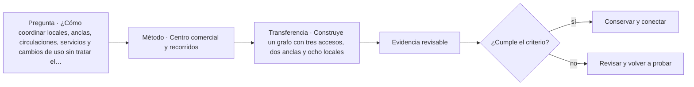

# ARQ-636 · Centro comercial y recorridos

**Parte 64 · Clase desarrollada · Incorporada en v0.34.**

Material educativo con casos ficticios. No sustituye proyecto, normativa, habilitación profesional, evaluación de seguridad ni autorización de operación.

## Pregunta central

¿Cómo coordinar locales, anclas, circulaciones, servicios y cambios de uso sin tratar el centro comercial como un pasillo con tiendas?

## Resultado de aprendizaje y continuidad

Analizarás red de recorridos, frentes activos, núcleos verticales, logística y estados horarios. Construirás un grafo de accesos y destinos.

## 1. Tipología y función

Un centro comercial combina espacio público de propiedad privada, tiendas, alimentación, servicios, estacionamiento, entregas y mantenimiento. Su arquitectura depende de simultaneidad y de la relación entre recorrido y visibilidad.

## 2. Programa y relaciones

Los locales ancla pueden generar flujos, pero la distancia no es el único factor. Cambios de nivel, decisiones, esperas, congestión y claridad de orientación también influyen.

## 3. Personas, flujos y operación

La circulación de mercancías debe coordinarse con horarios y back-of-house. Utilizar los mismos corredores para reposición durante máxima afluencia puede crear conflictos aun cuando el ancho geométrico sea suficiente.

## 4. Sistemas e interfaces

Los centros cambian con frecuencia: locales se unen, dividen o cambian instalaciones. La estructura, fachadas interiores y redes deben permitir adaptación sin comprometer rutas o compartimentación.

## 5. Tiempo, cambio y límites

La experiencia comercial no sustituye criterios de accesibilidad y seguridad. Un recorrido deliberadamente sinuoso puede prolongar exposición a vitrinas y dificultar orientación; la decisión necesita ser consciente y comprobable.

## Caso trabajado: red de recorridos

Un centro ficticio tiene dos anclas A y B unidas por una galería de 180 m. Una conexión transversal de 70 m permite llegar desde una entrada lateral al punto medio. Para un visitante cuyo destino está a 20 m del centro hacia B, el recorrido desde la entrada lateral es 70+20=90 m, mientras desde A sería 110 m. El “acceso principal” no es necesariamente la ruta más corta para todos los destinos.

## Errores frecuentes y revisión crítica

No confundas una suma correcta con una decisión de proyecto completa; no conviertas capacidad nominal en aforo, disponibilidad, seguridad o calidad; no traslades referencias extranjeras como normativa local; no ocultes estados desconocidos. Cada resultado debe conservar unidad, frontera, tiempo y supuestos.

## Práctica independiente

Construye un grafo con tres accesos, dos anclas y ocho locales. Analiza cómo cambia la accesibilidad si una escalera mecánica queda fuera de servicio, sin confundirla con la disponibilidad de ascensores.

## Solución razonada

La solución debe conservar medios alternativos y reconocer que una conexión física no prueba capacidad, claridad ni accesibilidad completa.

## Autoevaluación y enlace

Puedes avanzar cuando distingues programa, operación y evidencia, reconstruyes el caso sin copiar la respuesta y puedes nombrar al menos una condición que el cálculo no resuelve. ARQ-637 estudia retail de gran formato y la relación entre venta, reposición y estructura.

<!-- pedagogia-2026:inicio -->
## Mapa visual de aprendizaje

El diagrama representa el ciclo de aprendizaje de esta clase, no una secuencia de obra ni un procedimiento profesional.

## Resultado observable, evidencia y evaluación

**Tipo de clase:** proyectual.

**Evidencia mínima:** lámina o expediente con alternativas, representación pertinente, decisión argumentada, revisión y asuntos pendientes.

**Archivo sugerido:** `evidence/ARQ-636/evidencia.md`.

| Criterio | Evidencia observable |
|---|---|
| Precisión y representación · 20 % | Los conceptos, unidades y convenciones se usan de forma coherente y pueden ser reconstruidos por otra persona. |
| Evidencia y trazabilidad · 25 % | Cada afirmación importante se vincula con dato, cálculo, observación o fuente; hipótesis y desconocidos permanecen visibles. |
| Decisión y alternativas · 25 % | La decisión responde a la pregunta, compara al menos una alternativa y declara qué condición la haría cambiar. |
| Integración y ciclo de vida · 20 % | Se identifica una interfaz y una consecuencia para construcción, uso, mantenimiento, adaptación o fin de vida. |
| Comunicación, ética y límites · 10 % | El alcance se entiende sin explicación oral adicional y no se atribuyen permisos, competencias o certezas inexistentes. |

**Criterio de aceptación:** 80/100 y ningún criterio bajo 60 %. Una entrega genérica que podría reutilizarse sin cambios en otra clase no demuestra dominio. Si existe una condición crítica de seguridad, accesibilidad, evidencia o responsabilidad sin resolver, la entrega permanece pendiente aunque el promedio supere 80.

### Errores diagnósticos

En esta clase conviene vigilar especialmente: comparar alternativas con alcances distintos; defender la imagen antes que el servicio; borrar las huellas de la revisión.

## Autoevaluación, recuperación y continuidad

Antes de avanzar, responde sin consultar la solución:

1. ¿Qué decisión concreta puedes tomar ahora que no podías justificar antes?
2. ¿Qué evidencia de tu entrega es comprobada y cuál continúa siendo una hipótesis?
3. ¿Qué cambio de contexto invalidaría la transferencia realizada?

Revisa la entrega a las 24–48 horas y nuevamente al cerrar la parte. Conserva la primera versión, la crítica recibida y la versión revisada: el aprendizaje se demuestra también mediante el cambio entre versiones.
<!-- pedagogia-2026:fin -->

## Fuentes y alcance de uso

- [ADA-ST] ADA Accessibility Standards — U.S. Access Board. https://www.access-board.gov/ada/

Uso y límite: Accesibilidad de edificios, tribunales, detención, alojamiento temporal y áreas públicas. No se presenta como norma chilena.

- [CIV-GSA] Facilities Standards for the Public Buildings Service (P100) — U.S. General Services Administration. https://www.gsa.gov/real-estate/facilities-standards-for-the-public-buildings-service

Uso y límite: Referencia de edificios públicos, desempeño, accesibilidad, coordinación y ciclo de vida. Ámbito federal estadounidense; no sustituye normativa chilena.
