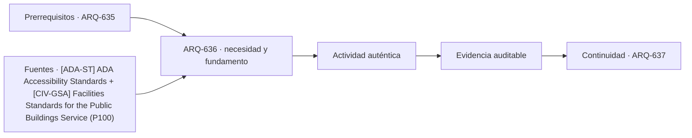

# ARQ-636 · Centro comercial y recorridos

**Parte 64 · Clase desarrollada · Incorporada en v0.34.**

Material educativo con casos ficticios. No sustituye proyecto, normativa, habilitación profesional, evaluación de seguridad ni autorización de operación.

## Pregunta central

¿Cómo coordinar locales, anclas, circulaciones, servicios y cambios de uso sin tratar el centro comercial como un pasillo con tiendas?

## Resultado de aprendizaje y continuidad

Analizarás red de recorridos, frentes activos, núcleos verticales, logística y estados horarios. Construirás un grafo de accesos y destinos.

## 1. Tipología y función

Un centro comercial combina espacio público de propiedad privada, tiendas, alimentación, servicios, estacionamiento, entregas y mantenimiento. Su arquitectura depende de simultaneidad y de la relación entre recorrido y visibilidad.

## 2. Programa y relaciones

Los locales ancla pueden generar flujos, pero la distancia no es el único factor. Cambios de nivel, decisiones, esperas, congestión y claridad de orientación también influyen.

## 3. Personas, flujos y operación

La circulación de mercancías debe coordinarse con horarios y back-of-house. Utilizar los mismos corredores para reposición durante máxima afluencia puede crear conflictos aun cuando el ancho geométrico sea suficiente.

## 4. Sistemas e interfaces

Los centros cambian con frecuencia: locales se unen, dividen o cambian instalaciones. La estructura, fachadas interiores y redes deben permitir adaptación sin comprometer rutas o compartimentación.

## 5. Tiempo, cambio y límites

La experiencia comercial no sustituye criterios de accesibilidad y seguridad. Un recorrido deliberadamente sinuoso puede prolongar exposición a vitrinas y dificultar orientación; la decisión necesita ser consciente y comprobable.

## Caso trabajado: red de recorridos

Un centro ficticio tiene dos anclas A y B unidas por una galería de 180 m. Una conexión transversal de 70 m permite llegar desde una entrada lateral al punto medio. Para un visitante cuyo destino está a 20 m del centro hacia B, el recorrido desde la entrada lateral es 70+20=90 m, mientras desde A sería 110 m. El “acceso principal” no es necesariamente la ruta más corta para todos los destinos.

## Errores frecuentes y revisión crítica

No confundas una suma correcta con una decisión de proyecto completa; no conviertas capacidad nominal en aforo, disponibilidad, seguridad o calidad; no traslades referencias extranjeras como normativa local; no ocultes estados desconocidos. Cada resultado debe conservar unidad, frontera, tiempo y supuestos.

## Práctica independiente

Construye un grafo con tres accesos, dos anclas y ocho locales. Analiza cómo cambia la accesibilidad si una escalera mecánica queda fuera de servicio, sin confundirla con la disponibilidad de ascensores.

## Solución razonada

La solución debe conservar medios alternativos y reconocer que una conexión física no prueba capacidad, claridad ni accesibilidad completa.

## Autoevaluación y enlace

Puedes avanzar cuando distingues programa, operación y evidencia, reconstruyes el caso sin copiar la respuesta y puedes nombrar al menos una condición que el cálculo no resuelve. ARQ-637 estudia retail de gran formato y la relación entre venta, reposición y estructura.

<!-- pedagogia-2026:inicio -->
## Decisión pedagógica y posición curricular

### Por qué existe

Esta clase existe para resolver una necesidad concreta del recorrido: ¿Cómo coordinar locales, anclas, circulaciones, servicios y cambios de uso sin tratar el centro comercial como un pasillo con tiendas?

### Por qué está exactamente aquí

Ocupa el lugar 6 de la Parte 64. Se estudia después de ARQ-635 · Hostales y alojamiento compacto porque usa esa base para responder «¿Cómo coordinar locales, anclas, circulaciones, servicios y cambios de uso sin tratar el centro comercial como un pasillo con tiendas?». Se ubica antes de ARQ-637 · Retail de gran formato y reposición porque la evidencia producida aquí debe estar disponible para ese paso.

- **Prerrequisitos:** `ARQ-635`
- **Capacidad que introduce:** Analizarás red de recorridos, frentes activos, núcleos verticales, logística y estados horarios. Construirás un grafo de accesos y destinos.
- **Clases o experiencias que dependen de ella:** `ARQ-637`

El diagrama permite comprobar una relación que el texto lineal oculta con facilidad: esta clase recibe capacidades previas, toma decisiones apoyadas por fuentes, exige una experiencia y produce evidencia que habilita trabajo posterior. No representa un procedimiento de obra.

## Resultado observable, evidencia y evaluación

1. Identificar y delimitar las condiciones necesarias para responder la pregunta central de centro comercial y recorridos.
2. Producir y comprobar la evidencia declarada por la clase: Analizarás red de recorridos, frentes activos, núcleos verticales, logística y estados horarios. Construirás un grafo de accesos y destinos.
3. Justificar una decisión de centro comercial y recorridos mediante fuentes, supuestos, alternativas y límites explícitos.

## Actividad, evidencia y criterio de aceptación

**Actividad:** Construye un grafo con tres accesos, dos anclas y ocho locales. Analiza cómo cambia la accesibilidad si una escalera mecánica queda fuera de servicio, sin confundirla con la disponibilidad de ascensores.

**Evidencia mínima:** Analizarás red de recorridos, frentes activos, núcleos verticales, logística y estados horarios. Construirás un grafo de accesos y destinos.

**Archivo sugerido:** `evidence/ARQ-636/evidencia.md`.

**Criterio de aceptación:** la entrega se acepta cuando:

- La entrega responde explícitamente a la pregunta: ¿Cómo coordinar locales, anclas, circulaciones, servicios y cambios de uso sin tratar el centro comercial como un pasillo con tiendas?
- La actividad conserva las fronteras del caso y permite reconstruir el procedimiento: Construye un grafo con tres accesos, dos anclas y ocho locales. Analiza cómo cambia la accesibilidad si una escalera mecánica queda fuera de servicio, sin confundirla con la disponibilidad de ascensores.
- Cada afirmación externa puede seguirse hasta una fuente, su alcance consultado y su límite.
- La evidencia deja disponible una entrada comprobable para ARQ-637.
- No confundas una suma correcta con una decisión de proyecto completa; no conviertas capacidad nominal en aforo, disponibilidad, seguridad o calidad; no traslades referencias extranjeras como normativa local; no ocultes estados desconocidos. Cada resultado debe conservar unidad, frontera, tiempo y supuestos.

La [rúbrica común](../../docs/RUBRICA_COMUN.md) complementa estos criterios; no los reemplaza. Una entrega puede superar un promedio y continuar pendiente si oculta una condición crítica.

## Trazabilidad de las decisiones

| # | Decisión o fundamento | Fuente utilizada | Aplicación y límite en esta clase |
|---:|---|---|---|
| 1 | Accesibilidad de edificios, tribunales, detención, alojamiento temporal y áreas públicas. No se presenta como norma chilena. | [[ADA-ST] ADA Accessibility Standards](https://www.access-board.gov/ada/) | Consulta: Alcance consultado no documentado; debe completarse antes de ampliar la conclusión. Límite: Accesibilidad de edificios, tribunales, detención, alojamiento temporal y áreas públicas. No se presenta como norma chilena. |
| 2 | Referencia de edificios públicos, desempeño, accesibilidad, coordinación y ciclo de vida. Ámbito federal estadounidense; no sustituye normativa chilena. | [[CIV-GSA] Facilities Standards for the Public Buildings Service (P100)](https://www.gsa.gov/real-estate/facilities-standards-for-the-public-buildings-service) | Consulta: Alcance consultado no documentado; debe completarse antes de ampliar la conclusión. Límite: Referencia de edificios públicos, desempeño, accesibilidad, coordinación y ciclo de vida. Ámbito federal estadounidense; no sustituye normativa chilena. |

La tabla permite auditar las relaciones; la explicación, el caso y la práctica de la clase siguen siendo la documentación principal.

## Autoevaluación, recuperación y continuidad

### Errores diagnósticos

Antes de avanzar, comprueba si puedes reconstruir cada resultado sin mirar la solución, señalar qué evidencia lo sostiene y nombrar una condición que obligaría a revisar tu decisión. Conserva la primera versión, la objeción recibida y la revisión.

**Conexión siguiente:** La continuidad inmediata es ARQ-637 · Retail de gran formato y reposición; conserva el método y vuelve a verificar datos y límites.
<!-- pedagogia-2026:fin -->

## Fuentes y alcance de uso

- [ADA-ST] ADA Accessibility Standards — U.S. Access Board. https://www.access-board.gov/ada/

Uso y límite: Accesibilidad de edificios, tribunales, detención, alojamiento temporal y áreas públicas. No se presenta como norma chilena.

- [CIV-GSA] Facilities Standards for the Public Buildings Service (P100) — U.S. General Services Administration. https://www.gsa.gov/real-estate/facilities-standards-for-the-public-buildings-service

Uso y límite: Referencia de edificios públicos, desempeño, accesibilidad, coordinación y ciclo de vida. Ámbito federal estadounidense; no sustituye normativa chilena.
