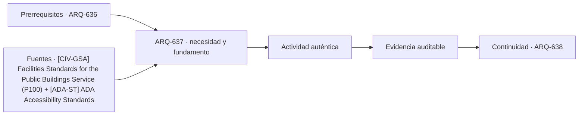

# ARQ-637 · Retail de gran formato y reposición

**Parte 64 · Clase desarrollada · Incorporada en v0.34.**

Material educativo con casos ficticios. No sustituye proyecto, normativa, habilitación profesional, evaluación de seguridad ni autorización de operación.

## Pregunta central

¿Cómo funciona un edificio comercial de gran formato cuando la exposición de productos depende de almacenamiento, entregas y reposición continua?

## Resultado de aprendizaje y continuidad

Diferenciarás sala de ventas, reserva, recepción, preparación y expedición. Relacionarás grandes luces y modulación con flexibilidad, sin convertir un layout en estructura dimensionada.

## 1. Tipología y función

El retail de gran formato necesita recibir mercancías en volúmenes que no aparecen en la experiencia frontal del cliente. El edificio debe coordinar muelles, reserva, preparación y reposición.

## 2. Programa y relaciones

Una gran sala libre facilita cambios, pero sus luces, altura e instalaciones condicionan estructura, incendio, iluminación y mantenimiento. La flexibilidad no significa ausencia de restricciones.

## 3. Personas, flujos y operación

La proporción entre venta y back-of-house depende del tipo de producto y reposición. Un almacén de muebles no funciona como supermercado o electrónica, aunque tengan áreas similares.

## 4. Sistemas e interfaces

Los flujos de cliente, carro de compra, pallet y residuos tienen escalas y velocidades distintas. Compartir puertas o pasillos puede ser posible en distintos horarios, pero debe documentarse la estrategia.

## 5. Tiempo, cambio y límites

El acceso vehicular necesita separar llegada de clientes, entregas y peatones cuando corresponda. La geometría del predio condiciona el edificio tanto como la planta interior.

## Caso trabajado: reserva y reposición

Una tienda ficticia vende en promedio 400 unidades/día y recibe entregas de 1.200 unidades cada tres días. Si inicia el ciclo con 1.200 y no hay stock de seguridad, al final de cada tercer día llega a cero antes de la nueva entrega bajo demanda uniforme. Una interrupción de un día produce déficit. El cálculo revela fragilidad logística; no determina superficie de bodega sin conocer volumen por unidad, pallets y política de inventario.

## Errores frecuentes y revisión crítica

No confundas una suma correcta con una decisión de proyecto completa; no conviertas capacidad nominal en aforo, disponibilidad, seguridad o calidad; no traslades referencias extranjeras como normativa local; no ocultes estados desconocidos. Cada resultado debe conservar unidad, frontera, tiempo y supuestos.

## Práctica independiente

Compara dos políticas de entrega para una tienda: diaria y cada tres días. Indica qué cambia en stock máximo, muelles y operación, sin asumir costos no proporcionados.

## Solución razonada

La solución debe distinguir unidades de producto y volumen físico. Más frecuencia reduce stock máximo, pero puede aumentar movimientos de camiones y trabajo de recepción.

## Autoevaluación y enlace

Puedes avanzar cuando distingues programa, operación y evidencia, reconstruyes el caso sin copiar la respuesta y puedes nombrar al menos una condición que el cálculo no resuelve. ARQ-638 lleva la lógica comercial a mercados y alimentos, donde higiene y frío modifican los flujos.

<!-- pedagogia-2026:inicio -->
## Decisión pedagógica y posición curricular

### Por qué existe

Esta clase existe para resolver una necesidad concreta del recorrido: ¿Cómo funciona un edificio comercial de gran formato cuando la exposición de productos depende de almacenamiento, entregas y reposición continua?

### Por qué está exactamente aquí

Ocupa el lugar 7 de la Parte 64. Se estudia después de ARQ-636 · Centro comercial y recorridos porque usa esa base para responder «¿Cómo funciona un edificio comercial de gran formato cuando la exposición de productos depende de almacenamiento, entregas y reposición continua?». Se ubica antes de ARQ-638 · Mercados y comercio de alimentos porque la evidencia producida aquí debe estar disponible para ese paso.

- **Prerrequisitos:** `ARQ-636`
- **Capacidad que introduce:** Diferenciarás sala de ventas, reserva, recepción, preparación y expedición. Relacionarás grandes luces y modulación con flexibilidad, sin convertir un layout en estructura dimensionada.
- **Clases o experiencias que dependen de ella:** `ARQ-638`

El diagrama permite comprobar una relación que el texto lineal oculta con facilidad: esta clase recibe capacidades previas, toma decisiones apoyadas por fuentes, exige una experiencia y produce evidencia que habilita trabajo posterior. No representa un procedimiento de obra.

## Resultado observable, evidencia y evaluación

1. Identificar y delimitar las condiciones necesarias para responder la pregunta central de retail de gran formato y reposición.
2. Producir y comprobar la evidencia declarada por la clase: Diferenciarás sala de ventas, reserva, recepción, preparación y expedición. Relacionarás grandes luces y modulación con flexibilidad, sin convertir un layout en estructura dimensionada.
3. Justificar una decisión de retail de gran formato y reposición mediante fuentes, supuestos, alternativas y límites explícitos.

## Actividad, evidencia y criterio de aceptación

**Actividad:** Compara dos políticas de entrega para una tienda: diaria y cada tres días. Indica qué cambia en stock máximo, muelles y operación, sin asumir costos no proporcionados.

**Evidencia mínima:** Diferenciarás sala de ventas, reserva, recepción, preparación y expedición. Relacionarás grandes luces y modulación con flexibilidad, sin convertir un layout en estructura dimensionada.

**Archivo sugerido:** `evidence/ARQ-637/evidencia.md`.

**Criterio de aceptación:** la entrega se acepta cuando:

- La entrega responde explícitamente a la pregunta: ¿Cómo funciona un edificio comercial de gran formato cuando la exposición de productos depende de almacenamiento, entregas y reposición continua?
- La actividad conserva las fronteras del caso y permite reconstruir el procedimiento: Compara dos políticas de entrega para una tienda: diaria y cada tres días. Indica qué cambia en stock máximo, muelles y operación, sin asumir costos no proporcionados.
- Cada afirmación externa puede seguirse hasta una fuente, su alcance consultado y su límite.
- La evidencia deja disponible una entrada comprobable para ARQ-638.
- No confundas una suma correcta con una decisión de proyecto completa; no conviertas capacidad nominal en aforo, disponibilidad, seguridad o calidad; no traslades referencias extranjeras como normativa local; no ocultes estados desconocidos. Cada resultado debe conservar unidad, frontera, tiempo y supuestos.

La [rúbrica común](../../docs/RUBRICA_COMUN.md) complementa estos criterios; no los reemplaza. Una entrega puede superar un promedio y continuar pendiente si oculta una condición crítica.

## Trazabilidad de las decisiones

| # | Decisión o fundamento | Fuente utilizada | Aplicación y límite en esta clase |
|---:|---|---|---|
| 1 | Referencia de edificios públicos, desempeño, accesibilidad, coordinación y ciclo de vida. Ámbito federal estadounidense; no sustituye normativa chilena. | [[CIV-GSA] Facilities Standards for the Public Buildings Service (P100)](https://www.gsa.gov/real-estate/facilities-standards-for-the-public-buildings-service) | Consulta: Alcance consultado no documentado; debe completarse antes de ampliar la conclusión. Límite: Referencia de edificios públicos, desempeño, accesibilidad, coordinación y ciclo de vida. Ámbito federal estadounidense; no sustituye normativa chilena. |
| 2 | Accesibilidad de edificios, tribunales, detención, alojamiento temporal y áreas públicas. No se presenta como norma chilena. | [[ADA-ST] ADA Accessibility Standards](https://www.access-board.gov/ada/) | Consulta: Alcance consultado no documentado; debe completarse antes de ampliar la conclusión. Límite: Accesibilidad de edificios, tribunales, detención, alojamiento temporal y áreas públicas. No se presenta como norma chilena. |

La tabla permite auditar las relaciones; la explicación, el caso y la práctica de la clase siguen siendo la documentación principal.

## Autoevaluación, recuperación y continuidad

### Errores diagnósticos

Antes de avanzar, comprueba si puedes reconstruir cada resultado sin mirar la solución, señalar qué evidencia lo sostiene y nombrar una condición que obligaría a revisar tu decisión. Conserva la primera versión, la objeción recibida y la revisión.

**Conexión siguiente:** La continuidad inmediata es ARQ-638 · Mercados y comercio de alimentos; conserva el método y vuelve a verificar datos y límites.
<!-- pedagogia-2026:fin -->

## Fuentes y alcance de uso

- [CIV-GSA] Facilities Standards for the Public Buildings Service (P100) — U.S. General Services Administration. https://www.gsa.gov/real-estate/facilities-standards-for-the-public-buildings-service

Uso y límite: Referencia de edificios públicos, desempeño, accesibilidad, coordinación y ciclo de vida. Ámbito federal estadounidense; no sustituye normativa chilena.

- [ADA-ST] ADA Accessibility Standards — U.S. Access Board. https://www.access-board.gov/ada/

Uso y límite: Accesibilidad de edificios, tribunales, detención, alojamiento temporal y áreas públicas. No se presenta como norma chilena.
