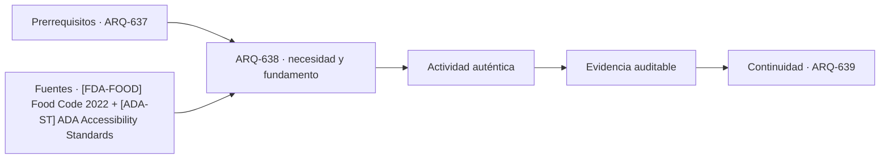

# ARQ-638 · Mercados y comercio de alimentos

**Parte 64 · Clase desarrollada · Incorporada en v0.34.**

Material educativo con casos ficticios. No sustituye proyecto, normativa, habilitación profesional, evaluación de seguridad ni autorización de operación.

## Pregunta central

¿Cómo coordinar venta, preparación, frío, lavado, residuos y público en un mercado sin mezclar flujos incompatibles?

## Resultado de aprendizaje y continuidad

Construirás un programa por operaciones alimentarias y servicios comunes. Diferenciarás recomendación de seguridad alimentaria de norma arquitectónica local.

## 1. Tipología y función

Un mercado combina puestos con productos y procesos diferentes. Algunos solo exhiben alimentos envasados; otros reciben, cortan, cocinan o mantienen cadena de frío. El diseño debe partir de actividades reales.

## 2. Programa y relaciones

La separación entre alimentos, lavado, residuos y limpieza puede requerir zonificación, equipos y secuencias. No basta rotular “limpio” y “sucio” si las rutas y superficies de trabajo los vuelven a cruzar.

## 3. Personas, flujos y operación

El FDA Food Code es un código modelo de seguridad alimentaria para retail y servicios de comida en Estados Unidos. Se utiliza como referencia de procesos y riesgos; no como legislación chilena ni como especificación automática.

## 4. Sistemas e interfaces

La cadena de frío depende de energía, equipos, apertura de puertas, carga y mantenimiento. Una cámara con volumen suficiente no garantiza temperatura ni recuperación después de reposición.

## 5. Tiempo, cambio y límites

El mercado también es espacio público: accesibilidad, orientación, ventilación, ruido y relación con la calle participan en su valor urbano. La higiene no debe convertirlo en una instalación hostil al usuario.

## Caso trabajado: capacidad de frío

Tres cámaras ficticias tienen capacidades útiles de 120, 80 y 60 cajas. Las demandas máximas previstas para tres familias de producto son 100, 70 y 75. El total de capacidad es 260 y la demanda total 245, pero la tercera familia excede su cámara en 15 cajas. La suma global favorable no resuelve incompatibilidad entre categorías si no pueden compartirse por las condiciones adoptadas.

## Errores frecuentes y revisión crítica

No confundas una suma correcta con una decisión de proyecto completa; no conviertas capacidad nominal en aforo, disponibilidad, seguridad o calidad; no traslades referencias extranjeras como normativa local; no ocultes estados desconocidos. Cada resultado debe conservar unidad, frontera, tiempo y supuestos.

## Práctica independiente

Diseña un pequeño mercado con ocho puestos, residuos, recepción, cámaras y zona de comida. Señala dos flujos que deban mantenerse separados y dos que puedan compartir infraestructura bajo condiciones.

## Solución razonada

La solución debe conservar categorías y no compensar una cámara insuficiente con otra si no se ha demostrado compatibilidad. Debe citar autoridad local como pendiente para un caso real.

## Autoevaluación y enlace

Puedes avanzar cuando distingues programa, operación y evidencia, reconstruyes el caso sin copiar la respuesta y puedes nombrar al menos una condición que el cálculo no resuelve. ARQ-639 estudia cambios de marca y arrendatario como problema de adaptabilidad del edificio comercial.

<!-- pedagogia-2026:inicio -->
## Decisión pedagógica y posición curricular

### Por qué existe

Esta clase existe para resolver una necesidad concreta del recorrido: ¿Cómo coordinar venta, preparación, frío, lavado, residuos y público en un mercado sin mezclar flujos incompatibles?

### Por qué está exactamente aquí

Ocupa el lugar 8 de la Parte 64. Se estudia después de ARQ-637 · Retail de gran formato y reposición porque usa esa base para responder «¿Cómo coordinar venta, preparación, frío, lavado, residuos y público en un mercado sin mezclar flujos incompatibles?». Se ubica antes de ARQ-639 · Adaptabilidad y cambios de marca porque la evidencia producida aquí debe estar disponible para ese paso.

- **Prerrequisitos:** `ARQ-637`
- **Capacidad que introduce:** Construirás un programa por operaciones alimentarias y servicios comunes. Diferenciarás recomendación de seguridad alimentaria de norma arquitectónica local.
- **Clases o experiencias que dependen de ella:** `ARQ-639`

El diagrama permite comprobar una relación que el texto lineal oculta con facilidad: esta clase recibe capacidades previas, toma decisiones apoyadas por fuentes, exige una experiencia y produce evidencia que habilita trabajo posterior. No representa un procedimiento de obra.

## Resultado observable, evidencia y evaluación

1. Identificar y delimitar las condiciones necesarias para responder la pregunta central de mercados y comercio de alimentos.
2. Producir y comprobar la evidencia declarada por la clase: Construirás un programa por operaciones alimentarias y servicios comunes. Diferenciarás recomendación de seguridad alimentaria de norma arquitectónica local.
3. Justificar una decisión de mercados y comercio de alimentos mediante fuentes, supuestos, alternativas y límites explícitos.

## Actividad, evidencia y criterio de aceptación

**Actividad:** Diseña un pequeño mercado con ocho puestos, residuos, recepción, cámaras y zona de comida. Señala dos flujos que deban mantenerse separados y dos que puedan compartir infraestructura bajo condiciones.

**Evidencia mínima:** Construirás un programa por operaciones alimentarias y servicios comunes. Diferenciarás recomendación de seguridad alimentaria de norma arquitectónica local.

**Archivo sugerido:** `evidence/ARQ-638/evidencia.md`.

**Criterio de aceptación:** la entrega se acepta cuando:

- La entrega responde explícitamente a la pregunta: ¿Cómo coordinar venta, preparación, frío, lavado, residuos y público en un mercado sin mezclar flujos incompatibles?
- La actividad conserva las fronteras del caso y permite reconstruir el procedimiento: Diseña un pequeño mercado con ocho puestos, residuos, recepción, cámaras y zona de comida. Señala dos flujos que deban mantenerse separados y dos que puedan compartir infraestructura bajo condiciones.
- Cada afirmación externa puede seguirse hasta una fuente, su alcance consultado y su límite.
- La evidencia deja disponible una entrada comprobable para ARQ-639.
- No confundas una suma correcta con una decisión de proyecto completa; no conviertas capacidad nominal en aforo, disponibilidad, seguridad o calidad; no traslades referencias extranjeras como normativa local; no ocultes estados desconocidos. Cada resultado debe conservar unidad, frontera, tiempo y supuestos.

La [rúbrica común](../../docs/RUBRICA_COMUN.md) complementa estos criterios; no los reemplaza. Una entrega puede superar un promedio y continuar pendiente si oculta una condición crítica.

## Trazabilidad de las decisiones

| # | Decisión o fundamento | Fuente utilizada | Aplicación y límite en esta clase |
|---:|---|---|---|
| 1 | Modelo de seguridad alimentaria para retail y servicios de comida. No se convierte en reglamentación chilena. | [[FDA-FOOD] Food Code 2022](https://www.fda.gov/food/fda-food-code/food-code-2022) | Consulta: Alcance consultado no documentado; debe completarse antes de ampliar la conclusión. Límite: Modelo de seguridad alimentaria para retail y servicios de comida. No se convierte en reglamentación chilena. |
| 2 | Accesibilidad de edificios, tribunales, detención, alojamiento temporal y áreas públicas. No se presenta como norma chilena. | [[ADA-ST] ADA Accessibility Standards](https://www.access-board.gov/ada/) | Consulta: Alcance consultado no documentado; debe completarse antes de ampliar la conclusión. Límite: Accesibilidad de edificios, tribunales, detención, alojamiento temporal y áreas públicas. No se presenta como norma chilena. |

La tabla permite auditar las relaciones; la explicación, el caso y la práctica de la clase siguen siendo la documentación principal.

## Autoevaluación, recuperación y continuidad

### Errores diagnósticos

Antes de avanzar, comprueba si puedes reconstruir cada resultado sin mirar la solución, señalar qué evidencia lo sostiene y nombrar una condición que obligaría a revisar tu decisión. Conserva la primera versión, la objeción recibida y la revisión.

**Conexión siguiente:** La continuidad inmediata es ARQ-639 · Adaptabilidad y cambios de marca; conserva el método y vuelve a verificar datos y límites.
<!-- pedagogia-2026:fin -->

## Fuentes y alcance de uso

- [FDA-FOOD] Food Code 2022 — U.S. Food and Drug Administration. https://www.fda.gov/food/fda-food-code/food-code-2022

Uso y límite: Modelo de seguridad alimentaria para retail y servicios de comida. No se convierte en reglamentación chilena.

- [ADA-ST] ADA Accessibility Standards — U.S. Access Board. https://www.access-board.gov/ada/

Uso y límite: Accesibilidad de edificios, tribunales, detención, alojamiento temporal y áreas públicas. No se presenta como norma chilena.
