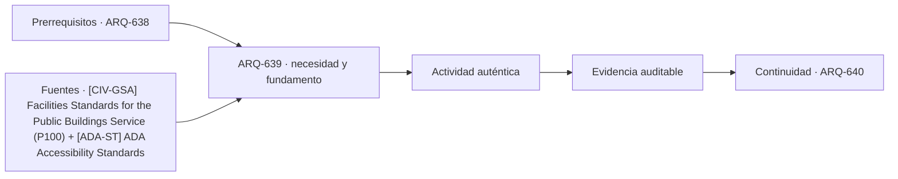

# ARQ-639 · Adaptabilidad y cambios de marca

**Parte 64 · Clase desarrollada · Incorporada en v0.34.**

Material educativo con casos ficticios. No sustituye proyecto, normativa, habilitación profesional, evaluación de seguridad ni autorización de operación.

## Pregunta central

¿Cómo preparar un edificio comercial para cambios frecuentes de arrendatario sin reconstruir cada vez estructura, fachada e instalaciones principales?

## Resultado de aprendizaje y continuidad

Distinguirás base building, fit-out y equipamiento del ocupante. Analizarás módulos, reservas y reversibilidad de cambios.

## 1. Tipología y función

Los locales comerciales cambian de marca y actividad más rápido que la estructura del edificio. Separar capas de distinta vida útil permite modificar acabados o particiones sin intervenir innecesariamente sistemas permanentes.

## 2. Programa y relaciones

El base building puede entregar estructura, envolvente, acometidas y rutas principales; el fit-out distribuye instalaciones, mobiliario y acabados. La frontera contractual debe quedar clara para evitar vacíos y duplicaciones.

## 3. Personas, flujos y operación

La modulación ayuda a unir o dividir locales, pero no todos los usos tienen iguales cargas, ventilación, agua o extracción. La flexibilidad geométrica necesita capacidad y espacio de sistemas.

## 4. Sistemas e interfaces

Una reserva de potencia o caudal es una decisión con costo y espacio. Sobredimensionar todo “por si acaso” tampoco es una estrategia eficiente; conviene definir escenarios plausibles y mecanismos de ampliación.

## 5. Tiempo, cambio y límites

La documentación de cambios debe conservar lo ejecutado. Un plano base desactualizado hace que la siguiente reforma parta de supuestos incorrectos y aumenta riesgo de interferencias.

## Caso trabajado: unir dos módulos

Dos locales contiguos tienen 90 m² cada uno y una franja técnica de 10 m² por local incluida en su superficie. Al unirlos, se eliminan 4 m² de partición interior y se mantiene una sola franja técnica de 14 m². La superficie útil comercial pasa de 2×80 =160 m² a 180-4-14 =162 m² bajo las convenciones del ejercicio. La ganancia es 2 m², no 4, porque cambia también la reserva técnica.

## Errores frecuentes y revisión crítica

No confundas una suma correcta con una decisión de proyecto completa; no conviertas capacidad nominal en aforo, disponibilidad, seguridad o calidad; no traslades referencias extranjeras como normativa local; no ocultes estados desconocidos. Cada resultado debe conservar unidad, frontera, tiempo y supuestos.

## Práctica independiente

Propón una retícula de cuatro módulos que puedan funcionar como cuatro, dos o un único local. Explica qué sistemas necesitan interfaces repetibles y cuáles no deberían duplicarse en cada módulo.

## Solución razonada

La solución debe separar área bruta, particiones y reservas. También debe marcar cargas y ventilación como pendientes si cambia la actividad.

## Autoevaluación y enlace

Puedes avanzar cuando distingues programa, operación y evidencia, reconstruyes el caso sin copiar la respuesta y puedes nombrar al menos una condición que el cálculo no resuelve. ARQ-640 integra hotelería y comercio en un proyecto mixto y cierra el bloque.

<!-- pedagogia-2026:inicio -->
## Decisión pedagógica y posición curricular

### Por qué existe

Esta clase existe para resolver una necesidad concreta del recorrido: ¿Cómo preparar un edificio comercial para cambios frecuentes de arrendatario sin reconstruir cada vez estructura, fachada e instalaciones principales?

### Por qué está exactamente aquí

Ocupa el lugar 9 de la Parte 64. Se estudia después de ARQ-638 · Mercados y comercio de alimentos porque usa esa base para responder «¿Cómo preparar un edificio comercial para cambios frecuentes de arrendatario sin reconstruir cada vez estructura, fachada e instalaciones principales?». Se ubica antes de ARQ-640 · Proyecto integrado de hospitalidad y comercio porque la evidencia producida aquí debe estar disponible para ese paso.

- **Prerrequisitos:** `ARQ-638`
- **Capacidad que introduce:** Distinguirás base building, fit-out y equipamiento del ocupante. Analizarás módulos, reservas y reversibilidad de cambios.
- **Clases o experiencias que dependen de ella:** `ARQ-640`

El diagrama permite comprobar una relación que el texto lineal oculta con facilidad: esta clase recibe capacidades previas, toma decisiones apoyadas por fuentes, exige una experiencia y produce evidencia que habilita trabajo posterior. No representa un procedimiento de obra.

## Resultado observable, evidencia y evaluación

1. Identificar y delimitar las condiciones necesarias para responder la pregunta central de adaptabilidad y cambios de marca.
2. Producir y comprobar la evidencia declarada por la clase: Distinguirás base building, fit-out y equipamiento del ocupante. Analizarás módulos, reservas y reversibilidad de cambios.
3. Justificar una decisión de adaptabilidad y cambios de marca mediante fuentes, supuestos, alternativas y límites explícitos.

## Actividad, evidencia y criterio de aceptación

**Actividad:** Propón una retícula de cuatro módulos que puedan funcionar como cuatro, dos o un único local. Explica qué sistemas necesitan interfaces repetibles y cuáles no deberían duplicarse en cada módulo.

**Evidencia mínima:** Distinguirás base building, fit-out y equipamiento del ocupante. Analizarás módulos, reservas y reversibilidad de cambios.

**Archivo sugerido:** `evidence/ARQ-639/evidencia.md`.

**Criterio de aceptación:** la entrega se acepta cuando:

- La entrega responde explícitamente a la pregunta: ¿Cómo preparar un edificio comercial para cambios frecuentes de arrendatario sin reconstruir cada vez estructura, fachada e instalaciones principales?
- La actividad conserva las fronteras del caso y permite reconstruir el procedimiento: Propón una retícula de cuatro módulos que puedan funcionar como cuatro, dos o un único local. Explica qué sistemas necesitan interfaces repetibles y cuáles no deberían duplicarse en cada módulo.
- Cada afirmación externa puede seguirse hasta una fuente, su alcance consultado y su límite.
- La evidencia deja disponible una entrada comprobable para ARQ-640.
- No confundas una suma correcta con una decisión de proyecto completa; no conviertas capacidad nominal en aforo, disponibilidad, seguridad o calidad; no traslades referencias extranjeras como normativa local; no ocultes estados desconocidos. Cada resultado debe conservar unidad, frontera, tiempo y supuestos.

La [rúbrica común](../../docs/RUBRICA_COMUN.md) complementa estos criterios; no los reemplaza. Una entrega puede superar un promedio y continuar pendiente si oculta una condición crítica.

## Trazabilidad de las decisiones

| # | Decisión o fundamento | Fuente utilizada | Aplicación y límite en esta clase |
|---:|---|---|---|
| 1 | Referencia de edificios públicos, desempeño, accesibilidad, coordinación y ciclo de vida. Ámbito federal estadounidense; no sustituye normativa chilena. | [[CIV-GSA] Facilities Standards for the Public Buildings Service (P100)](https://www.gsa.gov/real-estate/facilities-standards-for-the-public-buildings-service) | Consulta: Alcance consultado no documentado; debe completarse antes de ampliar la conclusión. Límite: Referencia de edificios públicos, desempeño, accesibilidad, coordinación y ciclo de vida. Ámbito federal estadounidense; no sustituye normativa chilena. |
| 2 | Accesibilidad de edificios, tribunales, detención, alojamiento temporal y áreas públicas. No se presenta como norma chilena. | [[ADA-ST] ADA Accessibility Standards](https://www.access-board.gov/ada/) | Consulta: Alcance consultado no documentado; debe completarse antes de ampliar la conclusión. Límite: Accesibilidad de edificios, tribunales, detención, alojamiento temporal y áreas públicas. No se presenta como norma chilena. |

La tabla permite auditar las relaciones; la explicación, el caso y la práctica de la clase siguen siendo la documentación principal.

## Autoevaluación, recuperación y continuidad

### Errores diagnósticos

Antes de avanzar, comprueba si puedes reconstruir cada resultado sin mirar la solución, señalar qué evidencia lo sostiene y nombrar una condición que obligaría a revisar tu decisión. Conserva la primera versión, la objeción recibida y la revisión.

**Conexión siguiente:** La continuidad inmediata es ARQ-640 · Proyecto integrado de hospitalidad y comercio; conserva el método y vuelve a verificar datos y límites.
<!-- pedagogia-2026:fin -->

## Fuentes y alcance de uso

- [CIV-GSA] Facilities Standards for the Public Buildings Service (P100) — U.S. General Services Administration. https://www.gsa.gov/real-estate/facilities-standards-for-the-public-buildings-service

Uso y límite: Referencia de edificios públicos, desempeño, accesibilidad, coordinación y ciclo de vida. Ámbito federal estadounidense; no sustituye normativa chilena.

- [ADA-ST] ADA Accessibility Standards — U.S. Access Board. https://www.access-board.gov/ada/

Uso y límite: Accesibilidad de edificios, tribunales, detención, alojamiento temporal y áreas públicas. No se presenta como norma chilena.
