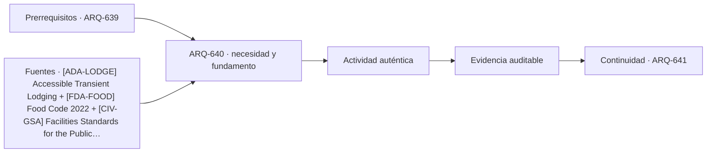

# ARQ-640 · Proyecto integrado de hospitalidad y comercio

**Parte 64 · Clase desarrollada · Incorporada en v0.34.**

Material educativo con casos ficticios. No sustituye proyecto, normativa, habilitación profesional, evaluación de seguridad ni autorización de operación.

## Pregunta central

¿Cómo coordinar hotel, restaurantes, comercio y espacios de evento en un conjunto mixto sin duplicar accesos, servicios o capacidades y sin perder independencia operativa?

## Resultado de aprendizaje y continuidad

Construirás un programa integrado, identificarás sinergias y dependencias y defenderás una estrategia por estados de operación.

## 1. Tipología y función

Los complejos mixtos permiten compartir estacionamiento, carga, energía, espacios de evento o parte del lobby, pero los beneficios existen solo si horarios, usuarios y responsabilidades son compatibles.

## 2. Programa y relaciones

Hotel y comercio tienen ritmos diferentes. Un restaurante puede servir huéspedes y público externo; una sala de eventos puede generar picos que coincidan con compras o check-in. El proyecto debe estudiar simultaneidad.

## 3. Personas, flujos y operación

Los back-of-house pueden compartir ciertas infraestructuras, pero alimentos, ropa, residuos, mercancía y mantenimiento no son flujos equivalentes. La integración necesita interfaces explícitas.

## 4. Sistemas e interfaces

La accesibilidad debe mantenerse a través de las fronteras entre operadores. Un huésped que usa restaurante o comercio no debería perder una cadena accesible por cambiar de “propiedad” dentro del complejo.

## 5. Tiempo, cambio y límites

La defensa del proyecto debe separar capacidad nominal, servicio previsto y condiciones pendientes. El hecho de que un espacio pueda alojar varias funciones en momentos distintos no significa que pueda hacerlo simultáneamente.

## Caso trabajado: estacionamiento compartido

Un hotel ficticio demanda 90 plazas en su pico nocturno y el comercio 140 en su pico vespertino. Si sus picos no coinciden, sumar 230 como necesidad fija puede sobredimensionar; pero usar solo el máximo de 140 supone coincidencia nula. En un intervalo de transición se estiman 70 del hotel y 100 del comercio: 170 plazas. El caso demuestra que compartir requiere perfiles horarios, no una suma ni un máximo aislado.

## Errores frecuentes y revisión crítica

No confundas una suma correcta con una decisión de proyecto completa; no conviertas capacidad nominal en aforo, disponibilidad, seguridad o calidad; no traslades referencias extranjeras como normativa local; no ocultes estados desconocidos. Cada resultado debe conservar unidad, frontera, tiempo y supuestos.

## Práctica independiente

Desarrolla un programa mixto con hotel de 80 habitaciones, restaurante, 12 locales y sala de eventos. Define qué funciones compartirías y cuáles mantendrías independientes. Incluye un escenario de cierre parcial.

## Solución razonada

La solución debe justificar cada compartición mediante horarios, operación y servicio; conservar accesibilidad y logística; y registrar normativa, incendio, estructura y seguridad como verificaciones profesionales pendientes.

## Autoevaluación y enlace

Puedes avanzar cuando distingues programa, operación y evidencia, reconstruyes el caso sin copiar la respuesta y puedes nombrar al menos una condición que el cálculo no resuelve. ARQ-641 abrirá escuelas, universidades y campus, trasladando métodos de programa y operación sin copiar capacidades de hotel o comercio.

<!-- pedagogia-2026:inicio -->
## Decisión pedagógica y posición curricular

### Por qué existe

Esta clase existe para resolver una necesidad concreta del recorrido: ¿Cómo coordinar hotel, restaurantes, comercio y espacios de evento en un conjunto mixto sin duplicar accesos, servicios o capacidades y sin perder independencia operativa?

### Por qué está exactamente aquí

Cierra la Parte 64: integra lo producido en ARQ-639 · Adaptabilidad y cambios de marca para responder «¿Cómo coordinar hotel, restaurantes, comercio y espacios de evento en un conjunto mixto sin duplicar accesos, servicios o capacidades y sin perder independencia operativa?». La transición hacia ARQ-641 · Escuela: aula, patio y comunidad transfiere el método y la disciplina de evidencia, no los datos o parámetros particulares de esta parte.

- **Prerrequisitos:** `ARQ-639`
- **Capacidad que introduce:** Construirás un programa integrado, identificarás sinergias y dependencias y defenderás una estrategia por estados de operación.
- **Clases o experiencias que dependen de ella:** `ARQ-641`

El diagrama permite comprobar una relación que el texto lineal oculta con facilidad: esta clase recibe capacidades previas, toma decisiones apoyadas por fuentes, exige una experiencia y produce evidencia que habilita trabajo posterior. No representa un procedimiento de obra.

## Resultado observable, evidencia y evaluación

1. Identificar y delimitar las condiciones necesarias para responder la pregunta central de proyecto integrado de hospitalidad y comercio.
2. Producir y comprobar la evidencia declarada por la clase: Construirás un programa integrado, identificarás sinergias y dependencias y defenderás una estrategia por estados de operación.
3. Justificar una decisión de proyecto integrado de hospitalidad y comercio mediante fuentes, supuestos, alternativas y límites explícitos.

## Actividad, evidencia y criterio de aceptación

**Actividad:** Desarrolla un programa mixto con hotel de 80 habitaciones, restaurante, 12 locales y sala de eventos. Define qué funciones compartirías y cuáles mantendrías independientes. Incluye un escenario de cierre parcial.

**Evidencia mínima:** Construirás un programa integrado, identificarás sinergias y dependencias y defenderás una estrategia por estados de operación.

**Archivo sugerido:** `evidence/ARQ-640/evidencia.md`.

**Criterio de aceptación:** la entrega se acepta cuando:

- La entrega responde explícitamente a la pregunta: ¿Cómo coordinar hotel, restaurantes, comercio y espacios de evento en un conjunto mixto sin duplicar accesos, servicios o capacidades y sin perder independencia operativa?
- La actividad conserva las fronteras del caso y permite reconstruir el procedimiento: Desarrolla un programa mixto con hotel de 80 habitaciones, restaurante, 12 locales y sala de eventos. Define qué funciones compartirías y cuáles mantendrías independientes. Incluye un escenario de cierre parcial.
- Cada afirmación externa puede seguirse hasta una fuente, su alcance consultado y su límite.
- La evidencia deja disponible una entrada comprobable para ARQ-641.
- No confundas una suma correcta con una decisión de proyecto completa; no conviertas capacidad nominal en aforo, disponibilidad, seguridad o calidad; no traslades referencias extranjeras como normativa local; no ocultes estados desconocidos. Cada resultado debe conservar unidad, frontera, tiempo y supuestos.

La [rúbrica común](../../docs/RUBRICA_COMUN.md) complementa estos criterios; no los reemplaza. Una entrega puede superar un promedio y continuar pendiente si oculta una condición crítica.

## Trazabilidad de las decisiones

| # | Decisión o fundamento | Fuente utilizada | Aplicación y límite en esta clase |
|---:|---|---|---|
| 1 | Habitaciones, baños, áreas comunes y servicios accesibles en alojamiento temporal. Ámbito ADA/ABA. | [[ADA-LODGE] Accessible Transient Lodging](https://www.access-board.gov/webinars/2023/07/06/accessible-transient-lodging/) | Consulta: Alcance consultado no documentado; debe completarse antes de ampliar la conclusión. Límite: Habitaciones, baños, áreas comunes y servicios accesibles en alojamiento temporal. Ámbito ADA/ABA. |
| 2 | Modelo de seguridad alimentaria para retail y servicios de comida. No se convierte en reglamentación chilena. | [[FDA-FOOD] Food Code 2022](https://www.fda.gov/food/fda-food-code/food-code-2022) | Consulta: Alcance consultado no documentado; debe completarse antes de ampliar la conclusión. Límite: Modelo de seguridad alimentaria para retail y servicios de comida. No se convierte en reglamentación chilena. |
| 3 | Referencia de edificios públicos, desempeño, accesibilidad, coordinación y ciclo de vida. Ámbito federal estadounidense; no sustituye normativa chilena. | [[CIV-GSA] Facilities Standards for the Public Buildings Service (P100)](https://www.gsa.gov/real-estate/facilities-standards-for-the-public-buildings-service) | Consulta: Alcance consultado no documentado; debe completarse antes de ampliar la conclusión. Límite: Referencia de edificios públicos, desempeño, accesibilidad, coordinación y ciclo de vida. Ámbito federal estadounidense; no sustituye normativa chilena. |

La tabla permite auditar las relaciones; la explicación, el caso y la práctica de la clase siguen siendo la documentación principal.

## Autoevaluación, recuperación y continuidad

### Errores diagnósticos

Antes de avanzar, comprueba si puedes reconstruir cada resultado sin mirar la solución, señalar qué evidencia lo sostiene y nombrar una condición que obligaría a revisar tu decisión. Conserva la primera versión, la objeción recibida y la revisión.

**Conexión siguiente:** La continuidad inmediata es ARQ-641 · Escuela: aula, patio y comunidad; conserva el método y vuelve a verificar datos y límites.
<!-- pedagogia-2026:fin -->

## Fuentes y alcance de uso

- [ADA-LODGE] Accessible Transient Lodging — U.S. Access Board. https://www.access-board.gov/webinars/2023/07/06/accessible-transient-lodging/

Uso y límite: Habitaciones, baños, áreas comunes y servicios accesibles en alojamiento temporal. Ámbito ADA/ABA.

- [FDA-FOOD] Food Code 2022 — U.S. Food and Drug Administration. https://www.fda.gov/food/fda-food-code/food-code-2022

Uso y límite: Modelo de seguridad alimentaria para retail y servicios de comida. No se convierte en reglamentación chilena.

- [CIV-GSA] Facilities Standards for the Public Buildings Service (P100) — U.S. General Services Administration. https://www.gsa.gov/real-estate/facilities-standards-for-the-public-buildings-service

Uso y límite: Referencia de edificios públicos, desempeño, accesibilidad, coordinación y ciclo de vida. Ámbito federal estadounidense; no sustituye normativa chilena.
