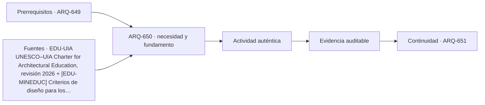

# ARQ-650 · Proyecto integrado de campus

**Parte 65 · Clase desarrollada · Incorporada en v0.35.**

Material educativo con casos ficticios. No sustituye proyecto, normativa, habilitación profesional, ensayo certificado ni autorización de uso. Las cifras se emplean para aprender a razonar y deben conservar sus fronteras.

## Pregunta central

¿Cómo integrar aprendizaje, residencia, paisaje, movilidad, etapas y comunidad en un campus sin perder la trazabilidad de cada decisión?

## Resultado de aprendizaje y continuidad

Construirás un expediente conceptual que conecte programa, red, estados de operación y crecimiento. Aprenderás a presentar una alternativa con decisiones verificadas y pendientes explícitos. Esta clase continúa la progresión de la parte y deja explícito qué información debe pasar a la siguiente sin transformar una hipótesis en dato confirmado.

## 1. El espacio educativo como soporte de actividades

Un edificio educativo no funciona porque tenga suficientes recintos rotulados. Funciona cuando actividades, personas, objetos, tiempos y apoyos pueden relacionarse sin contradicciones innecesarias. La arquitectura debe representar clases, trabajo individual, colaboración, pausa, alimentación, preparación, mantenimiento, acceso comunitario y cambios de horario como estados distintos. El programa es una hipótesis operativa que se contrasta; no una lista cerrada de metros cuadrados.

## 2. Programa, simultaneidad y relaciones

La superficie total es solo una de las variables. Dos programas con igual área pueden comportarse de manera muy distinta si uno concentra circulaciones, si los espacios compartidos están lejos de quienes los necesitan o si varias actividades exigen el mismo recurso al mismo tiempo. Conviene construir matrices de adyacencia y simultaneidad, diagramas de recorridos y escenarios de operación. Cuando una actividad es compartida, se debe documentar quién la usa, cuándo y qué ocurre si coincide con otra.

## 3. Personas, accesibilidad y comunidad

El diseño no puede suponer un usuario promedio único. Alturas, velocidades, apoyos, orientación, comunicación y necesidades de acompañamiento cambian entre personas y situaciones. La accesibilidad debe leerse como cadena completa desde llegada y comprensión hasta participación y salida. El uso comunitario agrega horarios y responsabilidades diferentes de la jornada académica. Abrir un gimnasio por la tarde puede requerir acceso independiente, servicios higiénicos disponibles, iluminación, custodia y mantenimiento sin exponer todo el edificio.

## 4. Ambiente, infraestructura y tecnología

Confort térmico, acústica, luz, calidad de aire, energía, agua y conectividad no son capas posteriores. Condicionan dónde se puede enseñar, concentrarse, experimentar o descansar. La tecnología tampoco se reduce a pantallas: incluye energía, datos, actualización, almacenamiento, soporte y capacidad de cambiar. Un recinto físicamente flexible puede ser tecnológicamente rígido si sus conexiones, ventilación o iluminación solo funcionan en una configuración.

## 5. Tiempo, mantenimiento y crecimiento

Las instituciones educativas cambian más rápido que muchos edificios. Un buen análisis separa lo que debe durar décadas -estructura, accesos, relaciones principales- de lo que puede cambiar con mayor frecuencia -mobiliario, equipamiento, particiones, software-. También considera mantenimiento y fases de expansión. Reservar una futura conexión es distinto de disponer hoy de una red, capacidad o autorización para usarla.

## Caso trabajado

CAMP-INT-01 tiene 6.000 m² académicos, 1.500 de biblioteca/comunidad, 2.000 de residencia, 1.000 de apoyo y 1.500 de circulación interior: 12.000 m² construidos. Una variante transfiere 300 m² de residencia a aprendizaje colaborativo. El total no cambia, pero la capacidad residencial y la mezcla de usos sí. Un balance correcto exige reabrir población alojada, horarios, recorridos y operación.

## Lectura crítica del caso

El ejemplo debe reconstruirse paso a paso. Primero fija la frontera: qué superficies, personas, piezas o intervalos pertenecen realmente al caso. Después conserva unidades y versión. A continuación comprueba el resultado por una segunda relación cuando sea posible. Finalmente escribe una frase que el cálculo respalda y otra que no puede sostener. Esta última parte es esencial: una cuenta correcta puede seguir siendo insuficiente para decidir una obra real.

También identifica al menos una interfaz con otra disciplina. En espacios educativos puede ser acústica, accesibilidad, instalaciones o gestión; en modelos y prototipos puede ser fabricación, estructura, materiales o información digital. La clase no busca aislar arquitectura de esas especialidades, sino reconocer cuándo una decisión arquitectónica depende de evidencia que debe producir otra persona o procedimiento.

## Errores frecuentes y control de calidad

Evita trasladar capacidades desde otra tipología, usar promedios para ocultar variación, sumar dos veces superficies compartidas, tratar disponibilidad nominal como servicio efectivo o presentar referencias extranjeras como autorización local. En prototipos, evita escalar directamente fuerzas o deformaciones sin leyes de similitud, medir sobre una versión distinta de la fabricada o corregir el archivo antes de comprobar el proceso. Toda conclusión debe conservar fecha, versión, unidades, supuestos y límites.

## Práctica independiente

Parte de 8.000 m²: 4.000 académicos, 1.000 biblioteca, 1.200 residencia, 600 apoyo y 1.200 circulación. Traslada 200 m² de circulación a aprendizaje colaborativo dentro del área académica. Explica qué debe comprobarse.

## Solución razonada

El total sigue 8.000. Académico pasa a 4.200 y circulación a 1.000. Deben revisarse rutas, accesibilidad, capacidad de cambios de clase, incendio, orientación y la necesidad real del nuevo espacio. No basta que la suma cierre.

La solución corresponde al modelo declarado. En un proyecto real deben verificarse normativa, sitio, personas, productos, ensayos, responsabilidades, operación y mantenimiento pertinentes. Si la evidencia no existe, el estado correcto es pendiente, no aprobado ni rechazado por intuición.

## Autoevaluación y transferencia

Puedes avanzar cuando reconstruyes el caso sin mirar la respuesta, distingues al menos una conclusión válida y una que excedería la evidencia, y señalas qué dato o especialista resolvería la incertidumbre. ARQ-651 continúa el bloque.

<!-- pedagogia-2026:inicio -->
## Decisión pedagógica y posición curricular

### Por qué existe

Esta clase existe para resolver una necesidad concreta del recorrido: ¿Cómo integrar aprendizaje, residencia, paisaje, movilidad, etapas y comunidad en un campus sin perder la trazabilidad de cada decisión?

### Por qué está exactamente aquí

Cierra la Parte 65: integra lo producido en ARQ-649 · Crecimiento por etapas y uso comunitario para responder «¿Cómo integrar aprendizaje, residencia, paisaje, movilidad, etapas y comunidad en un campus sin perder la trazabilidad de cada decisión?». La transición hacia ARQ-651 · Maqueta de masa y emplazamiento transfiere el método y la disciplina de evidencia, no los datos o parámetros particulares de esta parte.

- **Prerrequisitos:** `ARQ-649`
- **Capacidad que introduce:** Construirás un expediente conceptual que conecte programa, red, estados de operación y crecimiento. Aprenderás a presentar una alternativa con decisiones verificadas y pendientes explícitos. Esta clase continúa la progresión de la parte y deja explícito qué información debe pasar a la siguiente sin transformar una hipótesis en dato confirmado.
- **Clases o experiencias que dependen de ella:** `ARQ-651`

El diagrama permite comprobar una relación que el texto lineal oculta con facilidad: esta clase recibe capacidades previas, toma decisiones apoyadas por fuentes, exige una experiencia y produce evidencia que habilita trabajo posterior. No representa un procedimiento de obra.

## Resultado observable, evidencia y evaluación

1. Identificar y delimitar las condiciones necesarias para responder la pregunta central de proyecto integrado de campus.
2. Producir y comprobar la evidencia declarada por la clase: Construirás un expediente conceptual que conecte programa, red, estados de operación y crecimiento. Aprenderás a presentar una alternativa con decisiones verificadas y pendientes explícitos. Esta clase continúa la progresión de la parte y deja explícito qué información debe pasar a la siguiente sin transformar una hipótesis en dato confirmado.
3. Justificar una decisión de proyecto integrado de campus mediante fuentes, supuestos, alternativas y límites explícitos.

## Actividad, evidencia y criterio de aceptación

**Actividad:** Parte de 8.000 m²: 4.000 académicos, 1.000 biblioteca, 1.200 residencia, 600 apoyo y 1.200 circulación. Traslada 200 m² de circulación a aprendizaje colaborativo dentro del área académica. Explica qué debe comprobarse.

**Evidencia mínima:** Construirás un expediente conceptual que conecte programa, red, estados de operación y crecimiento. Aprenderás a presentar una alternativa con decisiones verificadas y pendientes explícitos. Esta clase continúa la progresión de la parte y deja explícito qué información debe pasar a la siguiente sin transformar una hipótesis en dato confirmado.

**Archivo sugerido:** `evidence/ARQ-650/evidencia.md`.

**Criterio de aceptación:** la entrega se acepta cuando:

- La entrega responde explícitamente a la pregunta: ¿Cómo integrar aprendizaje, residencia, paisaje, movilidad, etapas y comunidad en un campus sin perder la trazabilidad de cada decisión?
- La actividad conserva las fronteras del caso y permite reconstruir el procedimiento: Parte de 8.000 m²: 4.000 académicos, 1.000 biblioteca, 1.200 residencia, 600 apoyo y 1.200 circulación. Traslada 200 m² de circulación a aprendizaje colaborativo dentro del área académica. Explica qué debe comprobarse.
- Cada afirmación externa puede seguirse hasta una fuente, su alcance consultado y su límite.
- La evidencia deja disponible una entrada comprobable para ARQ-651.
- Evita trasladar capacidades desde otra tipología, usar promedios para ocultar variación, sumar dos veces superficies compartidas, tratar disponibilidad nominal como servicio efectivo o presentar referencias extranjeras como autorización local. En prototipos, evita escalar directamente fuerzas o deformaciones sin leyes de similitud, medir sobre una versión distinta de la fabricada o corregir el archivo antes de comprobar el proceso.

La [rúbrica común](../../docs/RUBRICA_COMUN.md) complementa estos criterios; no los reemplaza. Una entrega puede superar un promedio y continuar pendiente si oculta una condición crítica.

## Trazabilidad de las decisiones

| # | Decisión o fundamento | Fuente utilizada | Aplicación y límite en esta clase |
|---:|---|---|---|
| 1 | Amplitud de formación arquitectónica e integración de diseño, cultura, técnica, sociedad y responsabilidad. | [EDU-UIA UNESCO–UIA Charter for Architectural Education, revisión 2026](https://www.uia-architectes.org/en/news/unesco-uia-charter-for-architectural-education-revised-edition-2026/) | Consulta: Alcance consultado no documentado; debe completarse antes de ampliar la conclusión. Límite: Amplitud de formación arquitectónica e integración de diseño, cultura, técnica, sociedad y responsabilidad. |
| 2 | Criterios de infraestructura escolar, confort, superficie y relación entre espacio educativo y aprendizaje. Referencia de diseño; verificar normativa vigente y proyecto concreto. | [[EDU-MINEDUC] Criterios de diseño para los nuevos espacios educativos](https://bibliotecadigital.mineduc.cl/handle/20.500.12365/22010) | Consulta: Alcance consultado no documentado; debe completarse antes de ampliar la conclusión. Límite: Criterios de infraestructura escolar, confort, superficie y relación entre espacio educativo y aprendizaje. Referencia de diseño; verificar normativa vigente y proyecto concreto. |
| 3 | Modelos de espacios de aprendizaje flexibles, modificables y sostenibles. Referencia internacional, no estándar de superficie. | [[EDU-OECD-FLEX] The Future of the Physical Learning Environment](https://www.oecd.org/en/publications/the-future-of-the-physical-learning-environment_5kg0lkz2d9f2-en.html) | Consulta: Alcance consultado no documentado; debe completarse antes de ampliar la conclusión. Límite: Modelos de espacios de aprendizaje flexibles, modificables y sostenibles. Referencia internacional, no estándar de superficie. |
| 4 | Accesibilidad y usabilidad del entorno construido. No reemplaza OGUC ni requisitos locales chilenos. | [ISO-21542 ISO 21542:2021 — Accessibility and usability of the built…](https://www.iso.org/standard/71860.html) | Consulta: Alcance consultado no documentado; debe completarse antes de ampliar la conclusión. Límite: Accesibilidad y usabilidad del entorno construido. No reemplaza OGUC ni requisitos locales chilenos. |

La tabla permite auditar las relaciones; la explicación, el caso y la práctica de la clase siguen siendo la documentación principal.

## Autoevaluación, recuperación y continuidad

### Errores diagnósticos

Antes de avanzar, comprueba si puedes reconstruir cada resultado sin mirar la solución, señalar qué evidencia lo sostiene y nombrar una condición que obligaría a revisar tu decisión. Conserva la primera versión, la objeción recibida y la revisión.

**Conexión siguiente:** La continuidad inmediata es ARQ-651 · Maqueta de masa y emplazamiento; conserva el método y vuelve a verificar datos y límites.
<!-- pedagogia-2026:fin -->

## Fuentes y alcance de uso

- **[EDU-UIA] UNESCO-UIA Charter for Architectural Education, revised edition 2026** — UIA / UNESCO. https://www.uia-architectes.org/en/news/unesco-uia-charter-for-architectural-education-revised-edition-2026/

Uso y límite: Amplitud de formación arquitectónica e integración de diseño, cultura, técnica, sociedad y responsabilidad.

- **[EDU-MINEDUC] Criterios de diseño para los nuevos espacios educativos** — Ministerio de Educación de Chile. https://bibliotecadigital.mineduc.cl/handle/20.500.12365/22010

Uso y límite: Criterios de infraestructura escolar, confort, superficie y relación entre espacio educativo y aprendizaje. Referencia de diseño; verificar normativa vigente y proyecto concreto.

- **[EDU-OECD-FLEX] The Future of the Physical Learning Environment** — OECD. https://www.oecd.org/en/publications/the-future-of-the-physical-learning-environment_5kg0lkz2d9f2-en.html

Uso y límite: Modelos de espacios de aprendizaje flexibles, modificables y sostenibles. Referencia internacional, no estándar de superficie.

- **[ISO-21542] ISO 21542:2021 - Accessibility and usability of the built environment** — ISO. https://www.iso.org/standard/71860.html

Uso y límite: Accesibilidad y usabilidad del entorno construido. No reemplaza OGUC ni requisitos locales chilenos.
