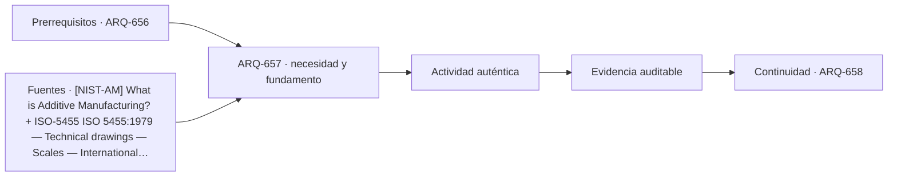

# ARQ-657 · Fabricación digital y control geométrico

**Parte 66 · Clase desarrollada · Incorporada en v0.35.**

Material educativo con casos ficticios. No sustituye proyecto, normativa, habilitación profesional, ensayo certificado ni autorización de uso. Las cifras se emplean para aprender a razonar y deben conservar sus fronteras.

## Pregunta central

¿Cómo pasar de un modelo digital a una pieza física sin asumir que la máquina reproduce exactamente la geometría nominal?

## Resultado de aprendizaje y continuidad

Distinguirás modelo, trayectoria, proceso, material y pieza medida. Analizarás kerf, tolerancias y acumulación de error mediante un ejemplo reproducible. Esta clase continúa la progresión de la parte y deja explícito qué información debe pasar a la siguiente sin transformar una hipótesis en dato confirmado.

## 1. Modelo, pregunta y escala

Una maqueta o prototipo es útil cuando se sabe qué pregunta intenta responder. Puede estudiar masa, vacío, secuencia, luz, montaje, tolerancias o percepción; no todas a la vez con el mismo grado de fidelidad. La escala debe declararse y relacionarse con el propósito. Una reducción geométrica conserva proporciones lineales, pero no garantiza semejanza de peso, rigidez, textura, sonido o comportamiento del material.

## 2. Representar no es copiar

Todo modelo selecciona información. Espesores demasiado pequeños pueden volverse simbólicos; colores pueden codificar funciones; un corte puede eliminar elementos para revelar relaciones ocultas. Esa selección es legítima si se documenta. El problema aparece cuando una convención gráfica se presenta como medición o cuando una simplificación necesaria para fabricar el modelo se olvida al interpretar el resultado.

## 3. Del archivo al objeto y de vuelta

En un flujo físico-digital existen varias versiones: modelo de diseño, archivo de fabricación, pieza producida, medición y registro de cambios. Cada transformación puede introducir diferencias. Por eso la trazabilidad debe conservar identificadores, unidades, escala, orientación y estado. La gestión de información BIM aporta un marco para no confundir presencia de un archivo con vigencia de su contenido.

## 4. Medir y contrastar

Un prototipo produce evidencia solo si se define qué se observa, cómo se mide y qué comparación es válida. Una fotografía atractiva no reemplaza una cota; una deformación visible no es una fuerza; una experiencia inmersiva no prueba accesibilidad. Cuando sea posible, conviene comprobar por otra vía: regla y archivo, maqueta y sección, modelo físico y digital, cálculo y medición. Las diferencias son información, no fallos que deban ocultarse.

## 5. Iteración, error y aprendizaje

El valor del prototipado está en poder cambiar una hipótesis antes de comprometer una obra. Por eso el portafolio debe conservar versiones descartadas y explicar por qué se modificaron. Una mejora local puede crear otra incompatibilidad: aumentar espesor para que una pieza sea fabricable puede distorsionar escala; simplificar geometría puede alterar una junta; aumentar detalle puede dificultar leer la idea principal. La iteración debe registrar estas compensaciones.

## Caso trabajado

FAB-01 necesita ensamblar cinco paneles nominales de 200 mm en una longitud total de 1.000 mm. El proceso produce piezas de 199,6 mm promedio bajo una desviación sistemática ficticia de -0,4 mm. Cinco piezas suman 998 mm: faltan 2 mm respecto de la nominal. Corregir cada archivo aumentando 0,4 mm puede compensar este lote, pero no es una regla universal: primero se investiga proceso, material y variación.

## Lectura crítica del caso

El ejemplo debe reconstruirse paso a paso. Primero fija la frontera: qué superficies, personas, piezas o intervalos pertenecen realmente al caso. Después conserva unidades y versión. A continuación comprueba el resultado por una segunda relación cuando sea posible. Finalmente escribe una frase que el cálculo respalda y otra que no puede sostener. Esta última parte es esencial: una cuenta correcta puede seguir siendo insuficiente para decidir una obra real.

También identifica al menos una interfaz con otra disciplina. En espacios educativos puede ser acústica, accesibilidad, instalaciones o gestión; en modelos y prototipos puede ser fabricación, estructura, materiales o información digital. La clase no busca aislar arquitectura de esas especialidades, sino reconocer cuándo una decisión arquitectónica depende de evidencia que debe producir otra persona o procedimiento.

## Errores frecuentes y control de calidad

Evita trasladar capacidades desde otra tipología, usar promedios para ocultar variación, sumar dos veces superficies compartidas, tratar disponibilidad nominal como servicio efectivo o presentar referencias extranjeras como autorización local. En prototipos, evita escalar directamente fuerzas o deformaciones sin leyes de similitud, medir sobre una versión distinta de la fabricada o corregir el archivo antes de comprobar el proceso. Toda conclusión debe conservar fecha, versión, unidades, supuestos y límites.

## Práctica independiente

Se ensamblan ocho piezas nominales de 125 mm. Cada una resulta 124,7 mm en una corrida. Calcula longitud total y diferencia frente a 1.000 mm. ¿Qué medirías antes de editar el modelo?

## Solución razonada

Total 997,6 mm; diferencia -2,4 mm. Antes de editar: repetibilidad, calibración, material, orientación, herramienta, temperatura y método de medición. Un solo conjunto no prueba error permanente.

La solución corresponde al modelo declarado. En un proyecto real deben verificarse normativa, sitio, personas, productos, ensayos, responsabilidades, operación y mantenimiento pertinentes. Si la evidencia no existe, el estado correcto es pendiente, no aprobado ni rechazado por intuición.

## Autoevaluación y transferencia

Puedes avanzar cuando reconstruyes el caso sin mirar la respuesta, distingues al menos una conclusión válida y una que excedería la evidencia, y señalas qué dato o especialista resolvería la incertidumbre. ARQ-658 continúa el bloque.

<!-- pedagogia-2026:inicio -->
## Decisión pedagógica y posición curricular

### Por qué existe

Esta clase existe para resolver una necesidad concreta del recorrido: ¿Cómo pasar de un modelo digital a una pieza física sin asumir que la máquina reproduce exactamente la geometría nominal?

### Por qué está exactamente aquí

Ocupa el lugar 7 de la Parte 66. Se estudia después de ARQ-656 · Prototipos 1:1 y mock-ups porque usa esa base para responder «¿Cómo pasar de un modelo digital a una pieza física sin asumir que la máquina reproduce exactamente la geometría nominal?». Se ubica antes de ARQ-658 · Realidad virtual y modelos inmersivos porque la evidencia producida aquí debe estar disponible para ese paso.

- **Prerrequisitos:** `ARQ-656`
- **Capacidad que introduce:** Distinguirás modelo, trayectoria, proceso, material y pieza medida. Analizarás kerf, tolerancias y acumulación de error mediante un ejemplo reproducible. Esta clase continúa la progresión de la parte y deja explícito qué información debe pasar a la siguiente sin transformar una hipótesis en dato confirmado.
- **Clases o experiencias que dependen de ella:** `ARQ-658`

El diagrama permite comprobar una relación que el texto lineal oculta con facilidad: esta clase recibe capacidades previas, toma decisiones apoyadas por fuentes, exige una experiencia y produce evidencia que habilita trabajo posterior. No representa un procedimiento de obra.

## Resultado observable, evidencia y evaluación

1. Identificar y delimitar las condiciones necesarias para responder la pregunta central de fabricación digital y control geométrico.
2. Producir y comprobar la evidencia declarada por la clase: Distinguirás modelo, trayectoria, proceso, material y pieza medida. Analizarás kerf, tolerancias y acumulación de error mediante un ejemplo reproducible. Esta clase continúa la progresión de la parte y deja explícito qué información debe pasar a la siguiente sin transformar una hipótesis en dato confirmado.
3. Justificar una decisión de fabricación digital y control geométrico mediante fuentes, supuestos, alternativas y límites explícitos.

## Actividad, evidencia y criterio de aceptación

**Actividad:** Se ensamblan ocho piezas nominales de 125 mm. Cada una resulta 124,7 mm en una corrida. Calcula longitud total y diferencia frente a 1.000 mm.

**Evidencia mínima:** Distinguirás modelo, trayectoria, proceso, material y pieza medida. Analizarás kerf, tolerancias y acumulación de error mediante un ejemplo reproducible. Esta clase continúa la progresión de la parte y deja explícito qué información debe pasar a la siguiente sin transformar una hipótesis en dato confirmado.

**Archivo sugerido:** `evidence/ARQ-657/evidencia.md`.

**Criterio de aceptación:** la entrega se acepta cuando:

- La entrega responde explícitamente a la pregunta: ¿Cómo pasar de un modelo digital a una pieza física sin asumir que la máquina reproduce exactamente la geometría nominal?
- La actividad conserva las fronteras del caso y permite reconstruir el procedimiento: Se ensamblan ocho piezas nominales de 125 mm. Cada una resulta 124,7 mm en una corrida. Calcula longitud total y diferencia frente a 1.000 mm.
- Cada afirmación externa puede seguirse hasta una fuente, su alcance consultado y su límite.
- La evidencia deja disponible una entrada comprobable para ARQ-658.
- Evita trasladar capacidades desde otra tipología, usar promedios para ocultar variación, sumar dos veces superficies compartidas, tratar disponibilidad nominal como servicio efectivo o presentar referencias extranjeras como autorización local. En prototipos, evita escalar directamente fuerzas o deformaciones sin leyes de similitud, medir sobre una versión distinta de la fabricada o corregir el archivo antes de comprobar el proceso.

La [rúbrica común](../../docs/RUBRICA_COMUN.md) complementa estos criterios; no los reemplaza. Una entrega puede superar un promedio y continuar pendiente si oculta una condición crítica.

## Trazabilidad de las decisiones

| # | Decisión o fundamento | Fuente utilizada | Aplicación y límite en esta clase |
|---:|---|---|---|
| 1 | Fabricación aditiva desde modelos digitales, capa a capa, y necesidad de medición y estándares. | [[NIST-AM] What is Additive Manufacturing?](https://www.nist.gov/additive-manufacturing/what-additive-manufacturing) | Consulta: Alcance consultado no documentado; debe completarse antes de ampliar la conclusión. Límite: Fabricación aditiva desde modelos digitales, capa a capa, y necesidad de medición y estándares. |
| 2 | Definición y designación de escalas para dibujo técnico. Edición confirmada en 2025 según catálogo público. | [ISO-5455 ISO 5455:1979 — Technical drawings — Scales — International…](https://www.iso.org/standard/11500.html) | Consulta: Alcance consultado no documentado; debe completarse antes de ampliar la conclusión. Límite: Definición y designación de escalas para dibujo técnico. Edición confirmada en 2025 según catálogo público. |
| 3 | Conceptos y principios de gestión de información BIM. En 2026 existe una segunda edición en desarrollo; la edición publicada sigue siendo 2018. | [ISO-19650-1 ISO 19650-1:2018 — Information management using BIM:…](https://www.iso.org/standard/68078.html) | Consulta: Alcance consultado no documentado; debe completarse antes de ampliar la conclusión. Límite: Conceptos y principios de gestión de información BIM. En 2026 existe una segunda edición en desarrollo; la edición publicada sigue siendo 2018. |

La tabla permite auditar las relaciones; la explicación, el caso y la práctica de la clase siguen siendo la documentación principal.

## Autoevaluación, recuperación y continuidad

### Errores diagnósticos

Antes de avanzar, comprueba si puedes reconstruir cada resultado sin mirar la solución, señalar qué evidencia lo sostiene y nombrar una condición que obligaría a revisar tu decisión. Conserva la primera versión, la objeción recibida y la revisión.

**Conexión siguiente:** La continuidad inmediata es ARQ-658 · Realidad virtual y modelos inmersivos; conserva el método y vuelve a verificar datos y límites.
<!-- pedagogia-2026:fin -->

## Fuentes y alcance de uso

- **[NIST-AM] What is Additive Manufacturing?** — National Institute of Standards and Technology. https://www.nist.gov/additive-manufacturing/what-additive-manufacturing

Uso y límite: Fabricación aditiva desde modelos digitales, capa a capa, y necesidad de medición y estándares.

- **[ISO-5455] ISO 5455:1979 - Technical drawings - Scales** — ISO. https://www.iso.org/standard/11500.html

Uso y límite: Definición y designación de escalas para dibujo técnico. Edición confirmada en 2025 según catálogo público.

- **[ISO-19650] ISO 19650-1:2018 - Information management using BIM** — ISO. https://www.iso.org/standard/68078.html

Uso y límite: Conceptos y principios de gestión de información BIM. En 2026 existe una segunda edición en desarrollo; la edición publicada sigue siendo 2018.
