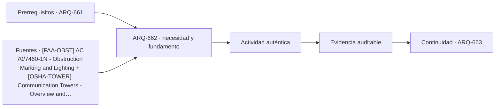

# ARQ-662 · Torres de telecomunicaciones

**Parte 67 · Clase desarrollada · Edición definitiva v1.0.**

Material educativo con casos ficticios. No constituye proyecto ejecutable, cálculo firmado, instrucción de trabajo peligroso, informe pericial, permiso ni habilitación profesional. Las cifras se emplean para aprender a razonar y conservan las fronteras declaradas.

## Pregunta central

¿Por qué una torre de telecomunicaciones debe estudiarse como estructura, infraestructura de servicio y lugar de trabajo, y no solo como un mástil con antenas?

## Resultado de aprendizaje y continuidad

Distinguirás geometría resistente, equipos, cables, energía, balizamiento, acceso y mantenimiento. Resolverás un momento de volcamiento ideal y rastrearás cómo una modificación de antenas afecta otras disciplinas. La clase conserva los métodos construidos en las partes anteriores y no hereda parámetros numéricos de otros casos salvo indicación explícita.

## 1. Servicio y soporte son inseparables

La función de una torre es sostener equipos en posiciones y orientaciones útiles, pero el servicio depende además de energía, transmisión, respaldo, climatización de gabinetes, puesta a tierra, acceso y permisos. La arquitectura e ingeniería de sitio deben representar qué puede cambiar sin reconstruir la torre y qué modificación altera cargas, interferencias o mantenimiento.

## 2. Área expuesta y posición importan

Dos conjuntos de antenas con la misma fuerza horizontal total no producen el mismo efecto si se encuentran a alturas distintas. En una estructura esbelta conviene registrar fuerza, altura, excentricidad y estado de operación. Una suma de kilonewtons sin su posición pierde información necesaria para equilibrio y para revisar el camino de cargas.

## 3. Aeronavegación y contexto

La altura de ciertas estructuras puede relacionarse con procesos de evaluación, marcado o iluminación aeronáutica. La referencia FAA vigente en 2026 es la AC 70/7460-1N en su ámbito. En Chile la aplicación corresponde a la regulación y autoridades locales pertinentes. El aprendizaje es metodológico: registrar jurisdicción, edición, objeto y condición de aplicación en lugar de copiar una solución extranjera.

## 4. Trabajo en altura como condicionante de diseño

OSHA identifica en torres de comunicación riesgos de caída, electricidad, izaje, clima, objetos que caen y fallas de equipos. El curso no enseña técnicas de escalada ni aparejos. Sí exige que el proyecto reconozca plataformas, recorridos, sustitución de equipos, puntos de acceso, espacios para inspección y la posibilidad de dejar sectores fuera de servicio.

## 5. Crecimiento y control de configuración

Una torre suele recibir ampliaciones. Agregar una antena no es una acción puramente tecnológica: puede cambiar área expuesta, masa, cableado, energía, protección, interferencias y acceso. Cada incorporación debe conservar versión, peso, cota, geometría y documentos afectados.

## Caso trabajado

TEL-01 tiene dos fuerzas horizontales ficticias: 4 kN a 20 m y 3 kN a 35 m. El cortante basal del modelo es `V=7 kN`. El momento basal es `M=4x20 + 3x35 = 185 kN·m`. Si se agrega un equipo que produce 1 kN a 38 m, el cortante aumenta solo 14,3 %, de 7 a 8 kN, pero el momento aumenta a 223 kN·m, un 20,5 %. El ejemplo muestra por qué un porcentaje de incremento de fuerza no describe por sí solo el efecto global.

## Método de revisión y límites

Reconstruye el caso desde su frontera: identifica objetos, personas, intervalos y estados incluidos. Comprueba unidades y signos, vuelve a obtener el resultado por equilibrio, balance o relación independiente cuando sea posible y escribe dos frases: una que el cálculo realmente respalda y otra que excedería la evidencia. Después identifica una interfaz con otra disciplina y el documento o profesional que debería aportar la información faltante. Esta secuencia evita que una operación correcta se convierta en una conclusión demasiado amplia.

En una obra real también deben revisarse jurisdicción, versiones normativas, sitio, productos, ensayos, operación y cambios. Una fuente internacional puede explicar un mecanismo sin ser exigencia chilena. Un valor de catálogo puede describir un componente sin representar su configuración instalada. Si la evidencia no existe, el estado correcto es pendiente.

## Errores frecuentes

Evita comparar métricas con denominadores distintos, sumar máximos de estados incompatibles, tratar capacidad nominal como servicio efectivo, usar un promedio para ocultar una región crítica o copiar dimensiones de otro proyecto porque su tipología se parece. Distingue geometría, demanda, capacidad y autorización. Cuando una modificación resuelve una interfaz, revisa qué otras dependencias puede haber alterado.

## Práctica independiente

Una variante tiene 5 kN a 18 m y 2 kN a 42 m. Calcula cortante y momento. Después agrega 0,8 kN a 45 m y compara porcentajes de incremento.

Solución razonada

Base: V=7 kN y M=174 kN·m. Con el nuevo equipo: V=7,8 kN, incremento 11,43 %; M=210 kN·m, incremento 20,69 %. Faltan dinámica, viento real, orientación, resistencia, fatiga, fundación y estados de montaje.

La solución pertenece al modelo declarado. No reemplaza revisión profesional ni permite extrapolar capacidades, distancias seguras, aforos, procedimientos de mantenimiento o cumplimiento reglamentario a una obra real.

## Autoevaluación y transferencia

Puedes avanzar cuando reconstruyes el caso sin mirar la respuesta, distingues dato, hipótesis y evidencia, y señalas al menos una decisión que debe reabrirse si cambia una condición. **ARQ-663** continúa el recorrido.

<!-- pedagogia-2026:inicio -->
## Decisión pedagógica y posición curricular

### Por qué existe

Esta clase existe para resolver una necesidad concreta del recorrido: ¿Por qué una torre de telecomunicaciones debe estudiarse como estructura, infraestructura de servicio y lugar de trabajo, y no solo como un mástil con antenas?

### Por qué está exactamente aquí

Ocupa el lugar 2 de la Parte 67. Se estudia después de ARQ-661 · Torres de observación y miradores porque usa esa base para responder «¿Por qué una torre de telecomunicaciones debe estudiarse como estructura, infraestructura de servicio y lugar de trabajo, y no solo como un mástil con antenas?». Se ubica antes de ARQ-663 · Chimeneas y estructuras industriales altas porque la evidencia producida aquí debe estar disponible para ese paso.

- **Prerrequisitos:** `ARQ-661`
- **Capacidad que introduce:** Distinguirás geometría resistente, equipos, cables, energía, balizamiento, acceso y mantenimiento. Resolverás un momento de volcamiento ideal y rastrearás cómo una modificación de antenas afecta otras disciplinas. La clase conserva los métodos construidos en las partes anteriores y no hereda parámetros numéricos de otros casos salvo indicación explícita.
- **Clases o experiencias que dependen de ella:** `ARQ-663`

El diagrama permite comprobar una relación que el texto lineal oculta con facilidad: esta clase recibe capacidades previas, toma decisiones apoyadas por fuentes, exige una experiencia y produce evidencia que habilita trabajo posterior. No representa un procedimiento de obra.

## Resultado observable, evidencia y evaluación

1. Identificar y delimitar las condiciones necesarias para responder la pregunta central de torres de telecomunicaciones.
2. Producir y comprobar la evidencia declarada por la clase: Distinguirás geometría resistente, equipos, cables, energía, balizamiento, acceso y mantenimiento. Resolverás un momento de volcamiento ideal y rastrearás cómo una modificación de antenas afecta otras disciplinas. La clase conserva los métodos construidos en las partes anteriores y no hereda parámetros numéricos de otros casos salvo indicación explícita.
3. Justificar una decisión de torres de telecomunicaciones mediante fuentes, supuestos, alternativas y límites explícitos.

## Actividad, evidencia y criterio de aceptación

**Actividad:** Una variante tiene 5 kN a 18 m y 2 kN a 42 m. Calcula cortante y momento. Después agrega 0,8 kN a 45 m y compara porcentajes de incremento.

**Evidencia mínima:** Distinguirás geometría resistente, equipos, cables, energía, balizamiento, acceso y mantenimiento. Resolverás un momento de volcamiento ideal y rastrearás cómo una modificación de antenas afecta otras disciplinas. La clase conserva los métodos construidos en las partes anteriores y no hereda parámetros numéricos de otros casos salvo indicación explícita.

**Archivo sugerido:** `evidence/ARQ-662/evidencia.md`.

**Criterio de aceptación:** la entrega se acepta cuando:

- La entrega responde explícitamente a la pregunta: ¿Por qué una torre de telecomunicaciones debe estudiarse como estructura, infraestructura de servicio y lugar de trabajo, y no solo como un mástil con antenas?
- La actividad conserva las fronteras del caso y permite reconstruir el procedimiento: Una variante tiene 5 kN a 18 m y 2 kN a 42 m. Calcula cortante y momento. Después agrega 0,8 kN a 45 m y compara porcentajes de incremento.
- Cada afirmación externa puede seguirse hasta una fuente, su alcance consultado y su límite.
- La evidencia deja disponible una entrada comprobable para ARQ-663.
- Evita comparar métricas con denominadores distintos, sumar máximos de estados incompatibles, tratar capacidad nominal como servicio efectivo, usar un promedio para ocultar una región crítica o copiar dimensiones de otro proyecto porque su tipología se parece. Distingue geometría, demanda, capacidad y autorización.

La [rúbrica común](../../docs/RUBRICA_COMUN.md) complementa estos criterios; no los reemplaza. Una entrega puede superar un promedio y continuar pendiente si oculta una condición crítica.

## Trazabilidad de las decisiones

| # | Decisión o fundamento | Fuente utilizada | Aplicación y límite en esta clase |
|---:|---|---|---|
| 1 | Referencia vigente desde 2026 sobre marcado e iluminación de obstáculos en su jurisdicción. No se traslada como normativa chilena. | [[FAA-OBST] AC 70/7460-1N - Obstruction Marking and Lighting](https://www.faa.gov/airports/resources/advisory_circulars/index.cfm/go/document.current/documentNumber/70_7460-1) | Consulta: Alcance consultado no documentado; debe completarse antes de ampliar la conclusión. Límite: Referencia vigente desde 2026 sobre marcado e iluminación de obstáculos en su jurisdicción. No se traslada como normativa chilena. |
| 2 | Apoyo para reconocer riesgos de acceso, mantenimiento, izaje y trabajo en altura. Referencia estadounidense; no constituye procedimiento de obra para Chile. | [[OSHA-TOWER] Communication Towers - Overview and Compliance Assistance](https://www.osha.gov/communication-towers) | Consulta: Alcance consultado no documentado; debe completarse antes de ampliar la conclusión. Límite: Apoyo para reconocer riesgos de acceso, mantenimiento, izaje y trabajo en altura. Referencia estadounidense; no constituye procedimiento de obra para Chile. |
| 3 | Apoyo para distinguir presión, dinámica, torsión y dirección del viento en estructuras esbeltas. No aporta cargas de diseño para los casos ficticios. | [TYPE-NIST-WIND Wind Effects on Tall Buildings: A Database-Assisted…](https://www.nist.gov/publications/wind-effects-tall-buildings-database-assisted-design-approach) | Consulta: Alcance consultado no documentado; debe completarse antes de ampliar la conclusión. Límite: Apoyo para distinguir presión, dinámica, torsión y dirección del viento en estructuras esbeltas. No aporta cargas de diseño para los casos ficticios. |

La tabla permite auditar las relaciones; la explicación, el caso y la práctica de la clase siguen siendo la documentación principal.

## Autoevaluación, recuperación y continuidad

### Errores diagnósticos

Antes de avanzar, comprueba si puedes reconstruir cada resultado sin mirar la solución, señalar qué evidencia lo sostiene y nombrar una condición que obligaría a revisar tu decisión. Conserva la primera versión, la objeción recibida y la revisión.

**Conexión siguiente:** La continuidad inmediata es ARQ-663 · Chimeneas y estructuras industriales altas; conserva el método y vuelve a verificar datos y límites.
<!-- pedagogia-2026:fin -->

## Fuentes y alcance de uso

- **[FAA-OBST] AC 70/7460-1N - Obstruction Marking and Lighting** — Federal Aviation Administration. https://www.faa.gov/airports/resources/advisory_circulars/index.cfm/go/document.current/documentNumber/70_7460-1

Uso y límite: Referencia vigente desde 2026 sobre marcado e iluminación de obstáculos en su jurisdicción. No se traslada como normativa chilena.

- **[OSHA-TOWER] Communication Towers - Overview and Compliance Assistance** — Occupational Safety and Health Administration. https://www.osha.gov/communication-towers

Uso y límite: Apoyo para reconocer riesgos de acceso, mantenimiento, izaje y trabajo en altura. Referencia estadounidense; no constituye procedimiento de obra para Chile.

- **[NIST-WIND] Wind Effects on Tall Buildings: A Database-Assisted Design Approach** — NIST. https://www.nist.gov/publications/wind-effects-tall-buildings-database-assisted-design-approach

Uso y límite: Apoyo para distinguir presión, dinámica, torsión y dirección del viento en estructuras esbeltas. No aporta cargas de diseño para los casos ficticios.
