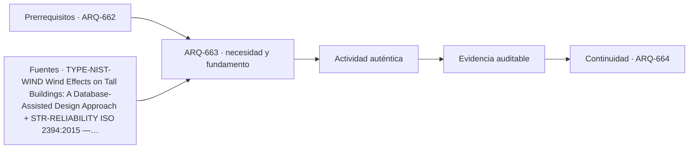

# ARQ-663 · Chimeneas y estructuras industriales altas

**Parte 67 · Clase desarrollada · Edición definitiva v1.0.**

Material educativo con casos ficticios. No constituye proyecto ejecutable, cálculo firmado, instrucción de trabajo peligroso, informe pericial, permiso ni habilitación profesional. Las cifras se emplean para aprender a razonar y conservan las fronteras declaradas.

## Pregunta central

¿Cómo se coordinan proceso, tiro, temperatura, viento, mantenimiento y estructura en una chimenea o torre industrial alta?

## Resultado de aprendizaje y continuidad

Separarás función de proceso y respuesta estructural. Analizarás expansión térmica y excentricidades sin convertirlas en tensiones o capacidades no calculadas. La clase conserva los métodos construidos en las partes anteriores y no hereda parámetros numéricos de otros casos salvo indicación explícita.

## 1. La altura tiene una razón de proceso

Una chimenea industrial no es una torre de observación cerrada al público. Su geometría depende de gases, equipos conectados, dispersión, mantenimiento y proceso. El proyecto debe distinguir el conducto funcional de la estructura que lo sostiene, aunque ambos puedan coincidir materialmente. Esa separación ayuda a identificar movimientos, aislamientos y uniones.

## 2. Temperatura y compatibilidad

Los cambios térmicos producen dilataciones y gradientes. Un conducto interior puede expandirse distinto de una envolvente o una estructura exterior. Fijar ambos en demasiados puntos puede convertir una expansión libre en fuerzas de restricción. La clase trabaja primero la deformación geométrica y deja tensiones, fluencia y conexiones para modelos con propiedades pertinentes.

## 3. Viento y vibración

Las estructuras cilíndricas esbeltas pueden presentar respuestas dinámicas que no se describen con una presión uniforme estática. Deben identificarse frecuencia, amortiguamiento, excitación, forma y dirección. El anteproyecto puede reservar juntas, accesos y espacio de equipos sin fingir que ha resuelto aeroelasticidad.

## 4. Inspección de superficies y revestimientos

Corrosión, refractarios, uniones, plataformas y drenajes deben poder inspeccionarse. La dificultad de acceso aumenta el costo y puede retrasar la detección de daño. Un detalle que exige acceso periódico necesita una estrategia de acceso documentada desde el diseño.

## 5. Paradas de proceso y estados transitorios

La estructura puede tener estados distintos en operación, calentamiento, enfriamiento, parada y mantenimiento. Las propiedades térmicas y presiones no deben combinarse como si sus máximos ocurrieran simultáneamente. El registro de estados evita envolventes físicamente imposibles.

## Caso trabajado

IND-STACK-01 tiene un conducto ideal de acero de 60 m y coeficiente lineal adoptado `12e-6 /K`. Si su temperatura uniforme aumenta 180 K y pudiera expandirse libremente, `Delta L = alpha L Delta T = 12e-6 x 60 x 180 = 0,1296 m`, o 129,6 mm. Si una junta geométrica solo ofrece 90 mm, falta 39,6 mm dentro de este modelo. No se calcula una fuerza: eso requeriría rigidez, apoyos y condición real de restricción.

## Método de revisión y límites

Reconstruye el caso desde su frontera: identifica objetos, personas, intervalos y estados incluidos. Comprueba unidades y signos, vuelve a obtener el resultado por equilibrio, balance o relación independiente cuando sea posible y escribe dos frases: una que el cálculo realmente respalda y otra que excedería la evidencia. Después identifica una interfaz con otra disciplina y el documento o profesional que debería aportar la información faltante. Esta secuencia evita que una operación correcta se convierta en una conclusión demasiado amplia.

En una obra real también deben revisarse jurisdicción, versiones normativas, sitio, productos, ensayos, operación y cambios. Una fuente internacional puede explicar un mecanismo sin ser exigencia chilena. Un valor de catálogo puede describir un componente sin representar su configuración instalada. Si la evidencia no existe, el estado correcto es pendiente.

## Errores frecuentes

Evita comparar métricas con denominadores distintos, sumar máximos de estados incompatibles, tratar capacidad nominal como servicio efectivo, usar un promedio para ocultar una región crítica o copiar dimensiones de otro proyecto porque su tipología se parece. Distingue geometría, demanda, capacidad y autorización. Cuando una modificación resuelve una interfaz, revisa qué otras dependencias puede haber alterado.

## Práctica independiente

Para 45 m, alpha=11,5e-6/K y aumento 140 K, calcula la expansión libre. Una junta dispone de 80 mm y reserva 15 mm para tolerancias. Evalúa solo la compatibilidad geométrica.

Solución razonada

Delta L=72,45 mm. La disponibilidad después de reserva es 65 mm, por lo que el déficit geométrico es 7,45 mm. No se concluye tensión ni fallo sin modelar restricciones y propiedades.

La solución pertenece al modelo declarado. No reemplaza revisión profesional ni permite extrapolar capacidades, distancias seguras, aforos, procedimientos de mantenimiento o cumplimiento reglamentario a una obra real.

## Autoevaluación y transferencia

Puedes avanzar cuando reconstruyes el caso sin mirar la respuesta, distingues dato, hipótesis y evidencia, y señalas al menos una decisión que debe reabrirse si cambia una condición. **ARQ-664** continúa el recorrido.

<!-- pedagogia-2026:inicio -->
## Decisión pedagógica y posición curricular

### Por qué existe

Esta clase existe para resolver una necesidad concreta del recorrido: ¿Cómo se coordinan proceso, tiro, temperatura, viento, mantenimiento y estructura en una chimenea o torre industrial alta?

### Por qué está exactamente aquí

Ocupa el lugar 3 de la Parte 67. Se estudia después de ARQ-662 · Torres de telecomunicaciones porque usa esa base para responder «¿Cómo se coordinan proceso, tiro, temperatura, viento, mantenimiento y estructura en una chimenea o torre industrial alta?». Se ubica antes de ARQ-664 · Monumentos y estructuras conmemorativas porque la evidencia producida aquí debe estar disponible para ese paso.

- **Prerrequisitos:** `ARQ-662`
- **Capacidad que introduce:** Separarás función de proceso y respuesta estructural. Analizarás expansión térmica y excentricidades sin convertirlas en tensiones o capacidades no calculadas. La clase conserva los métodos construidos en las partes anteriores y no hereda parámetros numéricos de otros casos salvo indicación explícita.
- **Clases o experiencias que dependen de ella:** `ARQ-664`

El diagrama permite comprobar una relación que el texto lineal oculta con facilidad: esta clase recibe capacidades previas, toma decisiones apoyadas por fuentes, exige una experiencia y produce evidencia que habilita trabajo posterior. No representa un procedimiento de obra.

## Resultado observable, evidencia y evaluación

1. Identificar y delimitar las condiciones necesarias para responder la pregunta central de chimeneas y estructuras industriales altas.
2. Producir y comprobar la evidencia declarada por la clase: Separarás función de proceso y respuesta estructural. Analizarás expansión térmica y excentricidades sin convertirlas en tensiones o capacidades no calculadas. La clase conserva los métodos construidos en las partes anteriores y no hereda parámetros numéricos de otros casos salvo indicación explícita.
3. Justificar una decisión de chimeneas y estructuras industriales altas mediante fuentes, supuestos, alternativas y límites explícitos.

## Actividad, evidencia y criterio de aceptación

**Actividad:** Para 45 m, alpha=11,5e-6/K y aumento 140 K, calcula la expansión libre. Una junta dispone de 80 mm y reserva 15 mm para tolerancias. Evalúa solo la compatibilidad geométrica.

**Evidencia mínima:** Separarás función de proceso y respuesta estructural. Analizarás expansión térmica y excentricidades sin convertirlas en tensiones o capacidades no calculadas. La clase conserva los métodos construidos en las partes anteriores y no hereda parámetros numéricos de otros casos salvo indicación explícita.

**Archivo sugerido:** `evidence/ARQ-663/evidencia.md`.

**Criterio de aceptación:** la entrega se acepta cuando:

- La entrega responde explícitamente a la pregunta: ¿Cómo se coordinan proceso, tiro, temperatura, viento, mantenimiento y estructura en una chimenea o torre industrial alta?
- La actividad conserva las fronteras del caso y permite reconstruir el procedimiento: Para 45 m, alpha=11,5e-6/K y aumento 140 K, calcula la expansión libre. Una junta dispone de 80 mm y reserva 15 mm para tolerancias. Evalúa solo la compatibilidad geométrica.
- Cada afirmación externa puede seguirse hasta una fuente, su alcance consultado y su límite.
- La evidencia deja disponible una entrada comprobable para ARQ-664.
- Evita comparar métricas con denominadores distintos, sumar máximos de estados incompatibles, tratar capacidad nominal como servicio efectivo, usar un promedio para ocultar una región crítica o copiar dimensiones de otro proyecto porque su tipología se parece. Distingue geometría, demanda, capacidad y autorización.

La [rúbrica común](../../docs/RUBRICA_COMUN.md) complementa estos criterios; no los reemplaza. Una entrega puede superar un promedio y continuar pendiente si oculta una condición crítica.

## Trazabilidad de las decisiones

| # | Decisión o fundamento | Fuente utilizada | Aplicación y límite en esta clase |
|---:|---|---|---|
| 1 | Apoyo para distinguir presión, dinámica, torsión y dirección del viento en estructuras esbeltas. No aporta cargas de diseño para los casos ficticios. | [TYPE-NIST-WIND Wind Effects on Tall Buildings: A Database-Assisted…](https://www.nist.gov/publications/wind-effects-tall-buildings-database-assisted-design-approach) | Consulta: Alcance consultado no documentado; debe completarse antes de ampliar la conclusión. Límite: Apoyo para distinguir presión, dinámica, torsión y dirección del viento en estructuras esbeltas. No aporta cargas de diseño para los casos ficticios. |
| 2 | Ficha pública de principios generales de fiabilidad. No se leyó íntegramente ni se extraen coeficientes de proyecto. | [STR-RELIABILITY ISO 2394:2015 — General principles on reliability for…](https://www.iso.org/standard/58036.html) | Consulta: Alcance consultado no documentado; debe completarse antes de ampliar la conclusión. Límite: Ficha pública de principios generales de fiabilidad. No se leyó íntegramente ni se extraen coeficientes de proyecto. |
| 3 | Apoyo para reconocer riesgos de acceso, mantenimiento, izaje y trabajo en altura. Referencia estadounidense; no constituye procedimiento de obra para Chile. | [[OSHA-TOWER] Communication Towers - Overview and Compliance Assistance](https://www.osha.gov/communication-towers) | Consulta: Alcance consultado no documentado; debe completarse antes de ampliar la conclusión. Límite: Apoyo para reconocer riesgos de acceso, mantenimiento, izaje y trabajo en altura. Referencia estadounidense; no constituye procedimiento de obra para Chile. |

La tabla permite auditar las relaciones; la explicación, el caso y la práctica de la clase siguen siendo la documentación principal.

## Autoevaluación, recuperación y continuidad

### Errores diagnósticos

Antes de avanzar, comprueba si puedes reconstruir cada resultado sin mirar la solución, señalar qué evidencia lo sostiene y nombrar una condición que obligaría a revisar tu decisión. Conserva la primera versión, la objeción recibida y la revisión.

**Conexión siguiente:** La continuidad inmediata es ARQ-664 · Monumentos y estructuras conmemorativas; conserva el método y vuelve a verificar datos y límites.
<!-- pedagogia-2026:fin -->

## Fuentes y alcance de uso

- **[NIST-WIND] Wind Effects on Tall Buildings: A Database-Assisted Design Approach** — NIST. https://www.nist.gov/publications/wind-effects-tall-buildings-database-assisted-design-approach

Uso y límite: Apoyo para distinguir presión, dinámica, torsión y dirección del viento en estructuras esbeltas. No aporta cargas de diseño para los casos ficticios.

- **[ISO2394] ISO 2394:2015 - General principles on reliability for structures** — ISO. https://www.iso.org/standard/58036.html

Uso y límite: Ficha pública de principios generales de fiabilidad. No se leyó íntegramente ni se extraen coeficientes de proyecto.

- **[OSHA-TOWER] Communication Towers - Overview and Compliance Assistance** — Occupational Safety and Health Administration. https://www.osha.gov/communication-towers

Uso y límite: Apoyo para reconocer riesgos de acceso, mantenimiento, izaje y trabajo en altura. Referencia estadounidense; no constituye procedimiento de obra para Chile.
