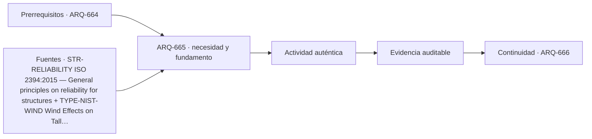

# ARQ-665 · Cubiertas tensadas y pabellones especiales

**Parte 67 · Clase desarrollada · Edición definitiva v1.0.**

Material educativo con casos ficticios. No constituye proyecto ejecutable, cálculo firmado, instrucción de trabajo peligroso, informe pericial, permiso ni habilitación profesional. Las cifras se emplean para aprender a razonar y conservan las fronteras declaradas.

## Pregunta central

¿Qué cambia cuando la estabilidad de una cubierta depende de forma, pretensión y curvatura en lugar de una viga rígida convencional?

## Resultado de aprendizaje y continuidad

Comprenderás la relación entre geometría, pretensión, apoyos y drenaje. Resolverás una analogía de cable y reconocerás por qué la forma no puede separarse de las cargas. La clase conserva los métodos construidos en las partes anteriores y no hereda parámetros numéricos de otros casos salvo indicación explícita.

## 1. Forma resistente y forma arquitectónica

En membranas, cables y redes tensadas la geometría participa directamente del equilibrio. Mover un apoyo o cambiar una flecha modifica fuerzas y drenaje. Por eso el modelado formal no puede cerrarse primero y “calcularse después” como si la estructura solo debiera adaptarse a una superficie arbitraria.

## 2. Pretensión y estados

La pretensión mantiene una membrana activa antes de acciones externas. Su magnitud y distribución necesitan modelos y procedimientos especializados. El curso trabaja analogías de cables y superficies para entender dependencias, no para definir valores de pretensión o patrones de corte reales.

## 3. Bordes y apoyos

Mástiles, anillos, cables de borde y anclajes concentran decisiones. Una superficie continua puede transmitir fuerzas a pocos puntos; esos puntos requieren espacio, fundación, drenaje y mantenimiento. El borde es parte del sistema, no un acabado de la tela.

## 4. Agua y estabilidad geométrica

Una cubierta flexible debe estudiar pendientes y deformaciones para evitar acumulaciones. El agua añade peso y puede cambiar la forma, lo que a su vez puede acumular más agua. Reconocer esa retroalimentación es más importante que memorizar una pendiente genérica.

## 5. Montaje, sustitución y envejecimiento

La secuencia de tensado, acceso a uniones y sustitución de paños condicionan la vida del pabellón. Un sistema ligero puede requerir equipos de montaje y revisiones especializadas. El diseño debe distinguir estructura permanente, elementos reemplazables y estados temporales.

## Caso trabajado

TEN-01 usa una analogía parabólica de cable con luz horizontal L=20 m, flecha f=2 m y carga uniforme horizontal ficticia w=1,5 kN/m. La componente horizontal ideal es `H = w L^2 /(8 f) = 37,5 kN`. Si la flecha aumenta a 3 m manteniendo el mismo modelo y carga, H baja a 25 kN. La comparación enseña que una forma “más plana” exige mayor componente horizontal en esta idealización. No representa una membrana completa ni selecciona anclajes.

## Método de revisión y límites

Reconstruye el caso desde su frontera: identifica objetos, personas, intervalos y estados incluidos. Comprueba unidades y signos, vuelve a obtener el resultado por equilibrio, balance o relación independiente cuando sea posible y escribe dos frases: una que el cálculo realmente respalda y otra que excedería la evidencia. Después identifica una interfaz con otra disciplina y el documento o profesional que debería aportar la información faltante. Esta secuencia evita que una operación correcta se convierta en una conclusión demasiado amplia.

En una obra real también deben revisarse jurisdicción, versiones normativas, sitio, productos, ensayos, operación y cambios. Una fuente internacional puede explicar un mecanismo sin ser exigencia chilena. Un valor de catálogo puede describir un componente sin representar su configuración instalada. Si la evidencia no existe, el estado correcto es pendiente.

## Errores frecuentes

Evita comparar métricas con denominadores distintos, sumar máximos de estados incompatibles, tratar capacidad nominal como servicio efectivo, usar un promedio para ocultar una región crítica o copiar dimensiones de otro proyecto porque su tipología se parece. Distingue geometría, demanda, capacidad y autorización. Cuando una modificación resuelve una interfaz, revisa qué otras dependencias puede haber alterado.

## Práctica independiente

Con L=24 m, w=1,2 kN/m, compara H para flechas de 2,4 m y 3,6 m.

Solución razonada

Para 2,4 m: H=36 kN. Para 3,6 m: H=24 kN. La reducción es 33,3 %. Faltan geometría tridimensional, pretensión, material, viento, nieve/agua, deformaciones y detalles.

La solución pertenece al modelo declarado. No reemplaza revisión profesional ni permite extrapolar capacidades, distancias seguras, aforos, procedimientos de mantenimiento o cumplimiento reglamentario a una obra real.

## Autoevaluación y transferencia

Puedes avanzar cuando reconstruyes el caso sin mirar la respuesta, distingues dato, hipótesis y evidencia, y señalas al menos una decisión que debe reabrirse si cambia una condición. **ARQ-666** continúa el recorrido.

<!-- pedagogia-2026:inicio -->
## Decisión pedagógica y posición curricular

### Por qué existe

Esta clase existe para resolver una necesidad concreta del recorrido: ¿Qué cambia cuando la estabilidad de una cubierta depende de forma, pretensión y curvatura en lugar de una viga rígida convencional?

### Por qué está exactamente aquí

Ocupa el lugar 5 de la Parte 67. Se estudia después de ARQ-664 · Monumentos y estructuras conmemorativas porque usa esa base para responder «¿Qué cambia cuando la estabilidad de una cubierta depende de forma, pretensión y curvatura en lugar de una viga rígida convencional?». Se ubica antes de ARQ-666 · Torres eólicas y soportes energéticos porque la evidencia producida aquí debe estar disponible para ese paso.

- **Prerrequisitos:** `ARQ-664`
- **Capacidad que introduce:** Comprenderás la relación entre geometría, pretensión, apoyos y drenaje. Resolverás una analogía de cable y reconocerás por qué la forma no puede separarse de las cargas. La clase conserva los métodos construidos en las partes anteriores y no hereda parámetros numéricos de otros casos salvo indicación explícita.
- **Clases o experiencias que dependen de ella:** `ARQ-666`

El diagrama permite comprobar una relación que el texto lineal oculta con facilidad: esta clase recibe capacidades previas, toma decisiones apoyadas por fuentes, exige una experiencia y produce evidencia que habilita trabajo posterior. No representa un procedimiento de obra.

## Resultado observable, evidencia y evaluación

1. Identificar y delimitar las condiciones necesarias para responder la pregunta central de cubiertas tensadas y pabellones especiales.
2. Producir y comprobar la evidencia declarada por la clase: Comprenderás la relación entre geometría, pretensión, apoyos y drenaje. Resolverás una analogía de cable y reconocerás por qué la forma no puede separarse de las cargas. La clase conserva los métodos construidos en las partes anteriores y no hereda parámetros numéricos de otros casos salvo indicación explícita.
3. Justificar una decisión de cubiertas tensadas y pabellones especiales mediante fuentes, supuestos, alternativas y límites explícitos.

## Actividad, evidencia y criterio de aceptación

**Actividad:** Con L=24 m, w=1,2 kN/m, compara H para flechas de 2,4 m y 3,6 m. La entrega debe conservar procedimiento, datos, supuestos, alternativa y conclusión revisable.

**Evidencia mínima:** Comprenderás la relación entre geometría, pretensión, apoyos y drenaje. Resolverás una analogía de cable y reconocerás por qué la forma no puede separarse de las cargas. La clase conserva los métodos construidos en las partes anteriores y no hereda parámetros numéricos de otros casos salvo indicación explícita.

**Archivo sugerido:** `evidence/ARQ-665/evidencia.md`.

**Criterio de aceptación:** la entrega se acepta cuando:

- La entrega responde explícitamente a la pregunta: ¿Qué cambia cuando la estabilidad de una cubierta depende de forma, pretensión y curvatura en lugar de una viga rígida convencional?
- La actividad conserva las fronteras del caso y permite reconstruir el procedimiento: Con L=24 m, w=1,2 kN/m, compara H para flechas de 2,4 m y 3,6 m. La entrega debe conservar procedimiento, datos, supuestos, alternativa y conclusión revisable.
- Cada afirmación externa puede seguirse hasta una fuente, su alcance consultado y su límite.
- La evidencia deja disponible una entrada comprobable para ARQ-666.
- Evita comparar métricas con denominadores distintos, sumar máximos de estados incompatibles, tratar capacidad nominal como servicio efectivo, usar un promedio para ocultar una región crítica o copiar dimensiones de otro proyecto porque su tipología se parece. Distingue geometría, demanda, capacidad y autorización.

La [rúbrica común](../../docs/RUBRICA_COMUN.md) complementa estos criterios; no los reemplaza. Una entrega puede superar un promedio y continuar pendiente si oculta una condición crítica.

## Trazabilidad de las decisiones

| # | Decisión o fundamento | Fuente utilizada | Aplicación y límite en esta clase |
|---:|---|---|---|
| 1 | Ficha pública de principios generales de fiabilidad. No se leyó íntegramente ni se extraen coeficientes de proyecto. | [STR-RELIABILITY ISO 2394:2015 — General principles on reliability for…](https://www.iso.org/standard/58036.html) | Consulta: Alcance consultado no documentado; debe completarse antes de ampliar la conclusión. Límite: Ficha pública de principios generales de fiabilidad. No se leyó íntegramente ni se extraen coeficientes de proyecto. |
| 2 | Apoyo para distinguir presión, dinámica, torsión y dirección del viento en estructuras esbeltas. No aporta cargas de diseño para los casos ficticios. | [TYPE-NIST-WIND Wind Effects on Tall Buildings: A Database-Assisted…](https://www.nist.gov/publications/wind-effects-tall-buildings-database-assisted-design-approach) | Consulta: Alcance consultado no documentado; debe completarse antes de ampliar la conclusión. Límite: Apoyo para distinguir presión, dinámica, torsión y dirección del viento en estructuras esbeltas. No aporta cargas de diseño para los casos ficticios. |
| 3 | Marco de formación arquitectónica integral. No acredita este programa ni sustituye habilitación profesional. | [EDU-UIA UNESCO–UIA Charter for Architectural Education, revisión 2026](https://www.uia-architectes.org/en/news/unesco-uia-charter-for-architectural-education-revised-edition-2026/) | Consulta: Alcance consultado no documentado; debe completarse antes de ampliar la conclusión. Límite: Marco de formación arquitectónica integral. No acredita este programa ni sustituye habilitación profesional. |

La tabla permite auditar las relaciones; la explicación, el caso y la práctica de la clase siguen siendo la documentación principal.

## Autoevaluación, recuperación y continuidad

### Errores diagnósticos

Antes de avanzar, comprueba si puedes reconstruir cada resultado sin mirar la solución, señalar qué evidencia lo sostiene y nombrar una condición que obligaría a revisar tu decisión. Conserva la primera versión, la objeción recibida y la revisión.

**Conexión siguiente:** La continuidad inmediata es ARQ-666 · Torres eólicas y soportes energéticos; conserva el método y vuelve a verificar datos y límites.
<!-- pedagogia-2026:fin -->

## Fuentes y alcance de uso

- **[ISO2394] ISO 2394:2015 - General principles on reliability for structures** — ISO. https://www.iso.org/standard/58036.html

Uso y límite: Ficha pública de principios generales de fiabilidad. No se leyó íntegramente ni se extraen coeficientes de proyecto.

- **[NIST-WIND] Wind Effects on Tall Buildings: A Database-Assisted Design Approach** — NIST. https://www.nist.gov/publications/wind-effects-tall-buildings-database-assisted-design-approach

Uso y límite: Apoyo para distinguir presión, dinámica, torsión y dirección del viento en estructuras esbeltas. No aporta cargas de diseño para los casos ficticios.

- **[UIA] UNESCO–UIA Charter for Architectural Education, revisión 2026** — Unión Internacional de Arquitectos. https://www.uia-architectes.org/en/news/unesco-uia-charter-for-architectural-education-revised-edition-2026/

Uso y límite: Marco de formación arquitectónica integral. No acredita este programa ni sustituye habilitación profesional.
