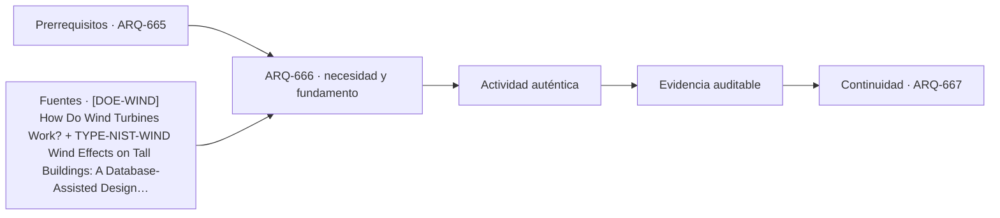

# ARQ-666 · Torres eólicas y soportes energéticos

**Parte 67 · Clase desarrollada · Edición definitiva v1.0.**

Material educativo con casos ficticios. No constituye proyecto ejecutable, cálculo firmado, instrucción de trabajo peligroso, informe pericial, permiso ni habilitación profesional. Las cifras se emplean para aprender a razonar y conservan las fronteras declaradas.

## Pregunta central

¿Cómo se coordina una torre eólica con rotor, góndola, cimentación, viento, vibración, acceso y red sin reducirla a un poste alto?

## Resultado de aprendizaje y continuidad

Distinguirás cargas estáticas y dinámicas, estados de operación y mantenimiento. Relacionarás altura de torre con momento ideal sin convertir el ejercicio en dimensionamiento de aerogeneradores. La clase conserva los métodos construidos en las partes anteriores y no hereda parámetros numéricos de otros casos salvo indicación explícita.

## 1. La torre pertenece a una máquina

La torre sostiene rotor y góndola, pero además aloja acceso, cables, sistemas de control y transfiere acciones a la fundación. La decisión de altura afecta recurso eólico, logística, masa, frecuencia y mantenimiento. DOE explica que la torre eleva el rotor hacia vientos generalmente más rápidos y menos turbulentos; esa descripción funcional no basta para proyectar la estructura.

## 2. Estados de operación

Un aerogenerador tiene estados de generación, arranque, parada, viento extremo y mantenimiento. Fuerzas aerodinámicas, masa rotatoria y controles cambian entre ellos. Un modelo arquitectónico debe etiquetar estados y no sumar máximos obtenidos en condiciones incompatibles.

## 3. Dinámica y fatiga

Repetición de cargas y proximidad entre frecuencias de excitación y naturales son relevantes en estructuras esbeltas. Una comprobación estática puede cerrar equilibrio y seguir sin responder a fatiga o resonancia. El curso utiliza período y frecuencia como preguntas que requieren especialista y datos del sistema.

## 4. Acceso interior y rescate

La torre contiene una ruta vertical de trabajo. Espacio, interrupciones, plataformas y equipos deben coordinarse con estructura y cables. OSHA y otras referencias de trabajo en altura sirven para reconocer que mantenimiento no es una nota posterior, sin enseñar maniobras específicas.

## 5. Terreno, cimentación y ciclo de vida

Las acciones de vuelco llegan al terreno mediante una fundación cuya solución depende de geotecnia. La sustitución de componentes grandes, repotenciación o desmantelamiento también requiere espacio y logística. La huella operativa del parque es más que el diámetro de la base.

## Caso trabajado

WIND-T-01 idealiza una fuerza horizontal de 120 kN aplicada a 80 m y una segunda de 40 kN aplicada a 50 m. El momento basal es `120x80 + 40x50 = 11.600 kN·m`. Aumentar la altura del primer punto a 100 m, manteniendo fuerzas artificialmente constantes, lleva el momento a 14.000 kN·m, +20,7 %. En una turbina real las fuerzas no permanecerían necesariamente constantes: el ejercicio aísla el efecto del brazo.

## Método de revisión y límites

Reconstruye el caso desde su frontera: identifica objetos, personas, intervalos y estados incluidos. Comprueba unidades y signos, vuelve a obtener el resultado por equilibrio, balance o relación independiente cuando sea posible y escribe dos frases: una que el cálculo realmente respalda y otra que excedería la evidencia. Después identifica una interfaz con otra disciplina y el documento o profesional que debería aportar la información faltante. Esta secuencia evita que una operación correcta se convierta en una conclusión demasiado amplia.

En una obra real también deben revisarse jurisdicción, versiones normativas, sitio, productos, ensayos, operación y cambios. Una fuente internacional puede explicar un mecanismo sin ser exigencia chilena. Un valor de catálogo puede describir un componente sin representar su configuración instalada. Si la evidencia no existe, el estado correcto es pendiente.

## Errores frecuentes

Evita comparar métricas con denominadores distintos, sumar máximos de estados incompatibles, tratar capacidad nominal como servicio efectivo, usar un promedio para ocultar una región crítica o copiar dimensiones de otro proyecto porque su tipología se parece. Distingue geometría, demanda, capacidad y autorización. Cuando una modificación resuelve una interfaz, revisa qué otras dependencias puede haber alterado.

## Práctica independiente

Calcula el momento de 90 kN a 70 m más 35 kN a 45 m. Luego mueve solo la primera fuerza a 85 m y compara.

Solución razonada

Base: 7.875 kN·m. Variante: 9.225 kN·m. Incremento 17,14 %. No se deducen dimensiones, tensiones ni fundación.

La solución pertenece al modelo declarado. No reemplaza revisión profesional ni permite extrapolar capacidades, distancias seguras, aforos, procedimientos de mantenimiento o cumplimiento reglamentario a una obra real.

## Autoevaluación y transferencia

Puedes avanzar cuando reconstruyes el caso sin mirar la respuesta, distingues dato, hipótesis y evidencia, y señalas al menos una decisión que debe reabrirse si cambia una condición. **ARQ-667** continúa el recorrido.

<!-- pedagogia-2026:inicio -->
## Decisión pedagógica y posición curricular

### Por qué existe

Esta clase existe para resolver una necesidad concreta del recorrido: ¿Cómo se coordina una torre eólica con rotor, góndola, cimentación, viento, vibración, acceso y red sin reducirla a un poste alto?

### Por qué está exactamente aquí

Ocupa el lugar 6 de la Parte 67. Se estudia después de ARQ-665 · Cubiertas tensadas y pabellones especiales porque usa esa base para responder «¿Cómo se coordina una torre eólica con rotor, góndola, cimentación, viento, vibración, acceso y red sin reducirla a un poste alto?». Se ubica antes de ARQ-667 · Pasarelas y estructuras peatonales singulares porque la evidencia producida aquí debe estar disponible para ese paso.

- **Prerrequisitos:** `ARQ-665`
- **Capacidad que introduce:** Distinguirás cargas estáticas y dinámicas, estados de operación y mantenimiento. Relacionarás altura de torre con momento ideal sin convertir el ejercicio en dimensionamiento de aerogeneradores. La clase conserva los métodos construidos en las partes anteriores y no hereda parámetros numéricos de otros casos salvo indicación explícita.
- **Clases o experiencias que dependen de ella:** `ARQ-667`

El diagrama permite comprobar una relación que el texto lineal oculta con facilidad: esta clase recibe capacidades previas, toma decisiones apoyadas por fuentes, exige una experiencia y produce evidencia que habilita trabajo posterior. No representa un procedimiento de obra.

## Resultado observable, evidencia y evaluación

1. Identificar y delimitar las condiciones necesarias para responder la pregunta central de torres eólicas y soportes energéticos.
2. Producir y comprobar la evidencia declarada por la clase: Distinguirás cargas estáticas y dinámicas, estados de operación y mantenimiento. Relacionarás altura de torre con momento ideal sin convertir el ejercicio en dimensionamiento de aerogeneradores. La clase conserva los métodos construidos en las partes anteriores y no hereda parámetros numéricos de otros casos salvo indicación explícita.
3. Justificar una decisión de torres eólicas y soportes energéticos mediante fuentes, supuestos, alternativas y límites explícitos.

## Actividad, evidencia y criterio de aceptación

**Actividad:** Calcula el momento de 90 kN a 70 m más 35 kN a 45 m. Luego mueve solo la primera fuerza a 85 m y compara.

**Evidencia mínima:** Distinguirás cargas estáticas y dinámicas, estados de operación y mantenimiento. Relacionarás altura de torre con momento ideal sin convertir el ejercicio en dimensionamiento de aerogeneradores. La clase conserva los métodos construidos en las partes anteriores y no hereda parámetros numéricos de otros casos salvo indicación explícita.

**Archivo sugerido:** `evidence/ARQ-666/evidencia.md`.

**Criterio de aceptación:** la entrega se acepta cuando:

- La entrega responde explícitamente a la pregunta: ¿Cómo se coordina una torre eólica con rotor, góndola, cimentación, viento, vibración, acceso y red sin reducirla a un poste alto?
- La actividad conserva las fronteras del caso y permite reconstruir el procedimiento: Calcula el momento de 90 kN a 70 m más 35 kN a 45 m. Luego mueve solo la primera fuerza a 85 m y compara.
- Cada afirmación externa puede seguirse hasta una fuente, su alcance consultado y su límite.
- La evidencia deja disponible una entrada comprobable para ARQ-667.
- Evita comparar métricas con denominadores distintos, sumar máximos de estados incompatibles, tratar capacidad nominal como servicio efectivo, usar un promedio para ocultar una región crítica o copiar dimensiones de otro proyecto porque su tipología se parece. Distingue geometría, demanda, capacidad y autorización.

La [rúbrica común](../../docs/RUBRICA_COMUN.md) complementa estos criterios; no los reemplaza. Una entrega puede superar un promedio y continuar pendiente si oculta una condición crítica.

## Trazabilidad de las decisiones

| # | Decisión o fundamento | Fuente utilizada | Aplicación y límite en esta clase |
|---:|---|---|---|
| 1 | Descripción pública de rotor, góndola, torre y conversión energética. No dimensiona torres ni cimentaciones. | [[DOE-WIND] How Do Wind Turbines Work?](https://www.energy.gov/cmei/systems/how-do-wind-turbines-work) | Consulta: Alcance consultado no documentado; debe completarse antes de ampliar la conclusión. Límite: Descripción pública de rotor, góndola, torre y conversión energética. No dimensiona torres ni cimentaciones. |
| 2 | Apoyo para distinguir presión, dinámica, torsión y dirección del viento en estructuras esbeltas. No aporta cargas de diseño para los casos ficticios. | [TYPE-NIST-WIND Wind Effects on Tall Buildings: A Database-Assisted…](https://www.nist.gov/publications/wind-effects-tall-buildings-database-assisted-design-approach) | Consulta: Alcance consultado no documentado; debe completarse antes de ampliar la conclusión. Límite: Apoyo para distinguir presión, dinámica, torsión y dirección del viento en estructuras esbeltas. No aporta cargas de diseño para los casos ficticios. |
| 3 | Apoyo para reconocer riesgos de acceso, mantenimiento, izaje y trabajo en altura. Referencia estadounidense; no constituye procedimiento de obra para Chile. | [[OSHA-TOWER] Communication Towers - Overview and Compliance Assistance](https://www.osha.gov/communication-towers) | Consulta: Alcance consultado no documentado; debe completarse antes de ampliar la conclusión. Límite: Apoyo para reconocer riesgos de acceso, mantenimiento, izaje y trabajo en altura. Referencia estadounidense; no constituye procedimiento de obra para Chile. |

La tabla permite auditar las relaciones; la explicación, el caso y la práctica de la clase siguen siendo la documentación principal.

## Autoevaluación, recuperación y continuidad

### Errores diagnósticos

Antes de avanzar, comprueba si puedes reconstruir cada resultado sin mirar la solución, señalar qué evidencia lo sostiene y nombrar una condición que obligaría a revisar tu decisión. Conserva la primera versión, la objeción recibida y la revisión.

**Conexión siguiente:** La continuidad inmediata es ARQ-667 · Pasarelas y estructuras peatonales singulares; conserva el método y vuelve a verificar datos y límites.
<!-- pedagogia-2026:fin -->

## Fuentes y alcance de uso

- **[DOE-WIND] How Do Wind Turbines Work?** — U.S. Department of Energy. https://www.energy.gov/cmei/systems/how-do-wind-turbines-work

Uso y límite: Descripción pública de rotor, góndola, torre y conversión energética. No dimensiona torres ni cimentaciones.

- **[NIST-WIND] Wind Effects on Tall Buildings: A Database-Assisted Design Approach** — NIST. https://www.nist.gov/publications/wind-effects-tall-buildings-database-assisted-design-approach

Uso y límite: Apoyo para distinguir presión, dinámica, torsión y dirección del viento en estructuras esbeltas. No aporta cargas de diseño para los casos ficticios.

- **[OSHA-TOWER] Communication Towers - Overview and Compliance Assistance** — Occupational Safety and Health Administration. https://www.osha.gov/communication-towers

Uso y límite: Apoyo para reconocer riesgos de acceso, mantenimiento, izaje y trabajo en altura. Referencia estadounidense; no constituye procedimiento de obra para Chile.
