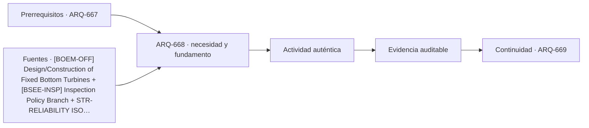

# ARQ-668 · Plataformas y estructuras offshore conceptuales

**Parte 67 · Clase desarrollada · Edición definitiva v1.0.**

Material educativo con casos ficticios. No constituye proyecto ejecutable, cálculo firmado, instrucción de trabajo peligroso, informe pericial, permiso ni habilitación profesional. Las cifras se emplean para aprender a razonar y conservan las fronteras declaradas.

## Pregunta central

¿Qué cambia cuando una estructura combina viento, oleaje, corrosión, acceso marítimo, cimentación y mantenimiento lejos de tierra?

## Resultado de aprendizaje y continuidad

Construirás un mapa de interfaces offshore sin trasladar parámetros de plataformas reales. Analizarás una resultante y momento ideal para comprender la importancia de la cota de aplicación. La clase conserva los métodos construidos en las partes anteriores y no hereda parámetros numéricos de otros casos salvo indicación explícita.

## 1. Medio marino y frontera del sistema

Una plataforma no termina en la línea de agua. Debe considerar subestructura, cubierta, equipos, conexiones, cables o tuberías, acceso, protección, operación y desmantelamiento. El medio introduce agua salina, oleaje, corrientes y ventanas meteorológicas que cambian construcción y mantenimiento.

## 2. Cargas cíclicas y fatiga

BOEM identifica para soportes offshore temas de huracanes, vibraciones, períodos, fatiga y cargas laterales cíclicas. Una suma estática puede ser útil para equilibrio instantáneo, pero no representa acumulación de daño ni interacción suelo-estructura.

## 3. Cimentación y socavación

Monopilotes, jackets y otras configuraciones responden de manera distinta al terreno y al agua. La socavación puede cambiar el soporte alrededor de una cimentación. El proyecto conceptual debe registrar que la geometría visible arriba del agua depende de investigación geotécnica y oceanográfica.

## 4. Acceso y mantenimiento

Llegar a una instalación offshore es una operación condicionada por clima y medio. La arquitectura de plataformas y pasarelas debe distinguir acceso normal, transferencia de personal, evacuación y mantenimiento. El curso no ofrece procedimientos marítimos ni de izaje.

## 5. Desmantelamiento y trazabilidad

La vida útil incluye retiro de equipos, estructuras y conexiones. Diseñar desmontaje exige identificar componentes, uniones y destinos, pero no supone que toda pieza pueda reutilizarse. Las autoridades y requisitos ambientales dependen de jurisdicción.

## Caso trabajado

OFF-01 usa dos fuerzas horizontales ficticias respecto del lecho marino: 250 kN a cota 12 m y 140 kN a cota 5 m. La resultante es 390 kN y el momento `250x12+140x5=3.700 kN·m`. La línea de acción equivalente queda a `3700/390=9,49 m`. Esa reducción conserva equilibrio global del estado, pero pierde la distribución necesaria para revisar elementos locales.

## Método de revisión y límites

Reconstruye el caso desde su frontera: identifica objetos, personas, intervalos y estados incluidos. Comprueba unidades y signos, vuelve a obtener el resultado por equilibrio, balance o relación independiente cuando sea posible y escribe dos frases: una que el cálculo realmente respalda y otra que excedería la evidencia. Después identifica una interfaz con otra disciplina y el documento o profesional que debería aportar la información faltante. Esta secuencia evita que una operación correcta se convierta en una conclusión demasiado amplia.

En una obra real también deben revisarse jurisdicción, versiones normativas, sitio, productos, ensayos, operación y cambios. Una fuente internacional puede explicar un mecanismo sin ser exigencia chilena. Un valor de catálogo puede describir un componente sin representar su configuración instalada. Si la evidencia no existe, el estado correcto es pendiente.

## Errores frecuentes

Evita comparar métricas con denominadores distintos, sumar máximos de estados incompatibles, tratar capacidad nominal como servicio efectivo, usar un promedio para ocultar una región crítica o copiar dimensiones de otro proyecto porque su tipología se parece. Distingue geometría, demanda, capacidad y autorización. Cuando una modificación resuelve una interfaz, revisa qué otras dependencias puede haber alterado.

## Práctica independiente

Con 180 kN a 14 m y 120 kN a 6 m, calcula resultante, momento y cota equivalente.

Solución razonada

R=300 kN; M=3.240 kN·m; cota equivalente=10,8 m. No se deducen miembros, cimentación, fatiga ni respuesta al oleaje.

La solución pertenece al modelo declarado. No reemplaza revisión profesional ni permite extrapolar capacidades, distancias seguras, aforos, procedimientos de mantenimiento o cumplimiento reglamentario a una obra real.

## Autoevaluación y transferencia

Puedes avanzar cuando reconstruyes el caso sin mirar la respuesta, distingues dato, hipótesis y evidencia, y señalas al menos una decisión que debe reabrirse si cambia una condición. **ARQ-669** continúa el recorrido.

<!-- pedagogia-2026:inicio -->
## Decisión pedagógica y posición curricular

### Por qué existe

Esta clase existe para resolver una necesidad concreta del recorrido: ¿Qué cambia cuando una estructura combina viento, oleaje, corrosión, acceso marítimo, cimentación y mantenimiento lejos de tierra?

### Por qué está exactamente aquí

Ocupa el lugar 8 de la Parte 67. Se estudia después de ARQ-667 · Pasarelas y estructuras peatonales singulares porque usa esa base para responder «¿Qué cambia cuando una estructura combina viento, oleaje, corrosión, acceso marítimo, cimentación y mantenimiento lejos de tierra?». Se ubica antes de ARQ-669 · Mantenimiento de estructuras de acceso complejo porque la evidencia producida aquí debe estar disponible para ese paso.

- **Prerrequisitos:** `ARQ-667`
- **Capacidad que introduce:** Construirás un mapa de interfaces offshore sin trasladar parámetros de plataformas reales. Analizarás una resultante y momento ideal para comprender la importancia de la cota de aplicación. La clase conserva los métodos construidos en las partes anteriores y no hereda parámetros numéricos de otros casos salvo indicación explícita.
- **Clases o experiencias que dependen de ella:** `ARQ-669`

El diagrama permite comprobar una relación que el texto lineal oculta con facilidad: esta clase recibe capacidades previas, toma decisiones apoyadas por fuentes, exige una experiencia y produce evidencia que habilita trabajo posterior. No representa un procedimiento de obra.

## Resultado observable, evidencia y evaluación

1. Identificar y delimitar las condiciones necesarias para responder la pregunta central de plataformas y estructuras offshore conceptuales.
2. Producir y comprobar la evidencia declarada por la clase: Construirás un mapa de interfaces offshore sin trasladar parámetros de plataformas reales. Analizarás una resultante y momento ideal para comprender la importancia de la cota de aplicación. La clase conserva los métodos construidos en las partes anteriores y no hereda parámetros numéricos de otros casos salvo indicación explícita.
3. Justificar una decisión de plataformas y estructuras offshore conceptuales mediante fuentes, supuestos, alternativas y límites explícitos.

## Actividad, evidencia y criterio de aceptación

**Actividad:** Con 180 kN a 14 m y 120 kN a 6 m, calcula resultante, momento y cota equivalente.

**Evidencia mínima:** Construirás un mapa de interfaces offshore sin trasladar parámetros de plataformas reales. Analizarás una resultante y momento ideal para comprender la importancia de la cota de aplicación. La clase conserva los métodos construidos en las partes anteriores y no hereda parámetros numéricos de otros casos salvo indicación explícita.

**Archivo sugerido:** `evidence/ARQ-668/evidencia.md`.

**Criterio de aceptación:** la entrega se acepta cuando:

- La entrega responde explícitamente a la pregunta: ¿Qué cambia cuando una estructura combina viento, oleaje, corrosión, acceso marítimo, cimentación y mantenimiento lejos de tierra?
- La actividad conserva las fronteras del caso y permite reconstruir el procedimiento: Con 180 kN a 14 m y 120 kN a 6 m, calcula resultante, momento y cota equivalente.
- Cada afirmación externa puede seguirse hasta una fuente, su alcance consultado y su límite.
- La evidencia deja disponible una entrada comprobable para ARQ-669.
- Evita comparar métricas con denominadores distintos, sumar máximos de estados incompatibles, tratar capacidad nominal como servicio efectivo, usar un promedio para ocultar una región crítica o copiar dimensiones de otro proyecto porque su tipología se parece. Distingue geometría, demanda, capacidad y autorización.

La [rúbrica común](../../docs/RUBRICA_COMUN.md) complementa estos criterios; no los reemplaza. Una entrega puede superar un promedio y continuar pendiente si oculta una condición crítica.

## Trazabilidad de las decisiones

| # | Decisión o fundamento | Fuente utilizada | Aplicación y límite en esta clase |
|---:|---|---|---|
| 1 | Apoyo conceptual sobre acciones, cimentaciones, fatiga, vibraciones, socavación y construcción offshore. No autoriza instalaciones ni define el caso docente. | [[BOEM-OFF] Design/Construction of Fixed Bottom Turbines](https://www.boem.gov/renewable-energy/studies/designconstruction-fixed-bottom-turbines) | Consulta: Alcance consultado no documentado; debe completarse antes de ampliar la conclusión. Límite: Apoyo conceptual sobre acciones, cimentaciones, fatiga, vibraciones, socavación y construcción offshore. No autoriza instalaciones ni define el caso docente. |
| 2 | Apoyo para entender inspección periódica, integridad y supervisión offshore. Ámbito regulatorio estadounidense. | [[BSEE-INSP] Inspection Policy Branch](https://www.bsee.gov/what-we-do/offshore-regulatory-programs/offshore-safety-improvement/inspection-policy-branch) | Consulta: Alcance consultado no documentado; debe completarse antes de ampliar la conclusión. Límite: Apoyo para entender inspección periódica, integridad y supervisión offshore. Ámbito regulatorio estadounidense. |
| 3 | Ficha pública de principios generales de fiabilidad. No se leyó íntegramente ni se extraen coeficientes de proyecto. | [STR-RELIABILITY ISO 2394:2015 — General principles on reliability for…](https://www.iso.org/standard/58036.html) | Consulta: Alcance consultado no documentado; debe completarse antes de ampliar la conclusión. Límite: Ficha pública de principios generales de fiabilidad. No se leyó íntegramente ni se extraen coeficientes de proyecto. |

La tabla permite auditar las relaciones; la explicación, el caso y la práctica de la clase siguen siendo la documentación principal.

## Autoevaluación, recuperación y continuidad

### Errores diagnósticos

Antes de avanzar, comprueba si puedes reconstruir cada resultado sin mirar la solución, señalar qué evidencia lo sostiene y nombrar una condición que obligaría a revisar tu decisión. Conserva la primera versión, la objeción recibida y la revisión.

**Conexión siguiente:** La continuidad inmediata es ARQ-669 · Mantenimiento de estructuras de acceso complejo; conserva el método y vuelve a verificar datos y límites.
<!-- pedagogia-2026:fin -->

## Fuentes y alcance de uso

- **[BOEM-OFF] Design/Construction of Fixed Bottom Turbines** — Bureau of Ocean Energy Management. https://www.boem.gov/renewable-energy/studies/designconstruction-fixed-bottom-turbines

Uso y límite: Apoyo conceptual sobre acciones, cimentaciones, fatiga, vibraciones, socavación y construcción offshore. No autoriza instalaciones ni define el caso docente.

- **[BSEE-INSP] Inspection Policy Branch** — Bureau of Safety and Environmental Enforcement. https://www.bsee.gov/what-we-do/offshore-regulatory-programs/offshore-safety-improvement/inspection-policy-branch

Uso y límite: Apoyo para entender inspección periódica, integridad y supervisión offshore. Ámbito regulatorio estadounidense.

- **[ISO2394] ISO 2394:2015 - General principles on reliability for structures** — ISO. https://www.iso.org/standard/58036.html

Uso y límite: Ficha pública de principios generales de fiabilidad. No se leyó íntegramente ni se extraen coeficientes de proyecto.
