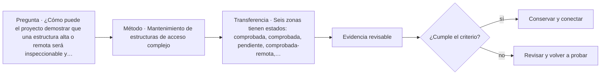

# ARQ-669 · Mantenimiento de estructuras de acceso complejo

**Parte 67 · Clase desarrollada · Edición definitiva v1.0.**

Material educativo con casos ficticios. No constituye proyecto ejecutable, cálculo firmado, instrucción de trabajo peligroso, informe pericial, permiso ni habilitación profesional. Las cifras se emplean para aprender a razonar y conservan las fronteras declaradas.

## Pregunta central

¿Cómo puede el proyecto demostrar que una estructura alta o remota será inspeccionable y mantenible sin convertir el plano en un procedimiento de trabajo peligroso?

## Resultado de aprendizaje y continuidad

Definirás zonas, componentes críticos, estados de acceso, indisponibilidad y evidencia de inspección. Resolverás un problema de cobertura temporal sin confundir disponibilidad nominal con servicio. La clase conserva los métodos construidos en las partes anteriores y no hereda parámetros numéricos de otros casos salvo indicación explícita.

## 1. Diseñar para inspeccionar

Un componente inaccesible tiende a permanecer desconocido. El diseño debe identificar qué requiere observación, medición, limpieza, lubricación, ajuste o sustitución. Eso puede modificar pasarelas, registros, separación entre piezas, puntos de desmontaje y logística.

## 2. Acceso no equivale a procedimiento

Representar que una persona o equipo puede llegar a un punto no autoriza una técnica de escalada, izaje o rescate. OSHA documenta riesgos importantes en torres; BSEE mantiene programas de inspección offshore. El aprendizaje arquitectónico es reservar condiciones para una operación definida por especialistas competentes.

## 3. Estados de indisponibilidad

Una instalación puede estar parcialmente fuera de servicio durante una inspección. Es necesario definir qué función se pierde, qué alternativa existe y cuánto dura el estado. Un programa de mantenimiento no debe suponer que todos los componentes pueden revisarse simultáneamente si comparten accesos o equipos.

## 4. Evidencia y condición

Inspección visual, medición, ensayo y monitoreo responden preguntas distintas. Una fotografía no demuestra capacidad; una alarma no identifica la causa; una lectura sin referencia puede no ser interpretable. Cada resultado necesita ubicación, fecha, método y versión.

## 5. Retroalimentar el proyecto

Las incidencias de mantenimiento deben volver a diseño y operación. Si una unión requiere intervenciones frecuentes, el siguiente proyecto puede cambiar material, protección o acceso. La mejora no consiste en ocultar la incidencia, sino en conservar su contexto y evaluar alternativas.

## Caso trabajado

MANT-01 divide una torre en cinco zonas. En una ventana mensual se inspeccionan A y B durante 2 h cada una, C durante 3 h, D queda pendiente y E se revisa remotamente 1 h. Sumando horas no se obtiene “80 % inspeccionado”. Si el criterio de cobertura es por zonas, 4 de 5 tienen alguna evidencia: 80 %, pero D sigue desconocida y los métodos no son equivalentes. Si el criterio fuera por tiempo o criticidad, el porcentaje cambiaría.

## Método de revisión y límites

Reconstruye el caso desde su frontera: identifica objetos, personas, intervalos y estados incluidos. Comprueba unidades y signos, vuelve a obtener el resultado por equilibrio, balance o relación independiente cuando sea posible y escribe dos frases: una que el cálculo realmente respalda y otra que excedería la evidencia. Después identifica una interfaz con otra disciplina y el documento o profesional que debería aportar la información faltante. Esta secuencia evita que una operación correcta se convierta en una conclusión demasiado amplia.

En una obra real también deben revisarse jurisdicción, versiones normativas, sitio, productos, ensayos, operación y cambios. Una fuente internacional puede explicar un mecanismo sin ser exigencia chilena. Un valor de catálogo puede describir un componente sin representar su configuración instalada. Si la evidencia no existe, el estado correcto es pendiente.

## Errores frecuentes

Evita comparar métricas con denominadores distintos, sumar máximos de estados incompatibles, tratar capacidad nominal como servicio efectivo, usar un promedio para ocultar una región crítica o copiar dimensiones de otro proyecto porque su tipología se parece. Distingue geometría, demanda, capacidad y autorización. Cuando una modificación resuelve una interfaz, revisa qué otras dependencias puede haber alterado.

## Práctica independiente

Seis zonas tienen estados: comprobada, comprobada, pendiente, comprobada-remota, conflicto, comprobada. Calcula solo la fracción con alguna evidencia y luego clasifica estados sin promediarlos.

Solución razonada

Cinco de seis tienen alguna evidencia (83,33 %), pero una presenta conflicto y una permanece pendiente. La instalación no se declara 83,33 % segura ni disponible; el porcentaje solo cuenta cobertura documental.

La solución pertenece al modelo declarado. No reemplaza revisión profesional ni permite extrapolar capacidades, distancias seguras, aforos, procedimientos de mantenimiento o cumplimiento reglamentario a una obra real.

## Autoevaluación y transferencia

Puedes avanzar cuando reconstruyes el caso sin mirar la respuesta, distingues dato, hipótesis y evidencia, y señalas al menos una decisión que debe reabrirse si cambia una condición. **ARQ-670** continúa el recorrido.

<!-- pedagogia-2026:inicio -->
## Mapa visual de aprendizaje

El diagrama representa el ciclo de aprendizaje de esta clase, no una secuencia de obra ni un procedimiento profesional.

## Resultado observable, evidencia y evaluación

**Tipo de clase:** cuantitativa.

**Evidencia mínima:** desarrollo reproducible con datos, unidades, hipótesis, control independiente y conclusión limitada al modelo.

**Archivo sugerido:** `evidence/ARQ-669/evidencia.md`.

| Criterio | Evidencia observable |
|---|---|
| Precisión y representación · 20 % | Los conceptos, unidades y convenciones se usan de forma coherente y pueden ser reconstruidos por otra persona. |
| Evidencia y trazabilidad · 25 % | Cada afirmación importante se vincula con dato, cálculo, observación o fuente; hipótesis y desconocidos permanecen visibles. |
| Decisión y alternativas · 25 % | La decisión responde a la pregunta, compara al menos una alternativa y declara qué condición la haría cambiar. |
| Integración y ciclo de vida · 20 % | Se identifica una interfaz y una consecuencia para construcción, uso, mantenimiento, adaptación o fin de vida. |
| Comunicación, ética y límites · 10 % | El alcance se entiende sin explicación oral adicional y no se atribuyen permisos, competencias o certezas inexistentes. |

**Criterio de aceptación:** 80/100 y ningún criterio bajo 60 %. Una entrega genérica que podría reutilizarse sin cambios en otra clase no demuestra dominio. Si existe una condición crítica de seguridad, accesibilidad, evidencia o responsabilidad sin resolver, la entrega permanece pendiente aunque el promedio supere 80.

### Errores diagnósticos

En esta clase conviene vigilar especialmente: perder unidades; ocultar hipótesis; redondear antes de tiempo; convertir el resultado del modelo en autorización.

## Autoevaluación, recuperación y continuidad

Antes de avanzar, responde sin consultar la solución:

1. ¿Qué decisión concreta puedes tomar ahora que no podías justificar antes?
2. ¿Qué evidencia de tu entrega es comprobada y cuál continúa siendo una hipótesis?
3. ¿Qué cambio de contexto invalidaría la transferencia realizada?

Revisa la entrega a las 24–48 horas y nuevamente al cerrar la parte. Conserva la primera versión, la crítica recibida y la versión revisada: el aprendizaje se demuestra también mediante el cambio entre versiones.
<!-- pedagogia-2026:fin -->

## Fuentes y alcance de uso

- **[OSHA-TOWER] Communication Towers - Overview and Compliance Assistance** — Occupational Safety and Health Administration. https://www.osha.gov/communication-towers

Uso y límite: Apoyo para reconocer riesgos de acceso, mantenimiento, izaje y trabajo en altura. Referencia estadounidense; no constituye procedimiento de obra para Chile.

- **[BSEE-INSP] Inspection Policy Branch** — Bureau of Safety and Environmental Enforcement. https://www.bsee.gov/what-we-do/offshore-regulatory-programs/offshore-safety-improvement/inspection-policy-branch

Uso y límite: Apoyo para entender inspección periódica, integridad y supervisión offshore. Ámbito regulatorio estadounidense.

- **[FHWA-BRIDGE] Bridges & Structures / Bridge Inspection** — Federal Highway Administration. https://www.fhwa.dot.gov/bridge/inspection/

Uso y límite: Apoyo para ciclo de vida, inspección, conservación y gestión de puentes. No sustituye especificaciones de un puente real.
