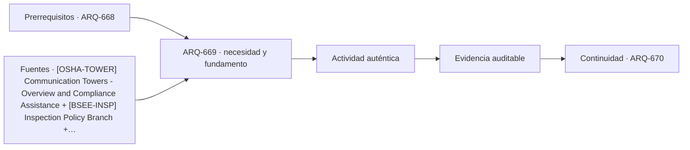

# ARQ-669 · Mantenimiento de estructuras de acceso complejo

**Parte 67 · Clase desarrollada · Edición definitiva v1.0.**

Material educativo con casos ficticios. No constituye proyecto ejecutable, cálculo firmado, instrucción de trabajo peligroso, informe pericial, permiso ni habilitación profesional. Las cifras se emplean para aprender a razonar y conservan las fronteras declaradas.

## Pregunta central

¿Cómo puede el proyecto demostrar que una estructura alta o remota será inspeccionable y mantenible sin convertir el plano en un procedimiento de trabajo peligroso?

## Resultado de aprendizaje y continuidad

Definirás zonas, componentes críticos, estados de acceso, indisponibilidad y evidencia de inspección. Resolverás un problema de cobertura temporal sin confundir disponibilidad nominal con servicio. La clase conserva los métodos construidos en las partes anteriores y no hereda parámetros numéricos de otros casos salvo indicación explícita.

## 1. Diseñar para inspeccionar

Un componente inaccesible tiende a permanecer desconocido. El diseño debe identificar qué requiere observación, medición, limpieza, lubricación, ajuste o sustitución. Eso puede modificar pasarelas, registros, separación entre piezas, puntos de desmontaje y logística.

## 2. Acceso no equivale a procedimiento

Representar que una persona o equipo puede llegar a un punto no autoriza una técnica de escalada, izaje o rescate. OSHA documenta riesgos importantes en torres; BSEE mantiene programas de inspección offshore. El aprendizaje arquitectónico es reservar condiciones para una operación definida por especialistas competentes.

## 3. Estados de indisponibilidad

Una instalación puede estar parcialmente fuera de servicio durante una inspección. Es necesario definir qué función se pierde, qué alternativa existe y cuánto dura el estado. Un programa de mantenimiento no debe suponer que todos los componentes pueden revisarse simultáneamente si comparten accesos o equipos.

## 4. Evidencia y condición

Inspección visual, medición, ensayo y monitoreo responden preguntas distintas. Una fotografía no demuestra capacidad; una alarma no identifica la causa; una lectura sin referencia puede no ser interpretable. Cada resultado necesita ubicación, fecha, método y versión.

## 5. Retroalimentar el proyecto

Las incidencias de mantenimiento deben volver a diseño y operación. Si una unión requiere intervenciones frecuentes, el siguiente proyecto puede cambiar material, protección o acceso. La mejora no consiste en ocultar la incidencia, sino en conservar su contexto y evaluar alternativas.

## Caso trabajado

MANT-01 divide una torre en cinco zonas. En una ventana mensual se inspeccionan A y B durante 2 h cada una, C durante 3 h, D queda pendiente y E se revisa remotamente 1 h. Sumando horas no se obtiene “80 % inspeccionado”. Si el criterio de cobertura es por zonas, 4 de 5 tienen alguna evidencia: 80 %, pero D sigue desconocida y los métodos no son equivalentes. Si el criterio fuera por tiempo o criticidad, el porcentaje cambiaría.

## Método de revisión y límites

Reconstruye el caso desde su frontera: identifica objetos, personas, intervalos y estados incluidos. Comprueba unidades y signos, vuelve a obtener el resultado por equilibrio, balance o relación independiente cuando sea posible y escribe dos frases: una que el cálculo realmente respalda y otra que excedería la evidencia. Después identifica una interfaz con otra disciplina y el documento o profesional que debería aportar la información faltante. Esta secuencia evita que una operación correcta se convierta en una conclusión demasiado amplia.

En una obra real también deben revisarse jurisdicción, versiones normativas, sitio, productos, ensayos, operación y cambios. Una fuente internacional puede explicar un mecanismo sin ser exigencia chilena. Un valor de catálogo puede describir un componente sin representar su configuración instalada. Si la evidencia no existe, el estado correcto es pendiente.

## Errores frecuentes

Evita comparar métricas con denominadores distintos, sumar máximos de estados incompatibles, tratar capacidad nominal como servicio efectivo, usar un promedio para ocultar una región crítica o copiar dimensiones de otro proyecto porque su tipología se parece. Distingue geometría, demanda, capacidad y autorización. Cuando una modificación resuelve una interfaz, revisa qué otras dependencias puede haber alterado.

## Práctica independiente

Seis zonas tienen estados: comprobada, comprobada, pendiente, comprobada-remota, conflicto, comprobada. Calcula solo la fracción con alguna evidencia y luego clasifica estados sin promediarlos.

Solución razonada

Cinco de seis tienen alguna evidencia (83,33 %), pero una presenta conflicto y una permanece pendiente. La instalación no se declara 83,33 % segura ni disponible; el porcentaje solo cuenta cobertura documental.

La solución pertenece al modelo declarado. No reemplaza revisión profesional ni permite extrapolar capacidades, distancias seguras, aforos, procedimientos de mantenimiento o cumplimiento reglamentario a una obra real.

## Autoevaluación y transferencia

Puedes avanzar cuando reconstruyes el caso sin mirar la respuesta, distingues dato, hipótesis y evidencia, y señalas al menos una decisión que debe reabrirse si cambia una condición. **ARQ-670** continúa el recorrido.

<!-- pedagogia-2026:inicio -->
## Decisión pedagógica y posición curricular

### Por qué existe

Esta clase existe para resolver una necesidad concreta del recorrido: ¿Cómo puede el proyecto demostrar que una estructura alta o remota será inspeccionable y mantenible sin convertir el plano en un procedimiento de trabajo peligroso?

### Por qué está exactamente aquí

Ocupa el lugar 9 de la Parte 67. Se estudia después de ARQ-668 · Plataformas y estructuras offshore conceptuales porque usa esa base para responder «¿Cómo puede el proyecto demostrar que una estructura alta o remota será inspeccionable y mantenible sin convertir el plano en un procedimiento de trabajo peligroso?». Se ubica antes de ARQ-670 · Proyecto de infraestructura especial porque la evidencia producida aquí debe estar disponible para ese paso.

- **Prerrequisitos:** `ARQ-668`
- **Capacidad que introduce:** Definirás zonas, componentes críticos, estados de acceso, indisponibilidad y evidencia de inspección. Resolverás un problema de cobertura temporal sin confundir disponibilidad nominal con servicio. La clase conserva los métodos construidos en las partes anteriores y no hereda parámetros numéricos de otros casos salvo indicación explícita.
- **Clases o experiencias que dependen de ella:** `ARQ-670`

El diagrama permite comprobar una relación que el texto lineal oculta con facilidad: esta clase recibe capacidades previas, toma decisiones apoyadas por fuentes, exige una experiencia y produce evidencia que habilita trabajo posterior. No representa un procedimiento de obra.

## Resultado observable, evidencia y evaluación

1. Identificar y delimitar las condiciones necesarias para responder la pregunta central de mantenimiento de estructuras de acceso complejo.
2. Producir y comprobar la evidencia declarada por la clase: Definirás zonas, componentes críticos, estados de acceso, indisponibilidad y evidencia de inspección. Resolverás un problema de cobertura temporal sin confundir disponibilidad nominal con servicio. La clase conserva los métodos construidos en las partes anteriores y no hereda parámetros numéricos de otros casos salvo indicación explícita.
3. Justificar una decisión de mantenimiento de estructuras de acceso complejo mediante fuentes, supuestos, alternativas y límites explícitos.

## Actividad, evidencia y criterio de aceptación

**Actividad:** Seis zonas tienen estados: comprobada, comprobada, pendiente, comprobada-remota, conflicto, comprobada. Calcula solo la fracción con alguna evidencia y luego clasifica estados sin promediarlos.

**Evidencia mínima:** Definirás zonas, componentes críticos, estados de acceso, indisponibilidad y evidencia de inspección. Resolverás un problema de cobertura temporal sin confundir disponibilidad nominal con servicio. La clase conserva los métodos construidos en las partes anteriores y no hereda parámetros numéricos de otros casos salvo indicación explícita.

**Archivo sugerido:** `evidence/ARQ-669/evidencia.md`.

**Criterio de aceptación:** la entrega se acepta cuando:

- La entrega responde explícitamente a la pregunta: ¿Cómo puede el proyecto demostrar que una estructura alta o remota será inspeccionable y mantenible sin convertir el plano en un procedimiento de trabajo peligroso?
- La actividad conserva las fronteras del caso y permite reconstruir el procedimiento: Seis zonas tienen estados: comprobada, comprobada, pendiente, comprobada-remota, conflicto, comprobada. Calcula solo la fracción con alguna evidencia y luego clasifica estados sin promediarlos.
- Cada afirmación externa puede seguirse hasta una fuente, su alcance consultado y su límite.
- La evidencia deja disponible una entrada comprobable para ARQ-670.
- Evita comparar métricas con denominadores distintos, sumar máximos de estados incompatibles, tratar capacidad nominal como servicio efectivo, usar un promedio para ocultar una región crítica o copiar dimensiones de otro proyecto porque su tipología se parece. Distingue geometría, demanda, capacidad y autorización.

La [rúbrica común](../../docs/RUBRICA_COMUN.md) complementa estos criterios; no los reemplaza. Una entrega puede superar un promedio y continuar pendiente si oculta una condición crítica.

## Trazabilidad de las decisiones

| # | Decisión o fundamento | Fuente utilizada | Aplicación y límite en esta clase |
|---:|---|---|---|
| 1 | Apoyo para reconocer riesgos de acceso, mantenimiento, izaje y trabajo en altura. Referencia estadounidense; no constituye procedimiento de obra para Chile. | [[OSHA-TOWER] Communication Towers - Overview and Compliance Assistance](https://www.osha.gov/communication-towers) | Consulta: Alcance consultado no documentado; debe completarse antes de ampliar la conclusión. Límite: Apoyo para reconocer riesgos de acceso, mantenimiento, izaje y trabajo en altura. Referencia estadounidense; no constituye procedimiento de obra para Chile. |
| 2 | Apoyo para entender inspección periódica, integridad y supervisión offshore. Ámbito regulatorio estadounidense. | [[BSEE-INSP] Inspection Policy Branch](https://www.bsee.gov/what-we-do/offshore-regulatory-programs/offshore-safety-improvement/inspection-policy-branch) | Consulta: Alcance consultado no documentado; debe completarse antes de ampliar la conclusión. Límite: Apoyo para entender inspección periódica, integridad y supervisión offshore. Ámbito regulatorio estadounidense. |
| 3 | Apoyo para ciclo de vida, inspección, conservación y gestión de puentes. No sustituye especificaciones de un puente real. | [BR-FHWA-INSPECT Bridge Inspection](https://www.fhwa.dot.gov/bridge/inspection/) | Consulta: Alcance consultado no documentado; debe completarse antes de ampliar la conclusión. Límite: Apoyo para ciclo de vida, inspección, conservación y gestión de puentes. No sustituye especificaciones de un puente real. |

La tabla permite auditar las relaciones; la explicación, el caso y la práctica de la clase siguen siendo la documentación principal.

## Autoevaluación, recuperación y continuidad

### Errores diagnósticos

Antes de avanzar, comprueba si puedes reconstruir cada resultado sin mirar la solución, señalar qué evidencia lo sostiene y nombrar una condición que obligaría a revisar tu decisión. Conserva la primera versión, la objeción recibida y la revisión.

**Conexión siguiente:** La continuidad inmediata es ARQ-670 · Proyecto de infraestructura especial; conserva el método y vuelve a verificar datos y límites.
<!-- pedagogia-2026:fin -->

## Fuentes y alcance de uso

- **[OSHA-TOWER] Communication Towers - Overview and Compliance Assistance** — Occupational Safety and Health Administration. https://www.osha.gov/communication-towers

Uso y límite: Apoyo para reconocer riesgos de acceso, mantenimiento, izaje y trabajo en altura. Referencia estadounidense; no constituye procedimiento de obra para Chile.

- **[BSEE-INSP] Inspection Policy Branch** — Bureau of Safety and Environmental Enforcement. https://www.bsee.gov/what-we-do/offshore-regulatory-programs/offshore-safety-improvement/inspection-policy-branch

Uso y límite: Apoyo para entender inspección periódica, integridad y supervisión offshore. Ámbito regulatorio estadounidense.

- **[FHWA-BRIDGE] Bridges & Structures / Bridge Inspection** — Federal Highway Administration. https://www.fhwa.dot.gov/bridge/inspection/

Uso y límite: Apoyo para ciclo de vida, inspección, conservación y gestión de puentes. No sustituye especificaciones de un puente real.
