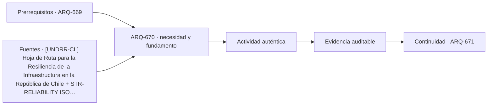

# ARQ-670 · Proyecto de infraestructura especial

**Parte 67 · Clase desarrollada · Edición definitiva v1.0.**

Material educativo con casos ficticios. No constituye proyecto ejecutable, cálculo firmado, instrucción de trabajo peligroso, informe pericial, permiso ni habilitación profesional. Las cifras se emplean para aprender a razonar y conservan las fronteras declaradas.

## Pregunta central

¿Cómo se integra una infraestructura singular cuando forma, servicio, acciones, acceso, mantenimiento y territorio tienen igual peso en la decisión?

## Resultado de aprendizaje y continuidad

Cerrarás la Parte 67 mediante una comparación de alternativas para una estructura especial ficticia, manteniendo restricciones, preferencias y pendientes separados. La clase conserva los métodos construidos en las partes anteriores y no hereda parámetros numéricos de otros casos salvo indicación explícita.

## 1. Formular el servicio antes de elegir la forma

El encargo INT-ESP-01 necesita un punto elevado de observación y telecomunicaciones en un parque remoto. Antes de dibujar una torre se deben definir alcance público, equipos, accesos, continuidad, condiciones meteorológicas, mantenimiento y relación paisajística. La forma surge de esas relaciones y no de una imagen previa.

## 2. Tres alternativas realmente comparables

Se plantean una torre compacta con ascensor, una estructura más baja conectada a una loma y un mástil técnico separado de un mirador. Cada opción debe ofrecer el mismo servicio declarado o explicar sus diferencias. Comparar una solución completa con otra que omite mantenimiento o accesibilidad produce una falsa ventaja.

## 3. Restricciones antes de preferencias

Una condición necesaria no debe compensarse con una puntuación estética. Si una alternativa no tiene ruta de acceso funcional, su mejor integración visual no cierra el proyecto. Una vez satisfechas condiciones necesarias, se pueden comparar costos, impacto visual, superficie intervenida o flexibilidad.

## 4. Interfaz territorial

La estructura depende de camino, energía, comunicaciones, drenaje y gestión del parque. UNDRR destaca que la resiliencia de infraestructura requiere considerar servicios y gobernanza, no objetos aislados. Una torre autónoma en el render puede depender de redes externas muy frágiles.

## 5. Entrega como expediente revisable

El proyecto final incluye base de datos, supuestos, geometría, estados, interfaces, responsables y pruebas pendientes. La presentación no debe ocultar decisiones sin verificar. Una hipótesis explícita es más útil que una certeza inventada.

## Caso trabajado

INT-ESP-01 compara tres alternativas bajo dos restricciones ficticias: altura pública mínima de 25 m y huella máxima de 180 m². A tiene 40 m y 160 m²; B, 24 m y 110 m²; C, 30 m y 190 m². Bajo esas dos restricciones solamente, A es la única que satisface ambas. Esto no la convierte en “ganadora”: aún faltan viento, accesibilidad, mantenimiento, energía, paisaje, costos y permisos.

## Método de revisión y límites

Reconstruye el caso desde su frontera: identifica objetos, personas, intervalos y estados incluidos. Comprueba unidades y signos, vuelve a obtener el resultado por equilibrio, balance o relación independiente cuando sea posible y escribe dos frases: una que el cálculo realmente respalda y otra que excedería la evidencia. Después identifica una interfaz con otra disciplina y el documento o profesional que debería aportar la información faltante. Esta secuencia evita que una operación correcta se convierta en una conclusión demasiado amplia.

En una obra real también deben revisarse jurisdicción, versiones normativas, sitio, productos, ensayos, operación y cambios. Una fuente internacional puede explicar un mecanismo sin ser exigencia chilena. Un valor de catálogo puede describir un componente sin representar su configuración instalada. Si la evidencia no existe, el estado correcto es pendiente.

## Errores frecuentes

Evita comparar métricas con denominadores distintos, sumar máximos de estados incompatibles, tratar capacidad nominal como servicio efectivo, usar un promedio para ocultar una región crítica o copiar dimensiones de otro proyecto porque su tipología se parece. Distingue geometría, demanda, capacidad y autorización. Cuando una modificación resuelve una interfaz, revisa qué otras dependencias puede haber alterado.

## Práctica independiente

Define tres alternativas con alturas 32/28/36 m y huellas 140/170/210 m². Restricciones: altura >=30 m y huella <=180 m². Identifica las que pasan antes de añadir preferencias.

Solución razonada

A pasa (32,140); B falla altura; C falla huella. Solo A permanece para esa etapa. Deben reabrirse las restricciones si el servicio puede reformularse, en vez de ocultar incumplimientos con una puntuación.

La solución pertenece al modelo declarado. No reemplaza revisión profesional ni permite extrapolar capacidades, distancias seguras, aforos, procedimientos de mantenimiento o cumplimiento reglamentario a una obra real.

## Autoevaluación y transferencia

Puedes avanzar cuando reconstruyes el caso sin mirar la respuesta, distingues dato, hipótesis y evidencia, y señalas al menos una decisión que debe reabrirse si cambia una condición. **ARQ-671** continúa el recorrido.

<!-- pedagogia-2026:inicio -->
## Decisión pedagógica y posición curricular

### Por qué existe

Esta clase existe para resolver una necesidad concreta del recorrido: ¿Cómo se integra una infraestructura singular cuando forma, servicio, acciones, acceso, mantenimiento y territorio tienen igual peso en la decisión?

### Por qué está exactamente aquí

Cierra la Parte 67: integra lo producido en ARQ-669 · Mantenimiento de estructuras de acceso complejo para responder «¿Cómo se integra una infraestructura singular cuando forma, servicio, acciones, acceso, mantenimiento y territorio tienen igual peso en la decisión?». La transición hacia ARQ-671 · Comparar una casa, un hospital y un aeropuerto transfiere el método y la disciplina de evidencia, no los datos o parámetros particulares de esta parte.

- **Prerrequisitos:** `ARQ-669`
- **Capacidad que introduce:** Cerrarás la Parte 67 mediante una comparación de alternativas para una estructura especial ficticia, manteniendo restricciones, preferencias y pendientes separados. La clase conserva los métodos construidos en las partes anteriores y no hereda parámetros numéricos de otros casos salvo indicación explícita.
- **Clases o experiencias que dependen de ella:** `ARQ-671`

El diagrama permite comprobar una relación que el texto lineal oculta con facilidad: esta clase recibe capacidades previas, toma decisiones apoyadas por fuentes, exige una experiencia y produce evidencia que habilita trabajo posterior. No representa un procedimiento de obra.

## Resultado observable, evidencia y evaluación

1. Identificar y delimitar las condiciones necesarias para responder la pregunta central de proyecto de infraestructura especial.
2. Producir y comprobar la evidencia declarada por la clase: Cerrarás la Parte 67 mediante una comparación de alternativas para una estructura especial ficticia, manteniendo restricciones, preferencias y pendientes separados. La clase conserva los métodos construidos en las partes anteriores y no hereda parámetros numéricos de otros casos salvo indicación explícita.
3. Justificar una decisión de proyecto de infraestructura especial mediante fuentes, supuestos, alternativas y límites explícitos.

## Actividad, evidencia y criterio de aceptación

**Actividad:** Define tres alternativas con alturas 32/28/36 m y huellas 140/170/210 m². Restricciones: altura =30 m y huella <=180 m². Identifica las que pasan antes de añadir preferencias.

**Evidencia mínima:** Cerrarás la Parte 67 mediante una comparación de alternativas para una estructura especial ficticia, manteniendo restricciones, preferencias y pendientes separados. La clase conserva los métodos construidos en las partes anteriores y no hereda parámetros numéricos de otros casos salvo indicación explícita.

**Archivo sugerido:** `evidence/ARQ-670/evidencia.md`.

**Criterio de aceptación:** la entrega se acepta cuando:

- La entrega responde explícitamente a la pregunta: ¿Cómo se integra una infraestructura singular cuando forma, servicio, acciones, acceso, mantenimiento y territorio tienen igual peso en la decisión?
- La actividad conserva las fronteras del caso y permite reconstruir el procedimiento: Define tres alternativas con alturas 32/28/36 m y huellas 140/170/210 m². Restricciones: altura =30 m y huella <=180 m². Identifica las que pasan antes de añadir preferencias.
- Cada afirmación externa puede seguirse hasta una fuente, su alcance consultado y su límite.
- La evidencia deja disponible una entrada comprobable para ARQ-671.
- Evita comparar métricas con denominadores distintos, sumar máximos de estados incompatibles, tratar capacidad nominal como servicio efectivo, usar un promedio para ocultar una región crítica o copiar dimensiones de otro proyecto porque su tipología se parece. Distingue geometría, demanda, capacidad y autorización.

La [rúbrica común](../../docs/RUBRICA_COMUN.md) complementa estos criterios; no los reemplaza. Una entrega puede superar un promedio y continuar pendiente si oculta una condición crítica.

## Trazabilidad de las decisiones

| # | Decisión o fundamento | Fuente utilizada | Aplicación y límite en esta clase |
|---:|---|---|---|
| 1 | Apoyo para pensar infraestructura como sistema de servicios y dependencias, con gobernanza y resiliencia. No es diseño de detalle. | [[UNDRR-CL] Hoja de Ruta para la Resiliencia de la Infraestructura en…](https://www.undrr.org/es/publication/hoja-de-ruta-para-la-resiliencia-de-la-infraestructura-en-la-republica-de-chile) | Consulta: Alcance consultado no documentado; debe completarse antes de ampliar la conclusión. Límite: Apoyo para pensar infraestructura como sistema de servicios y dependencias, con gobernanza y resiliencia. No es diseño de detalle. |
| 2 | Ficha pública de principios generales de fiabilidad. No se leyó íntegramente ni se extraen coeficientes de proyecto. | [STR-RELIABILITY ISO 2394:2015 — General principles on reliability for…](https://www.iso.org/standard/58036.html) | Consulta: Alcance consultado no documentado; debe completarse antes de ampliar la conclusión. Límite: Ficha pública de principios generales de fiabilidad. No se leyó íntegramente ni se extraen coeficientes de proyecto. |
| 3 | Marco de formación arquitectónica integral. No acredita este programa ni sustituye habilitación profesional. | [EDU-UIA UNESCO–UIA Charter for Architectural Education, revisión 2026](https://www.uia-architectes.org/en/news/unesco-uia-charter-for-architectural-education-revised-edition-2026/) | Consulta: Alcance consultado no documentado; debe completarse antes de ampliar la conclusión. Límite: Marco de formación arquitectónica integral. No acredita este programa ni sustituye habilitación profesional. |

La tabla permite auditar las relaciones; la explicación, el caso y la práctica de la clase siguen siendo la documentación principal.

## Autoevaluación, recuperación y continuidad

### Errores diagnósticos

Antes de avanzar, comprueba si puedes reconstruir cada resultado sin mirar la solución, señalar qué evidencia lo sostiene y nombrar una condición que obligaría a revisar tu decisión. Conserva la primera versión, la objeción recibida y la revisión.

**Conexión siguiente:** La continuidad inmediata es ARQ-671 · Comparar una casa, un hospital y un aeropuerto; conserva el método y vuelve a verificar datos y límites.
<!-- pedagogia-2026:fin -->

## Fuentes y alcance de uso

- **[UNDRR-CL] Hoja de Ruta para la Resiliencia de la Infraestructura en la República de Chile** — UNDRR / CDRI / Chile. https://www.undrr.org/es/publication/hoja-de-ruta-para-la-resiliencia-de-la-infraestructura-en-la-republica-de-chile

Uso y límite: Apoyo para pensar infraestructura como sistema de servicios y dependencias, con gobernanza y resiliencia. No es diseño de detalle.

- **[ISO2394] ISO 2394:2015 - General principles on reliability for structures** — ISO. https://www.iso.org/standard/58036.html

Uso y límite: Ficha pública de principios generales de fiabilidad. No se leyó íntegramente ni se extraen coeficientes de proyecto.

- **[UIA] UNESCO–UIA Charter for Architectural Education, revisión 2026** — Unión Internacional de Arquitectos. https://www.uia-architectes.org/en/news/unesco-uia-charter-for-architectural-education-revised-edition-2026/

Uso y límite: Marco de formación arquitectónica integral. No acredita este programa ni sustituye habilitación profesional.
