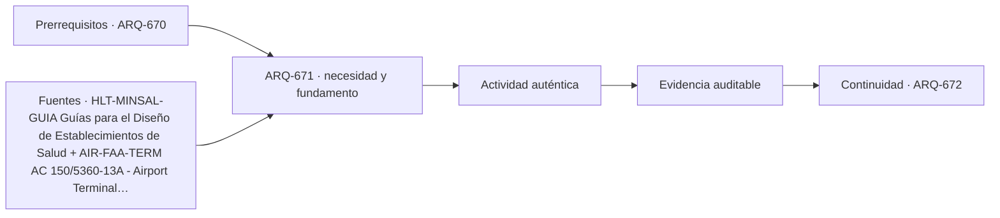

# ARQ-671 · Comparar una casa, un hospital y un aeropuerto

**Parte 68 · Clase desarrollada · Edición definitiva v1.0.**

Material educativo con casos ficticios. No constituye proyecto ejecutable, cálculo firmado, instrucción de trabajo peligroso, informe pericial, permiso ni habilitación profesional. Las cifras se emplean para aprender a razonar y conservan las fronteras declaradas.

## Pregunta central

¿Qué conocimientos se transfieren entre una casa, un hospital y un aeropuerto y cuáles cambian radicalmente por escala, riesgo y operación?

## Resultado de aprendizaje y continuidad

Construirás una matriz comparativa de tres tipologías, separando invariantes metodológicas de parámetros que no deben copiarse. La clase conserva los métodos construidos en las partes anteriores y no hereda parámetros numéricos de otros casos salvo indicación explícita.

## 1. Mismo método, servicios distintos

Las tres tipologías necesitan encargo, sitio, usuarios, programa, estructura, instalaciones, accesibilidad, seguridad, mantenimiento y operación. Esa lista común no significa que tengan igual complejidad ni que una relación de superficies pueda transferirse. La casa organiza vida doméstica; el hospital, cuidados y flujos clínicos; el aeropuerto, procesamiento masivo y conexión con sistemas aeronáuticos.

## 2. El usuario no es una sola categoría

En la casa puede haber residentes, visitas y cuidadores; en el hospital, pacientes, acompañantes, personal y logística; en el aeropuerto, pasajeros, tripulaciones, trabajadores y equipaje. Una matriz de usuarios debe representar tareas y estados, no etiquetas abstractas.

## 3. Continuidad y consecuencias de fallo

Una interrupción eléctrica puede ser incómoda en una vivienda, crítica para ciertas funciones hospitalarias y disruptiva para procesamiento aeroportuario. El diseño debe definir servicio mínimo y dependencias sin inferir que una tipología es siempre “más importante” que otra.

## 4. Escala y redundancia

Más grande no significa automáticamente más complejo, pero escala aumenta cantidad de interfaces y estados. La casa puede concentrar servicios; hospital y aeropuerto suelen requerir sectorización, redundancias y operaciones parciales. La comparación debe preservar fronteras.

## 5. Transferir preguntas, no números

La pregunta “¿cómo se mantiene este sistema?” es transferible. Un caudal, número de ascensores o ancho de circulación no lo es sin nuevo programa y normativa. La competencia integradora consiste en reconocer esta diferencia.

## Caso trabajado

COMP-671 usa superficies ficticias: casa 180 m², hospital 18.000 m² y terminal 45.000 m². Dividir cada una por su número de usuarios simultáneos hipotéticos (6, 900 y 4.500) produce 30, 20 y 10 m²/persona. Esos cocientes no crean una jerarquía de calidad ni permiten dimensionar otra obra: mezclan funciones, circulaciones, equipos y estados muy distintos.

## Método de revisión y límites

Reconstruye el caso desde su frontera: identifica objetos, personas, intervalos y estados incluidos. Comprueba unidades y signos, vuelve a obtener el resultado por equilibrio, balance o relación independiente cuando sea posible y escribe dos frases: una que el cálculo realmente respalda y otra que excedería la evidencia. Después identifica una interfaz con otra disciplina y el documento o profesional que debería aportar la información faltante. Esta secuencia evita que una operación correcta se convierta en una conclusión demasiado amplia.

En una obra real también deben revisarse jurisdicción, versiones normativas, sitio, productos, ensayos, operación y cambios. Una fuente internacional puede explicar un mecanismo sin ser exigencia chilena. Un valor de catálogo puede describir un componente sin representar su configuración instalada. Si la evidencia no existe, el estado correcto es pendiente.

## Errores frecuentes

Evita comparar métricas con denominadores distintos, sumar máximos de estados incompatibles, tratar capacidad nominal como servicio efectivo, usar un promedio para ocultar una región crítica o copiar dimensiones de otro proyecto porque su tipología se parece. Distingue geometría, demanda, capacidad y autorización. Cuando una modificación resuelve una interfaz, revisa qué otras dependencias puede haber alterado.

## Práctica independiente

Una casa de 240 m² aloja 8 personas; una clínica de 6.000 m² atiende simultáneamente 300; una terminal de 20.000 m² tiene 2.000. Calcula los cocientes y redacta dos razones por las que no son estándares transferibles.

Solución razonada

30, 20 y 10 m²/persona. No son estándares porque las funciones y superficies incluidas difieren, y porque simultaneidad, operación, equipamiento y normativa cambian por tipología.

La solución pertenece al modelo declarado. No reemplaza revisión profesional ni permite extrapolar capacidades, distancias seguras, aforos, procedimientos de mantenimiento o cumplimiento reglamentario a una obra real.

## Autoevaluación y transferencia

Puedes avanzar cuando reconstruyes el caso sin mirar la respuesta, distingues dato, hipótesis y evidencia, y señalas al menos una decisión que debe reabrirse si cambia una condición. **ARQ-672** continúa el recorrido.

<!-- pedagogia-2026:inicio -->
## Decisión pedagógica y posición curricular

### Por qué existe

Esta clase existe para resolver una necesidad concreta del recorrido: ¿Qué conocimientos se transfieren entre una casa, un hospital y un aeropuerto y cuáles cambian radicalmente por escala, riesgo y operación?

### Por qué está exactamente aquí

Abre la Parte 68 porque plantea primero el problema «¿Qué conocimientos se transfieren entre una casa, un hospital y un aeropuerto y cuáles cambian radicalmente por escala, riesgo y operación?». La transición desde ARQ-670 · Proyecto de infraestructura especial conserva métodos de evidencia y límites, pero no traslada parámetros del bloque anterior. Establece la pregunta y el producto base que ARQ-672 · Comparar iglesia, museo y estadio desarrollará a continuación.

- **Prerrequisitos:** `ARQ-670`
- **Capacidad que introduce:** Construirás una matriz comparativa de tres tipologías, separando invariantes metodológicas de parámetros que no deben copiarse. La clase conserva los métodos construidos en las partes anteriores y no hereda parámetros numéricos de otros casos salvo indicación explícita.
- **Clases o experiencias que dependen de ella:** `ARQ-672`

El diagrama permite comprobar una relación que el texto lineal oculta con facilidad: esta clase recibe capacidades previas, toma decisiones apoyadas por fuentes, exige una experiencia y produce evidencia que habilita trabajo posterior. No representa un procedimiento de obra.

## Resultado observable, evidencia y evaluación

1. Identificar y delimitar las condiciones necesarias para responder la pregunta central de comparar una casa, un hospital y un aeropuerto.
2. Producir y comprobar la evidencia declarada por la clase: Construirás una matriz comparativa de tres tipologías, separando invariantes metodológicas de parámetros que no deben copiarse. La clase conserva los métodos construidos en las partes anteriores y no hereda parámetros numéricos de otros casos salvo indicación explícita.
3. Justificar una decisión de comparar una casa, un hospital y un aeropuerto mediante fuentes, supuestos, alternativas y límites explícitos.

## Actividad, evidencia y criterio de aceptación

**Actividad:** Una casa de 240 m² aloja 8 personas; una clínica de 6.000 m² atiende simultáneamente 300; una terminal de 20.000 m² tiene 2.000. Calcula los cocientes y redacta dos razones por las que no son estándares transferibles.

**Evidencia mínima:** Construirás una matriz comparativa de tres tipologías, separando invariantes metodológicas de parámetros que no deben copiarse. La clase conserva los métodos construidos en las partes anteriores y no hereda parámetros numéricos de otros casos salvo indicación explícita.

**Archivo sugerido:** `evidence/ARQ-671/evidencia.md`.

**Criterio de aceptación:** la entrega se acepta cuando:

- La entrega responde explícitamente a la pregunta: ¿Qué conocimientos se transfieren entre una casa, un hospital y un aeropuerto y cuáles cambian radicalmente por escala, riesgo y operación?
- La actividad conserva las fronteras del caso y permite reconstruir el procedimiento: Una casa de 240 m² aloja 8 personas; una clínica de 6.000 m² atiende simultáneamente 300; una terminal de 20.000 m² tiene 2.000. Calcula los cocientes y redacta dos razones por las que no son estándares transferibles.
- Cada afirmación externa puede seguirse hasta una fuente, su alcance consultado y su límite.
- La evidencia deja disponible una entrada comprobable para ARQ-672.
- Evita comparar métricas con denominadores distintos, sumar máximos de estados incompatibles, tratar capacidad nominal como servicio efectivo, usar un promedio para ocultar una región crítica o copiar dimensiones de otro proyecto porque su tipología se parece. Distingue geometría, demanda, capacidad y autorización.

La [rúbrica común](../../docs/RUBRICA_COMUN.md) complementa estos criterios; no los reemplaza. Una entrega puede superar un promedio y continuar pendiente si oculta una condición crítica.

## Trazabilidad de las decisiones

| # | Decisión o fundamento | Fuente utilizada | Aplicación y límite en esta clase |
|---:|---|---|---|
| 1 | Referencia chilena para planificación y diseño hospitalario. Cada proyecto debe revisar documentos y exigencias vigentes aplicables. | [HLT-MINSAL-GUIA Guías para el Diseño de Establecimientos de Salud](https://plandeinversionesensalud.minsal.cl/guias-para-el-diseno-de-establecimientos-de-salud/) | Consulta: Alcance consultado no documentado; debe completarse antes de ampliar la conclusión. Límite: Referencia chilena para planificación y diseño hospitalario. Cada proyecto debe revisar documentos y exigencias vigentes aplicables. |
| 2 | Referencia de planificación de terminales aeroportuarias. No crea requisitos chilenos ni reemplaza DGAC. | [AIR-FAA-TERM AC 150/5360-13A - Airport Terminal Planning](https://www.faa.gov/regulations_policies/advisory_circulars/index.cfm/go/document.information/documentID/1033908) | Consulta: Alcance consultado no documentado; debe completarse antes de ampliar la conclusión. Límite: Referencia de planificación de terminales aeroportuarias. No crea requisitos chilenos ni reemplaza DGAC. |
| 3 | Marco de formación arquitectónica integral. No acredita este programa ni sustituye habilitación profesional. | [EDU-UIA UNESCO–UIA Charter for Architectural Education, revisión 2026](https://www.uia-architectes.org/en/news/unesco-uia-charter-for-architectural-education-revised-edition-2026/) | Consulta: Alcance consultado no documentado; debe completarse antes de ampliar la conclusión. Límite: Marco de formación arquitectónica integral. No acredita este programa ni sustituye habilitación profesional. |

La tabla permite auditar las relaciones; la explicación, el caso y la práctica de la clase siguen siendo la documentación principal.

## Autoevaluación, recuperación y continuidad

### Errores diagnósticos

Antes de avanzar, comprueba si puedes reconstruir cada resultado sin mirar la solución, señalar qué evidencia lo sostiene y nombrar una condición que obligaría a revisar tu decisión. Conserva la primera versión, la objeción recibida y la revisión.

**Conexión siguiente:** La continuidad inmediata es ARQ-672 · Comparar iglesia, museo y estadio; conserva el método y vuelve a verificar datos y límites.
<!-- pedagogia-2026:fin -->

## Fuentes y alcance de uso

- **[MINSAL] Guías para el Diseño de Establecimientos de Salud** — Ministerio de Salud de Chile. https://plandeinversionesensalud.minsal.cl/guias-para-el-diseno-de-establecimientos-de-salud/

Uso y límite: Referencia chilena para planificación y diseño hospitalario. Cada proyecto debe revisar documentos y exigencias vigentes aplicables.

- **[FAA-TERM] AC 150/5360-13A - Airport Terminal Planning** — Federal Aviation Administration. https://www.faa.gov/regulations_policies/advisory_circulars/index.cfm/go/document.information/documentID/1033908

Uso y límite: Referencia de planificación de terminales aeroportuarias. No crea requisitos chilenos ni reemplaza DGAC.

- **[UIA] UNESCO–UIA Charter for Architectural Education, revisión 2026** — Unión Internacional de Arquitectos. https://www.uia-architectes.org/en/news/unesco-uia-charter-for-architectural-education-revised-edition-2026/

Uso y límite: Marco de formación arquitectónica integral. No acredita este programa ni sustituye habilitación profesional.
