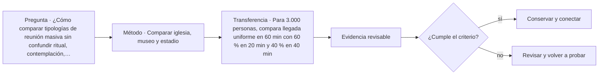

# ARQ-672 · Comparar iglesia, museo y estadio

**Parte 68 · Clase desarrollada · Edición definitiva v1.0.**

Material educativo con casos ficticios. No constituye proyecto ejecutable, cálculo firmado, instrucción de trabajo peligroso, informe pericial, permiso ni habilitación profesional. Las cifras se emplean para aprender a razonar y conservan las fronteras declaradas.

## Pregunta central

¿Cómo comparar tipologías de reunión masiva sin confundir ritual, contemplación, exposición y evento con una sola idea de “aforo”?

## Resultado de aprendizaje y continuidad

Distinguirás concentración, duración, orientación, acústica, patrimonio y logística en tres espacios colectivos. La clase conserva los métodos construidos en las partes anteriores y no hereda parámetros numéricos de otros casos salvo indicación explícita.

## 1. Reunirse no significa hacer lo mismo

Iglesia, museo y estadio pueden recibir muchas personas, pero sus patrones espaciales son diferentes. El templo puede orientar la atención a un foco ritual; el museo distribuye recorrido y permanencia; el estadio concentra visión hacia un campo y movimientos masivos antes y después del evento.

## 2. Tiempo y distribución

Un museo puede tener entradas continuas y permanencias largas; un estadio concentra llegadas y salidas; una iglesia combina ocupación cotidiana y ceremonias puntuales. La capacidad nominal necesita una serie temporal y estados, no una cifra aislada.

## 3. Acústica y luz con objetivos distintos

Reverberación, palabra, música, iluminación de objetos y visibilidad de campo responden a criterios diferentes. Transferir un tiempo de reverberación o nivel de luz entre tipologías sin tarea común carece de sentido.

## 4. Patrimonio y transformación

Iglesias y museos pueden ocupar edificios históricos; estadios también pueden adquirir valor cultural. Adaptar exige identificar valores y funcionamiento vivo. Conservación no elimina requisitos de accesibilidad, seguridad u operación; tampoco los resuelve automáticamente.

## 5. Logística detrás de la experiencia

Objetos, vestuario, limpieza, seguridad, mantenimiento y eventos temporales funcionan detrás de la experiencia pública. El diseño debe representar back-of-house y no solo el espacio fotografiable.

## Caso trabajado

COMP-672 compara tres eventos de 2.000 asistentes. En A llegan uniformemente en 40 min: 50 pers/min. En B, 70 % llega en 15 min y el resto en 30: durante el primer intervalo la media es 93,3 pers/min. Igual asistencia total produce una demanda temporal casi doble. El ejemplo puede representar dos estados de cualquiera de las tipologías; no define capacidad segura.

## Método de revisión y límites

Reconstruye el caso desde su frontera: identifica objetos, personas, intervalos y estados incluidos. Comprueba unidades y signos, vuelve a obtener el resultado por equilibrio, balance o relación independiente cuando sea posible y escribe dos frases: una que el cálculo realmente respalda y otra que excedería la evidencia. Después identifica una interfaz con otra disciplina y el documento o profesional que debería aportar la información faltante. Esta secuencia evita que una operación correcta se convierta en una conclusión demasiado amplia.

En una obra real también deben revisarse jurisdicción, versiones normativas, sitio, productos, ensayos, operación y cambios. Una fuente internacional puede explicar un mecanismo sin ser exigencia chilena. Un valor de catálogo puede describir un componente sin representar su configuración instalada. Si la evidencia no existe, el estado correcto es pendiente.

## Errores frecuentes

Evita comparar métricas con denominadores distintos, sumar máximos de estados incompatibles, tratar capacidad nominal como servicio efectivo, usar un promedio para ocultar una región crítica o copiar dimensiones de otro proyecto porque su tipología se parece. Distingue geometría, demanda, capacidad y autorización. Cuando una modificación resuelve una interfaz, revisa qué otras dependencias puede haber alterado.

## Práctica independiente

Para 3.000 personas, compara llegada uniforme en 60 min con 60 % en 20 min y 40 % en 40 min. Calcula tasas medias de cada fase.

Solución razonada

Uniforme: 50 pers/min. Fase intensa: 1.800/20=90 pers/min; segunda: 1.200/40=30 pers/min. Faltan distribución espacial, rutas, controles y criterios de seguridad.

La solución pertenece al modelo declarado. No reemplaza revisión profesional ni permite extrapolar capacidades, distancias seguras, aforos, procedimientos de mantenimiento o cumplimiento reglamentario a una obra real.

## Autoevaluación y transferencia

Puedes avanzar cuando reconstruyes el caso sin mirar la respuesta, distingues dato, hipótesis y evidencia, y señalas al menos una decisión que debe reabrirse si cambia una condición. **ARQ-673** continúa el recorrido.

<!-- pedagogia-2026:inicio -->
## Mapa visual de aprendizaje

El diagrama representa el ciclo de aprendizaje de esta clase, no una secuencia de obra ni un procedimiento profesional.

## Resultado observable, evidencia y evaluación

**Tipo de clase:** proyectual.

**Evidencia mínima:** lámina o expediente con alternativas, representación pertinente, decisión argumentada, revisión y asuntos pendientes.

**Archivo sugerido:** `evidence/ARQ-672/evidencia.md`.

| Criterio | Evidencia observable |
|---|---|
| Precisión y representación · 20 % | Los conceptos, unidades y convenciones se usan de forma coherente y pueden ser reconstruidos por otra persona. |
| Evidencia y trazabilidad · 25 % | Cada afirmación importante se vincula con dato, cálculo, observación o fuente; hipótesis y desconocidos permanecen visibles. |
| Decisión y alternativas · 25 % | La decisión responde a la pregunta, compara al menos una alternativa y declara qué condición la haría cambiar. |
| Integración y ciclo de vida · 20 % | Se identifica una interfaz y una consecuencia para construcción, uso, mantenimiento, adaptación o fin de vida. |
| Comunicación, ética y límites · 10 % | El alcance se entiende sin explicación oral adicional y no se atribuyen permisos, competencias o certezas inexistentes. |

**Criterio de aceptación:** 80/100 y ningún criterio bajo 60 %. Una entrega genérica que podría reutilizarse sin cambios en otra clase no demuestra dominio. Si existe una condición crítica de seguridad, accesibilidad, evidencia o responsabilidad sin resolver, la entrega permanece pendiente aunque el promedio supere 80.

### Errores diagnósticos

En esta clase conviene vigilar especialmente: comparar alternativas con alcances distintos; defender la imagen antes que el servicio; borrar las huellas de la revisión.

## Autoevaluación, recuperación y continuidad

Antes de avanzar, responde sin consultar la solución:

1. ¿Qué decisión concreta puedes tomar ahora que no podías justificar antes?
2. ¿Qué evidencia de tu entrega es comprobada y cuál continúa siendo una hipótesis?
3. ¿Qué cambio de contexto invalidaría la transferencia realizada?

Revisa la entrega a las 24–48 horas y nuevamente al cerrar la parte. Conserva la primera versión, la crítica recibida y la versión revisada: el aprendizaje se demuestra también mediante el cambio entre versiones.
<!-- pedagogia-2026:fin -->

## Fuentes y alcance de uso

- **[FIFA] Football Stadiums Guidelines** — FIFA. https://inside.fifa.com/innovation/stadium-guidelines

Uso y límite: Referencia internacional de planificación de estadios. No es normativa urbana o de edificación chilena.

- **[UNESCO] World Heritage and sustainable management resources** — UNESCO World Heritage Centre. https://whc.unesco.org/

Uso y límite: Referencia patrimonial general. La conservación de una obra real requiere fuentes específicas del bien y autoridades competentes.

- **[ISO21542] ISO 21542:2021 - Accessibility and usability of the built environment** — ISO. https://www.iso.org/standard/71860.html

Uso y límite: Ficha pública sobre accesibilidad y usabilidad. No sustituye OGUC ni normativa local.
