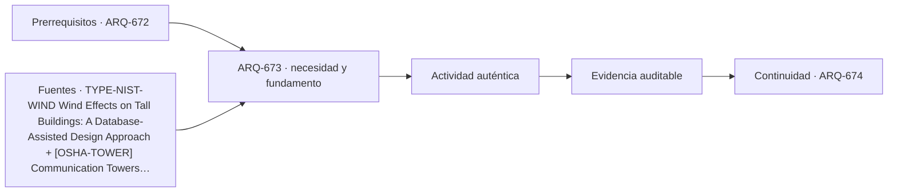

# ARQ-673 · Comparar rascacielos, torre y centro de datos

**Parte 68 · Clase desarrollada · Edición definitiva v1.0.**

Material educativo con casos ficticios. No constituye proyecto ejecutable, cálculo firmado, instrucción de trabajo peligroso, informe pericial, permiso ni habilitación profesional. Las cifras se emplean para aprender a razonar y conservan las fronteras declaradas.

## Pregunta central

¿Qué diferencia una estructura alta ocupada, una torre especial y un centro de datos cuando las tres dependen de infraestructura crítica y mantenimiento?

## Resultado de aprendizaje y continuidad

Compararás verticalidad, ocupación, densidad de equipos, continuidad y exposición ambiental sin usar una métrica única. La clase conserva los métodos construidos en las partes anteriores y no hereda parámetros numéricos de otros casos salvo indicación explícita.

## 1. Altura y densidad son problemas diferentes

El rascacielos concentra personas y servicios en altura; una torre especial puede tener muy poca ocupación; el centro de datos concentra equipos, potencia y calor, incluso en pocos niveles. La complejidad no se ordena simplemente por metros de altura.

## 2. Movimiento y tolerancias

En rascacielos y torres, viento y movimiento pueden controlar juntas, fachadas y equipos. En centro de datos, vibración y movimiento también importan, pero con otra relación entre equipo, soporte y servicio. La misma palabra “movimiento” exige diferentes evidencias.

## 3. Continuidad de servicio

Evacuar un edificio alto, mantener una antena y mantener un servicio digital tienen estados y dependencias distintas. La continuidad debe definirse por función: ocupación segura, cobertura de comunicación o disponibilidad de TI, no por un porcentaje genérico.

## 4. Mantenimiento como arquitectura

Ascensores de servicio, recorridos técnicos, salas, repuestos y zonas de sustitución deben aparecer desde el programa. Un equipo que cabe puede ser imposible de reemplazar. Una antena accesible puede dejar de serlo tras agregar otras instalaciones.

## 5. Métricas con denominadores correctos

PUE, m²/persona, altura, potencia o área expuesta responden preguntas distintas. No se combinan en un índice universal. La comparación exige servicio común o una matriz de consecuencias.

## Caso trabajado

COMP-673 presenta: torre A de 250 m con 1.000 ocupantes, torre técnica B de 120 m con 5 trabajadores ocasionales y centro de datos C de 24 m con 8 MW TI. Los cocientes altura/ocupante o MW/m² no permiten ordenar “complejidad”. El ejercicio pide identificar tres variables distintas: movimiento estructural, continuidad de servicio y acceso de mantenimiento.

## Método de revisión y límites

Reconstruye el caso desde su frontera: identifica objetos, personas, intervalos y estados incluidos. Comprueba unidades y signos, vuelve a obtener el resultado por equilibrio, balance o relación independiente cuando sea posible y escribe dos frases: una que el cálculo realmente respalda y otra que excedería la evidencia. Después identifica una interfaz con otra disciplina y el documento o profesional que debería aportar la información faltante. Esta secuencia evita que una operación correcta se convierta en una conclusión demasiado amplia.

En una obra real también deben revisarse jurisdicción, versiones normativas, sitio, productos, ensayos, operación y cambios. Una fuente internacional puede explicar un mecanismo sin ser exigencia chilena. Un valor de catálogo puede describir un componente sin representar su configuración instalada. Si la evidencia no existe, el estado correcto es pendiente.

## Errores frecuentes

Evita comparar métricas con denominadores distintos, sumar máximos de estados incompatibles, tratar capacidad nominal como servicio efectivo, usar un promedio para ocultar una región crítica o copiar dimensiones de otro proyecto porque su tipología se parece. Distingue geometría, demanda, capacidad y autorización. Cuando una modificación resuelve una interfaz, revisa qué otras dependencias puede haber alterado.

## Práctica independiente

Elige tres indicadores apropiados, uno por tipología, y explica qué decisión ayuda a estudiar y qué no demuestra.

Solución razonada

Ejemplos válidos: deriva/aceleración para edificio alto (no calidad de evacuación); disponibilidad de rutas de mantenimiento para torre técnica (no capacidad estructural); PUE o potencia TI para centro de datos (no resiliencia completa).

La solución pertenece al modelo declarado. No reemplaza revisión profesional ni permite extrapolar capacidades, distancias seguras, aforos, procedimientos de mantenimiento o cumplimiento reglamentario a una obra real.

## Autoevaluación y transferencia

Puedes avanzar cuando reconstruyes el caso sin mirar la respuesta, distingues dato, hipótesis y evidencia, y señalas al menos una decisión que debe reabrirse si cambia una condición. **ARQ-674** continúa el recorrido.

<!-- pedagogia-2026:inicio -->
## Decisión pedagógica y posición curricular

### Por qué existe

Esta clase existe para resolver una necesidad concreta del recorrido: ¿Qué diferencia una estructura alta ocupada, una torre especial y un centro de datos cuando las tres dependen de infraestructura crítica y mantenimiento?

### Por qué está exactamente aquí

Ocupa el lugar 3 de la Parte 68. Se estudia después de ARQ-672 · Comparar iglesia, museo y estadio porque usa esa base para responder «¿Qué diferencia una estructura alta ocupada, una torre especial y un centro de datos cuando las tres dependen de infraestructura crítica y mantenimiento?». Se ubica antes de ARQ-674 · Comparar estación, metro y terminal aeroportuaria porque la evidencia producida aquí debe estar disponible para ese paso.

- **Prerrequisitos:** `ARQ-672`
- **Capacidad que introduce:** Compararás verticalidad, ocupación, densidad de equipos, continuidad y exposición ambiental sin usar una métrica única. La clase conserva los métodos construidos en las partes anteriores y no hereda parámetros numéricos de otros casos salvo indicación explícita.
- **Clases o experiencias que dependen de ella:** `ARQ-674`

El diagrama permite comprobar una relación que el texto lineal oculta con facilidad: esta clase recibe capacidades previas, toma decisiones apoyadas por fuentes, exige una experiencia y produce evidencia que habilita trabajo posterior. No representa un procedimiento de obra.

## Resultado observable, evidencia y evaluación

1. Identificar y delimitar las condiciones necesarias para responder la pregunta central de comparar rascacielos, torre y centro de datos.
2. Producir y comprobar la evidencia declarada por la clase: Compararás verticalidad, ocupación, densidad de equipos, continuidad y exposición ambiental sin usar una métrica única. La clase conserva los métodos construidos en las partes anteriores y no hereda parámetros numéricos de otros casos salvo indicación explícita.
3. Justificar una decisión de comparar rascacielos, torre y centro de datos mediante fuentes, supuestos, alternativas y límites explícitos.

## Actividad, evidencia y criterio de aceptación

**Actividad:** Elige tres indicadores apropiados, uno por tipología, y explica qué decisión ayuda a estudiar y qué no demuestra.

**Evidencia mínima:** Compararás verticalidad, ocupación, densidad de equipos, continuidad y exposición ambiental sin usar una métrica única. La clase conserva los métodos construidos en las partes anteriores y no hereda parámetros numéricos de otros casos salvo indicación explícita.

**Archivo sugerido:** `evidence/ARQ-673/evidencia.md`.

**Criterio de aceptación:** la entrega se acepta cuando:

- La entrega responde explícitamente a la pregunta: ¿Qué diferencia una estructura alta ocupada, una torre especial y un centro de datos cuando las tres dependen de infraestructura crítica y mantenimiento?
- La actividad conserva las fronteras del caso y permite reconstruir el procedimiento: Elige tres indicadores apropiados, uno por tipología, y explica qué decisión ayuda a estudiar y qué no demuestra.
- Cada afirmación externa puede seguirse hasta una fuente, su alcance consultado y su límite.
- La evidencia deja disponible una entrada comprobable para ARQ-674.
- Evita comparar métricas con denominadores distintos, sumar máximos de estados incompatibles, tratar capacidad nominal como servicio efectivo, usar un promedio para ocultar una región crítica o copiar dimensiones de otro proyecto porque su tipología se parece. Distingue geometría, demanda, capacidad y autorización.

La [rúbrica común](../../docs/RUBRICA_COMUN.md) complementa estos criterios; no los reemplaza. Una entrega puede superar un promedio y continuar pendiente si oculta una condición crítica.

## Trazabilidad de las decisiones

| # | Decisión o fundamento | Fuente utilizada | Aplicación y límite en esta clase |
|---:|---|---|---|
| 1 | Apoyo para distinguir presión, dinámica, torsión y dirección del viento en estructuras esbeltas. No aporta cargas de diseño para los casos ficticios. | [TYPE-NIST-WIND Wind Effects on Tall Buildings: A Database-Assisted…](https://www.nist.gov/publications/wind-effects-tall-buildings-database-assisted-design-approach) | Consulta: Alcance consultado no documentado; debe completarse antes de ampliar la conclusión. Límite: Apoyo para distinguir presión, dinámica, torsión y dirección del viento en estructuras esbeltas. No aporta cargas de diseño para los casos ficticios. |
| 2 | Apoyo para reconocer riesgos de acceso, mantenimiento, izaje y trabajo en altura. Referencia estadounidense; no constituye procedimiento de obra para Chile. | [[OSHA-TOWER] Communication Towers - Overview and Compliance Assistance](https://www.osha.gov/communication-towers) | Consulta: Alcance consultado no documentado; debe completarse antes de ampliar la conclusión. Límite: Apoyo para reconocer riesgos de acceso, mantenimiento, izaje y trabajo en altura. Referencia estadounidense; no constituye procedimiento de obra para Chile. |
| 3 | Ficha pública sobre conceptos, disponibilidad, seguridad y eficiencia de centros de datos. No se reproduce la norma íntegra. | [DC-ISO22237-1 ISO/IEC 22237-1:2021 — Data centre facilities and…](https://www.iso.org/standard/78550.html) | Consulta: Alcance consultado no documentado; debe completarse antes de ampliar la conclusión. Límite: Ficha pública sobre conceptos, disponibilidad, seguridad y eficiencia de centros de datos. No se reproduce la norma íntegra. |

La tabla permite auditar las relaciones; la explicación, el caso y la práctica de la clase siguen siendo la documentación principal.

## Autoevaluación, recuperación y continuidad

### Errores diagnósticos

Antes de avanzar, comprueba si puedes reconstruir cada resultado sin mirar la solución, señalar qué evidencia lo sostiene y nombrar una condición que obligaría a revisar tu decisión. Conserva la primera versión, la objeción recibida y la revisión.

**Conexión siguiente:** La continuidad inmediata es ARQ-674 · Comparar estación, metro y terminal aeroportuaria; conserva el método y vuelve a verificar datos y límites.
<!-- pedagogia-2026:fin -->

## Fuentes y alcance de uso

- **[NIST-WIND] Wind Effects on Tall Buildings: A Database-Assisted Design Approach** — NIST. https://www.nist.gov/publications/wind-effects-tall-buildings-database-assisted-design-approach

Uso y límite: Apoyo para distinguir presión, dinámica, torsión y dirección del viento en estructuras esbeltas. No aporta cargas de diseño para los casos ficticios.

- **[OSHA-TOWER] Communication Towers - Overview and Compliance Assistance** — Occupational Safety and Health Administration. https://www.osha.gov/communication-towers

Uso y límite: Apoyo para reconocer riesgos de acceso, mantenimiento, izaje y trabajo en altura. Referencia estadounidense; no constituye procedimiento de obra para Chile.

- **[ISO22237] ISO/IEC 22237-1:2021 - Data centre facilities and infrastructures - General concepts** — ISO/IEC. https://www.iso.org/standard/78550.html

Uso y límite: Ficha pública sobre conceptos, disponibilidad, seguridad y eficiencia de centros de datos. No se reproduce la norma íntegra.
