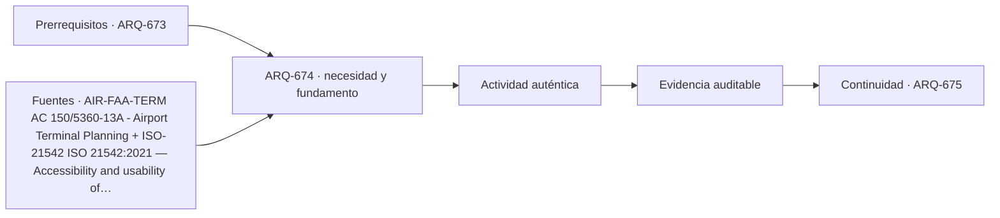

# ARQ-674 · Comparar estación, metro y terminal aeroportuaria

**Parte 68 · Clase desarrollada · Edición definitiva v1.0.**

Material educativo con casos ficticios. No constituye proyecto ejecutable, cálculo firmado, instrucción de trabajo peligroso, informe pericial, permiso ni habilitación profesional. Las cifras se emplean para aprender a razonar y conservan las fronteras declaradas.

## Pregunta central

¿Cómo cambia la arquitectura del intercambio cuando tren, metro y avión operan con frecuencias, controles y escalas diferentes?

## Resultado de aprendizaje y continuidad

Analizarás cadenas de viaje, transbordos, procesamiento, información y estados de interrupción. La clase conserva los métodos construidos en las partes anteriores y no hereda parámetros numéricos de otros casos salvo indicación explícita.

## 1. La estación es una cadena de decisiones

Llegar, orientarse, validar, esperar, abordar, conectar y salir forman una secuencia. Ferrocarril y metro pueden compartir ciertos procesos; aeropuerto añade controles, equipaje y fronteras operativas específicas. El diseño no se compara solo por distancia desde calle a vehículo.

## 2. Frecuencia y acumulación

Un metro de alta frecuencia produce espera y acumulación distintas de un tren interurbano o un vuelo. La sala necesaria depende de patrones temporales. Promediar pasajeros por día oculta picos y conexiones perdidas.

## 3. Separaciones operativas

Zonas públicas, restringidas, técnicas y de personal cambian según modo. Una conexión intermodal puede reducir tiempo y a la vez introducir nuevos controles. La arquitectura debe representar qué límites se cruzan y en qué orden.

## 4. Información y accesibilidad

El viajero debe comprender decisiones antes de comprometerse con una ruta. Señalética, anuncios, iluminación, alternativas accesibles y personal forman una cadena. Una ruta físicamente accesible que conduce a una plataforma equivocada no entrega el servicio.

## 5. Recuperación ante fallas

Cerrar una plataforma, ascensor o control cambia la red. Los planos de operación deben incluir estados degradados. La redundancia topológica no es suficiente si las alternativas dependen del mismo punto común.

## Caso trabajado

COMP-674 compara dos conexiones de 500 m. En la primera se camina a 1,2 m/s y se esperan 4 min; tiempo total ideal ≈10,94 min. En la segunda se camina a 0,9 m/s y se esperan 2 min; total ≈11,26 min. La espera menor no garantiza menor tiempo total. Tampoco se modelan colas, controles, accesibilidad o incertidumbre.

## Método de revisión y límites

Reconstruye el caso desde su frontera: identifica objetos, personas, intervalos y estados incluidos. Comprueba unidades y signos, vuelve a obtener el resultado por equilibrio, balance o relación independiente cuando sea posible y escribe dos frases: una que el cálculo realmente respalda y otra que excedería la evidencia. Después identifica una interfaz con otra disciplina y el documento o profesional que debería aportar la información faltante. Esta secuencia evita que una operación correcta se convierta en una conclusión demasiado amplia.

En una obra real también deben revisarse jurisdicción, versiones normativas, sitio, productos, ensayos, operación y cambios. Una fuente internacional puede explicar un mecanismo sin ser exigencia chilena. Un valor de catálogo puede describir un componente sin representar su configuración instalada. Si la evidencia no existe, el estado correcto es pendiente.

## Errores frecuentes

Evita comparar métricas con denominadores distintos, sumar máximos de estados incompatibles, tratar capacidad nominal como servicio efectivo, usar un promedio para ocultar una región crítica o copiar dimensiones de otro proyecto porque su tipología se parece. Distingue geometría, demanda, capacidad y autorización. Cuando una modificación resuelve una interfaz, revisa qué otras dependencias puede haber alterado.

## Práctica independiente

Compara 420 m a 1,1 m/s + 5 min de espera con 600 m a 1,25 m/s + 2 min.

Solución razonada

Primera: 6,36 min de caminata +5 =11,36 min. Segunda: 8 min +2=10 min. La ruta más larga resulta menor en este modelo; faltan procesos reales y variabilidad.

La solución pertenece al modelo declarado. No reemplaza revisión profesional ni permite extrapolar capacidades, distancias seguras, aforos, procedimientos de mantenimiento o cumplimiento reglamentario a una obra real.

## Autoevaluación y transferencia

Puedes avanzar cuando reconstruyes el caso sin mirar la respuesta, distingues dato, hipótesis y evidencia, y señalas al menos una decisión que debe reabrirse si cambia una condición. **ARQ-675** continúa el recorrido.

<!-- pedagogia-2026:inicio -->
## Decisión pedagógica y posición curricular

### Por qué existe

Esta clase existe para resolver una necesidad concreta del recorrido: ¿Cómo cambia la arquitectura del intercambio cuando tren, metro y avión operan con frecuencias, controles y escalas diferentes?

### Por qué está exactamente aquí

Ocupa el lugar 4 de la Parte 68. Se estudia después de ARQ-673 · Comparar rascacielos, torre y centro de datos porque usa esa base para responder «¿Cómo cambia la arquitectura del intercambio cuando tren, metro y avión operan con frecuencias, controles y escalas diferentes?». Se ubica antes de ARQ-675 · Comparar puente, túnel y puerto porque la evidencia producida aquí debe estar disponible para ese paso.

- **Prerrequisitos:** `ARQ-673`
- **Capacidad que introduce:** Analizarás cadenas de viaje, transbordos, procesamiento, información y estados de interrupción. La clase conserva los métodos construidos en las partes anteriores y no hereda parámetros numéricos de otros casos salvo indicación explícita.
- **Clases o experiencias que dependen de ella:** `ARQ-675`

El diagrama permite comprobar una relación que el texto lineal oculta con facilidad: esta clase recibe capacidades previas, toma decisiones apoyadas por fuentes, exige una experiencia y produce evidencia que habilita trabajo posterior. No representa un procedimiento de obra.

## Resultado observable, evidencia y evaluación

1. Identificar y delimitar las condiciones necesarias para responder la pregunta central de comparar estación, metro y terminal aeroportuaria.
2. Producir y comprobar la evidencia declarada por la clase: Analizarás cadenas de viaje, transbordos, procesamiento, información y estados de interrupción. La clase conserva los métodos construidos en las partes anteriores y no hereda parámetros numéricos de otros casos salvo indicación explícita.
3. Justificar una decisión de comparar estación, metro y terminal aeroportuaria mediante fuentes, supuestos, alternativas y límites explícitos.

## Actividad, evidencia y criterio de aceptación

**Actividad:** Compara 420 m a 1,1 m/s + 5 min de espera con 600 m a 1,25 m/s + 2 min. La entrega debe conservar procedimiento, datos, supuestos, alternativa y conclusión revisable.

**Evidencia mínima:** Analizarás cadenas de viaje, transbordos, procesamiento, información y estados de interrupción. La clase conserva los métodos construidos en las partes anteriores y no hereda parámetros numéricos de otros casos salvo indicación explícita.

**Archivo sugerido:** `evidence/ARQ-674/evidencia.md`.

**Criterio de aceptación:** la entrega se acepta cuando:

- La entrega responde explícitamente a la pregunta: ¿Cómo cambia la arquitectura del intercambio cuando tren, metro y avión operan con frecuencias, controles y escalas diferentes?
- La actividad conserva las fronteras del caso y permite reconstruir el procedimiento: Compara 420 m a 1,1 m/s + 5 min de espera con 600 m a 1,25 m/s + 2 min. La entrega debe conservar procedimiento, datos, supuestos, alternativa y conclusión revisable.
- Cada afirmación externa puede seguirse hasta una fuente, su alcance consultado y su límite.
- La evidencia deja disponible una entrada comprobable para ARQ-675.
- Evita comparar métricas con denominadores distintos, sumar máximos de estados incompatibles, tratar capacidad nominal como servicio efectivo, usar un promedio para ocultar una región crítica o copiar dimensiones de otro proyecto porque su tipología se parece. Distingue geometría, demanda, capacidad y autorización.

La [rúbrica común](../../docs/RUBRICA_COMUN.md) complementa estos criterios; no los reemplaza. Una entrega puede superar un promedio y continuar pendiente si oculta una condición crítica.

## Trazabilidad de las decisiones

| # | Decisión o fundamento | Fuente utilizada | Aplicación y límite en esta clase |
|---:|---|---|---|
| 1 | Referencia de planificación de terminales aeroportuarias. No crea requisitos chilenos ni reemplaza DGAC. | [AIR-FAA-TERM AC 150/5360-13A - Airport Terminal Planning](https://www.faa.gov/regulations_policies/advisory_circulars/index.cfm/go/document.information/documentID/1033908) | Consulta: Alcance consultado no documentado; debe completarse antes de ampliar la conclusión. Límite: Referencia de planificación de terminales aeroportuarias. No crea requisitos chilenos ni reemplaza DGAC. |
| 2 | Ficha pública sobre accesibilidad y usabilidad. No sustituye OGUC ni normativa local. | [ISO-21542 ISO 21542:2021 — Accessibility and usability of the built…](https://www.iso.org/standard/71860.html) | Consulta: Alcance consultado no documentado; debe completarse antes de ampliar la conclusión. Límite: Ficha pública sobre accesibilidad y usabilidad. No sustituye OGUC ni normativa local. |
| 3 | Apoyo para pensar infraestructura como sistema de servicios y dependencias, con gobernanza y resiliencia. No es diseño de detalle. | [[UNDRR-CL] Hoja de Ruta para la Resiliencia de la Infraestructura en…](https://www.undrr.org/es/publication/hoja-de-ruta-para-la-resiliencia-de-la-infraestructura-en-la-republica-de-chile) | Consulta: Alcance consultado no documentado; debe completarse antes de ampliar la conclusión. Límite: Apoyo para pensar infraestructura como sistema de servicios y dependencias, con gobernanza y resiliencia. No es diseño de detalle. |

La tabla permite auditar las relaciones; la explicación, el caso y la práctica de la clase siguen siendo la documentación principal.

## Autoevaluación, recuperación y continuidad

### Errores diagnósticos

Antes de avanzar, comprueba si puedes reconstruir cada resultado sin mirar la solución, señalar qué evidencia lo sostiene y nombrar una condición que obligaría a revisar tu decisión. Conserva la primera versión, la objeción recibida y la revisión.

**Conexión siguiente:** La continuidad inmediata es ARQ-675 · Comparar puente, túnel y puerto; conserva el método y vuelve a verificar datos y límites.
<!-- pedagogia-2026:fin -->

## Fuentes y alcance de uso

- **[FAA-TERM] AC 150/5360-13A - Airport Terminal Planning** — Federal Aviation Administration. https://www.faa.gov/regulations_policies/advisory_circulars/index.cfm/go/document.information/documentID/1033908

Uso y límite: Referencia de planificación de terminales aeroportuarias. No crea requisitos chilenos ni reemplaza DGAC.

- **[ISO21542] ISO 21542:2021 - Accessibility and usability of the built environment** — ISO. https://www.iso.org/standard/71860.html

Uso y límite: Ficha pública sobre accesibilidad y usabilidad. No sustituye OGUC ni normativa local.

- **[UNDRR-CL] Hoja de Ruta para la Resiliencia de la Infraestructura en la República de Chile** — UNDRR / CDRI / Chile. https://www.undrr.org/es/publication/hoja-de-ruta-para-la-resiliencia-de-la-infraestructura-en-la-republica-de-chile

Uso y límite: Apoyo para pensar infraestructura como sistema de servicios y dependencias, con gobernanza y resiliencia. No es diseño de detalle.
