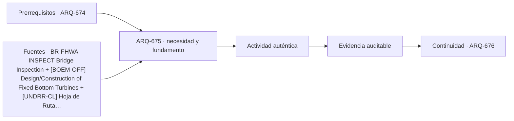

# ARQ-675 · Comparar puente, túnel y puerto

**Parte 68 · Clase desarrollada · Edición definitiva v1.0.**

Material educativo con casos ficticios. No constituye proyecto ejecutable, cálculo firmado, instrucción de trabajo peligroso, informe pericial, permiso ni habilitación profesional. Las cifras se emplean para aprender a razonar y conservan las fronteras declaradas.

## Pregunta central

¿Cómo comparar infraestructuras de conexión cuando unas cruzan, otras perforan y otras transfieren entre tierra y agua?

## Resultado de aprendizaje y continuidad

Relacionarás servicio, terreno, agua, construcción, inspección y continuidad en tres familias de infraestructura. La clase conserva los métodos construidos en las partes anteriores y no hereda parámetros numéricos de otros casos salvo indicación explícita.

## 1. Conectar mediante condiciones distintas

El puente salva una discontinuidad por encima; el túnel la atraviesa; el puerto organiza transferencia entre medios. Cada solución modifica paisaje, geotecnia, agua y mantenimiento de manera diferente. No existe una tipología universalmente superior.

## 2. Lo visible y lo oculto

En puentes gran parte de la estructura puede inspeccionarse directamente; túneles y puertos contienen elementos enterrados, sumergidos o de difícil acceso. La estrategia de inspección depende de accesibilidad y ambiente.

## 3. Agua como acción y medio

Un puente puede enfrentar socavación; un túnel, presión e infiltración; un puerto, mareas, oleaje y corrosión. Usar “agua” como una sola carga pierde mecanismos y fronteras.

## 4. Construcción y continuidad

Desvíos de tráfico, excavación, montaje y operaciones portuarias deben planificarse con estados temporales. Una solución final correcta puede ser inviable si su secuencia interrumpe un servicio crítico sin alternativa.

## 5. Ciclo de vida e inspección

FHWA trata inspección como parte continua de puentes y túneles. Puertos también requieren conservación de pavimentos, defensas, muelles y equipos. El costo de acceso y parada debe entrar a la comparación.

## Caso trabajado

COMP-675 usa una demanda de transporte ficticia de 1.200 unidades/h. Puente A tiene capacidad nominal 1.500, túnel B 1.400 y transferencia portuaria C 1.600. Si una etapa común aguas arriba limita a 1.000 unidades/h, ninguna alternativa entrega más de 1.000 en el sistema completo. La capacidad local mayor no elimina un cuello compartido.

## Método de revisión y límites

Reconstruye el caso desde su frontera: identifica objetos, personas, intervalos y estados incluidos. Comprueba unidades y signos, vuelve a obtener el resultado por equilibrio, balance o relación independiente cuando sea posible y escribe dos frases: una que el cálculo realmente respalda y otra que excedería la evidencia. Después identifica una interfaz con otra disciplina y el documento o profesional que debería aportar la información faltante. Esta secuencia evita que una operación correcta se convierta en una conclusión demasiado amplia.

En una obra real también deben revisarse jurisdicción, versiones normativas, sitio, productos, ensayos, operación y cambios. Una fuente internacional puede explicar un mecanismo sin ser exigencia chilena. Un valor de catálogo puede describir un componente sin representar su configuración instalada. Si la evidencia no existe, el estado correcto es pendiente.

## Errores frecuentes

Evita comparar métricas con denominadores distintos, sumar máximos de estados incompatibles, tratar capacidad nominal como servicio efectivo, usar un promedio para ocultar una región crítica o copiar dimensiones de otro proyecto porque su tipología se parece. Distingue geometría, demanda, capacidad y autorización. Cuando una modificación resuelve una interfaz, revisa qué otras dependencias puede haber alterado.

## Práctica independiente

Tres alternativas tienen capacidades 900/1.100/1.300, pero una conexión común admite 1.000. Determina capacidad de sistema para cada una.

Solución razonada

A=900; B=1.000; C=1.000 unidades/h bajo el modelo. B y C quedan limitadas por la conexión común. Faltan confiabilidad, mantenimiento, geometría y demanda temporal.

La solución pertenece al modelo declarado. No reemplaza revisión profesional ni permite extrapolar capacidades, distancias seguras, aforos, procedimientos de mantenimiento o cumplimiento reglamentario a una obra real.

## Autoevaluación y transferencia

Puedes avanzar cuando reconstruyes el caso sin mirar la respuesta, distingues dato, hipótesis y evidencia, y señalas al menos una decisión que debe reabrirse si cambia una condición. **ARQ-676** continúa el recorrido.

<!-- pedagogia-2026:inicio -->
## Decisión pedagógica y posición curricular

### Por qué existe

Esta clase existe para resolver una necesidad concreta del recorrido: ¿Cómo comparar infraestructuras de conexión cuando unas cruzan, otras perforan y otras transfieren entre tierra y agua?

### Por qué está exactamente aquí

Ocupa el lugar 5 de la Parte 68. Se estudia después de ARQ-674 · Comparar estación, metro y terminal aeroportuaria porque usa esa base para responder «¿Cómo comparar infraestructuras de conexión cuando unas cruzan, otras perforan y otras transfieren entre tierra y agua?». Se ubica antes de ARQ-676 · Comparar castillo y edificio de alta seguridad porque la evidencia producida aquí debe estar disponible para ese paso.

- **Prerrequisitos:** `ARQ-674`
- **Capacidad que introduce:** Relacionarás servicio, terreno, agua, construcción, inspección y continuidad en tres familias de infraestructura. La clase conserva los métodos construidos en las partes anteriores y no hereda parámetros numéricos de otros casos salvo indicación explícita.
- **Clases o experiencias que dependen de ella:** `ARQ-676`

El diagrama permite comprobar una relación que el texto lineal oculta con facilidad: esta clase recibe capacidades previas, toma decisiones apoyadas por fuentes, exige una experiencia y produce evidencia que habilita trabajo posterior. No representa un procedimiento de obra.

## Resultado observable, evidencia y evaluación

1. Identificar y delimitar las condiciones necesarias para responder la pregunta central de comparar puente, túnel y puerto.
2. Producir y comprobar la evidencia declarada por la clase: Relacionarás servicio, terreno, agua, construcción, inspección y continuidad en tres familias de infraestructura. La clase conserva los métodos construidos en las partes anteriores y no hereda parámetros numéricos de otros casos salvo indicación explícita.
3. Justificar una decisión de comparar puente, túnel y puerto mediante fuentes, supuestos, alternativas y límites explícitos.

## Actividad, evidencia y criterio de aceptación

**Actividad:** Tres alternativas tienen capacidades 900/1.100/1.300, pero una conexión común admite 1.000. Determina capacidad de sistema para cada una.

**Evidencia mínima:** Relacionarás servicio, terreno, agua, construcción, inspección y continuidad en tres familias de infraestructura. La clase conserva los métodos construidos en las partes anteriores y no hereda parámetros numéricos de otros casos salvo indicación explícita.

**Archivo sugerido:** `evidence/ARQ-675/evidencia.md`.

**Criterio de aceptación:** la entrega se acepta cuando:

- La entrega responde explícitamente a la pregunta: ¿Cómo comparar infraestructuras de conexión cuando unas cruzan, otras perforan y otras transfieren entre tierra y agua?
- La actividad conserva las fronteras del caso y permite reconstruir el procedimiento: Tres alternativas tienen capacidades 900/1.100/1.300, pero una conexión común admite 1.000. Determina capacidad de sistema para cada una.
- Cada afirmación externa puede seguirse hasta una fuente, su alcance consultado y su límite.
- La evidencia deja disponible una entrada comprobable para ARQ-676.
- Evita comparar métricas con denominadores distintos, sumar máximos de estados incompatibles, tratar capacidad nominal como servicio efectivo, usar un promedio para ocultar una región crítica o copiar dimensiones de otro proyecto porque su tipología se parece. Distingue geometría, demanda, capacidad y autorización.

La [rúbrica común](../../docs/RUBRICA_COMUN.md) complementa estos criterios; no los reemplaza. Una entrega puede superar un promedio y continuar pendiente si oculta una condición crítica.

## Trazabilidad de las decisiones

| # | Decisión o fundamento | Fuente utilizada | Aplicación y límite en esta clase |
|---:|---|---|---|
| 1 | Apoyo para ciclo de vida, inspección, conservación y gestión de puentes. No sustituye especificaciones de un puente real. | [BR-FHWA-INSPECT Bridge Inspection](https://www.fhwa.dot.gov/bridge/inspection/) | Consulta: Alcance consultado no documentado; debe completarse antes de ampliar la conclusión. Límite: Apoyo para ciclo de vida, inspección, conservación y gestión de puentes. No sustituye especificaciones de un puente real. |
| 2 | Apoyo conceptual sobre acciones, cimentaciones, fatiga, vibraciones, socavación y construcción offshore. No autoriza instalaciones ni define el caso docente. | [[BOEM-OFF] Design/Construction of Fixed Bottom Turbines](https://www.boem.gov/renewable-energy/studies/designconstruction-fixed-bottom-turbines) | Consulta: Alcance consultado no documentado; debe completarse antes de ampliar la conclusión. Límite: Apoyo conceptual sobre acciones, cimentaciones, fatiga, vibraciones, socavación y construcción offshore. No autoriza instalaciones ni define el caso docente. |
| 3 | Apoyo para pensar infraestructura como sistema de servicios y dependencias, con gobernanza y resiliencia. No es diseño de detalle. | [[UNDRR-CL] Hoja de Ruta para la Resiliencia de la Infraestructura en…](https://www.undrr.org/es/publication/hoja-de-ruta-para-la-resiliencia-de-la-infraestructura-en-la-republica-de-chile) | Consulta: Alcance consultado no documentado; debe completarse antes de ampliar la conclusión. Límite: Apoyo para pensar infraestructura como sistema de servicios y dependencias, con gobernanza y resiliencia. No es diseño de detalle. |

La tabla permite auditar las relaciones; la explicación, el caso y la práctica de la clase siguen siendo la documentación principal.

## Autoevaluación, recuperación y continuidad

### Errores diagnósticos

Antes de avanzar, comprueba si puedes reconstruir cada resultado sin mirar la solución, señalar qué evidencia lo sostiene y nombrar una condición que obligaría a revisar tu decisión. Conserva la primera versión, la objeción recibida y la revisión.

**Conexión siguiente:** La continuidad inmediata es ARQ-676 · Comparar castillo y edificio de alta seguridad; conserva el método y vuelve a verificar datos y límites.
<!-- pedagogia-2026:fin -->

## Fuentes y alcance de uso

- **[FHWA-BRIDGE] Bridges & Structures / Bridge Inspection** — Federal Highway Administration. https://www.fhwa.dot.gov/bridge/inspection/

Uso y límite: Apoyo para ciclo de vida, inspección, conservación y gestión de puentes. No sustituye especificaciones de un puente real.

- **[BOEM-OFF] Design/Construction of Fixed Bottom Turbines** — Bureau of Ocean Energy Management. https://www.boem.gov/renewable-energy/studies/designconstruction-fixed-bottom-turbines

Uso y límite: Apoyo conceptual sobre acciones, cimentaciones, fatiga, vibraciones, socavación y construcción offshore. No autoriza instalaciones ni define el caso docente.

- **[UNDRR-CL] Hoja de Ruta para la Resiliencia de la Infraestructura en la República de Chile** — UNDRR / CDRI / Chile. https://www.undrr.org/es/publication/hoja-de-ruta-para-la-resiliencia-de-la-infraestructura-en-la-republica-de-chile

Uso y límite: Apoyo para pensar infraestructura como sistema de servicios y dependencias, con gobernanza y resiliencia. No es diseño de detalle.
