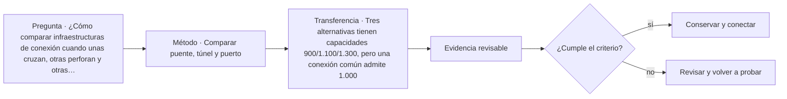

# ARQ-675 · Comparar puente, túnel y puerto

**Parte 68 · Clase desarrollada · Edición definitiva v1.0.**

Material educativo con casos ficticios. No constituye proyecto ejecutable, cálculo firmado, instrucción de trabajo peligroso, informe pericial, permiso ni habilitación profesional. Las cifras se emplean para aprender a razonar y conservan las fronteras declaradas.

## Pregunta central

¿Cómo comparar infraestructuras de conexión cuando unas cruzan, otras perforan y otras transfieren entre tierra y agua?

## Resultado de aprendizaje y continuidad

Relacionarás servicio, terreno, agua, construcción, inspección y continuidad en tres familias de infraestructura. La clase conserva los métodos construidos en las partes anteriores y no hereda parámetros numéricos de otros casos salvo indicación explícita.

## 1. Conectar mediante condiciones distintas

El puente salva una discontinuidad por encima; el túnel la atraviesa; el puerto organiza transferencia entre medios. Cada solución modifica paisaje, geotecnia, agua y mantenimiento de manera diferente. No existe una tipología universalmente superior.

## 2. Lo visible y lo oculto

En puentes gran parte de la estructura puede inspeccionarse directamente; túneles y puertos contienen elementos enterrados, sumergidos o de difícil acceso. La estrategia de inspección depende de accesibilidad y ambiente.

## 3. Agua como acción y medio

Un puente puede enfrentar socavación; un túnel, presión e infiltración; un puerto, mareas, oleaje y corrosión. Usar “agua” como una sola carga pierde mecanismos y fronteras.

## 4. Construcción y continuidad

Desvíos de tráfico, excavación, montaje y operaciones portuarias deben planificarse con estados temporales. Una solución final correcta puede ser inviable si su secuencia interrumpe un servicio crítico sin alternativa.

## 5. Ciclo de vida e inspección

FHWA trata inspección como parte continua de puentes y túneles. Puertos también requieren conservación de pavimentos, defensas, muelles y equipos. El costo de acceso y parada debe entrar a la comparación.

## Caso trabajado

COMP-675 usa una demanda de transporte ficticia de 1.200 unidades/h. Puente A tiene capacidad nominal 1.500, túnel B 1.400 y transferencia portuaria C 1.600. Si una etapa común aguas arriba limita a 1.000 unidades/h, ninguna alternativa entrega más de 1.000 en el sistema completo. La capacidad local mayor no elimina un cuello compartido.

## Método de revisión y límites

Reconstruye el caso desde su frontera: identifica objetos, personas, intervalos y estados incluidos. Comprueba unidades y signos, vuelve a obtener el resultado por equilibrio, balance o relación independiente cuando sea posible y escribe dos frases: una que el cálculo realmente respalda y otra que excedería la evidencia. Después identifica una interfaz con otra disciplina y el documento o profesional que debería aportar la información faltante. Esta secuencia evita que una operación correcta se convierta en una conclusión demasiado amplia.

En una obra real también deben revisarse jurisdicción, versiones normativas, sitio, productos, ensayos, operación y cambios. Una fuente internacional puede explicar un mecanismo sin ser exigencia chilena. Un valor de catálogo puede describir un componente sin representar su configuración instalada. Si la evidencia no existe, el estado correcto es pendiente.

## Errores frecuentes

Evita comparar métricas con denominadores distintos, sumar máximos de estados incompatibles, tratar capacidad nominal como servicio efectivo, usar un promedio para ocultar una región crítica o copiar dimensiones de otro proyecto porque su tipología se parece. Distingue geometría, demanda, capacidad y autorización. Cuando una modificación resuelve una interfaz, revisa qué otras dependencias puede haber alterado.

## Práctica independiente

Tres alternativas tienen capacidades 900/1.100/1.300, pero una conexión común admite 1.000. Determina capacidad de sistema para cada una.

Solución razonada

A=900; B=1.000; C=1.000 unidades/h bajo el modelo. B y C quedan limitadas por la conexión común. Faltan confiabilidad, mantenimiento, geometría y demanda temporal.

La solución pertenece al modelo declarado. No reemplaza revisión profesional ni permite extrapolar capacidades, distancias seguras, aforos, procedimientos de mantenimiento o cumplimiento reglamentario a una obra real.

## Autoevaluación y transferencia

Puedes avanzar cuando reconstruyes el caso sin mirar la respuesta, distingues dato, hipótesis y evidencia, y señalas al menos una decisión que debe reabrirse si cambia una condición. **ARQ-676** continúa el recorrido.

<!-- pedagogia-2026:inicio -->
## Mapa visual de aprendizaje

El diagrama representa el ciclo de aprendizaje de esta clase, no una secuencia de obra ni un procedimiento profesional.

## Resultado observable, evidencia y evaluación

**Tipo de clase:** proyectual.

**Evidencia mínima:** lámina o expediente con alternativas, representación pertinente, decisión argumentada, revisión y asuntos pendientes.

**Archivo sugerido:** `evidence/ARQ-675/evidencia.md`.

| Criterio | Evidencia observable |
|---|---|
| Precisión y representación · 20 % | Los conceptos, unidades y convenciones se usan de forma coherente y pueden ser reconstruidos por otra persona. |
| Evidencia y trazabilidad · 25 % | Cada afirmación importante se vincula con dato, cálculo, observación o fuente; hipótesis y desconocidos permanecen visibles. |
| Decisión y alternativas · 25 % | La decisión responde a la pregunta, compara al menos una alternativa y declara qué condición la haría cambiar. |
| Integración y ciclo de vida · 20 % | Se identifica una interfaz y una consecuencia para construcción, uso, mantenimiento, adaptación o fin de vida. |
| Comunicación, ética y límites · 10 % | El alcance se entiende sin explicación oral adicional y no se atribuyen permisos, competencias o certezas inexistentes. |

**Criterio de aceptación:** 80/100 y ningún criterio bajo 60 %. Una entrega genérica que podría reutilizarse sin cambios en otra clase no demuestra dominio. Si existe una condición crítica de seguridad, accesibilidad, evidencia o responsabilidad sin resolver, la entrega permanece pendiente aunque el promedio supere 80.

### Errores diagnósticos

En esta clase conviene vigilar especialmente: comparar alternativas con alcances distintos; defender la imagen antes que el servicio; borrar las huellas de la revisión.

## Autoevaluación, recuperación y continuidad

Antes de avanzar, responde sin consultar la solución:

1. ¿Qué decisión concreta puedes tomar ahora que no podías justificar antes?
2. ¿Qué evidencia de tu entrega es comprobada y cuál continúa siendo una hipótesis?
3. ¿Qué cambio de contexto invalidaría la transferencia realizada?

Revisa la entrega a las 24–48 horas y nuevamente al cerrar la parte. Conserva la primera versión, la crítica recibida y la versión revisada: el aprendizaje se demuestra también mediante el cambio entre versiones.
<!-- pedagogia-2026:fin -->

## Fuentes y alcance de uso

- **[FHWA-BRIDGE] Bridges & Structures / Bridge Inspection** — Federal Highway Administration. https://www.fhwa.dot.gov/bridge/inspection/

Uso y límite: Apoyo para ciclo de vida, inspección, conservación y gestión de puentes. No sustituye especificaciones de un puente real.

- **[BOEM-OFF] Design/Construction of Fixed Bottom Turbines** — Bureau of Ocean Energy Management. https://www.boem.gov/renewable-energy/studies/designconstruction-fixed-bottom-turbines

Uso y límite: Apoyo conceptual sobre acciones, cimentaciones, fatiga, vibraciones, socavación y construcción offshore. No autoriza instalaciones ni define el caso docente.

- **[UNDRR-CL] Hoja de Ruta para la Resiliencia de la Infraestructura en la República de Chile** — UNDRR / CDRI / Chile. https://www.undrr.org/es/publication/hoja-de-ruta-para-la-resiliencia-de-la-infraestructura-en-la-republica-de-chile

Uso y límite: Apoyo para pensar infraestructura como sistema de servicios y dependencias, con gobernanza y resiliencia. No es diseño de detalle.
