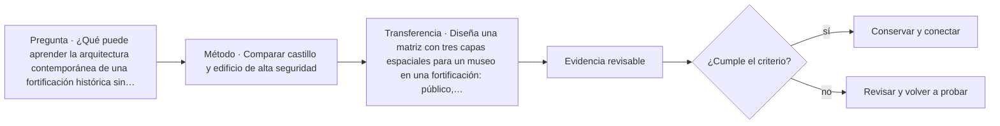

# ARQ-676 · Comparar castillo y edificio de alta seguridad

**Parte 68 · Clase desarrollada · Edición definitiva v1.0.**

Material educativo con casos ficticios. No constituye proyecto ejecutable, cálculo firmado, instrucción de trabajo peligroso, informe pericial, permiso ni habilitación profesional. Las cifras se emplean para aprender a razonar y conservan las fronteras declaradas.

## Pregunta central

¿Qué puede aprender la arquitectura contemporánea de una fortificación histórica sin convertir su lógica defensiva en instrucciones de seguridad explotables?

## Resultado de aprendizaje y continuidad

Compararás capas espaciales, control, habitabilidad, dignidad y adaptación patrimonial desde un nivel arquitectónico no operativo. La clase conserva los métodos construidos en las partes anteriores y no hereda parámetros numéricos de otros casos salvo indicación explícita.

## 1. Defensa histórica y seguridad contemporánea no son equivalentes

Un castillo organizaba territorio, acceso, residencia, almacenamiento y defensa según tecnologías y conflictos de su tiempo. Un edificio contemporáneo de alta seguridad integra derechos, procedimientos, tecnología y supervisión institucional. Copiar murallas o recorridos no transfiere automáticamente seguridad.

## 2. Capas y transiciones

Ambas tipologías pueden usar secuencias de acceso, pero la función y ética cambian. La arquitectura debe distinguir público, controlado, privado y técnico sin describir vulnerabilidades ni métodos para eludir controles.

## 3. Habitabilidad y dignidad

La seguridad no elimina luz, aire, accesibilidad, orientación, descanso y trabajo. En rehabilitación patrimonial, además, valores históricos pueden entrar en conflicto con nuevas instalaciones. El proyecto debe explicitar la tensión y buscar alternativas compatibles.

## 4. Evidencia y amenaza

Una pared gruesa puede ser evidencia histórica; no es certificación de seguridad actual. Un sistema electrónico puede gestionar acceso; no sustituye estructura o operación. Cada amenaza requiere un marco definido por responsables competentes.

## 5. Reutilización responsable

Muchos castillos se convierten en museos, hoteles o centros culturales. La adaptación debe separar lectura histórica de nuevas capas. Un uso de alta seguridad en un edificio patrimonial tendría requisitos específicos que no se deducen por analogía.

## Caso trabajado

COMP-676 compara dos secuencias espaciales únicamente por número de transiciones: castillo ficticio A tiene 4; edificio contemporáneo B tiene 6. No se concluye que B sea “50 % más seguro”. El conteo no incluye calidad de control, redundancia, operación, visibilidad, fallas ni efectos sobre personas. La métrica sirve solo para describir complejidad de recorrido.

## Método de revisión y límites

Reconstruye el caso desde su frontera: identifica objetos, personas, intervalos y estados incluidos. Comprueba unidades y signos, vuelve a obtener el resultado por equilibrio, balance o relación independiente cuando sea posible y escribe dos frases: una que el cálculo realmente respalda y otra que excedería la evidencia. Después identifica una interfaz con otra disciplina y el documento o profesional que debería aportar la información faltante. Esta secuencia evita que una operación correcta se convierta en una conclusión demasiado amplia.

En una obra real también deben revisarse jurisdicción, versiones normativas, sitio, productos, ensayos, operación y cambios. Una fuente internacional puede explicar un mecanismo sin ser exigencia chilena. Un valor de catálogo puede describir un componente sin representar su configuración instalada. Si la evidencia no existe, el estado correcto es pendiente.

## Errores frecuentes

Evita comparar métricas con denominadores distintos, sumar máximos de estados incompatibles, tratar capacidad nominal como servicio efectivo, usar un promedio para ocultar una región crítica o copiar dimensiones de otro proyecto porque su tipología se parece. Distingue geometría, demanda, capacidad y autorización. Cuando una modificación resuelve una interfaz, revisa qué otras dependencias puede haber alterado.

## Práctica independiente

Diseña una matriz con tres capas espaciales para un museo en una fortificación: público, colección y técnico. Indica una interfaz y una pregunta de evidencia para cada transición.

Solución razonada

Ejemplo: público-colección: control de acceso y conservación; colección-técnico: logística y mantenimiento; público-técnico: separación operacional. La matriz no evalúa seguridad contra amenazas concretas.

La solución pertenece al modelo declarado. No reemplaza revisión profesional ni permite extrapolar capacidades, distancias seguras, aforos, procedimientos de mantenimiento o cumplimiento reglamentario a una obra real.

## Autoevaluación y transferencia

Puedes avanzar cuando reconstruyes el caso sin mirar la respuesta, distingues dato, hipótesis y evidencia, y señalas al menos una decisión que debe reabrirse si cambia una condición. **ARQ-677** continúa el recorrido.

<!-- pedagogia-2026:inicio -->
## Mapa visual de aprendizaje

El diagrama representa el ciclo de aprendizaje de esta clase, no una secuencia de obra ni un procedimiento profesional.

## Resultado observable, evidencia y evaluación

**Tipo de clase:** proyectual.

**Evidencia mínima:** lámina o expediente con alternativas, representación pertinente, decisión argumentada, revisión y asuntos pendientes.

**Archivo sugerido:** `evidence/ARQ-676/evidencia.md`.

| Criterio | Evidencia observable |
|---|---|
| Precisión y representación · 20 % | Los conceptos, unidades y convenciones se usan de forma coherente y pueden ser reconstruidos por otra persona. |
| Evidencia y trazabilidad · 25 % | Cada afirmación importante se vincula con dato, cálculo, observación o fuente; hipótesis y desconocidos permanecen visibles. |
| Decisión y alternativas · 25 % | La decisión responde a la pregunta, compara al menos una alternativa y declara qué condición la haría cambiar. |
| Integración y ciclo de vida · 20 % | Se identifica una interfaz y una consecuencia para construcción, uso, mantenimiento, adaptación o fin de vida. |
| Comunicación, ética y límites · 10 % | El alcance se entiende sin explicación oral adicional y no se atribuyen permisos, competencias o certezas inexistentes. |

**Criterio de aceptación:** 80/100 y ningún criterio bajo 60 %. Una entrega genérica que podría reutilizarse sin cambios en otra clase no demuestra dominio. Si existe una condición crítica de seguridad, accesibilidad, evidencia o responsabilidad sin resolver, la entrega permanece pendiente aunque el promedio supere 80.

### Errores diagnósticos

En esta clase conviene vigilar especialmente: comparar alternativas con alcances distintos; defender la imagen antes que el servicio; borrar las huellas de la revisión.

## Autoevaluación, recuperación y continuidad

Antes de avanzar, responde sin consultar la solución:

1. ¿Qué decisión concreta puedes tomar ahora que no podías justificar antes?
2. ¿Qué evidencia de tu entrega es comprobada y cuál continúa siendo una hipótesis?
3. ¿Qué cambio de contexto invalidaría la transferencia realizada?

Revisa la entrega a las 24–48 horas y nuevamente al cerrar la parte. Conserva la primera versión, la crítica recibida y la versión revisada: el aprendizaje se demuestra también mediante el cambio entre versiones.
<!-- pedagogia-2026:fin -->

## Fuentes y alcance de uso

- **[UNESCO] World Heritage and sustainable management resources** — UNESCO World Heritage Centre. https://whc.unesco.org/

Uso y límite: Referencia patrimonial general. La conservación de una obra real requiere fuentes específicas del bien y autoridades competentes.

- **[ISO21542] ISO 21542:2021 - Accessibility and usability of the built environment** — ISO. https://www.iso.org/standard/71860.html

Uso y límite: Ficha pública sobre accesibilidad y usabilidad. No sustituye OGUC ni normativa local.

- **[UNDRR-CL] Hoja de Ruta para la Resiliencia de la Infraestructura en la República de Chile** — UNDRR / CDRI / Chile. https://www.undrr.org/es/publication/hoja-de-ruta-para-la-resiliencia-de-la-infraestructura-en-la-republica-de-chile

Uso y límite: Apoyo para pensar infraestructura como sistema de servicios y dependencias, con gobernanza y resiliencia. No es diseño de detalle.
