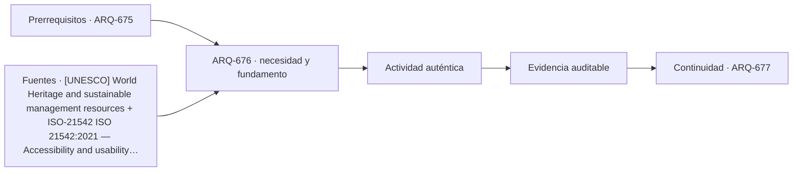

# ARQ-676 · Comparar castillo y edificio de alta seguridad

**Parte 68 · Clase desarrollada · Edición definitiva v1.0.**

Material educativo con casos ficticios. No constituye proyecto ejecutable, cálculo firmado, instrucción de trabajo peligroso, informe pericial, permiso ni habilitación profesional. Las cifras se emplean para aprender a razonar y conservan las fronteras declaradas.

## Pregunta central

¿Qué puede aprender la arquitectura contemporánea de una fortificación histórica sin convertir su lógica defensiva en instrucciones de seguridad explotables?

## Resultado de aprendizaje y continuidad

Compararás capas espaciales, control, habitabilidad, dignidad y adaptación patrimonial desde un nivel arquitectónico no operativo. La clase conserva los métodos construidos en las partes anteriores y no hereda parámetros numéricos de otros casos salvo indicación explícita.

## 1. Defensa histórica y seguridad contemporánea no son equivalentes

Un castillo organizaba territorio, acceso, residencia, almacenamiento y defensa según tecnologías y conflictos de su tiempo. Un edificio contemporáneo de alta seguridad integra derechos, procedimientos, tecnología y supervisión institucional. Copiar murallas o recorridos no transfiere automáticamente seguridad.

## 2. Capas y transiciones

Ambas tipologías pueden usar secuencias de acceso, pero la función y ética cambian. La arquitectura debe distinguir público, controlado, privado y técnico sin describir vulnerabilidades ni métodos para eludir controles.

## 3. Habitabilidad y dignidad

La seguridad no elimina luz, aire, accesibilidad, orientación, descanso y trabajo. En rehabilitación patrimonial, además, valores históricos pueden entrar en conflicto con nuevas instalaciones. El proyecto debe explicitar la tensión y buscar alternativas compatibles.

## 4. Evidencia y amenaza

Una pared gruesa puede ser evidencia histórica; no es certificación de seguridad actual. Un sistema electrónico puede gestionar acceso; no sustituye estructura o operación. Cada amenaza requiere un marco definido por responsables competentes.

## 5. Reutilización responsable

Muchos castillos se convierten en museos, hoteles o centros culturales. La adaptación debe separar lectura histórica de nuevas capas. Un uso de alta seguridad en un edificio patrimonial tendría requisitos específicos que no se deducen por analogía.

## Caso trabajado

COMP-676 compara dos secuencias espaciales únicamente por número de transiciones: castillo ficticio A tiene 4; edificio contemporáneo B tiene 6. No se concluye que B sea “50 % más seguro”. El conteo no incluye calidad de control, redundancia, operación, visibilidad, fallas ni efectos sobre personas. La métrica sirve solo para describir complejidad de recorrido.

## Método de revisión y límites

Reconstruye el caso desde su frontera: identifica objetos, personas, intervalos y estados incluidos. Comprueba unidades y signos, vuelve a obtener el resultado por equilibrio, balance o relación independiente cuando sea posible y escribe dos frases: una que el cálculo realmente respalda y otra que excedería la evidencia. Después identifica una interfaz con otra disciplina y el documento o profesional que debería aportar la información faltante. Esta secuencia evita que una operación correcta se convierta en una conclusión demasiado amplia.

En una obra real también deben revisarse jurisdicción, versiones normativas, sitio, productos, ensayos, operación y cambios. Una fuente internacional puede explicar un mecanismo sin ser exigencia chilena. Un valor de catálogo puede describir un componente sin representar su configuración instalada. Si la evidencia no existe, el estado correcto es pendiente.

## Errores frecuentes

Evita comparar métricas con denominadores distintos, sumar máximos de estados incompatibles, tratar capacidad nominal como servicio efectivo, usar un promedio para ocultar una región crítica o copiar dimensiones de otro proyecto porque su tipología se parece. Distingue geometría, demanda, capacidad y autorización. Cuando una modificación resuelve una interfaz, revisa qué otras dependencias puede haber alterado.

## Práctica independiente

Diseña una matriz con tres capas espaciales para un museo en una fortificación: público, colección y técnico. Indica una interfaz y una pregunta de evidencia para cada transición.

Solución razonada

Ejemplo: público-colección: control de acceso y conservación; colección-técnico: logística y mantenimiento; público-técnico: separación operacional. La matriz no evalúa seguridad contra amenazas concretas.

La solución pertenece al modelo declarado. No reemplaza revisión profesional ni permite extrapolar capacidades, distancias seguras, aforos, procedimientos de mantenimiento o cumplimiento reglamentario a una obra real.

## Autoevaluación y transferencia

Puedes avanzar cuando reconstruyes el caso sin mirar la respuesta, distingues dato, hipótesis y evidencia, y señalas al menos una decisión que debe reabrirse si cambia una condición. **ARQ-677** continúa el recorrido.

<!-- pedagogia-2026:inicio -->
## Decisión pedagógica y posición curricular

### Por qué existe

Esta clase existe para resolver una necesidad concreta del recorrido: ¿Qué puede aprender la arquitectura contemporánea de una fortificación histórica sin convertir su lógica defensiva en instrucciones de seguridad explotables?

### Por qué está exactamente aquí

Ocupa el lugar 6 de la Parte 68. Se estudia después de ARQ-675 · Comparar puente, túnel y puerto porque usa esa base para responder «¿Qué puede aprender la arquitectura contemporánea de una fortificación histórica sin convertir su lógica defensiva en instrucciones de seguridad explotables?». Se ubica antes de ARQ-677 · Comparar escuela, hotel y residencia porque la evidencia producida aquí debe estar disponible para ese paso.

- **Prerrequisitos:** `ARQ-675`
- **Capacidad que introduce:** Compararás capas espaciales, control, habitabilidad, dignidad y adaptación patrimonial desde un nivel arquitectónico no operativo. La clase conserva los métodos construidos en las partes anteriores y no hereda parámetros numéricos de otros casos salvo indicación explícita.
- **Clases o experiencias que dependen de ella:** `ARQ-677`

El diagrama permite comprobar una relación que el texto lineal oculta con facilidad: esta clase recibe capacidades previas, toma decisiones apoyadas por fuentes, exige una experiencia y produce evidencia que habilita trabajo posterior. No representa un procedimiento de obra.

## Resultado observable, evidencia y evaluación

1. Identificar y delimitar las condiciones necesarias para responder la pregunta central de comparar castillo y edificio de alta seguridad.
2. Producir y comprobar la evidencia declarada por la clase: Compararás capas espaciales, control, habitabilidad, dignidad y adaptación patrimonial desde un nivel arquitectónico no operativo. La clase conserva los métodos construidos en las partes anteriores y no hereda parámetros numéricos de otros casos salvo indicación explícita.
3. Justificar una decisión de comparar castillo y edificio de alta seguridad mediante fuentes, supuestos, alternativas y límites explícitos.

## Actividad, evidencia y criterio de aceptación

**Actividad:** Diseña una matriz con tres capas espaciales para un museo en una fortificación: público, colección y técnico. Indica una interfaz y una pregunta de evidencia para cada transición.

**Evidencia mínima:** Compararás capas espaciales, control, habitabilidad, dignidad y adaptación patrimonial desde un nivel arquitectónico no operativo. La clase conserva los métodos construidos en las partes anteriores y no hereda parámetros numéricos de otros casos salvo indicación explícita.

**Archivo sugerido:** `evidence/ARQ-676/evidencia.md`.

**Criterio de aceptación:** la entrega se acepta cuando:

- La entrega responde explícitamente a la pregunta: ¿Qué puede aprender la arquitectura contemporánea de una fortificación histórica sin convertir su lógica defensiva en instrucciones de seguridad explotables?
- La actividad conserva las fronteras del caso y permite reconstruir el procedimiento: Diseña una matriz con tres capas espaciales para un museo en una fortificación: público, colección y técnico. Indica una interfaz y una pregunta de evidencia para cada transición.
- Cada afirmación externa puede seguirse hasta una fuente, su alcance consultado y su límite.
- La evidencia deja disponible una entrada comprobable para ARQ-677.
- Evita comparar métricas con denominadores distintos, sumar máximos de estados incompatibles, tratar capacidad nominal como servicio efectivo, usar un promedio para ocultar una región crítica o copiar dimensiones de otro proyecto porque su tipología se parece. Distingue geometría, demanda, capacidad y autorización.

La [rúbrica común](../../docs/RUBRICA_COMUN.md) complementa estos criterios; no los reemplaza. Una entrega puede superar un promedio y continuar pendiente si oculta una condición crítica.

## Trazabilidad de las decisiones

| # | Decisión o fundamento | Fuente utilizada | Aplicación y límite en esta clase |
|---:|---|---|---|
| 1 | Referencia patrimonial general. La conservación de una obra real requiere fuentes específicas del bien y autoridades competentes. | [[UNESCO] World Heritage and sustainable management resources](https://whc.unesco.org/) | Consulta: Alcance consultado no documentado; debe completarse antes de ampliar la conclusión. Límite: Referencia patrimonial general. La conservación de una obra real requiere fuentes específicas del bien y autoridades competentes. |
| 2 | Ficha pública sobre accesibilidad y usabilidad. No sustituye OGUC ni normativa local. | [ISO-21542 ISO 21542:2021 — Accessibility and usability of the built…](https://www.iso.org/standard/71860.html) | Consulta: Alcance consultado no documentado; debe completarse antes de ampliar la conclusión. Límite: Ficha pública sobre accesibilidad y usabilidad. No sustituye OGUC ni normativa local. |
| 3 | Apoyo para pensar infraestructura como sistema de servicios y dependencias, con gobernanza y resiliencia. No es diseño de detalle. | [[UNDRR-CL] Hoja de Ruta para la Resiliencia de la Infraestructura en…](https://www.undrr.org/es/publication/hoja-de-ruta-para-la-resiliencia-de-la-infraestructura-en-la-republica-de-chile) | Consulta: Alcance consultado no documentado; debe completarse antes de ampliar la conclusión. Límite: Apoyo para pensar infraestructura como sistema de servicios y dependencias, con gobernanza y resiliencia. No es diseño de detalle. |

La tabla permite auditar las relaciones; la explicación, el caso y la práctica de la clase siguen siendo la documentación principal.

## Autoevaluación, recuperación y continuidad

### Errores diagnósticos

Antes de avanzar, comprueba si puedes reconstruir cada resultado sin mirar la solución, señalar qué evidencia lo sostiene y nombrar una condición que obligaría a revisar tu decisión. Conserva la primera versión, la objeción recibida y la revisión.

**Conexión siguiente:** La continuidad inmediata es ARQ-677 · Comparar escuela, hotel y residencia; conserva el método y vuelve a verificar datos y límites.
<!-- pedagogia-2026:fin -->

## Fuentes y alcance de uso

- **[UNESCO] World Heritage and sustainable management resources** — UNESCO World Heritage Centre. https://whc.unesco.org/

Uso y límite: Referencia patrimonial general. La conservación de una obra real requiere fuentes específicas del bien y autoridades competentes.

- **[ISO21542] ISO 21542:2021 - Accessibility and usability of the built environment** — ISO. https://www.iso.org/standard/71860.html

Uso y límite: Ficha pública sobre accesibilidad y usabilidad. No sustituye OGUC ni normativa local.

- **[UNDRR-CL] Hoja de Ruta para la Resiliencia de la Infraestructura en la República de Chile** — UNDRR / CDRI / Chile. https://www.undrr.org/es/publication/hoja-de-ruta-para-la-resiliencia-de-la-infraestructura-en-la-republica-de-chile

Uso y límite: Apoyo para pensar infraestructura como sistema de servicios y dependencias, con gobernanza y resiliencia. No es diseño de detalle.
