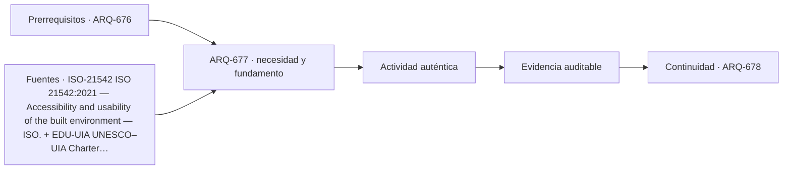

# ARQ-677 · Comparar escuela, hotel y residencia

**Parte 68 · Clase desarrollada · Edición definitiva v1.0.**

Material educativo con casos ficticios. No constituye proyecto ejecutable, cálculo firmado, instrucción de trabajo peligroso, informe pericial, permiso ni habilitación profesional. Las cifras se emplean para aprender a razonar y conservan las fronteras declaradas.

## Pregunta central

¿Cómo distinguir tres tipologías de estancia cuando todas contienen habitaciones, servicios compartidos y rutinas cotidianas?

## Resultado de aprendizaje y continuidad

Compararás duración, propiedad, cuidado, horarios y servicios compartidos sin reducir edificios a dormitorios y pasillos. La clase conserva los métodos construidos en las partes anteriores y no hereda parámetros numéricos de otros casos salvo indicación explícita.

## 1. Permanecer no significa habitar de la misma forma

La escuela organiza aprendizaje y comunidad; el hotel, estadías temporales y servicio; la residencia, vida cotidiana. Los patrones de privacidad, pertenencia, almacenamiento y apropiación cambian. Una habitación de hotel no es un dormitorio doméstico trasladable.

## 2. Horarios y simultaneidad

La escuela concentra cambios de clase; el hotel tiene llegadas escalonadas y picos de desayuno; la residencia combina rutinas distribuidas. El espacio común debe dimensionarse y operarse desde series temporales, no solo población total.

## 3. Servicios y back-of-house

Cocinas, limpieza, lavandería, residuos, mantenimiento y personal cambian según tipología. En hotel son parte intensa de la operación; en escuela pueden concentrarse por horarios; en residencia pueden descentralizarse. El diseño visible depende de estos sistemas menos visibles.

## 4. Accesibilidad y apoyo

Personas pueden necesitar orientación, cuidado o asistencia de maneras distintas. La cadena accesible debe cubrir la actividad real, no un recinto nominalmente accesible. Un alojamiento accesible también debe coordinar reserva, llegada y uso.

## 5. Flexibilidad y apropiación

Escuelas y residencias suelen requerir cambios a largo plazo; hoteles cambian marca y operación. Flexibilidad debe identificar qué puede cambiar, con qué costo y qué infraestructura permanece.

## Caso trabajado

COMP-677 tiene 120 usuarios y un comedor de 90 plazas. Si todos necesitan comer en una sola franja, faltan 30 plazas. Si se organizan dos turnos iguales, la demanda por turno es 60 y sobran 30 plazas, pero la duración total del servicio aumenta. El ejemplo muestra que capacidad y programación son variables conectadas.

## Método de revisión y límites

Reconstruye el caso desde su frontera: identifica objetos, personas, intervalos y estados incluidos. Comprueba unidades y signos, vuelve a obtener el resultado por equilibrio, balance o relación independiente cuando sea posible y escribe dos frases: una que el cálculo realmente respalda y otra que excedería la evidencia. Después identifica una interfaz con otra disciplina y el documento o profesional que debería aportar la información faltante. Esta secuencia evita que una operación correcta se convierta en una conclusión demasiado amplia.

En una obra real también deben revisarse jurisdicción, versiones normativas, sitio, productos, ensayos, operación y cambios. Una fuente internacional puede explicar un mecanismo sin ser exigencia chilena. Un valor de catálogo puede describir un componente sin representar su configuración instalada. Si la evidencia no existe, el estado correcto es pendiente.

## Errores frecuentes

Evita comparar métricas con denominadores distintos, sumar máximos de estados incompatibles, tratar capacidad nominal como servicio efectivo, usar un promedio para ocultar una región crítica o copiar dimensiones de otro proyecto porque su tipología se parece. Distingue geometría, demanda, capacidad y autorización. Cuando una modificación resuelve una interfaz, revisa qué otras dependencias puede haber alterado.

## Práctica independiente

180 usuarios, comedor 100 plazas. Compara un turno y dos turnos de 90. Indica qué otras condiciones deben comprobarse.

Solución razonada

Un turno: déficit 80. Dos turnos de 90: capacidad suficiente con 10 plazas libres por turno. Deben comprobarse tiempo, cocina, limpieza, circulación, horarios y equivalencia del servicio.

La solución pertenece al modelo declarado. No reemplaza revisión profesional ni permite extrapolar capacidades, distancias seguras, aforos, procedimientos de mantenimiento o cumplimiento reglamentario a una obra real.

## Autoevaluación y transferencia

Puedes avanzar cuando reconstruyes el caso sin mirar la respuesta, distingues dato, hipótesis y evidencia, y señalas al menos una decisión que debe reabrirse si cambia una condición. **ARQ-678** continúa el recorrido.

<!-- pedagogia-2026:inicio -->
## Decisión pedagógica y posición curricular

### Por qué existe

Esta clase existe para resolver una necesidad concreta del recorrido: ¿Cómo distinguir tres tipologías de estancia cuando todas contienen habitaciones, servicios compartidos y rutinas cotidianas?

### Por qué está exactamente aquí

Ocupa el lugar 7 de la Parte 68. Se estudia después de ARQ-676 · Comparar castillo y edificio de alta seguridad porque usa esa base para responder «¿Cómo distinguir tres tipologías de estancia cuando todas contienen habitaciones, servicios compartidos y rutinas cotidianas?». Se ubica antes de ARQ-678 · Comparar fábrica y laboratorio porque la evidencia producida aquí debe estar disponible para ese paso.

- **Prerrequisitos:** `ARQ-676`
- **Capacidad que introduce:** Compararás duración, propiedad, cuidado, horarios y servicios compartidos sin reducir edificios a dormitorios y pasillos. La clase conserva los métodos construidos en las partes anteriores y no hereda parámetros numéricos de otros casos salvo indicación explícita.
- **Clases o experiencias que dependen de ella:** `ARQ-678`

El diagrama permite comprobar una relación que el texto lineal oculta con facilidad: esta clase recibe capacidades previas, toma decisiones apoyadas por fuentes, exige una experiencia y produce evidencia que habilita trabajo posterior. No representa un procedimiento de obra.

## Resultado observable, evidencia y evaluación

1. Identificar y delimitar las condiciones necesarias para responder la pregunta central de comparar escuela, hotel y residencia.
2. Producir y comprobar la evidencia declarada por la clase: Compararás duración, propiedad, cuidado, horarios y servicios compartidos sin reducir edificios a dormitorios y pasillos. La clase conserva los métodos construidos en las partes anteriores y no hereda parámetros numéricos de otros casos salvo indicación explícita.
3. Justificar una decisión de comparar escuela, hotel y residencia mediante fuentes, supuestos, alternativas y límites explícitos.

## Actividad, evidencia y criterio de aceptación

**Actividad:** 180 usuarios, comedor 100 plazas. Compara un turno y dos turnos de 90. Indica qué otras condiciones deben comprobarse.

**Evidencia mínima:** Compararás duración, propiedad, cuidado, horarios y servicios compartidos sin reducir edificios a dormitorios y pasillos. La clase conserva los métodos construidos en las partes anteriores y no hereda parámetros numéricos de otros casos salvo indicación explícita.

**Archivo sugerido:** `evidence/ARQ-677/evidencia.md`.

**Criterio de aceptación:** la entrega se acepta cuando:

- La entrega responde explícitamente a la pregunta: ¿Cómo distinguir tres tipologías de estancia cuando todas contienen habitaciones, servicios compartidos y rutinas cotidianas?
- La actividad conserva las fronteras del caso y permite reconstruir el procedimiento: 180 usuarios, comedor 100 plazas. Compara un turno y dos turnos de 90. Indica qué otras condiciones deben comprobarse.
- Cada afirmación externa puede seguirse hasta una fuente, su alcance consultado y su límite.
- La evidencia deja disponible una entrada comprobable para ARQ-678.
- Evita comparar métricas con denominadores distintos, sumar máximos de estados incompatibles, tratar capacidad nominal como servicio efectivo, usar un promedio para ocultar una región crítica o copiar dimensiones de otro proyecto porque su tipología se parece. Distingue geometría, demanda, capacidad y autorización.

La [rúbrica común](../../docs/RUBRICA_COMUN.md) complementa estos criterios; no los reemplaza. Una entrega puede superar un promedio y continuar pendiente si oculta una condición crítica.

## Trazabilidad de las decisiones

| # | Decisión o fundamento | Fuente utilizada | Aplicación y límite en esta clase |
|---:|---|---|---|
| 1 | Ficha pública sobre accesibilidad y usabilidad. No sustituye OGUC ni normativa local. | [ISO-21542 ISO 21542:2021 — Accessibility and usability of the built…](https://www.iso.org/standard/71860.html) | Consulta: Alcance consultado no documentado; debe completarse antes de ampliar la conclusión. Límite: Ficha pública sobre accesibilidad y usabilidad. No sustituye OGUC ni normativa local. |
| 2 | Marco de formación arquitectónica integral. No acredita este programa ni sustituye habilitación profesional. | [EDU-UIA UNESCO–UIA Charter for Architectural Education, revisión 2026](https://www.uia-architectes.org/en/news/unesco-uia-charter-for-architectural-education-revised-edition-2026/) | Consulta: Alcance consultado no documentado; debe completarse antes de ampliar la conclusión. Límite: Marco de formación arquitectónica integral. No acredita este programa ni sustituye habilitación profesional. |

La tabla permite auditar las relaciones; la explicación, el caso y la práctica de la clase siguen siendo la documentación principal.

## Autoevaluación, recuperación y continuidad

### Errores diagnósticos

Antes de avanzar, comprueba si puedes reconstruir cada resultado sin mirar la solución, señalar qué evidencia lo sostiene y nombrar una condición que obligaría a revisar tu decisión. Conserva la primera versión, la objeción recibida y la revisión.

**Conexión siguiente:** La continuidad inmediata es ARQ-678 · Comparar fábrica y laboratorio; conserva el método y vuelve a verificar datos y límites.
<!-- pedagogia-2026:fin -->

## Fuentes y alcance de uso

- **[ISO21542] ISO 21542:2021 - Accessibility and usability of the built environment** — ISO. https://www.iso.org/standard/71860.html

Uso y límite: Ficha pública sobre accesibilidad y usabilidad. No sustituye OGUC ni normativa local.

- **[UIA] UNESCO–UIA Charter for Architectural Education, revisión 2026** — Unión Internacional de Arquitectos. https://www.uia-architectes.org/en/news/unesco-uia-charter-for-architectural-education-revised-edition-2026/

Uso y límite: Marco de formación arquitectónica integral. No acredita este programa ni sustituye habilitación profesional.
