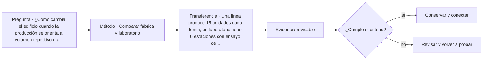

# ARQ-678 · Comparar fábrica y laboratorio

**Parte 68 · Clase desarrollada · Edición definitiva v1.0.**

Material educativo con casos ficticios. No constituye proyecto ejecutable, cálculo firmado, instrucción de trabajo peligroso, informe pericial, permiso ni habilitación profesional. Las cifras se emplean para aprender a razonar y conservan las fronteras declaradas.

## Pregunta central

¿Cómo cambia el edificio cuando la producción se orienta a volumen repetitivo o a experimentación controlada?

## Resultado de aprendizaje y continuidad

Distinguirás proceso, incertidumbre, equipos, seguridad, contaminación, logística y capacidad de cambio. La clase conserva los métodos construidos en las partes anteriores y no hereda parámetros numéricos de otros casos salvo indicación explícita.

## 1. Proceso conocido y proceso de investigación

Una fábrica suele organizar una secuencia productiva definida, aunque cambie con el tiempo. Un laboratorio puede trabajar con protocolos variados, equipos de alta sensibilidad y condiciones que se revisan con cada investigación. Ambos necesitan programa basado en procesos, no rótulos.

## 2. Flujos materiales y personas

Materias primas, muestras, residuos, productos, herramientas y personas tienen rutas diferentes. La separación necesaria depende del riesgo y calidad requeridos, no de una regla universal de pasillos.

## 3. Ambiente y control

Temperatura, partículas, vibración, presión, potencia o agua pueden ser parte del proceso. Un laboratorio limpio no es automáticamente un laboratorio de contención; una fábrica ventilada no satisface cualquier emisión. Cada requisito necesita fuente y método.

## 4. Escala y capacidad

La fábrica puede medir unidades por hora; el laboratorio, número de experimentos o equipos disponibles. Comparar productividad con una sola ratio puede ocultar calidad, preparación y tiempos de cambio.

## 5. Cambio tecnológico

Ambas tipologías enfrentan obsolescencia. Alturas, retículas, redes, accesos y reservas pueden permitir renovación. Diseñar espacio vacío sin interfaces no garantiza adaptabilidad.

## Caso trabajado

COMP-678 compara dos procesos. Fábrica F tarda 6 min por lote y produce 20 unidades/lote: 200 unidades/h teóricas. Laboratorio L tarda 30 min por ensayo y tiene 4 estaciones: 8 ensayos/h teóricos. Los números no permiten decir que F es 25 veces “más productiva”: las unidades de servicio no son equivalentes.

## Método de revisión y límites

Reconstruye el caso desde su frontera: identifica objetos, personas, intervalos y estados incluidos. Comprueba unidades y signos, vuelve a obtener el resultado por equilibrio, balance o relación independiente cuando sea posible y escribe dos frases: una que el cálculo realmente respalda y otra que excedería la evidencia. Después identifica una interfaz con otra disciplina y el documento o profesional que debería aportar la información faltante. Esta secuencia evita que una operación correcta se convierta en una conclusión demasiado amplia.

En una obra real también deben revisarse jurisdicción, versiones normativas, sitio, productos, ensayos, operación y cambios. Una fuente internacional puede explicar un mecanismo sin ser exigencia chilena. Un valor de catálogo puede describir un componente sin representar su configuración instalada. Si la evidencia no existe, el estado correcto es pendiente.

## Errores frecuentes

Evita comparar métricas con denominadores distintos, sumar máximos de estados incompatibles, tratar capacidad nominal como servicio efectivo, usar un promedio para ocultar una región crítica o copiar dimensiones de otro proyecto porque su tipología se parece. Distingue geometría, demanda, capacidad y autorización. Cuando una modificación resuelve una interfaz, revisa qué otras dependencias puede haber alterado.

## Práctica independiente

Una línea produce 15 unidades cada 5 min; un laboratorio tiene 6 estaciones con ensayo de 45 min. Calcula capacidades nominales y explica por qué no se comparan directamente.

Solución razonada

Línea: 180 unidades/h. Laboratorio: 8 ensayos/h. Faltan equivalencia de servicio, preparación, calidad, fallos, personal y objetivos.

La solución pertenece al modelo declarado. No reemplaza revisión profesional ni permite extrapolar capacidades, distancias seguras, aforos, procedimientos de mantenimiento o cumplimiento reglamentario a una obra real.

## Autoevaluación y transferencia

Puedes avanzar cuando reconstruyes el caso sin mirar la respuesta, distingues dato, hipótesis y evidencia, y señalas al menos una decisión que debe reabrirse si cambia una condición. **ARQ-679** continúa el recorrido.

<!-- pedagogia-2026:inicio -->
## Mapa visual de aprendizaje

El diagrama representa el ciclo de aprendizaje de esta clase, no una secuencia de obra ni un procedimiento profesional.

## Resultado observable, evidencia y evaluación

**Tipo de clase:** proyectual.

**Evidencia mínima:** lámina o expediente con alternativas, representación pertinente, decisión argumentada, revisión y asuntos pendientes.

**Archivo sugerido:** `evidence/ARQ-678/evidencia.md`.

| Criterio | Evidencia observable |
|---|---|
| Precisión y representación · 20 % | Los conceptos, unidades y convenciones se usan de forma coherente y pueden ser reconstruidos por otra persona. |
| Evidencia y trazabilidad · 25 % | Cada afirmación importante se vincula con dato, cálculo, observación o fuente; hipótesis y desconocidos permanecen visibles. |
| Decisión y alternativas · 25 % | La decisión responde a la pregunta, compara al menos una alternativa y declara qué condición la haría cambiar. |
| Integración y ciclo de vida · 20 % | Se identifica una interfaz y una consecuencia para construcción, uso, mantenimiento, adaptación o fin de vida. |
| Comunicación, ética y límites · 10 % | El alcance se entiende sin explicación oral adicional y no se atribuyen permisos, competencias o certezas inexistentes. |

**Criterio de aceptación:** 80/100 y ningún criterio bajo 60 %. Una entrega genérica que podría reutilizarse sin cambios en otra clase no demuestra dominio. Si existe una condición crítica de seguridad, accesibilidad, evidencia o responsabilidad sin resolver, la entrega permanece pendiente aunque el promedio supere 80.

### Errores diagnósticos

En esta clase conviene vigilar especialmente: comparar alternativas con alcances distintos; defender la imagen antes que el servicio; borrar las huellas de la revisión.

## Autoevaluación, recuperación y continuidad

Antes de avanzar, responde sin consultar la solución:

1. ¿Qué decisión concreta puedes tomar ahora que no podías justificar antes?
2. ¿Qué evidencia de tu entrega es comprobada y cuál continúa siendo una hipótesis?
3. ¿Qué cambio de contexto invalidaría la transferencia realizada?

Revisa la entrega a las 24–48 horas y nuevamente al cerrar la parte. Conserva la primera versión, la crítica recibida y la versión revisada: el aprendizaje se demuestra también mediante el cambio entre versiones.
<!-- pedagogia-2026:fin -->

## Fuentes y alcance de uso

- **[ISO22237] ISO/IEC 22237-1:2021 - Data centre facilities and infrastructures - General concepts** — ISO/IEC. https://www.iso.org/standard/78550.html

Uso y límite: Ficha pública sobre conceptos, disponibilidad, seguridad y eficiencia de centros de datos. No se reproduce la norma íntegra.

- **[UIA] UNESCO–UIA Charter for Architectural Education, revisión 2026** — Unión Internacional de Arquitectos. https://www.uia-architectes.org/en/news/unesco-uia-charter-for-architectural-education-revised-edition-2026/

Uso y límite: Marco de formación arquitectónica integral. No acredita este programa ni sustituye habilitación profesional.
