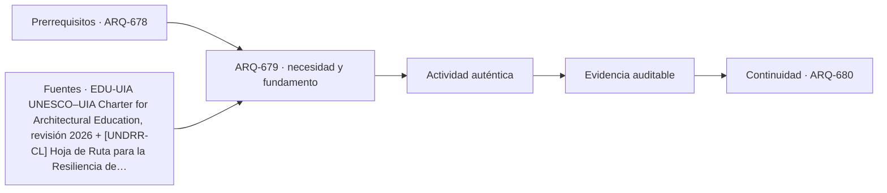

# ARQ-679 · Transferencia responsable entre tipologías

**Parte 68 · Clase desarrollada · Edición definitiva v1.0.**

Material educativo con casos ficticios. No constituye proyecto ejecutable, cálculo firmado, instrucción de trabajo peligroso, informe pericial, permiso ni habilitación profesional. Las cifras se emplean para aprender a razonar y conservan las fronteras declaradas.

## Pregunta central

¿Cómo aprender de una tipología sin copiar números, formas o soluciones cuya evidencia pertenece a otro contexto?

## Resultado de aprendizaje y continuidad

Construirás un protocolo explícito de transferencia: problema común, mecanismo, condiciones, diferencias, prueba y límites. La clase conserva los métodos construidos en las partes anteriores y no hereda parámetros numéricos de otros casos salvo indicación explícita.

## 1. Precedente no es plantilla

Un precedente puede enseñar una relación espacial, un mecanismo de mantenimiento o una estrategia de crecimiento. Copiar su planta o su dimensión sin contexto elimina precisamente lo que hace útil el aprendizaje: entender por qué funcionaba allí.

## 2. Formular el mecanismo

Antes de transferir, escribe qué mecanismo se pretende reutilizar. Ejemplos: separar flujos incompatibles, concentrar servicios, usar un espacio intermedio, permitir expansión modular. La formulación debe ser más abstracta que la forma y más concreta que un adjetivo como “flexible”.

## 3. Declarar condiciones de validez

El mecanismo depende de ocupación, clima, cultura, material, normativa, economía y operación. Si una condición cambia, la transferencia debe volver a probarse. Una fuente extranjera puede explicar el mecanismo y seguir sin ser norma local.

## 4. Construir una prueba proporcional

No toda transferencia exige un modelo completo. Puede bastar un diagrama, cálculo, mock-up o simulación si responde la pregunta. La evidencia debe ser proporcional a la consecuencia de equivocarse.

## 5. Registrar fracaso y aprendizaje

Una transferencia que no funciona es información útil. El expediente debe conservar qué se intentó, por qué falló y qué cambió. Borrar alternativas fallidas favorece repetir errores y exagerar certeza.

## Caso trabajado

TRANS-01 toma de un aeropuerto la idea de separar llegadas y salidas y quiere aplicarla a una escuela. La transferencia responsable no copia dos corredores de 6 m: formula el mecanismo “reducir conflictos entre flujos simultáneos” y prueba si entradas/salidas escolares realmente coinciden, qué usuarios participan y qué espacio requiere el caso local.

## Método de revisión y límites

Reconstruye el caso desde su frontera: identifica objetos, personas, intervalos y estados incluidos. Comprueba unidades y signos, vuelve a obtener el resultado por equilibrio, balance o relación independiente cuando sea posible y escribe dos frases: una que el cálculo realmente respalda y otra que excedería la evidencia. Después identifica una interfaz con otra disciplina y el documento o profesional que debería aportar la información faltante. Esta secuencia evita que una operación correcta se convierta en una conclusión demasiado amplia.

En una obra real también deben revisarse jurisdicción, versiones normativas, sitio, productos, ensayos, operación y cambios. Una fuente internacional puede explicar un mecanismo sin ser exigencia chilena. Un valor de catálogo puede describir un componente sin representar su configuración instalada. Si la evidencia no existe, el estado correcto es pendiente.

## Errores frecuentes

Evita comparar métricas con denominadores distintos, sumar máximos de estados incompatibles, tratar capacidad nominal como servicio efectivo, usar un promedio para ocultar una región crítica o copiar dimensiones de otro proyecto porque su tipología se parece. Distingue geometría, demanda, capacidad y autorización. Cuando una modificación resuelve una interfaz, revisa qué otras dependencias puede haber alterado.

## Práctica independiente

Elige una idea de hospital que quieras transferir a un hotel. Escribe mecanismo, tres condiciones que cambian y una prueba mínima antes de adoptarla.

Solución razonada

Ejemplo: mecanismo = separar flujo de servicio del huésped; diferencias = riesgo clínico inexistente, logística hotelera distinta, horarios distintos; prueba = mapa de recorridos y cruces durante operación pico. No se copian anchos ni sectorizaciones hospitalarias.

La solución pertenece al modelo declarado. No reemplaza revisión profesional ni permite extrapolar capacidades, distancias seguras, aforos, procedimientos de mantenimiento o cumplimiento reglamentario a una obra real.

## Autoevaluación y transferencia

Puedes avanzar cuando reconstruyes el caso sin mirar la respuesta, distingues dato, hipótesis y evidencia, y señalas al menos una decisión que debe reabrirse si cambia una condición. **ARQ-680** continúa el recorrido.

<!-- pedagogia-2026:inicio -->
## Decisión pedagógica y posición curricular

### Por qué existe

Esta clase existe para resolver una necesidad concreta del recorrido: ¿Cómo aprender de una tipología sin copiar números, formas o soluciones cuya evidencia pertenece a otro contexto?

### Por qué está exactamente aquí

Ocupa el lugar 9 de la Parte 68. Se estudia después de ARQ-678 · Comparar fábrica y laboratorio porque usa esa base para responder «¿Cómo aprender de una tipología sin copiar números, formas o soluciones cuya evidencia pertenece a otro contexto?». Se ubica antes de ARQ-680 · Defensa final de tipologías y grandes obras porque la evidencia producida aquí debe estar disponible para ese paso.

- **Prerrequisitos:** `ARQ-678`
- **Capacidad que introduce:** Construirás un protocolo explícito de transferencia: problema común, mecanismo, condiciones, diferencias, prueba y límites. La clase conserva los métodos construidos en las partes anteriores y no hereda parámetros numéricos de otros casos salvo indicación explícita.
- **Clases o experiencias que dependen de ella:** `ARQ-680`

El diagrama permite comprobar una relación que el texto lineal oculta con facilidad: esta clase recibe capacidades previas, toma decisiones apoyadas por fuentes, exige una experiencia y produce evidencia que habilita trabajo posterior. No representa un procedimiento de obra.

## Resultado observable, evidencia y evaluación

1. Identificar y delimitar las condiciones necesarias para responder la pregunta central de transferencia responsable entre tipologías.
2. Producir y comprobar la evidencia declarada por la clase: Construirás un protocolo explícito de transferencia: problema común, mecanismo, condiciones, diferencias, prueba y límites. La clase conserva los métodos construidos en las partes anteriores y no hereda parámetros numéricos de otros casos salvo indicación explícita.
3. Justificar una decisión de transferencia responsable entre tipologías mediante fuentes, supuestos, alternativas y límites explícitos.

## Actividad, evidencia y criterio de aceptación

**Actividad:** Elige una idea de hospital que quieras transferir a un hotel. Escribe mecanismo, tres condiciones que cambian y una prueba mínima antes de adoptarla.

**Evidencia mínima:** Construirás un protocolo explícito de transferencia: problema común, mecanismo, condiciones, diferencias, prueba y límites. La clase conserva los métodos construidos en las partes anteriores y no hereda parámetros numéricos de otros casos salvo indicación explícita.

**Archivo sugerido:** `evidence/ARQ-679/evidencia.md`.

**Criterio de aceptación:** la entrega se acepta cuando:

- La entrega responde explícitamente a la pregunta: ¿Cómo aprender de una tipología sin copiar números, formas o soluciones cuya evidencia pertenece a otro contexto?
- La actividad conserva las fronteras del caso y permite reconstruir el procedimiento: Elige una idea de hospital que quieras transferir a un hotel. Escribe mecanismo, tres condiciones que cambian y una prueba mínima antes de adoptarla.
- Cada afirmación externa puede seguirse hasta una fuente, su alcance consultado y su límite.
- La evidencia deja disponible una entrada comprobable para ARQ-680.
- Evita comparar métricas con denominadores distintos, sumar máximos de estados incompatibles, tratar capacidad nominal como servicio efectivo, usar un promedio para ocultar una región crítica o copiar dimensiones de otro proyecto porque su tipología se parece. Distingue geometría, demanda, capacidad y autorización.

La [rúbrica común](../../docs/RUBRICA_COMUN.md) complementa estos criterios; no los reemplaza. Una entrega puede superar un promedio y continuar pendiente si oculta una condición crítica.

## Trazabilidad de las decisiones

| # | Decisión o fundamento | Fuente utilizada | Aplicación y límite en esta clase |
|---:|---|---|---|
| 1 | Marco de formación arquitectónica integral. No acredita este programa ni sustituye habilitación profesional. | [EDU-UIA UNESCO–UIA Charter for Architectural Education, revisión 2026](https://www.uia-architectes.org/en/news/unesco-uia-charter-for-architectural-education-revised-edition-2026/) | Consulta: Alcance consultado no documentado; debe completarse antes de ampliar la conclusión. Límite: Marco de formación arquitectónica integral. No acredita este programa ni sustituye habilitación profesional. |
| 2 | Apoyo para pensar infraestructura como sistema de servicios y dependencias, con gobernanza y resiliencia. No es diseño de detalle. | [[UNDRR-CL] Hoja de Ruta para la Resiliencia de la Infraestructura en…](https://www.undrr.org/es/publication/hoja-de-ruta-para-la-resiliencia-de-la-infraestructura-en-la-republica-de-chile) | Consulta: Alcance consultado no documentado; debe completarse antes de ampliar la conclusión. Límite: Apoyo para pensar infraestructura como sistema de servicios y dependencias, con gobernanza y resiliencia. No es diseño de detalle. |
| 3 | Ficha pública de principios generales de fiabilidad. No se leyó íntegramente ni se extraen coeficientes de proyecto. | [STR-RELIABILITY ISO 2394:2015 — General principles on reliability for…](https://www.iso.org/standard/58036.html) | Consulta: Alcance consultado no documentado; debe completarse antes de ampliar la conclusión. Límite: Ficha pública de principios generales de fiabilidad. No se leyó íntegramente ni se extraen coeficientes de proyecto. |

La tabla permite auditar las relaciones; la explicación, el caso y la práctica de la clase siguen siendo la documentación principal.

## Autoevaluación, recuperación y continuidad

### Errores diagnósticos

Antes de avanzar, comprueba si puedes reconstruir cada resultado sin mirar la solución, señalar qué evidencia lo sostiene y nombrar una condición que obligaría a revisar tu decisión. Conserva la primera versión, la objeción recibida y la revisión.

**Conexión siguiente:** La continuidad inmediata es ARQ-680 · Defensa final de tipologías y grandes obras; conserva el método y vuelve a verificar datos y límites.
<!-- pedagogia-2026:fin -->

## Fuentes y alcance de uso

- **[UIA] UNESCO–UIA Charter for Architectural Education, revisión 2026** — Unión Internacional de Arquitectos. https://www.uia-architectes.org/en/news/unesco-uia-charter-for-architectural-education-revised-edition-2026/

Uso y límite: Marco de formación arquitectónica integral. No acredita este programa ni sustituye habilitación profesional.

- **[UNDRR-CL] Hoja de Ruta para la Resiliencia de la Infraestructura en la República de Chile** — UNDRR / CDRI / Chile. https://www.undrr.org/es/publication/hoja-de-ruta-para-la-resiliencia-de-la-infraestructura-en-la-republica-de-chile

Uso y límite: Apoyo para pensar infraestructura como sistema de servicios y dependencias, con gobernanza y resiliencia. No es diseño de detalle.

- **[ISO2394] ISO 2394:2015 - General principles on reliability for structures** — ISO. https://www.iso.org/standard/58036.html

Uso y límite: Ficha pública de principios generales de fiabilidad. No se leyó íntegramente ni se extraen coeficientes de proyecto.
