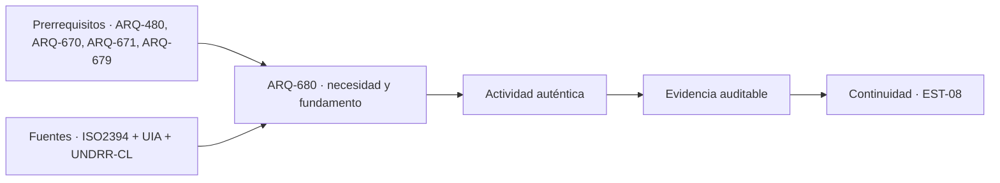

# ARQ-680 · Defensa final de tipologías y grandes obras

**Parte 68 · Clase desarrollada · Edición definitiva v1.0.**

Material educativo con casos ficticios. No constituye proyecto ejecutable, cálculo firmado, instrucción de trabajo peligroso, informe pericial, permiso ni habilitación profesional. Las cifras se emplean para aprender a razonar y conservan las fronteras declaradas.

## Pregunta central

¿Cómo defender una decisión arquitectónica compleja mostrando evidencia, límites y alternativas sin fingir que todo está resuelto?

## Resultado de aprendizaje y continuidad

Cerrarás la Fase II mediante una defensa comparativa que conecte tipología, sitio, personas, sistemas, construcción, operación y ciclo de vida. La evidencia final debe permitir revisar tus decisiones, no solo admirar una presentación. La clase conserva los métodos construidos en las partes anteriores y no hereda parámetros numéricos de otros casos salvo indicación explícita.

## 1. La defensa empieza por la pregunta

Una buena defensa no comienza con el render. Comienza explicando qué problema se intenta resolver, para quién, dónde, bajo qué restricciones y por qué la tipología elegida es pertinente. Si el problema cambia, el proyecto debe poder reabrirse.

## 2. Separar cinco estados de conocimiento

Cada afirmación se clasifica como dato documentado, hipótesis, cálculo comprobado dentro de un modelo, evidencia externa o pendiente. Esta clasificación impide que una cifra inventada para aprender termine presentada como medición de terreno, o que una fuente de catálogo se convierta en cumplimiento normativo.

## 3. Defender interfaces, no disciplinas aisladas

Las decisiones más importantes aparecen entre arquitectura y estructura, instalaciones, operación, paisaje, mantenimiento, normativa o personas. La defensa debe mostrar al menos tres interfaces y explicar qué sucede si una cambia. La lectura de infraestructura como servicio y como red de dependencias ayuda a no reducir la resiliencia a la resistencia de un objeto aislado [[UNDRR-CL]](#FUENTE-UNDRR-CL). Un proyecto coordinado no es una suma de documentos independientes.

## 4. Comparar alternativas antes de narrar una conclusión

La alternativa seleccionada debe compararse con otras de servicio equivalente o con diferencias declaradas. Restricciones se verifican antes de preferencias. Un puntaje no compensa una condición necesaria incumplida ni borra una incógnita crítica.

## 5. Ciclo de vida y capacidad de aprender

Construcción, entrega, operación, mantenimiento, adaptación y fin de vida forman parte de la arquitectura. La defensa final debe incluir qué se medirá después de ocupar, qué decisión podría revisarse y qué información debe conservarse para futuros equipos.

## 6. El límite profesional también se defiende

Completar el programa no habilita para firmar estructuras, instalaciones, permisos o especialidades fuera de las competencias legales y profesionales correspondientes. La integración de conocimientos y la responsabilidad profesional forman parte del marco educativo usado para justificar esta defensa final, sin que ello convierta al programa en una acreditación [[UIA]](#FUENTE-UIA). Saber reconocer cuándo se necesita otro especialista es parte del aprendizaje arquitectónico, no una carencia.

## Caso trabajado

DEF-680 utiliza una matriz final con seis dimensiones: servicio, sitio, personas, sistemas, construcción y operación. Una propuesta tiene estados C/C/P/C/C/P, donde C significa comprobado dentro del ejercicio y P pendiente. Contar 4/6 = 66,7 % no produce un “grado de aprobación”. Las dos pendientes pueden ser precisamente las condiciones que impiden cerrar una decisión. La matriz sirve para localizar trabajo, no para promediar riesgos.

## Método de revisión y límites

Reconstruye el caso desde su frontera: identifica objetos, personas, intervalos y estados incluidos. Comprueba unidades y signos, vuelve a obtener el resultado por equilibrio, balance o relación independiente cuando sea posible y escribe dos frases: una que el cálculo realmente respalda y otra que excedería la evidencia. Los principios de fiabilidad aportan aquí una disciplina para declarar bases, incertidumbres y límites, pero no se extraen coeficientes ni reglas de diseño desde una ficha pública [[ISO2394]](#FUENTE-ISO2394). Después identifica una interfaz con otra disciplina y el documento o profesional que debería aportar la información faltante. Esta secuencia evita que una operación correcta se convierta en una conclusión demasiado amplia.

En una obra real también deben revisarse jurisdicción, versiones normativas, sitio, productos, ensayos, operación y cambios. Una fuente internacional puede explicar un mecanismo sin ser exigencia chilena. Un valor de catálogo puede describir un componente sin representar su configuración instalada. Si la evidencia no existe, el estado correcto es pendiente.

## Errores frecuentes

Evita comparar métricas con denominadores distintos, sumar máximos de estados incompatibles, tratar capacidad nominal como servicio efectivo, usar un promedio para ocultar una región crítica o copiar dimensiones de otro proyecto porque su tipología se parece. Distingue geometría, demanda, capacidad y autorización. Cuando una modificación resuelve una interfaz, revisa qué otras dependencias puede haber alterado.

## Práctica independiente

Construye una defensa de una tipología elegida del programa con: pregunta central, dos alternativas descartadas, tres interfaces, cuatro afirmaciones comprobadas, tres hipótesis, dos pendientes críticas y una estrategia de evaluación posocupacional.

Solución razonada

No existe una solución formal única. La entrega es satisfactoria cuando cada afirmación tiene fuente o método, las alternativas se comparan con fronteras equivalentes, las pendientes no se ocultan y la evaluación futura puede modificar una decisión. Una defensa visualmente convincente que no permite reconstruir sus datos sigue incompleta.

La solución pertenece al modelo declarado. No reemplaza revisión profesional ni permite extrapolar capacidades, distancias seguras, aforos, procedimientos de mantenimiento o cumplimiento reglamentario a una obra real.

## Autoevaluación y transferencia

La Fase II queda cerrada cuando puedes transferir métodos entre tipologías sin trasladar parámetros, defender límites y señalar qué evidencia adicional exigiría una intervención real.

<!-- pedagogia-2026:inicio -->
## Decisión pedagógica y posición curricular

### Por qué existe

Demostrar que el estudiante puede reconstruir y defender una decisión compleja, incluidas alternativas descartadas, límites, cambios y pendientes, en vez de cerrar el programa con una presentación persuasiva pero no auditable.

### Por qué está exactamente aquí

Es la última clase porque exige transferir métodos de toda la Fase I y de veinte familias tipológicas, después de que ARQ-679 haya enseñado a separar mecanismos transferibles de parámetros contextuales. No introduce otra tipología: hace visible la calidad del razonamiento acumulado.

- **Prerrequisitos:** `ARQ-480`, `ARQ-670`, `ARQ-671`, `ARQ-679`
- **Capacidad que introduce:** Una defensa final bidireccional: de la fuente a la decisión y del resultado nuevamente a la fuente, incluyendo revisión posterior y plan de aprendizaje.
- **Clases o experiencias que dependen de ella:** `EST-08`

El diagrama permite comprobar una relación que el texto lineal oculta con facilidad: esta clase recibe capacidades previas, toma decisiones apoyadas por fuentes, exige una experiencia y produce evidencia que habilita trabajo posterior. No representa un procedimiento de obra.

## Resultado observable, evidencia y evaluación

1. Defender una decisión mediante una cadena reconstruible de fuentes, supuestos, alternativas, actividad, evidencia y criterio.
2. Comparar dos alternativas con fronteras equivalentes y justificar por qué una se conserva.
3. Diagnosticar pendientes críticos y formular un plan de verificación o aprendizaje posterior.

## Actividad, evidencia y criterio de aceptación

**Actividad:** Preparar y defender una tipología elegida con pregunta, dos alternativas descartadas, tres interfaces, cuatro afirmaciones comprobadas, tres hipótesis, dos pendientes críticos, cambios entre versiones y evaluación posocupacional.

**Evidencia mínima:** Dossier de defensa, matriz de trazabilidad bidireccional, registro de cambios, presentación y acta de objeciones; todos deben permitir reconstruir la decisión sin explicación oral adicional.

**Archivo sugerido:** `evidence/ARQ-680/evidencia.md`.

**Criterio de aceptación:** la entrega se acepta cuando:

- Cada afirmación crítica enlaza fuente o método, localizador, uso y límite.
- Las alternativas conservan función y fronteras comparables.
- Las pendientes críticas no se promedian ni se presentan como resueltas.
- La respuesta a objeciones queda registrada como conservar, revisar o investigar.
- El plan posterior identifica evidencia faltante, responsable y condición de cierre.

La [rúbrica común](../../docs/RUBRICA_COMUN.md) complementa estos criterios; no los reemplaza. Una entrega puede superar un promedio y continuar pendiente si oculta una condición crítica.

## Trazabilidad de las decisiones

| # | Decisión o fundamento | Fuente utilizada | Aplicación y límite en esta clase |
|---:|---|---|---|
| 1 | Evaluar integración disciplinar, responsabilidad y capacidad de juicio. | `UIA` | Sustenta la naturaleza integradora de la defensa, no una equivalencia con acreditación. |
| 2 | Tratar infraestructura como servicio con dependencias y gobernanza. | `UNDRR-CL` | Sustenta la exigencia de interfaces y continuidad, no un diseño específico. |
| 3 | Mantener bases, incertidumbres y límites al formular afirmaciones de fiabilidad. | `ISO2394` | Sustenta la disciplina de la evidencia sin extraer coeficientes del estándar. |

La tabla permite auditar las relaciones; la explicación, el caso y la práctica de la clase siguen siendo la documentación principal.

## Autoevaluación, recuperación y continuidad

### Errores diagnósticos

Antes de avanzar, comprueba si puedes reconstruir cada resultado sin mirar la solución, señalar qué evidencia lo sostiene y nombrar una condición que obligaría a revisar tu decisión. Conserva la primera versión, la objeción recibida y la revisión.

**Conexión siguiente:** EST-08 convierte la defensa en portafolio longitudinal: compara evidencia inicial, intermedia y final, reconstruye cambios y formula el aprendizaje posterior.
<!-- pedagogia-2026:fin -->

## Fuentes y alcance de uso

### [[UIA]](#FUENTE-UIA) UNESCO–UIA Charter for Architectural Education, revisión 2026

Unión Internacional de Arquitectos, 2026. [Noticia y localizador oficial](https://www.uia-architectes.org/en/news/unesco-uia-charter-for-architectural-education-revised-edition-2026/).

**Consulta:** 20 de septiembre de 2026; noticia oficial y descripción pública de la revisión. **Apoyo:** integración de diseño, cultura, técnica, ambiente y responsabilidad en la formación. **Aplicación:** justifica que la defensa final coordine campos y explicite responsabilidades. **Límite:** no se revisó aquí el texto protegido completo, no acredita este programa y no sustituye habilitación profesional.

### [[UNDRR-CL]](#FUENTE-UNDRR-CL) Hoja de Ruta para la Resiliencia de la Infraestructura en la República de Chile

UNDRR, Coalition for Disaster Resilient Infrastructure y Gobierno de Chile, 2024. [Publicación oficial](https://www.undrr.org/es/publication/hoja-de-ruta-para-la-resiliencia-de-la-infraestructura-en-la-republica-de-chile).

**Consulta:** 20 de septiembre de 2026; página oficial, resumen y documento enlazado. **Apoyo:** infraestructura como sistema de servicios, dependencias, gobernanza y continuidad. **Aplicación:** exige que la defensa muestre interfaces y consecuencias de una interrupción. **Límite:** no proporciona el diseño de detalle de la tipología elegida ni demuestra resiliencia del caso académico.

### [[ISO2394]](#FUENTE-ISO2394) ISO 2394:2015 — General principles on reliability for structures

International Organization for Standardization, 2015. [Ficha oficial, ISO 2394:2015](https://www.iso.org/standard/58036.html).

**Consulta:** 20 de septiembre de 2026; ficha pública del estándar. **Apoyo:** bases generales para expresar fiabilidad, incertidumbre y condiciones de una afirmación estructural. **Aplicación:** sustenta la obligación de declarar modelo y límites en la defensa. **Límite:** no se leyó íntegramente el texto normativo, no se extraen coeficientes y la ficha no demuestra cumplimiento de un proyecto.
