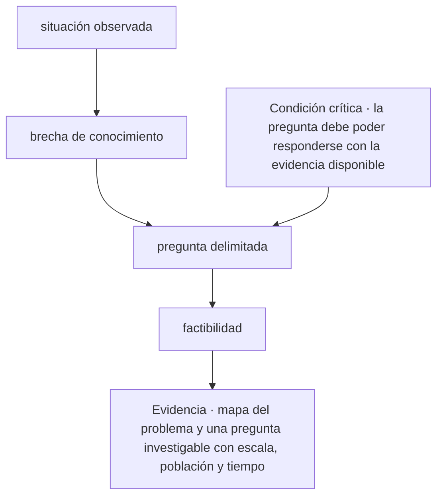
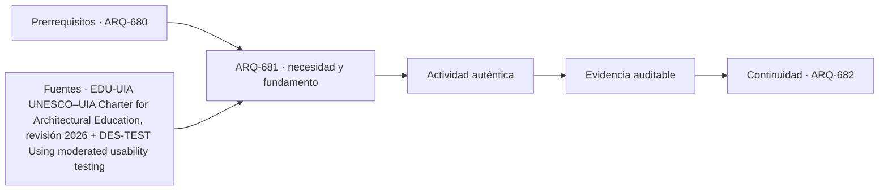

# ARQ-681 · Preguntas investigables y problemas de arquitectura

**Parte 69 · Fase III · Profundización y especialización · Edición 2026.10.**

Material educativo independiente. Esta clase no sustituye formación acreditada, experiencia supervisada, encargo profesional, normativa vigente, cálculo firmado, permiso ni revisión de especialistas. Los datos del caso son didácticos y deben reemplazarse por antecedentes verificables antes de una aplicación real.

## Pregunta central

¿Cómo abordar preguntas investigables y problemas de arquitectura y comprobar esta condición crítica: la pregunta debe poder responderse con la evidencia disponible?

## Propósito, prerrequisitos y resultados de aprendizaje

La clase profundiza en **preguntas investigables y problemas de arquitectura** para formular conocimiento arquitectónico reproducible sin confundir evidencia, interpretación y opinión. Recibe de `ARQ-680` un registro de decisiones, fuentes y pendientes. No basta con reconocer vocabulario: el estudiante debe transformar una pregunta en un procedimiento que otra persona pueda reconstruir, criticar y corregir.

Al terminar podrás:

1. **identificar** los datos, actores, escalas y límites que condicionan una decisión sobre preguntas investigables y problemas de arquitectura;
2. **comparar** al menos dos alternativas con una función común y criterios no intercambiables;
3. **producir** una evidencia propia para el portafolio de Fase III;
4. **justificar** qué parte puede resolver arquitectura, qué requiere colaboración especializada y qué permanece abierta;
5. **revisar** la decisión cuando cambie un supuesto, una fuente, una necesidad o una condición de uso.

La evidencia de salida será un componente del **protocolo de investigación y capítulo de tesis auditable** de la Parte 69.

## Conceptos y distinciones fundamentales

### Núcleo disciplinar de esta clase

Esta clase no trata el tema como una etiqueta. Su núcleo operativo articula **pregunta, unidad de análisis, diseño de método, calidad de datos, inferencia y reproducibilidad**. Dentro de esa cadena, **preguntas investigables y problemas de arquitectura** ocupa la posición 1 de la parte y delimita el problema y las variables que pertenecen al sistema. La pregunta decisiva es qué cambia en el proyecto cuando cambia una de esas entradas, cómo se observa el efecto y quién tiene autoridad para aceptar la consecuencia.

La secuencia propia de la clase es **situación observada → brecha de conocimiento → pregunta delimitada → factibilidad**. Su resultado concreto será **mapa del problema y una pregunta investigable con escala, población y tiempo**. La revisión debe comprobar que **la pregunta debe poder responderse con la evidencia disponible**. Estas tres frases funcionan como guía de lectura: el texto explica la secuencia, el ejercicio construye la evidencia y la evaluación intenta refutar una conclusión demasiado amplia.

El expediente específico debe poder aplicarse a **la evaluación posocupacional de un conjunto de vivienda social donde planos, entrevistas, mediciones y observaciones no coinciden**. Cada elemento debe conservar escala, fecha, versión, responsable y relación con el producto acumulativo de la Parte 69. Cuando el dato no existe, se registra el método para obtenerlo; cuando una atribución corresponde a otra disciplina, se documenta la interfaz y el punto de coordinación.

Antes de producir, separa cuatro estados dentro de **preguntas investigables y problemas de arquitectura**: el requisito que posee autoridad y versión; la preferencia que expresa un valor negociable; la hipótesis que permite avanzar y aún debe probarse; y la restricción que acota alternativas en este contexto. Escríbelos junto a **situación observada**. Cuando uno cambie, recorre la secuencia y marca qué conclusiones dejan de ser válidas.

## Desarrollo paso a paso

### 1. Situación observada

Empieza sin dibujar una solución. Describe qué se observa en **preguntas investigables y problemas de arquitectura**, quién lo experimenta y dónde termina el sistema que analizarás. El foco es **pregunta**: registra una evidencia a favor, una señal que la contradiga y un vacío que todavía no puedes llenar. **la pregunta central** entrega el punto de partida; **brecha de conocimiento** sólo puede comenzar cuando la escala, el periodo y las personas afectadas quedan visibles. Cierra este paso con un croquis o esquema de situación y una frase que pueda resultar falsa. Así, **situación observada** abre una investigación en vez de decorar una decisión ya tomada.

### 2. Brecha de conocimiento

Convierte **brecha de conocimiento** en una mesa de clasificación. Una columna recibe datos confirmados; otra, requisitos con autoridad y versión; una tercera, hipótesis; y una cuarta, desconocidos. En **preguntas investigables y problemas de arquitectura**, la variable que merece atención es **unidad de análisis**. Comprueba unidades, fechas y procedencia antes de agrupar. Luego elige dos elementos que suelen confundirse y explica la diferencia con un ejemplo del caso. El resultado debe permitir pasar de **situación observada** a **pregunta delimitada** sin cambiar silenciosamente una definición. Si algo no cabe en ninguna columna, no lo fuerces: convierte esa incomodidad en una pregunta.

### 3. Pregunta delimitada

Ahora cambia de lenguaje. Representa **pregunta delimitada** mediante el medio que mejor revele **diseño de método**: planta para relaciones horizontales, sección para niveles y flujos, mapa para distribución, línea de tiempo para secuencias o diagrama para dependencias. En **preguntas investigables y problemas de arquitectura**, cada trazo debe responder qué muestra y qué oculta. Anota escala, orientación, unidades y fuente junto a la figura. Superpone una segunda capa con dudas o conflictos; no los borres para limpiar la composición. Pide a otra persona que explique cómo **brecha de conocimiento** se transforma en **factibilidad** mirando sólo la gráfica. Lo que no pueda reconstruir señala la revisión necesaria.

### 4. Factibilidad

Usa **factibilidad** para explicar un mecanismo, no una coincidencia. Escribe una cadena breve: entrada → transformación → efecto → persona o sistema afectado. En **preguntas investigables y problemas de arquitectura**, sigue especialmente **calidad de datos** y dibuja al menos un camino alternativo. Cambia una entrada y anticipa qué parte de **mapa del problema y una pregunta investigable con escala, población y tiempo** debería cambiar; después busca un caso que no obedezca esa expectativa. La explicación se acepta cuando distingue asociación, causa propuesta y límite de la evidencia. Si el salto desde **pregunta delimitada** exige una pericia externa, formula la pregunta para esa especialidad y adjunta el antecedente que necesita para responder.

### Lo que une la secuencia

Los 4 pasos no son una receta universal. En esta clase ordenan una decisión sobre **preguntas investigables y problemas de arquitectura** dentro de **Investigación avanzada, evidencia y tesis** y conducen a **mapa del problema y una pregunta investigable con escala, población y tiempo**. Pueden repetirse cuando aparece evidencia contradictoria, pero no intercambiarse sin explicación: saltar desde **situación observada** hasta **factibilidad** ocultaría precisamente el razonamiento que la entrega debe enseñar. La secuencia se detiene cuando **la pregunta debe poder responderse con la evidencia disponible** no puede demostrarse.

## Contexto histórico, social y profesional

El contexto de trabajo es **la evaluación posocupacional de un conjunto de vivienda social donde planos, entrevistas, mediciones y observaciones no coinciden**. Allí, el tema de preguntas investigables y problemas de arquitectura no aparece como un problema aislado: se cruza con pregunta, unidad de análisis, diseño de método, calidad de datos, inferencia y reproducibilidad. El estudiante debe preguntar quién definió cada categoría, quién falta en el registro y qué decisión histórica o institucional explica la situación actual. Una tecnología nueva sólo se incorpora cuando mejora una observación, una coordinación o una prueba identificable; su novedad no constituye evidencia.

En una práctica profesional, arquitectura puede formular el problema espacial, relacionar escalas, representar alternativas y coordinar el expediente. Para esta clase debe asignar autores y revisores a **brecha de conocimiento**, **pregunta delimitada** y **mapa del problema y una pregunta investigable con escala, población y tiempo**. Cuando una conclusión dependa de cálculo, diagnóstico o atribución regulada de otra disciplina, se redacta la pregunta de coordinación, se entrega el antecedente necesario y se conserva la respuesta. Esa interfaz también es parte del proyecto.

## Método: de la observación a una decisión trazable

1. **Delimita: situación observada.** Declara la entrada, realiza una operación visible y entrega algo que pueda usarse en **brecha de conocimiento**. Añade al margen la duda que todavía puede modificar el paso.
2. **Ordena: brecha de conocimiento.** Declara la entrada, realiza una operación visible y entrega algo que pueda usarse en **pregunta delimitada**. Añade al margen la duda que todavía puede modificar el paso.
3. **Dibuja: pregunta delimitada.** Declara la entrada, realiza una operación visible y entrega algo que pueda usarse en **factibilidad**. Añade al margen la duda que todavía puede modificar el paso.
4. **Explica: factibilidad.** Declara la entrada, realiza una operación visible y entrega algo que pueda usarse en **mapa del problema y una pregunta investigable con escala, población y tiempo**. Añade al margen la duda que todavía puede modificar el paso.
5. **Intenta refutar el cierre.** Comprueba si **la pregunta debe poder responderse con la evidencia disponible**; si la respuesta depende sólo de la apariencia del producto, vuelve al primer paso que no tenga evidencia.

La herramienta elegida debe permitir ejecutar esta secuencia, no reemplazarla. Para **preguntas investigables y problemas de arquitectura**, anota entradas, unidades, versión y transformaciones; exporta un formato que otra persona pueda inspeccionar; y verifica **pregunta delimitada** por un medio independiente proporcional a su consecuencia. Si intervienen automatización o IA, conserva también la instrucción, el resultado original, la revisión humana y el motivo de cada corrección.

## Mapa visual de la decisión

El diagrama es específico de **preguntas investigables y problemas de arquitectura**. Se lee de arriba abajo y permite localizar un salto. Si el expediente pasa del primer al último nodo sin documentar los pasos intermedios, la conclusión todavía no es reproducible. La condición crítica entra antes del cierre porque debe cambiar o detener la decisión, no aparecer como advertencia tardía.

## Caso trabajado: EXP-681

El caso se sitúa en **la evaluación posocupacional de un conjunto de vivienda social donde planos, entrevistas, mediciones y observaciones no coinciden**. El equipo debe abordar **preguntas investigables y problemas de arquitectura** y entregar **mapa del problema y una pregunta investigable con escala, población y tiempo**. La primera versión salta desde **situación observada** hasta **factibilidad**: presenta una respuesta terminada, pero no permite saber cómo se tomaron las decisiones intermedias.

La revisión devuelve el trabajo a **brecha de conocimiento** y **pregunta delimitada**. El equipo separa datos confirmados, hipótesis y desconocidos; identifica qué representación hace visible el mecanismo y asigna a una persona la comprobación de **pregunta delimitada**. Esa corrección cambia la evidencia: deja de ser una afirmación ilustrada y se convierte en un procedimiento que otra persona puede repetir.

Antes de cerrar, la crítica aplica la condición **“la pregunta debe poder responderse con la evidencia disponible”**. Si no se satisface, la entrega permanece abierta aunque su presentación sea convincente. El resultado del caso EXP-681 es una versión revisada de **mapa del problema y una pregunta investigable con escala, población y tiempo**, acompañada por la objeción que produjo el cambio y por un asunto que todavía requiere investigación o revisión especializada.

## Práctica guiada

Construye una primera versión de **mapa del problema y una pregunta investigable con escala, población y tiempo** siguiendo los 4 pasos del diagrama. Bajo cada paso escribe una entrada, una operación y una salida. Marca con un signo de interrogación lo que todavía no conoces; no lo conviertas en cero, promedio o supuesto oculto.

Intercambia el trabajo con otra persona. Debe poder señalar dónde se comprueba **la pregunta debe poder responderse con la evidencia disponible** y reconstruir la transición desde **pregunta delimitada** hasta **factibilidad** sin explicación oral. Registra dos dudas de esa lectura y corrige al menos una. La primera versión, las objeciones y la versión revisada forman parte de la evidencia.

## Ejercicio autónomo

Aplica la secuencia **situación observada → brecha de conocimiento → pregunta delimitada → factibilidad** a otro contexto, escala o grupo de personas. Produce **mapa del problema y una pregunta investigable con escala, población y tiempo**, una versión inicial y una revisada. Explica qué se mantuvo, qué cambió y por qué los parámetros del caso trabajado no podían copiarse.

**Evidencia mínima de preguntas investigables y problemas de arquitectura:** mapa del problema y una pregunta investigable con escala, población y tiempo; diagrama de **situación observada → brecha de conocimiento → pregunta delimitada → factibilidad**; demostración de que **la pregunta debe poder responderse con la evidencia disponible**; y registro de una revisión que haya cambiado el resultado. Guarda el expediente en `evidence/ARQ-681/evidencia.md` y enlázalo desde tu portafolio.

## Errores frecuentes y cómo corregirlos

- **Fallo crítico de esta clase:** La pregunta debe poder responderse con la evidencia disponible. En **preguntas investigables y problemas de arquitectura**, localiza el paso que no lo demuestra y vuelve a producir la evidencia.
- **Comenzar por factibilidad:** muestra una respuesta sin explicar cómo se llegó a ella. Recupera **situación observada** y conserva las decisiones intermedias.
- **Tratar brecha de conocimiento como trámite:** deja sin fundamento lo que sigue. Escribe su entrada, su operación y una salida que otra persona pueda revisar.
- **Entregar mapa del problema y una pregunta investigable con escala, población y tiempo sin procedencia:** una evidencia sin fecha, escala, autor o fuente pierde alcance. Completa esos cuatro campos junto al producto.
- **Copiar parámetros del caso:** la forma del método puede transferirse, pero sus valores deben volver a medirse en cada contexto.
- **Ocultar la objeción:** registra la crítica que produjo un cambio; una versión perfecta desde el inicio impide evaluar el proceso.

## Evaluación y criterios de aceptación

La evidencia se acepta cuando:

1. produce **mapa del problema y una pregunta investigable con escala, población y tiempo** y responde explícitamente a la pregunta central;
2. diferencia datos, requisitos, hipótesis, preferencias y desconocidos;
3. compara alternativas con función y fronteras equivalentes o justifica la diferencia;
4. permite reconstruir al menos una comprobación, incluidas unidades, versión y fuente;
5. conserva una condición crítica fuera de cualquier promedio compensatorio;
6. identifica responsabilidades y no atribuye al estudiante competencias profesionales reguladas;
7. incluye revisión sustantiva entre dos versiones y explica la consecuencia;
8. demuestra que **la pregunta debe poder responderse con la evidencia disponible** y enlaza la evidencia con `ARQ-682`.

La rúbrica común permite comparar el avance del programa; estos criterios deciden la aceptación de **mapa del problema y una pregunta investigable con escala, población y tiempo**. Una presentación convincente permanece pendiente cuando **la pregunta debe poder responderse con la evidencia disponible** no puede comprobarse o la fuente utilizada no sostiene la conclusión.

## Autoevaluación, recuperación y reflexión crítica

Sin mirar el texto, reconstruye la secuencia **situación observada → brecha de conocimiento → pregunta delimitada → factibilidad** y nombra la evidencia que produce cada transición. Explica por qué **la pregunta debe poder responderse con la evidencia disponible**. Si no puedes localizar esa comprobación en tu entrega, vuelve al diagrama y sustituye una afirmación vaga por una operación observable.

Para recuperar **preguntas investigables y problemas de arquitectura**, vuelve 24–48 horas después y dibuja de memoria **situación observada → brecha de conocimiento → … → factibilidad**. Aplícala a otro actor o escala y marca en otro color los parámetros que tuviste que volver a investigar. Cierra preguntando quién recibe el beneficio de **mapa del problema y una pregunta investigable con escala, población y tiempo**, quién asume su costo, quién queda fuera de sus datos y quién podrá corregirla más adelante.

**Conexión siguiente:** `ARQ-682` reutiliza la matriz, la representación y el registro de cambios. Lleva la evidencia, no las cifras del caso.

<!-- pedagogia-2026:inicio -->
## Decisión pedagógica y posición curricular

### Por qué existe

Esta clase existe para resolver una necesidad concreta del recorrido: ¿Cómo abordar preguntas investigables y problemas de arquitectura y comprobar esta condición crítica: la pregunta debe poder responderse con la evidencia disponible?

### Por qué está exactamente aquí

Abre la Parte 69 porque plantea primero el problema «¿Cómo abordar preguntas investigables y problemas de arquitectura y comprobar esta condición crítica: la pregunta debe poder responderse con la evidencia disponible?». La transición desde ARQ-680 · Defensa final de tipologías y grandes obras conserva métodos de evidencia y límites, pero no traslada parámetros del bloque anterior. Establece la pregunta y el producto base que ARQ-682 · Hipótesis, proposiciones y preguntas abiertas desarrollará a continuación.

- **Prerrequisitos:** `ARQ-680`
- **Capacidad que introduce:** La clase profundiza en preguntas investigables y problemas de arquitectura para formular conocimiento arquitectónico reproducible sin confundir evidencia, interpretación y opinión. Recibe de ARQ-680 un registro de decisiones, fuentes y pendientes. No basta con reconocer vocabulario: el estudiante debe transformar una pregunta en un procedimiento que otra persona pueda reconstruir, criticar y corregir.
- **Clases o experiencias que dependen de ella:** `ARQ-682`

El diagrama permite comprobar una relación que el texto lineal oculta con facilidad: esta clase recibe capacidades previas, toma decisiones apoyadas por fuentes, exige una experiencia y produce evidencia que habilita trabajo posterior. No representa un procedimiento de obra.

## Resultado observable, evidencia y evaluación

1. Identificar y delimitar las condiciones necesarias para responder la pregunta central de preguntas investigables y problemas de arquitectura.
2. Producir y comprobar la evidencia declarada por la clase: La clase profundiza en preguntas investigables y problemas de arquitectura para formular conocimiento arquitectónico reproducible sin confundir evidencia, interpretación y opinión. Recibe de ARQ-680 un registro de decisiones, fuentes y pendientes. No basta con reconocer vocabulario: el estudiante debe transformar una pregunta en un procedimiento que otra persona pueda reconstruir, criticar y corregir.
3. Justificar una decisión de preguntas investigables y problemas de arquitectura mediante fuentes, supuestos, alternativas y límites explícitos.

## Actividad, evidencia y criterio de aceptación

**Actividad:** Construye una primera versión de mapa del problema y una pregunta investigable con escala, población y tiempo siguiendo los 4 pasos del diagrama. Bajo cada paso escribe una entrada, una operación y una salida. Marca con un signo de interrogación lo que todavía no conoces; no lo conviertas en cero, promedio o supuesto oculto.

**Evidencia mínima:** La clase profundiza en preguntas investigables y problemas de arquitectura para formular conocimiento arquitectónico reproducible sin confundir evidencia, interpretación y opinión. Recibe de ARQ-680 un registro de decisiones, fuentes y pendientes. No basta con reconocer vocabulario: el estudiante debe transformar una pregunta en un procedimiento que otra persona pueda reconstruir, criticar y corregir.

**Archivo sugerido:** `evidence/ARQ-681/evidencia.md`.

**Criterio de aceptación:** la entrega se acepta cuando:

- La entrega responde explícitamente a la pregunta: ¿Cómo abordar preguntas investigables y problemas de arquitectura y comprobar esta condición crítica: la pregunta debe poder responderse con la evidencia disponible?
- La actividad conserva las fronteras del caso y permite reconstruir el procedimiento: Construye una primera versión de mapa del problema y una pregunta investigable con escala, población y tiempo siguiendo los 4 pasos del diagrama. Bajo cada paso escribe una entrada, una operación y una salida. Marca con un signo de interrogación lo que todavía no conoces; no lo conviertas en cero, promedio o supuesto oculto.
- Cada afirmación externa puede seguirse hasta una fuente, su alcance consultado y su límite.
- La evidencia deja disponible una entrada comprobable para ARQ-682.
- - Fallo crítico de esta clase: La pregunta debe poder responderse con la evidencia disponible. En preguntas investigables y problemas de arquitectura , localiza el paso que no lo demuestra y vuelve a producir la evidencia.

La [rúbrica común](../../docs/RUBRICA_COMUN.md) complementa estos criterios; no los reemplaza. Una entrega puede superar un promedio y continuar pendiente si oculta una condición crítica.

## Trazabilidad de las decisiones

| # | Decisión o fundamento | Fuente utilizada | Aplicación y límite en esta clase |
|---:|---|---|---|
| 1 | Amplitud formativa, juicio profesional y relación entre diseño, técnica, sociedad y ambiente. | [EDU-UIA UNESCO–UIA Charter for Architectural Education, revisión 2026](https://www.uia-architectes.org/en/news/unesco-uia-charter-for-architectural-education-revised-edition-2026/) | Consulta: página o documento oficial identificado en el enlace. Límite: Noticia y materiales públicos de la revisión; no acredita este programa ni sustituye el texto íntegro de la Carta. Fecha de |
| 2 | Planificación de pruebas con personas, observación y registro de hallazgos. | [DES-TEST Using moderated usability testing](https://www.gov.uk/service-manual/user-research/using-moderated-usability-testing) | Consulta: página o documento oficial identificado en el enlace. Límite: Guía de servicios digitales transferida como método; no constituye protocolo clínico ni normativa chilena. Fecha de |

La tabla permite auditar las relaciones; la explicación, el caso y la práctica de la clase siguen siendo la documentación principal.

## Autoevaluación, recuperación y continuidad

### Errores diagnósticos

Antes de avanzar, comprueba si puedes reconstruir cada resultado sin mirar la solución, señalar qué evidencia lo sostiene y nombrar una condición que obligaría a revisar tu decisión. Conserva la primera versión, la objeción recibida y la revisión.

**Conexión siguiente:** La continuidad inmediata es ARQ-682 · Hipótesis, proposiciones y preguntas abiertas; conserva el método y vuelve a verificar datos y límites.
<!-- pedagogia-2026:fin -->

## Fuentes y alcance de uso

### [[UIA]] UNESCO–UIA Charter for Architectural Education, revisión 2026

Unión Internacional de Arquitectos. [https://www.uia-architectes.org/en/news/unesco-uia-charter-for-architectural-education-revised-edition-2026/](https://www.uia-architectes.org/en/news/unesco-uia-charter-for-architectural-education-revised-edition-2026/)

**Consulta:** página o documento oficial identificado en el enlace. **Apoyo:** Amplitud formativa, juicio profesional y relación entre diseño, técnica, sociedad y ambiente. **Límite:** Noticia y materiales públicos de la revisión; no acredita este programa ni sustituye el texto íntegro de la Carta. **Fecha de consulta:** 6 de octubre de 2026.

### [[GOV-RESEARCH]] Using moderated usability testing

Government Digital Service, Reino Unido. [https://www.gov.uk/service-manual/user-research/using-moderated-usability-testing](https://www.gov.uk/service-manual/user-research/using-moderated-usability-testing)

**Consulta:** página o documento oficial identificado en el enlace. **Apoyo:** Planificación de pruebas con personas, observación y registro de hallazgos. **Límite:** Guía de servicios digitales transferida como método; no constituye protocolo clínico ni normativa chilena. **Fecha de consulta:** 6 de octubre de 2026.
