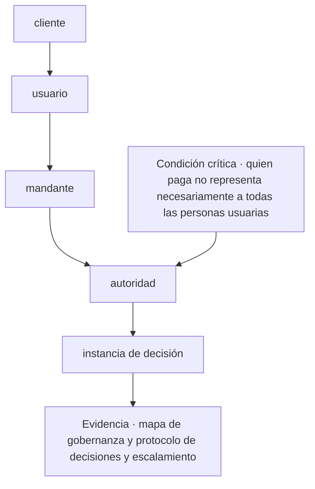
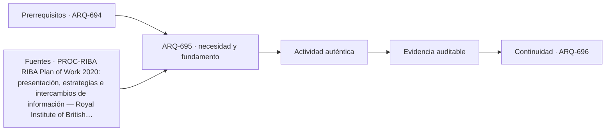

# ARQ-695 · Clientes, usuarios, mandantes y gobernanza

**Parte 70 · Fase III · Profundización y especialización · Edición 2026.10.**

Material educativo independiente. Esta clase no sustituye formación acreditada, experiencia supervisada, encargo profesional, normativa vigente, cálculo firmado, permiso ni revisión de especialistas. Los datos del caso son didácticos y deben reemplazarse por antecedentes verificables antes de una aplicación real.

## Pregunta central

¿Cómo abordar clientes, usuarios, mandantes y gobernanza y comprobar esta condición crítica: quien paga no representa necesariamente a todas las personas usuarias?

## Propósito, prerrequisitos y resultados de aprendizaje

La clase profundiza en **clientes, usuarios, mandantes y gobernanza** para gestionar encargos, relaciones, riesgos y recursos sin ocultar responsabilidades ni conflictos. Recibe de `ARQ-694` un registro de decisiones, fuentes y pendientes. No basta con reconocer vocabulario: el estudiante debe transformar una pregunta en un procedimiento que otra persona pueda reconstruir, criticar y corregir.

Al terminar podrás:

1. **identificar** los datos, actores, escalas y límites que condicionan una decisión sobre clientes, usuarios, mandantes y gobernanza;
2. **comparar** al menos dos alternativas con una función común y criterios no intercambiables;
3. **producir** una evidencia propia para el portafolio de Fase III;
4. **justificar** qué parte puede resolver arquitectura, qué requiere colaboración especializada y qué permanece abierta;
5. **revisar** la decisión cuando cambie un supuesto, una fuente, una necesidad o una condición de uso.

La evidencia de salida será un componente del **plan de práctica profesional con alcance, honorarios, riesgos y control documental** de la Parte 70.

## Conceptos y distinciones fundamentales

### Núcleo disciplinar de esta clase

Esta clase no trata el tema como una etiqueta. Su núcleo operativo articula **encargo, alcance, exclusión, honorario, autoridad, conflicto de interés, cambio y archivo contractual**. Dentro de esa cadena, **clientes, usuarios, mandantes y gobernanza** ocupa la posición 5 de la parte y formula alternativas comparables y condiciones críticas. La pregunta decisiva es qué cambia en el proyecto cuando cambia una de esas entradas, cómo se observa el efecto y quién tiene autoridad para aceptar la consecuencia.

La secuencia propia de la clase es **cliente → usuario → mandante → autoridad → instancia de decisión**. Su resultado concreto será **mapa de gobernanza y protocolo de decisiones y escalamiento**. La revisión debe comprobar que **quien paga no representa necesariamente a todas las personas usuarias**. Estas tres frases funcionan como guía de lectura: el texto explica la secuencia, el ejercicio construye la evidencia y la evaluación intenta refutar una conclusión demasiado amplia.

El expediente específico debe poder aplicarse a **una oficina pequeña que debe decidir si acepta un encargo con programa inestable, plazo fijo y responsabilidades mal asignadas**. Cada elemento debe conservar escala, fecha, versión, responsable y relación con el producto acumulativo de la Parte 70. Cuando el dato no existe, se registra el método para obtenerlo; cuando una atribución corresponde a otra disciplina, se documenta la interfaz y el punto de coordinación.

Antes de producir, separa cuatro estados dentro de **clientes, usuarios, mandantes y gobernanza**: el requisito que posee autoridad y versión; la preferencia que expresa un valor negociable; la hipótesis que permite avanzar y aún debe probarse; y la restricción que acota alternativas en este contexto. Escríbelos junto a **cliente**. Cuando uno cambie, recorre la secuencia y marca qué conclusiones dejan de ser válidas.

## Desarrollo paso a paso

### 1. Cliente

Empieza sin dibujar una solución. Describe qué se observa en **clientes, usuarios, mandantes y gobernanza**, quién lo experimenta y dónde termina el sistema que analizarás. El foco es **encargo**: registra una evidencia a favor, una señal que la contradiga y un vacío que todavía no puedes llenar. **la pregunta central** entrega el punto de partida; **usuario** sólo puede comenzar cuando la escala, el periodo y las personas afectadas quedan visibles. Cierra este paso con un croquis o esquema de situación y una frase que pueda resultar falsa. Así, **cliente** abre una investigación en vez de decorar una decisión ya tomada.

### 2. Usuario

Convierte **usuario** en una mesa de clasificación. Una columna recibe datos confirmados; otra, requisitos con autoridad y versión; una tercera, hipótesis; y una cuarta, desconocidos. En **clientes, usuarios, mandantes y gobernanza**, la variable que merece atención es **alcance**. Comprueba unidades, fechas y procedencia antes de agrupar. Luego elige dos elementos que suelen confundirse y explica la diferencia con un ejemplo del caso. El resultado debe permitir pasar de **cliente** a **mandante** sin cambiar silenciosamente una definición. Si algo no cabe en ninguna columna, no lo fuerces: convierte esa incomodidad en una pregunta.

### 3. Mandante

Ahora cambia de lenguaje. Representa **mandante** mediante el medio que mejor revele **exclusión**: planta para relaciones horizontales, sección para niveles y flujos, mapa para distribución, línea de tiempo para secuencias o diagrama para dependencias. En **clientes, usuarios, mandantes y gobernanza**, cada trazo debe responder qué muestra y qué oculta. Anota escala, orientación, unidades y fuente junto a la figura. Superpone una segunda capa con dudas o conflictos; no los borres para limpiar la composición. Pide a otra persona que explique cómo **usuario** se transforma en **autoridad** mirando sólo la gráfica. Lo que no pueda reconstruir señala la revisión necesaria.

### 4. Autoridad

Usa **autoridad** para explicar un mecanismo, no una coincidencia. Escribe una cadena breve: entrada → transformación → efecto → persona o sistema afectado. En **clientes, usuarios, mandantes y gobernanza**, sigue especialmente **honorario** y dibuja al menos un camino alternativo. Cambia una entrada y anticipa qué parte de **instancia de decisión** debería cambiar; después busca un caso que no obedezca esa expectativa. La explicación se acepta cuando distingue asociación, causa propuesta y límite de la evidencia. Si el salto desde **mandante** exige una pericia externa, formula la pregunta para esa especialidad y adjunta el antecedente que necesita para responder.

### 5. Instancia de decisión

En **instancia de decisión**, construye dos alternativas comparables para **clientes, usuarios, mandantes y gobernanza**. Mantén constante la función principal y declara qué varía; si las fronteras no coinciden, corrígelas antes de puntuar. Evalúa **autoridad** con una medida y con una observación cualitativa, porque una cifra única puede esconder distribución, experiencia o riesgo. Incluye una condición que no pueda compensarse con ventajas en otros criterios. La salida hacia **mapa de gobernanza y protocolo de decisiones y escalamiento** debe conservar la opción descartada y el motivo. Después invierte una preferencia del encargo: si la elección no cambia, explica por qué; si cambia, identifica el supuesto que realmente gobernaba la decisión.

### Lo que une la secuencia

Los 5 pasos no son una receta universal. En esta clase ordenan una decisión sobre **clientes, usuarios, mandantes y gobernanza** dentro de **Práctica profesional, oficina, negocio y negociación** y conducen a **mapa de gobernanza y protocolo de decisiones y escalamiento**. Pueden repetirse cuando aparece evidencia contradictoria, pero no intercambiarse sin explicación: saltar desde **cliente** hasta **instancia de decisión** ocultaría precisamente el razonamiento que la entrega debe enseñar. La secuencia se detiene cuando **quien paga no representa necesariamente a todas las personas usuarias** no puede demostrarse.

## Contexto histórico, social y profesional

El contexto de trabajo es **una oficina pequeña que debe decidir si acepta un encargo con programa inestable, plazo fijo y responsabilidades mal asignadas**. Allí, el tema de clientes, usuarios, mandantes y gobernanza no aparece como un problema aislado: se cruza con encargo, alcance, exclusión, honorario, autoridad, conflicto de interés, cambio y archivo contractual. El estudiante debe preguntar quién definió cada categoría, quién falta en el registro y qué decisión histórica o institucional explica la situación actual. Una tecnología nueva sólo se incorpora cuando mejora una observación, una coordinación o una prueba identificable; su novedad no constituye evidencia.

En una práctica profesional, arquitectura puede formular el problema espacial, relacionar escalas, representar alternativas y coordinar el expediente. Para esta clase debe asignar autores y revisores a **usuario**, **autoridad** y **mapa de gobernanza y protocolo de decisiones y escalamiento**. Cuando una conclusión dependa de cálculo, diagnóstico o atribución regulada de otra disciplina, se redacta la pregunta de coordinación, se entrega el antecedente necesario y se conserva la respuesta. Esa interfaz también es parte del proyecto.

## Método: de la observación a una decisión trazable

1. **Compara: cliente.** Declara la entrada, realiza una operación visible y entrega algo que pueda usarse en **usuario**. Añade al margen la duda que todavía puede modificar el paso.
2. **Ensaya: usuario.** Declara la entrada, realiza una operación visible y entrega algo que pueda usarse en **mandante**. Añade al margen la duda que todavía puede modificar el paso.
3. **Busca: mandante.** Declara la entrada, realiza una operación visible y entrega algo que pueda usarse en **autoridad**. Añade al margen la duda que todavía puede modificar el paso.
4. **Coordina: autoridad.** Declara la entrada, realiza una operación visible y entrega algo que pueda usarse en **instancia de decisión**. Añade al margen la duda que todavía puede modificar el paso.
5. **Verifica: instancia de decisión.** Declara la entrada, realiza una operación visible y entrega algo que pueda usarse en **mapa de gobernanza y protocolo de decisiones y escalamiento**. Añade al margen la duda que todavía puede modificar el paso.
6. **Intenta refutar el cierre.** Comprueba si **quien paga no representa necesariamente a todas las personas usuarias**; si la respuesta depende sólo de la apariencia del producto, vuelve al primer paso que no tenga evidencia.

La herramienta elegida debe permitir ejecutar esta secuencia, no reemplazarla. Para **clientes, usuarios, mandantes y gobernanza**, anota entradas, unidades, versión y transformaciones; exporta un formato que otra persona pueda inspeccionar; y verifica **autoridad** por un medio independiente proporcional a su consecuencia. Si intervienen automatización o IA, conserva también la instrucción, el resultado original, la revisión humana y el motivo de cada corrección.

## Mapa visual de la decisión

El diagrama es específico de **clientes, usuarios, mandantes y gobernanza**. Se lee de arriba abajo y permite localizar un salto. Si el expediente pasa del primer al último nodo sin documentar los pasos intermedios, la conclusión todavía no es reproducible. La condición crítica entra antes del cierre porque debe cambiar o detener la decisión, no aparecer como advertencia tardía.

## Caso trabajado: EXP-695

El caso se sitúa en **una oficina pequeña que debe decidir si acepta un encargo con programa inestable, plazo fijo y responsabilidades mal asignadas**. El equipo debe abordar **clientes, usuarios, mandantes y gobernanza** y entregar **mapa de gobernanza y protocolo de decisiones y escalamiento**. La primera versión salta desde **cliente** hasta **instancia de decisión**: presenta una respuesta terminada, pero no permite saber cómo se tomaron las decisiones intermedias.

La revisión devuelve el trabajo a **usuario** y **mandante**. El equipo separa datos confirmados, hipótesis y desconocidos; identifica qué representación hace visible el mecanismo y asigna a una persona la comprobación de **autoridad**. Esa corrección cambia la evidencia: deja de ser una afirmación ilustrada y se convierte en un procedimiento que otra persona puede repetir.

Antes de cerrar, la crítica aplica la condición **“quien paga no representa necesariamente a todas las personas usuarias”**. Si no se satisface, la entrega permanece abierta aunque su presentación sea convincente. El resultado del caso EXP-695 es una versión revisada de **mapa de gobernanza y protocolo de decisiones y escalamiento**, acompañada por la objeción que produjo el cambio y por un asunto que todavía requiere investigación o revisión especializada.

## Práctica guiada

Construye una primera versión de **mapa de gobernanza y protocolo de decisiones y escalamiento** siguiendo los 5 pasos del diagrama. Bajo cada paso escribe una entrada, una operación y una salida. Marca con un signo de interrogación lo que todavía no conoces; no lo conviertas en cero, promedio o supuesto oculto.

Intercambia el trabajo con otra persona. Debe poder señalar dónde se comprueba **quien paga no representa necesariamente a todas las personas usuarias** y reconstruir la transición desde **mandante** hasta **instancia de decisión** sin explicación oral. Registra dos dudas de esa lectura y corrige al menos una. La primera versión, las objeciones y la versión revisada forman parte de la evidencia.

## Ejercicio autónomo

Aplica la secuencia **cliente → usuario → mandante → autoridad → instancia de decisión** a otro contexto, escala o grupo de personas. Produce **mapa de gobernanza y protocolo de decisiones y escalamiento**, una versión inicial y una revisada. Explica qué se mantuvo, qué cambió y por qué los parámetros del caso trabajado no podían copiarse.

**Evidencia mínima de clientes, usuarios, mandantes y gobernanza:** mapa de gobernanza y protocolo de decisiones y escalamiento; diagrama de **cliente → usuario → mandante → autoridad → instancia de decisión**; demostración de que **quien paga no representa necesariamente a todas las personas usuarias**; y registro de una revisión que haya cambiado el resultado. Guarda el expediente en `evidence/ARQ-695/evidencia.md` y enlázalo desde tu portafolio.

## Errores frecuentes y cómo corregirlos

- **Fallo crítico de esta clase:** Quien paga no representa necesariamente a todas las personas usuarias. En **clientes, usuarios, mandantes y gobernanza**, localiza el paso que no lo demuestra y vuelve a producir la evidencia.
- **Comenzar por instancia de decisión:** muestra una respuesta sin explicar cómo se llegó a ella. Recupera **cliente** y conserva las decisiones intermedias.
- **Tratar usuario como trámite:** deja sin fundamento lo que sigue. Escribe su entrada, su operación y una salida que otra persona pueda revisar.
- **Entregar mapa de gobernanza y protocolo de decisiones y escalamiento sin procedencia:** una evidencia sin fecha, escala, autor o fuente pierde alcance. Completa esos cuatro campos junto al producto.
- **Copiar parámetros del caso:** la forma del método puede transferirse, pero sus valores deben volver a medirse en cada contexto.
- **Ocultar la objeción:** registra la crítica que produjo un cambio; una versión perfecta desde el inicio impide evaluar el proceso.

## Evaluación y criterios de aceptación

La evidencia se acepta cuando:

1. produce **mapa de gobernanza y protocolo de decisiones y escalamiento** y responde explícitamente a la pregunta central;
2. diferencia datos, requisitos, hipótesis, preferencias y desconocidos;
3. compara alternativas con función y fronteras equivalentes o justifica la diferencia;
4. permite reconstruir al menos una comprobación, incluidas unidades, versión y fuente;
5. conserva una condición crítica fuera de cualquier promedio compensatorio;
6. identifica responsabilidades y no atribuye al estudiante competencias profesionales reguladas;
7. incluye revisión sustantiva entre dos versiones y explica la consecuencia;
8. demuestra que **quien paga no representa necesariamente a todas las personas usuarias** y enlaza la evidencia con `ARQ-696`.

La rúbrica común permite comparar el avance del programa; estos criterios deciden la aceptación de **mapa de gobernanza y protocolo de decisiones y escalamiento**. Una presentación convincente permanece pendiente cuando **quien paga no representa necesariamente a todas las personas usuarias** no puede comprobarse o la fuente utilizada no sostiene la conclusión.

## Autoevaluación, recuperación y reflexión crítica

Sin mirar el texto, reconstruye la secuencia **cliente → usuario → mandante → autoridad → instancia de decisión** y nombra la evidencia que produce cada transición. Explica por qué **quien paga no representa necesariamente a todas las personas usuarias**. Si no puedes localizar esa comprobación en tu entrega, vuelve al diagrama y sustituye una afirmación vaga por una operación observable.

Para recuperar **clientes, usuarios, mandantes y gobernanza**, vuelve 24–48 horas después y dibuja de memoria **cliente → usuario → … → instancia de decisión**. Aplícala a otro actor o escala y marca en otro color los parámetros que tuviste que volver a investigar. Cierra preguntando quién recibe el beneficio de **mapa de gobernanza y protocolo de decisiones y escalamiento**, quién asume su costo, quién queda fuera de sus datos y quién podrá corregirla más adelante.

**Conexión siguiente:** `ARQ-696` reutiliza la matriz, la representación y el registro de cambios. Lleva la evidencia, no las cifras del caso.

<!-- pedagogia-2026:inicio -->
## Decisión pedagógica y posición curricular

### Por qué existe

Esta clase existe para resolver una necesidad concreta del recorrido: ¿Cómo abordar clientes, usuarios, mandantes y gobernanza y comprobar esta condición crítica: quien paga no representa necesariamente a todas las personas usuarias?

### Por qué está exactamente aquí

Ocupa el lugar 5 de la Parte 70. Se estudia después de ARQ-694 · Contratos, seguros y distribución de responsabilidades porque usa esa base para responder «¿Cómo abordar clientes, usuarios, mandantes y gobernanza y comprobar esta condición crítica: quien paga no representa necesariamente a todas las personas usuarias?». Se ubica antes de ARQ-696 · Negociación basada en intereses y registro de acuerdos porque la evidencia producida aquí debe estar disponible para ese paso.

- **Prerrequisitos:** `ARQ-694`
- **Capacidad que introduce:** La clase profundiza en clientes, usuarios, mandantes y gobernanza para gestionar encargos, relaciones, riesgos y recursos sin ocultar responsabilidades ni conflictos. Recibe de ARQ-694 un registro de decisiones, fuentes y pendientes. No basta con reconocer vocabulario: el estudiante debe transformar una pregunta en un procedimiento que otra persona pueda reconstruir, criticar y corregir.
- **Clases o experiencias que dependen de ella:** `ARQ-696`

El diagrama permite comprobar una relación que el texto lineal oculta con facilidad: esta clase recibe capacidades previas, toma decisiones apoyadas por fuentes, exige una experiencia y produce evidencia que habilita trabajo posterior. No representa un procedimiento de obra.

## Resultado observable, evidencia y evaluación

1. Identificar y delimitar las condiciones necesarias para responder la pregunta central de clientes, usuarios, mandantes y gobernanza.
2. Producir y comprobar la evidencia declarada por la clase: La clase profundiza en clientes, usuarios, mandantes y gobernanza para gestionar encargos, relaciones, riesgos y recursos sin ocultar responsabilidades ni conflictos. Recibe de ARQ-694 un registro de decisiones, fuentes y pendientes. No basta con reconocer vocabulario: el estudiante debe transformar una pregunta en un procedimiento que otra persona pueda reconstruir, criticar y corregir.
3. Justificar una decisión de clientes, usuarios, mandantes y gobernanza mediante fuentes, supuestos, alternativas y límites explícitos.

## Actividad, evidencia y criterio de aceptación

**Actividad:** Construye una primera versión de mapa de gobernanza y protocolo de decisiones y escalamiento siguiendo los 5 pasos del diagrama. Bajo cada paso escribe una entrada, una operación y una salida. Marca con un signo de interrogación lo que todavía no conoces; no lo conviertas en cero, promedio o supuesto oculto.

**Evidencia mínima:** La clase profundiza en clientes, usuarios, mandantes y gobernanza para gestionar encargos, relaciones, riesgos y recursos sin ocultar responsabilidades ni conflictos. Recibe de ARQ-694 un registro de decisiones, fuentes y pendientes. No basta con reconocer vocabulario: el estudiante debe transformar una pregunta en un procedimiento que otra persona pueda reconstruir, criticar y corregir.

**Archivo sugerido:** `evidence/ARQ-695/evidencia.md`.

**Criterio de aceptación:** la entrega se acepta cuando:

- La entrega responde explícitamente a la pregunta: ¿Cómo abordar clientes, usuarios, mandantes y gobernanza y comprobar esta condición crítica: quien paga no representa necesariamente a todas las personas usuarias?
- La actividad conserva las fronteras del caso y permite reconstruir el procedimiento: Construye una primera versión de mapa de gobernanza y protocolo de decisiones y escalamiento siguiendo los 5 pasos del diagrama. Bajo cada paso escribe una entrada, una operación y una salida. Marca con un signo de interrogación lo que todavía no conoces; no lo conviertas en cero, promedio o supuesto oculto.
- Cada afirmación externa puede seguirse hasta una fuente, su alcance consultado y su límite.
- La evidencia deja disponible una entrada comprobable para ARQ-696.
- - Fallo crítico de esta clase: Quien paga no representa necesariamente a todas las personas usuarias. En clientes, usuarios, mandantes y gobernanza , localiza el paso que no lo demuestra y vuelve a producir la evidencia.

La [rúbrica común](../../docs/RUBRICA_COMUN.md) complementa estos criterios; no los reemplaza. Una entrega puede superar un promedio y continuar pendiente si oculta una condición crítica.

## Trazabilidad de las decisiones

| # | Decisión o fundamento | Fuente utilizada | Aplicación y límite en esta clase |
|---:|---|---|---|
| 1 | Etapas, intercambios de información, estrategias y responsabilidades durante el proyecto. | [PROC-RIBA RIBA Plan of Work 2020: presentación, estrategias e…](https://www.riba.org/work/insights-and-resources/riba-plan-of-work/) | Consulta: página o documento oficial identificado en el enlace. Límite: Marco británico usado para comparación; contratos, permisos y atribuciones deben verificarse en la jurisdicción aplicable. Fecha de |
| 2 | Identificación, comunicación y gestión documentada de conflictos de interés. | [ETH-CONFLICT Managing Conflicts of Interest (03-11-2025) — Architects…](https://arb.org.uk/wp-content/uploads/Conflict-of-Interest-guidance-document.pdf) | Consulta: página o documento oficial identificado en el enlace. Límite: Guía profesional británica; no sustituye deberes legales, contractuales ni éticos vigentes en Chile. Fecha de |

La tabla permite auditar las relaciones; la explicación, el caso y la práctica de la clase siguen siendo la documentación principal.

## Autoevaluación, recuperación y continuidad

### Errores diagnósticos

Antes de avanzar, comprueba si puedes reconstruir cada resultado sin mirar la solución, señalar qué evidencia lo sostiene y nombrar una condición que obligaría a revisar tu decisión. Conserva la primera versión, la objeción recibida y la revisión.

**Conexión siguiente:** La continuidad inmediata es ARQ-696 · Negociación basada en intereses y registro de acuerdos; conserva el método y vuelve a verificar datos y límites.
<!-- pedagogia-2026:fin -->

## Fuentes y alcance de uso

### [[RIBA-PLAN]] RIBA Plan of Work 2020

Royal Institute of British Architects. [https://www.riba.org/work/insights-and-resources/riba-plan-of-work/](https://www.riba.org/work/insights-and-resources/riba-plan-of-work/)

**Consulta:** página o documento oficial identificado en el enlace. **Apoyo:** Etapas, intercambios de información, estrategias y responsabilidades durante el proyecto. **Límite:** Marco británico usado para comparación; contratos, permisos y atribuciones deben verificarse en la jurisdicción aplicable. **Fecha de consulta:** 6 de octubre de 2026.

### [[ARB-CONFLICT]] Managing Conflicts of Interest

Architects Registration Board. [https://arb.org.uk/wp-content/uploads/Conflict-of-Interest-guidance-document.pdf](https://arb.org.uk/wp-content/uploads/Conflict-of-Interest-guidance-document.pdf)

**Consulta:** página o documento oficial identificado en el enlace. **Apoyo:** Identificación, comunicación y gestión documentada de conflictos de interés. **Límite:** Guía profesional británica; no sustituye deberes legales, contractuales ni éticos vigentes en Chile. **Fecha de consulta:** 6 de octubre de 2026.
