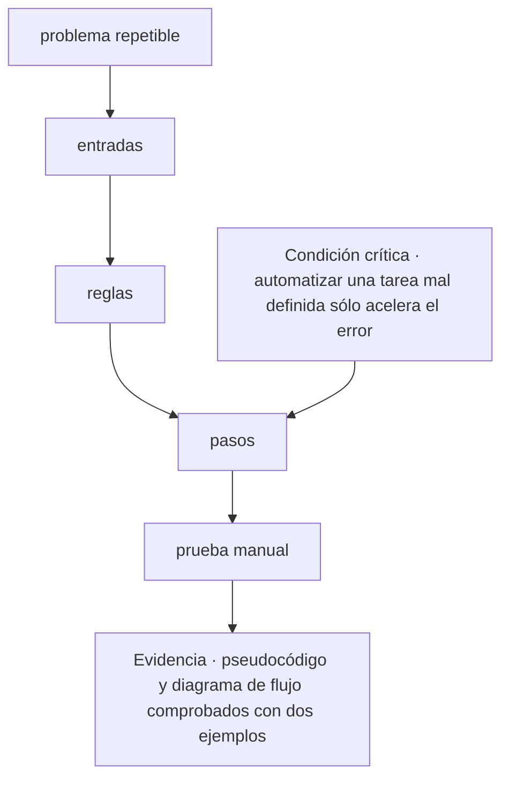
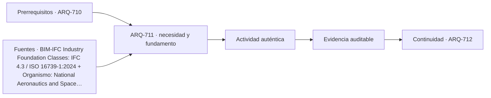

# ARQ-711 · Pensamiento algorítmico para proyectistas

**Parte 72 · Fase III · Profundización y especialización · Edición 2026.10.**

Material educativo independiente. Esta clase no sustituye formación acreditada, experiencia supervisada, encargo profesional, normativa vigente, cálculo firmado, permiso ni revisión de especialistas. Los datos del caso son didácticos y deben reemplazarse por antecedentes verificables antes de una aplicación real.

## Pregunta central

¿Cómo abordar pensamiento algorítmico para proyectistas y comprobar esta condición crítica: automatizar una tarea mal definida sólo acelera el error?

## Propósito, prerrequisitos y resultados de aprendizaje

La clase profundiza en **pensamiento algorítmico para proyectistas** para transformar reglas de diseño en modelos legibles, comprobables y transferibles sin delegar el juicio. Recibe de `ARQ-710` un registro de decisiones, fuentes y pendientes. No basta con reconocer vocabulario: el estudiante debe transformar una pregunta en un procedimiento que otra persona pueda reconstruir, criticar y corregir.

Al terminar podrás:

1. **identificar** los datos, actores, escalas y límites que condicionan una decisión sobre pensamiento algorítmico para proyectistas;
2. **comparar** al menos dos alternativas con una función común y criterios no intercambiables;
3. **producir** una evidencia propia para el portafolio de Fase III;
4. **justificar** qué parte puede resolver arquitectura, qué requiere colaboración especializada y qué permanece abierta;
5. **revisar** la decisión cuando cambie un supuesto, una fuente, una necesidad o una condición de uso.

La evidencia de salida será un componente del **modelo paramétrico versionado con pruebas, sensibilidad y alternativas** de la Parte 72.

## Conceptos y distinciones fundamentales

### Núcleo disciplinar de esta clase

Esta clase no trata el tema como una etiqueta. Su núcleo operativo articula **dato, tipo, unidad, relación geométrica, dependencia, algoritmo, tolerancia, prueba y versión**. Dentro de esa cadena, **pensamiento algorítmico para proyectistas** ocupa la posición 1 de la parte y delimita el problema y las variables que pertenecen al sistema. La pregunta decisiva es qué cambia en el proyecto cuando cambia una de esas entradas, cómo se observa el efecto y quién tiene autoridad para aceptar la consecuencia.

La secuencia propia de la clase es **problema repetible → entradas → reglas → pasos → prueba manual**. Su resultado concreto será **pseudocódigo y diagrama de flujo comprobados con dos ejemplos**. La revisión debe comprobar que **automatizar una tarea mal definida sólo acelera el error**. Estas tres frases funcionan como guía de lectura: el texto explica la secuencia, el ejercicio construye la evidencia y la evaluación intenta refutar una conclusión demasiado amplia.

El expediente específico debe poder aplicarse a **un sistema de protección solar paramétrico que debe responder a orientación, modulación, fabricación y mantenimiento sin ocultar reglas**. Cada elemento debe conservar escala, fecha, versión, responsable y relación con el producto acumulativo de la Parte 72. Cuando el dato no existe, se registra el método para obtenerlo; cuando una atribución corresponde a otra disciplina, se documenta la interfaz y el punto de coordinación.

Antes de producir, separa cuatro estados dentro de **pensamiento algorítmico para proyectistas**: el requisito que posee autoridad y versión; la preferencia que expresa un valor negociable; la hipótesis que permite avanzar y aún debe probarse; y la restricción que acota alternativas en este contexto. Escríbelos junto a **problema repetible**. Cuando uno cambie, recorre la secuencia y marca qué conclusiones dejan de ser válidas.

## Desarrollo paso a paso

### 1. Problema repetible

Empieza sin dibujar una solución. Describe qué se observa en **pensamiento algorítmico para proyectistas**, quién lo experimenta y dónde termina el sistema que analizarás. El foco es **dato**: registra una evidencia a favor, una señal que la contradiga y un vacío que todavía no puedes llenar. **la pregunta central** entrega el punto de partida; **entradas** sólo puede comenzar cuando la escala, el periodo y las personas afectadas quedan visibles. Cierra este paso con un croquis o esquema de situación y una frase que pueda resultar falsa. Así, **problema repetible** abre una investigación en vez de decorar una decisión ya tomada.

### 2. Entradas

Convierte **entradas** en una mesa de clasificación. Una columna recibe datos confirmados; otra, requisitos con autoridad y versión; una tercera, hipótesis; y una cuarta, desconocidos. En **pensamiento algorítmico para proyectistas**, la variable que merece atención es **tipo**. Comprueba unidades, fechas y procedencia antes de agrupar. Luego elige dos elementos que suelen confundirse y explica la diferencia con un ejemplo del caso. El resultado debe permitir pasar de **problema repetible** a **reglas** sin cambiar silenciosamente una definición. Si algo no cabe en ninguna columna, no lo fuerces: convierte esa incomodidad en una pregunta.

### 3. Reglas

Ahora cambia de lenguaje. Representa **reglas** mediante el medio que mejor revele **unidad**: planta para relaciones horizontales, sección para niveles y flujos, mapa para distribución, línea de tiempo para secuencias o diagrama para dependencias. En **pensamiento algorítmico para proyectistas**, cada trazo debe responder qué muestra y qué oculta. Anota escala, orientación, unidades y fuente junto a la figura. Superpone una segunda capa con dudas o conflictos; no los borres para limpiar la composición. Pide a otra persona que explique cómo **entradas** se transforma en **pasos** mirando sólo la gráfica. Lo que no pueda reconstruir señala la revisión necesaria.

### 4. Pasos

Usa **pasos** para explicar un mecanismo, no una coincidencia. Escribe una cadena breve: entrada → transformación → efecto → persona o sistema afectado. En **pensamiento algorítmico para proyectistas**, sigue especialmente **relación geométrica** y dibuja al menos un camino alternativo. Cambia una entrada y anticipa qué parte de **prueba manual** debería cambiar; después busca un caso que no obedezca esa expectativa. La explicación se acepta cuando distingue asociación, causa propuesta y límite de la evidencia. Si el salto desde **reglas** exige una pericia externa, formula la pregunta para esa especialidad y adjunta el antecedente que necesita para responder.

### 5. Prueba manual

En **prueba manual**, construye dos alternativas comparables para **pensamiento algorítmico para proyectistas**. Mantén constante la función principal y declara qué varía; si las fronteras no coinciden, corrígelas antes de puntuar. Evalúa **dependencia** con una medida y con una observación cualitativa, porque una cifra única puede esconder distribución, experiencia o riesgo. Incluye una condición que no pueda compensarse con ventajas en otros criterios. La salida hacia **pseudocódigo y diagrama de flujo comprobados con dos ejemplos** debe conservar la opción descartada y el motivo. Después invierte una preferencia del encargo: si la elección no cambia, explica por qué; si cambia, identifica el supuesto que realmente gobernaba la decisión.

### Lo que une la secuencia

Los 5 pasos no son una receta universal. En esta clase ordenan una decisión sobre **pensamiento algorítmico para proyectistas** dentro de **Programación, geometría y diseño computacional** y conducen a **pseudocódigo y diagrama de flujo comprobados con dos ejemplos**. Pueden repetirse cuando aparece evidencia contradictoria, pero no intercambiarse sin explicación: saltar desde **problema repetible** hasta **prueba manual** ocultaría precisamente el razonamiento que la entrega debe enseñar. La secuencia se detiene cuando **automatizar una tarea mal definida sólo acelera el error** no puede demostrarse.

## Contexto histórico, social y profesional

El contexto de trabajo es **un sistema de protección solar paramétrico que debe responder a orientación, modulación, fabricación y mantenimiento sin ocultar reglas**. Allí, el tema de pensamiento algorítmico para proyectistas no aparece como un problema aislado: se cruza con dato, tipo, unidad, relación geométrica, dependencia, algoritmo, tolerancia, prueba y versión. El estudiante debe preguntar quién definió cada categoría, quién falta en el registro y qué decisión histórica o institucional explica la situación actual. Una tecnología nueva sólo se incorpora cuando mejora una observación, una coordinación o una prueba identificable; su novedad no constituye evidencia.

En una práctica profesional, arquitectura puede formular el problema espacial, relacionar escalas, representar alternativas y coordinar el expediente. Para esta clase debe asignar autores y revisores a **entradas**, **pasos** y **pseudocódigo y diagrama de flujo comprobados con dos ejemplos**. Cuando una conclusión dependa de cálculo, diagnóstico o atribución regulada de otra disciplina, se redacta la pregunta de coordinación, se entrega el antecedente necesario y se conserva la respuesta. Esa interfaz también es parte del proyecto.

## Método: de la observación a una decisión trazable

1. **Delimita: problema repetible.** Declara la entrada, realiza una operación visible y entrega algo que pueda usarse en **entradas**. Añade al margen la duda que todavía puede modificar el paso.
2. **Ordena: entradas.** Declara la entrada, realiza una operación visible y entrega algo que pueda usarse en **reglas**. Añade al margen la duda que todavía puede modificar el paso.
3. **Dibuja: reglas.** Declara la entrada, realiza una operación visible y entrega algo que pueda usarse en **pasos**. Añade al margen la duda que todavía puede modificar el paso.
4. **Explica: pasos.** Declara la entrada, realiza una operación visible y entrega algo que pueda usarse en **prueba manual**. Añade al margen la duda que todavía puede modificar el paso.
5. **Compara: prueba manual.** Declara la entrada, realiza una operación visible y entrega algo que pueda usarse en **pseudocódigo y diagrama de flujo comprobados con dos ejemplos**. Añade al margen la duda que todavía puede modificar el paso.
6. **Intenta refutar el cierre.** Comprueba si **automatizar una tarea mal definida sólo acelera el error**; si la respuesta depende sólo de la apariencia del producto, vuelve al primer paso que no tenga evidencia.

La herramienta elegida debe permitir ejecutar esta secuencia, no reemplazarla. Para **pensamiento algorítmico para proyectistas**, anota entradas, unidades, versión y transformaciones; exporta un formato que otra persona pueda inspeccionar; y verifica **pasos** por un medio independiente proporcional a su consecuencia. Si intervienen automatización o IA, conserva también la instrucción, el resultado original, la revisión humana y el motivo de cada corrección.

## Mapa visual de la decisión

El diagrama es específico de **pensamiento algorítmico para proyectistas**. Se lee de arriba abajo y permite localizar un salto. Si el expediente pasa del primer al último nodo sin documentar los pasos intermedios, la conclusión todavía no es reproducible. La condición crítica entra antes del cierre porque debe cambiar o detener la decisión, no aparecer como advertencia tardía.

## Caso trabajado: EXP-711

El caso se sitúa en **un sistema de protección solar paramétrico que debe responder a orientación, modulación, fabricación y mantenimiento sin ocultar reglas**. El equipo debe abordar **pensamiento algorítmico para proyectistas** y entregar **pseudocódigo y diagrama de flujo comprobados con dos ejemplos**. La primera versión salta desde **problema repetible** hasta **prueba manual**: presenta una respuesta terminada, pero no permite saber cómo se tomaron las decisiones intermedias.

La revisión devuelve el trabajo a **entradas** y **reglas**. El equipo separa datos confirmados, hipótesis y desconocidos; identifica qué representación hace visible el mecanismo y asigna a una persona la comprobación de **pasos**. Esa corrección cambia la evidencia: deja de ser una afirmación ilustrada y se convierte en un procedimiento que otra persona puede repetir.

Antes de cerrar, la crítica aplica la condición **“automatizar una tarea mal definida sólo acelera el error”**. Si no se satisface, la entrega permanece abierta aunque su presentación sea convincente. El resultado del caso EXP-711 es una versión revisada de **pseudocódigo y diagrama de flujo comprobados con dos ejemplos**, acompañada por la objeción que produjo el cambio y por un asunto que todavía requiere investigación o revisión especializada.

## Práctica guiada

Construye una primera versión de **pseudocódigo y diagrama de flujo comprobados con dos ejemplos** siguiendo los 5 pasos del diagrama. Bajo cada paso escribe una entrada, una operación y una salida. Marca con un signo de interrogación lo que todavía no conoces; no lo conviertas en cero, promedio o supuesto oculto.

Intercambia el trabajo con otra persona. Debe poder señalar dónde se comprueba **automatizar una tarea mal definida sólo acelera el error** y reconstruir la transición desde **reglas** hasta **prueba manual** sin explicación oral. Registra dos dudas de esa lectura y corrige al menos una. La primera versión, las objeciones y la versión revisada forman parte de la evidencia.

## Ejercicio autónomo

Aplica la secuencia **problema repetible → entradas → reglas → pasos → prueba manual** a otro contexto, escala o grupo de personas. Produce **pseudocódigo y diagrama de flujo comprobados con dos ejemplos**, una versión inicial y una revisada. Explica qué se mantuvo, qué cambió y por qué los parámetros del caso trabajado no podían copiarse.

**Evidencia mínima de pensamiento algorítmico para proyectistas:** pseudocódigo y diagrama de flujo comprobados con dos ejemplos; diagrama de **problema repetible → entradas → reglas → pasos → prueba manual**; demostración de que **automatizar una tarea mal definida sólo acelera el error**; y registro de una revisión que haya cambiado el resultado. Guarda el expediente en `evidence/ARQ-711/evidencia.md` y enlázalo desde tu portafolio.

## Errores frecuentes y cómo corregirlos

- **Fallo crítico de esta clase:** Automatizar una tarea mal definida sólo acelera el error. En **pensamiento algorítmico para proyectistas**, localiza el paso que no lo demuestra y vuelve a producir la evidencia.
- **Comenzar por prueba manual:** muestra una respuesta sin explicar cómo se llegó a ella. Recupera **problema repetible** y conserva las decisiones intermedias.
- **Tratar entradas como trámite:** deja sin fundamento lo que sigue. Escribe su entrada, su operación y una salida que otra persona pueda revisar.
- **Entregar pseudocódigo y diagrama de flujo comprobados con dos ejemplos sin procedencia:** una evidencia sin fecha, escala, autor o fuente pierde alcance. Completa esos cuatro campos junto al producto.
- **Copiar parámetros del caso:** la forma del método puede transferirse, pero sus valores deben volver a medirse en cada contexto.
- **Ocultar la objeción:** registra la crítica que produjo un cambio; una versión perfecta desde el inicio impide evaluar el proceso.

## Evaluación y criterios de aceptación

La evidencia se acepta cuando:

1. produce **pseudocódigo y diagrama de flujo comprobados con dos ejemplos** y responde explícitamente a la pregunta central;
2. diferencia datos, requisitos, hipótesis, preferencias y desconocidos;
3. compara alternativas con función y fronteras equivalentes o justifica la diferencia;
4. permite reconstruir al menos una comprobación, incluidas unidades, versión y fuente;
5. conserva una condición crítica fuera de cualquier promedio compensatorio;
6. identifica responsabilidades y no atribuye al estudiante competencias profesionales reguladas;
7. incluye revisión sustantiva entre dos versiones y explica la consecuencia;
8. demuestra que **automatizar una tarea mal definida sólo acelera el error** y enlaza la evidencia con `ARQ-712`.

La rúbrica común permite comparar el avance del programa; estos criterios deciden la aceptación de **pseudocódigo y diagrama de flujo comprobados con dos ejemplos**. Una presentación convincente permanece pendiente cuando **automatizar una tarea mal definida sólo acelera el error** no puede comprobarse o la fuente utilizada no sostiene la conclusión.

## Autoevaluación, recuperación y reflexión crítica

Sin mirar el texto, reconstruye la secuencia **problema repetible → entradas → reglas → pasos → prueba manual** y nombra la evidencia que produce cada transición. Explica por qué **automatizar una tarea mal definida sólo acelera el error**. Si no puedes localizar esa comprobación en tu entrega, vuelve al diagrama y sustituye una afirmación vaga por una operación observable.

Para recuperar **pensamiento algorítmico para proyectistas**, vuelve 24–48 horas después y dibuja de memoria **problema repetible → entradas → … → prueba manual**. Aplícala a otro actor o escala y marca en otro color los parámetros que tuviste que volver a investigar. Cierra preguntando quién recibe el beneficio de **pseudocódigo y diagrama de flujo comprobados con dos ejemplos**, quién asume su costo, quién queda fuera de sus datos y quién podrá corregirla más adelante.

**Conexión siguiente:** `ARQ-712` reutiliza la matriz, la representación y el registro de cambios. Lleva la evidencia, no las cifras del caso.

<!-- pedagogia-2026:inicio -->
## Decisión pedagógica y posición curricular

### Por qué existe

Esta clase existe para resolver una necesidad concreta del recorrido: ¿Cómo abordar pensamiento algorítmico para proyectistas y comprobar esta condición crítica: automatizar una tarea mal definida sólo acelera el error?

### Por qué está exactamente aquí

Abre la Parte 72 porque plantea primero el problema «¿Cómo abordar pensamiento algorítmico para proyectistas y comprobar esta condición crítica: automatizar una tarea mal definida sólo acelera el error?». La transición desde ARQ-710 · Publicación accesible y portafolio multiformato conserva métodos de evidencia y límites, pero no traslada parámetros del bloque anterior. Establece la pregunta y el producto base que ARQ-712 · Datos, tipos, unidades y estructuras desarrollará a continuación.

- **Prerrequisitos:** `ARQ-710`
- **Capacidad que introduce:** La clase profundiza en pensamiento algorítmico para proyectistas para transformar reglas de diseño en modelos legibles, comprobables y transferibles sin delegar el juicio. Recibe de ARQ-710 un registro de decisiones, fuentes y pendientes. No basta con reconocer vocabulario: el estudiante debe transformar una pregunta en un procedimiento que otra persona pueda reconstruir, criticar y corregir.
- **Clases o experiencias que dependen de ella:** `ARQ-712`

El diagrama permite comprobar una relación que el texto lineal oculta con facilidad: esta clase recibe capacidades previas, toma decisiones apoyadas por fuentes, exige una experiencia y produce evidencia que habilita trabajo posterior. No representa un procedimiento de obra.

## Resultado observable, evidencia y evaluación

1. Identificar y delimitar las condiciones necesarias para responder la pregunta central de pensamiento algorítmico para proyectistas.
2. Producir y comprobar la evidencia declarada por la clase: La clase profundiza en pensamiento algorítmico para proyectistas para transformar reglas de diseño en modelos legibles, comprobables y transferibles sin delegar el juicio. Recibe de ARQ-710 un registro de decisiones, fuentes y pendientes. No basta con reconocer vocabulario: el estudiante debe transformar una pregunta en un procedimiento que otra persona pueda reconstruir, criticar y corregir.
3. Justificar una decisión de pensamiento algorítmico para proyectistas mediante fuentes, supuestos, alternativas y límites explícitos.

## Actividad, evidencia y criterio de aceptación

**Actividad:** Construye una primera versión de pseudocódigo y diagrama de flujo comprobados con dos ejemplos siguiendo los 5 pasos del diagrama. Bajo cada paso escribe una entrada, una operación y una salida. Marca con un signo de interrogación lo que todavía no conoces; no lo conviertas en cero, promedio o supuesto oculto.

**Evidencia mínima:** La clase profundiza en pensamiento algorítmico para proyectistas para transformar reglas de diseño en modelos legibles, comprobables y transferibles sin delegar el juicio. Recibe de ARQ-710 un registro de decisiones, fuentes y pendientes. No basta con reconocer vocabulario: el estudiante debe transformar una pregunta en un procedimiento que otra persona pueda reconstruir, criticar y corregir.

**Archivo sugerido:** `evidence/ARQ-711/evidencia.md`.

**Criterio de aceptación:** la entrega se acepta cuando:

- La entrega responde explícitamente a la pregunta: ¿Cómo abordar pensamiento algorítmico para proyectistas y comprobar esta condición crítica: automatizar una tarea mal definida sólo acelera el error?
- La actividad conserva las fronteras del caso y permite reconstruir el procedimiento: Construye una primera versión de pseudocódigo y diagrama de flujo comprobados con dos ejemplos siguiendo los 5 pasos del diagrama. Bajo cada paso escribe una entrada, una operación y una salida. Marca con un signo de interrogación lo que todavía no conoces; no lo conviertas en cero, promedio o supuesto oculto.
- Cada afirmación externa puede seguirse hasta una fuente, su alcance consultado y su límite.
- La evidencia deja disponible una entrada comprobable para ARQ-712.
- - Fallo crítico de esta clase: Automatizar una tarea mal definida sólo acelera el error. En pensamiento algorítmico para proyectistas , localiza el paso que no lo demuestra y vuelve a producir la evidencia.

La [rúbrica común](../../docs/RUBRICA_COMUN.md) complementa estos criterios; no los reemplaza. Una entrega puede superar un promedio y continuar pendiente si oculta una condición crítica.

## Trazabilidad de las decisiones

| # | Decisión o fundamento | Fuente utilizada | Aplicación y límite en esta clase |
|---:|---|---|---|
| 1 | Estructura abierta de intercambio de información para activos construidos. | [BIM-IFC Industry Foundation Classes: IFC 4.3 / ISO 16739-1:2024](https://www.buildingsmart.org/standards/bsi-standards/industry-foundation-classes/) | Consulta: página o documento oficial identificado en el enlace. Límite: La existencia del estándar no garantiza interoperabilidad, calidad semántica ni adecuación del modelo a un uso concreto. Fecha de |
| 2 | Distinción entre verificación, validación, requisitos, producto y uso previsto. | [Organismo: National Aeronautics and Space Administration. Consulta:…](https://www.nasa.gov/reference/5-0-product-realization/) | Consulta: página o documento oficial identificado en el enlace. Límite: Método de ingeniería de sistemas transferido con límites; no valida automáticamente un edificio o una simulación. Fecha de |

La tabla permite auditar las relaciones; la explicación, el caso y la práctica de la clase siguen siendo la documentación principal.

## Autoevaluación, recuperación y continuidad

### Errores diagnósticos

Antes de avanzar, comprueba si puedes reconstruir cada resultado sin mirar la solución, señalar qué evidencia lo sostiene y nombrar una condición que obligaría a revisar tu decisión. Conserva la primera versión, la objeción recibida y la revisión.

**Conexión siguiente:** La continuidad inmediata es ARQ-712 · Datos, tipos, unidades y estructuras; conserva el método y vuelve a verificar datos y límites.
<!-- pedagogia-2026:fin -->

## Fuentes y alcance de uso

### [[IFC]] Industry Foundation Classes: IFC 4.3 / ISO 16739-1:2024

buildingSMART International. [https://www.buildingsmart.org/standards/bsi-standards/industry-foundation-classes/](https://www.buildingsmart.org/standards/bsi-standards/industry-foundation-classes/)

**Consulta:** página o documento oficial identificado en el enlace. **Apoyo:** Estructura abierta de intercambio de información para activos construidos. **Límite:** La existencia del estándar no garantiza interoperabilidad, calidad semántica ni adecuación del modelo a un uso concreto. **Fecha de consulta:** 6 de octubre de 2026.

### [[NASA-VERIFY]] NASA Systems Engineering Handbook: Product Realization

National Aeronautics and Space Administration. [https://www.nasa.gov/reference/5-0-product-realization/](https://www.nasa.gov/reference/5-0-product-realization/)

**Consulta:** página o documento oficial identificado en el enlace. **Apoyo:** Distinción entre verificación, validación, requisitos, producto y uso previsto. **Límite:** Método de ingeniería de sistemas transferido con límites; no valida automáticamente un edificio o una simulación. **Fecha de consulta:** 6 de octubre de 2026.
