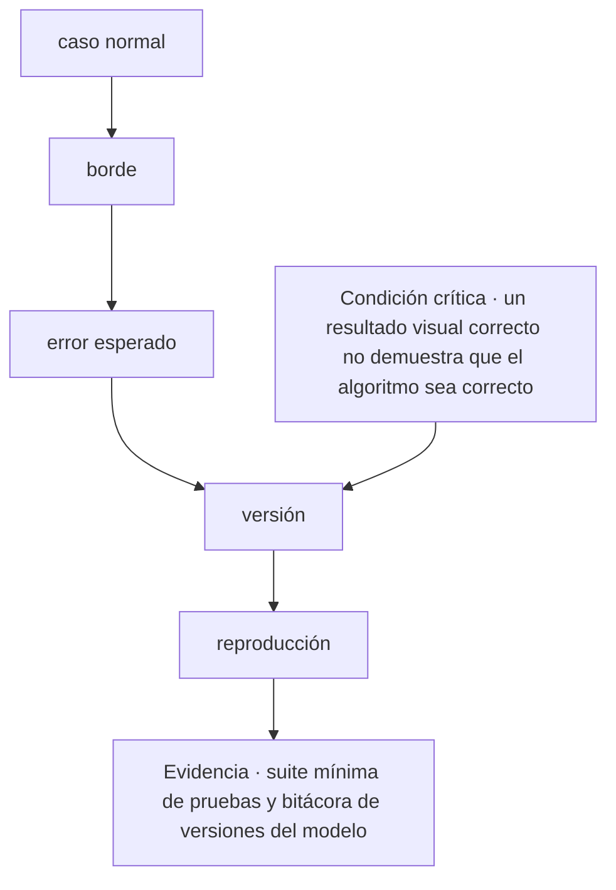
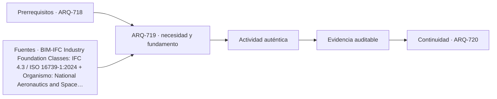

# ARQ-719 · Pruebas, versiones y reproducibilidad del código

**Parte 72 · Fase III · Profundización y especialización · Edición 2026.10.**

Material educativo independiente. Esta clase no sustituye formación acreditada, experiencia supervisada, encargo profesional, normativa vigente, cálculo firmado, permiso ni revisión de especialistas. Los datos del caso son didácticos y deben reemplazarse por antecedentes verificables antes de una aplicación real.

## Pregunta central

¿Cómo abordar pruebas, versiones y reproducibilidad del código y comprobar esta condición crítica: un resultado visual correcto no demuestra que el algoritmo sea correcto?

## Propósito, prerrequisitos y resultados de aprendizaje

La clase profundiza en **pruebas, versiones y reproducibilidad del código** para transformar reglas de diseño en modelos legibles, comprobables y transferibles sin delegar el juicio. Recibe de `ARQ-718` un registro de decisiones, fuentes y pendientes. No basta con reconocer vocabulario: el estudiante debe transformar una pregunta en un procedimiento que otra persona pueda reconstruir, criticar y corregir.

Al terminar podrás:

1. **identificar** los datos, actores, escalas y límites que condicionan una decisión sobre pruebas, versiones y reproducibilidad del código;
2. **comparar** al menos dos alternativas con una función común y criterios no intercambiables;
3. **producir** una evidencia propia para el portafolio de Fase III;
4. **justificar** qué parte puede resolver arquitectura, qué requiere colaboración especializada y qué permanece abierta;
5. **revisar** la decisión cuando cambie un supuesto, una fuente, una necesidad o una condición de uso.

La evidencia de salida será un componente del **modelo paramétrico versionado con pruebas, sensibilidad y alternativas** de la Parte 72.

## Conceptos y distinciones fundamentales

### Núcleo disciplinar de esta clase

Esta clase no trata el tema como una etiqueta. Su núcleo operativo articula **dato, tipo, unidad, relación geométrica, dependencia, algoritmo, tolerancia, prueba y versión**. Dentro de esa cadena, **pruebas, versiones y reproducibilidad del código** ocupa la posición 9 de la parte y valida mediante un método independiente y define seguimiento. La pregunta decisiva es qué cambia en el proyecto cuando cambia una de esas entradas, cómo se observa el efecto y quién tiene autoridad para aceptar la consecuencia.

La secuencia propia de la clase es **caso normal → borde → error esperado → versión → reproducción**. Su resultado concreto será **suite mínima de pruebas y bitácora de versiones del modelo**. La revisión debe comprobar que **un resultado visual correcto no demuestra que el algoritmo sea correcto**. Estas tres frases funcionan como guía de lectura: el texto explica la secuencia, el ejercicio construye la evidencia y la evaluación intenta refutar una conclusión demasiado amplia.

El expediente específico debe poder aplicarse a **un sistema de protección solar paramétrico que debe responder a orientación, modulación, fabricación y mantenimiento sin ocultar reglas**. Cada elemento debe conservar escala, fecha, versión, responsable y relación con el producto acumulativo de la Parte 72. Cuando el dato no existe, se registra el método para obtenerlo; cuando una atribución corresponde a otra disciplina, se documenta la interfaz y el punto de coordinación.

Antes de producir, separa cuatro estados dentro de **pruebas, versiones y reproducibilidad del código**: el requisito que posee autoridad y versión; la preferencia que expresa un valor negociable; la hipótesis que permite avanzar y aún debe probarse; y la restricción que acota alternativas en este contexto. Escríbelos junto a **caso normal**. Cuando uno cambie, recorre la secuencia y marca qué conclusiones dejan de ser válidas.

## Desarrollo paso a paso

### 1. Caso normal

Empieza sin dibujar una solución. Describe qué se observa en **pruebas, versiones y reproducibilidad del código**, quién lo experimenta y dónde termina el sistema que analizarás. El foco es **dato**: registra una evidencia a favor, una señal que la contradiga y un vacío que todavía no puedes llenar. **la pregunta central** entrega el punto de partida; **borde** sólo puede comenzar cuando la escala, el periodo y las personas afectadas quedan visibles. Cierra este paso con un croquis o esquema de situación y una frase que pueda resultar falsa. Así, **caso normal** abre una investigación en vez de decorar una decisión ya tomada.

### 2. Borde

Convierte **borde** en una mesa de clasificación. Una columna recibe datos confirmados; otra, requisitos con autoridad y versión; una tercera, hipótesis; y una cuarta, desconocidos. En **pruebas, versiones y reproducibilidad del código**, la variable que merece atención es **tipo**. Comprueba unidades, fechas y procedencia antes de agrupar. Luego elige dos elementos que suelen confundirse y explica la diferencia con un ejemplo del caso. El resultado debe permitir pasar de **caso normal** a **error esperado** sin cambiar silenciosamente una definición. Si algo no cabe en ninguna columna, no lo fuerces: convierte esa incomodidad en una pregunta.

### 3. Error esperado

Ahora cambia de lenguaje. Representa **error esperado** mediante el medio que mejor revele **unidad**: planta para relaciones horizontales, sección para niveles y flujos, mapa para distribución, línea de tiempo para secuencias o diagrama para dependencias. En **pruebas, versiones y reproducibilidad del código**, cada trazo debe responder qué muestra y qué oculta. Anota escala, orientación, unidades y fuente junto a la figura. Superpone una segunda capa con dudas o conflictos; no los borres para limpiar la composición. Pide a otra persona que explique cómo **borde** se transforma en **versión** mirando sólo la gráfica. Lo que no pueda reconstruir señala la revisión necesaria.

### 4. Versión

Usa **versión** para explicar un mecanismo, no una coincidencia. Escribe una cadena breve: entrada → transformación → efecto → persona o sistema afectado. En **pruebas, versiones y reproducibilidad del código**, sigue especialmente **relación geométrica** y dibuja al menos un camino alternativo. Cambia una entrada y anticipa qué parte de **reproducción** debería cambiar; después busca un caso que no obedezca esa expectativa. La explicación se acepta cuando distingue asociación, causa propuesta y límite de la evidencia. Si el salto desde **error esperado** exige una pericia externa, formula la pregunta para esa especialidad y adjunta el antecedente que necesita para responder.

### 5. Reproducción

En **reproducción**, construye dos alternativas comparables para **pruebas, versiones y reproducibilidad del código**. Mantén constante la función principal y declara qué varía; si las fronteras no coinciden, corrígelas antes de puntuar. Evalúa **dependencia** con una medida y con una observación cualitativa, porque una cifra única puede esconder distribución, experiencia o riesgo. Incluye una condición que no pueda compensarse con ventajas en otros criterios. La salida hacia **suite mínima de pruebas y bitácora de versiones del modelo** debe conservar la opción descartada y el motivo. Después invierte una preferencia del encargo: si la elección no cambia, explica por qué; si cambia, identifica el supuesto que realmente gobernaba la decisión.

### Lo que une la secuencia

Los 5 pasos no son una receta universal. En esta clase ordenan una decisión sobre **pruebas, versiones y reproducibilidad del código** dentro de **Programación, geometría y diseño computacional** y conducen a **suite mínima de pruebas y bitácora de versiones del modelo**. Pueden repetirse cuando aparece evidencia contradictoria, pero no intercambiarse sin explicación: saltar desde **caso normal** hasta **reproducción** ocultaría precisamente el razonamiento que la entrega debe enseñar. La secuencia se detiene cuando **un resultado visual correcto no demuestra que el algoritmo sea correcto** no puede demostrarse.

## Contexto histórico, social y profesional

El contexto de trabajo es **un sistema de protección solar paramétrico que debe responder a orientación, modulación, fabricación y mantenimiento sin ocultar reglas**. Allí, el tema de pruebas, versiones y reproducibilidad del código no aparece como un problema aislado: se cruza con dato, tipo, unidad, relación geométrica, dependencia, algoritmo, tolerancia, prueba y versión. El estudiante debe preguntar quién definió cada categoría, quién falta en el registro y qué decisión histórica o institucional explica la situación actual. Una tecnología nueva sólo se incorpora cuando mejora una observación, una coordinación o una prueba identificable; su novedad no constituye evidencia.

En una práctica profesional, arquitectura puede formular el problema espacial, relacionar escalas, representar alternativas y coordinar el expediente. Para esta clase debe asignar autores y revisores a **borde**, **versión** y **suite mínima de pruebas y bitácora de versiones del modelo**. Cuando una conclusión dependa de cálculo, diagnóstico o atribución regulada de otra disciplina, se redacta la pregunta de coordinación, se entrega el antecedente necesario y se conserva la respuesta. Esa interfaz también es parte del proyecto.

## Método: de la observación a una decisión trazable

1. **Verifica: caso normal.** Declara la entrada, realiza una operación visible y entrega algo que pueda usarse en **borde**. Añade al margen la duda que todavía puede modificar el paso.
2. **Transfiere: borde.** Declara la entrada, realiza una operación visible y entrega algo que pueda usarse en **error esperado**. Añade al margen la duda que todavía puede modificar el paso.
3. **Delimita: error esperado.** Declara la entrada, realiza una operación visible y entrega algo que pueda usarse en **versión**. Añade al margen la duda que todavía puede modificar el paso.
4. **Ordena: versión.** Declara la entrada, realiza una operación visible y entrega algo que pueda usarse en **reproducción**. Añade al margen la duda que todavía puede modificar el paso.
5. **Dibuja: reproducción.** Declara la entrada, realiza una operación visible y entrega algo que pueda usarse en **suite mínima de pruebas y bitácora de versiones del modelo**. Añade al margen la duda que todavía puede modificar el paso.
6. **Intenta refutar el cierre.** Comprueba si **un resultado visual correcto no demuestra que el algoritmo sea correcto**; si la respuesta depende sólo de la apariencia del producto, vuelve al primer paso que no tenga evidencia.

La herramienta elegida debe permitir ejecutar esta secuencia, no reemplazarla. Para **pruebas, versiones y reproducibilidad del código**, anota entradas, unidades, versión y transformaciones; exporta un formato que otra persona pueda inspeccionar; y verifica **versión** por un medio independiente proporcional a su consecuencia. Si intervienen automatización o IA, conserva también la instrucción, el resultado original, la revisión humana y el motivo de cada corrección.

## Mapa visual de la decisión

El diagrama es específico de **pruebas, versiones y reproducibilidad del código**. Se lee de arriba abajo y permite localizar un salto. Si el expediente pasa del primer al último nodo sin documentar los pasos intermedios, la conclusión todavía no es reproducible. La condición crítica entra antes del cierre porque debe cambiar o detener la decisión, no aparecer como advertencia tardía.

## Caso trabajado: EXP-719

El caso se sitúa en **un sistema de protección solar paramétrico que debe responder a orientación, modulación, fabricación y mantenimiento sin ocultar reglas**. El equipo debe abordar **pruebas, versiones y reproducibilidad del código** y entregar **suite mínima de pruebas y bitácora de versiones del modelo**. La primera versión salta desde **caso normal** hasta **reproducción**: presenta una respuesta terminada, pero no permite saber cómo se tomaron las decisiones intermedias.

La revisión devuelve el trabajo a **borde** y **error esperado**. El equipo separa datos confirmados, hipótesis y desconocidos; identifica qué representación hace visible el mecanismo y asigna a una persona la comprobación de **versión**. Esa corrección cambia la evidencia: deja de ser una afirmación ilustrada y se convierte en un procedimiento que otra persona puede repetir.

Antes de cerrar, la crítica aplica la condición **“un resultado visual correcto no demuestra que el algoritmo sea correcto”**. Si no se satisface, la entrega permanece abierta aunque su presentación sea convincente. El resultado del caso EXP-719 es una versión revisada de **suite mínima de pruebas y bitácora de versiones del modelo**, acompañada por la objeción que produjo el cambio y por un asunto que todavía requiere investigación o revisión especializada.

## Práctica guiada

Construye una primera versión de **suite mínima de pruebas y bitácora de versiones del modelo** siguiendo los 5 pasos del diagrama. Bajo cada paso escribe una entrada, una operación y una salida. Marca con un signo de interrogación lo que todavía no conoces; no lo conviertas en cero, promedio o supuesto oculto.

Intercambia el trabajo con otra persona. Debe poder señalar dónde se comprueba **un resultado visual correcto no demuestra que el algoritmo sea correcto** y reconstruir la transición desde **error esperado** hasta **reproducción** sin explicación oral. Registra dos dudas de esa lectura y corrige al menos una. La primera versión, las objeciones y la versión revisada forman parte de la evidencia.

## Ejercicio autónomo

Aplica la secuencia **caso normal → borde → error esperado → versión → reproducción** a otro contexto, escala o grupo de personas. Produce **suite mínima de pruebas y bitácora de versiones del modelo**, una versión inicial y una revisada. Explica qué se mantuvo, qué cambió y por qué los parámetros del caso trabajado no podían copiarse.

**Evidencia mínima de pruebas, versiones y reproducibilidad del código:** suite mínima de pruebas y bitácora de versiones del modelo; diagrama de **caso normal → borde → error esperado → versión → reproducción**; demostración de que **un resultado visual correcto no demuestra que el algoritmo sea correcto**; y registro de una revisión que haya cambiado el resultado. Guarda el expediente en `evidence/ARQ-719/evidencia.md` y enlázalo desde tu portafolio.

## Errores frecuentes y cómo corregirlos

- **Fallo crítico de esta clase:** Un resultado visual correcto no demuestra que el algoritmo sea correcto. En **pruebas, versiones y reproducibilidad del código**, localiza el paso que no lo demuestra y vuelve a producir la evidencia.
- **Comenzar por reproducción:** muestra una respuesta sin explicar cómo se llegó a ella. Recupera **caso normal** y conserva las decisiones intermedias.
- **Tratar borde como trámite:** deja sin fundamento lo que sigue. Escribe su entrada, su operación y una salida que otra persona pueda revisar.
- **Entregar suite mínima de pruebas y bitácora de versiones del modelo sin procedencia:** una evidencia sin fecha, escala, autor o fuente pierde alcance. Completa esos cuatro campos junto al producto.
- **Copiar parámetros del caso:** la forma del método puede transferirse, pero sus valores deben volver a medirse en cada contexto.
- **Ocultar la objeción:** registra la crítica que produjo un cambio; una versión perfecta desde el inicio impide evaluar el proceso.

## Evaluación y criterios de aceptación

La evidencia se acepta cuando:

1. produce **suite mínima de pruebas y bitácora de versiones del modelo** y responde explícitamente a la pregunta central;
2. diferencia datos, requisitos, hipótesis, preferencias y desconocidos;
3. compara alternativas con función y fronteras equivalentes o justifica la diferencia;
4. permite reconstruir al menos una comprobación, incluidas unidades, versión y fuente;
5. conserva una condición crítica fuera de cualquier promedio compensatorio;
6. identifica responsabilidades y no atribuye al estudiante competencias profesionales reguladas;
7. incluye revisión sustantiva entre dos versiones y explica la consecuencia;
8. demuestra que **un resultado visual correcto no demuestra que el algoritmo sea correcto** y enlaza la evidencia con `ARQ-720`.

La rúbrica común permite comparar el avance del programa; estos criterios deciden la aceptación de **suite mínima de pruebas y bitácora de versiones del modelo**. Una presentación convincente permanece pendiente cuando **un resultado visual correcto no demuestra que el algoritmo sea correcto** no puede comprobarse o la fuente utilizada no sostiene la conclusión.

## Autoevaluación, recuperación y reflexión crítica

Sin mirar el texto, reconstruye la secuencia **caso normal → borde → error esperado → versión → reproducción** y nombra la evidencia que produce cada transición. Explica por qué **un resultado visual correcto no demuestra que el algoritmo sea correcto**. Si no puedes localizar esa comprobación en tu entrega, vuelve al diagrama y sustituye una afirmación vaga por una operación observable.

Para recuperar **pruebas, versiones y reproducibilidad del código**, vuelve 24–48 horas después y dibuja de memoria **caso normal → borde → … → reproducción**. Aplícala a otro actor o escala y marca en otro color los parámetros que tuviste que volver a investigar. Cierra preguntando quién recibe el beneficio de **suite mínima de pruebas y bitácora de versiones del modelo**, quién asume su costo, quién queda fuera de sus datos y quién podrá corregirla más adelante.

**Conexión siguiente:** `ARQ-720` reutiliza la matriz, la representación y el registro de cambios. Lleva la evidencia, no las cifras del caso.

<!-- pedagogia-2026:inicio -->
## Decisión pedagógica y posición curricular

### Por qué existe

Esta clase existe para resolver una necesidad concreta del recorrido: ¿Cómo abordar pruebas, versiones y reproducibilidad del código y comprobar esta condición crítica: un resultado visual correcto no demuestra que el algoritmo sea correcto?

### Por qué está exactamente aquí

Ocupa el lugar 9 de la Parte 72. Se estudia después de ARQ-718 · Optimización multiobjetivo y frentes de Pareto porque usa esa base para responder «¿Cómo abordar pruebas, versiones y reproducibilidad del código y comprobar esta condición crítica: un resultado visual correcto no demuestra que el algoritmo sea correcto?». Se ubica antes de ARQ-720 · Proyecto computacional: regla, modelo y fabricación porque la evidencia producida aquí debe estar disponible para ese paso.

- **Prerrequisitos:** `ARQ-718`
- **Capacidad que introduce:** La clase profundiza en pruebas, versiones y reproducibilidad del código para transformar reglas de diseño en modelos legibles, comprobables y transferibles sin delegar el juicio. Recibe de ARQ-718 un registro de decisiones, fuentes y pendientes. No basta con reconocer vocabulario: el estudiante debe transformar una pregunta en un procedimiento que otra persona pueda reconstruir, criticar y corregir.
- **Clases o experiencias que dependen de ella:** `ARQ-720`

El diagrama permite comprobar una relación que el texto lineal oculta con facilidad: esta clase recibe capacidades previas, toma decisiones apoyadas por fuentes, exige una experiencia y produce evidencia que habilita trabajo posterior. No representa un procedimiento de obra.

## Resultado observable, evidencia y evaluación

1. Identificar y delimitar las condiciones necesarias para responder la pregunta central de pruebas, versiones y reproducibilidad del código.
2. Producir y comprobar la evidencia declarada por la clase: La clase profundiza en pruebas, versiones y reproducibilidad del código para transformar reglas de diseño en modelos legibles, comprobables y transferibles sin delegar el juicio. Recibe de ARQ-718 un registro de decisiones, fuentes y pendientes. No basta con reconocer vocabulario: el estudiante debe transformar una pregunta en un procedimiento que otra persona pueda reconstruir, criticar y corregir.
3. Justificar una decisión de pruebas, versiones y reproducibilidad del código mediante fuentes, supuestos, alternativas y límites explícitos.

## Actividad, evidencia y criterio de aceptación

**Actividad:** Construye una primera versión de suite mínima de pruebas y bitácora de versiones del modelo siguiendo los 5 pasos del diagrama. Bajo cada paso escribe una entrada, una operación y una salida. Marca con un signo de interrogación lo que todavía no conoces; no lo conviertas en cero, promedio o supuesto oculto.

**Evidencia mínima:** La clase profundiza en pruebas, versiones y reproducibilidad del código para transformar reglas de diseño en modelos legibles, comprobables y transferibles sin delegar el juicio. Recibe de ARQ-718 un registro de decisiones, fuentes y pendientes. No basta con reconocer vocabulario: el estudiante debe transformar una pregunta en un procedimiento que otra persona pueda reconstruir, criticar y corregir.

**Archivo sugerido:** `evidence/ARQ-719/evidencia.md`.

**Criterio de aceptación:** la entrega se acepta cuando:

- La entrega responde explícitamente a la pregunta: ¿Cómo abordar pruebas, versiones y reproducibilidad del código y comprobar esta condición crítica: un resultado visual correcto no demuestra que el algoritmo sea correcto?
- La actividad conserva las fronteras del caso y permite reconstruir el procedimiento: Construye una primera versión de suite mínima de pruebas y bitácora de versiones del modelo siguiendo los 5 pasos del diagrama. Bajo cada paso escribe una entrada, una operación y una salida. Marca con un signo de interrogación lo que todavía no conoces; no lo conviertas en cero, promedio o supuesto oculto.
- Cada afirmación externa puede seguirse hasta una fuente, su alcance consultado y su límite.
- La evidencia deja disponible una entrada comprobable para ARQ-720.
- - Fallo crítico de esta clase: Un resultado visual correcto no demuestra que el algoritmo sea correcto. En pruebas, versiones y reproducibilidad del código , localiza el paso que no lo demuestra y vuelve a producir la evidencia.

La [rúbrica común](../../docs/RUBRICA_COMUN.md) complementa estos criterios; no los reemplaza. Una entrega puede superar un promedio y continuar pendiente si oculta una condición crítica.

## Trazabilidad de las decisiones

| # | Decisión o fundamento | Fuente utilizada | Aplicación y límite en esta clase |
|---:|---|---|---|
| 1 | Estructura abierta de intercambio de información para activos construidos. | [BIM-IFC Industry Foundation Classes: IFC 4.3 / ISO 16739-1:2024](https://www.buildingsmart.org/standards/bsi-standards/industry-foundation-classes/) | Consulta: página o documento oficial identificado en el enlace. Límite: La existencia del estándar no garantiza interoperabilidad, calidad semántica ni adecuación del modelo a un uso concreto. Fecha de |
| 2 | Distinción entre verificación, validación, requisitos, producto y uso previsto. | [Organismo: National Aeronautics and Space Administration. Consulta:…](https://www.nasa.gov/reference/5-0-product-realization/) | Consulta: página o documento oficial identificado en el enlace. Límite: Método de ingeniería de sistemas transferido con límites; no valida automáticamente un edificio o una simulación. Fecha de |

La tabla permite auditar las relaciones; la explicación, el caso y la práctica de la clase siguen siendo la documentación principal.

## Autoevaluación, recuperación y continuidad

### Errores diagnósticos

Antes de avanzar, comprueba si puedes reconstruir cada resultado sin mirar la solución, señalar qué evidencia lo sostiene y nombrar una condición que obligaría a revisar tu decisión. Conserva la primera versión, la objeción recibida y la revisión.

**Conexión siguiente:** La continuidad inmediata es ARQ-720 · Proyecto computacional: regla, modelo y fabricación; conserva el método y vuelve a verificar datos y límites.
<!-- pedagogia-2026:fin -->

## Fuentes y alcance de uso

### [[IFC]] Industry Foundation Classes: IFC 4.3 / ISO 16739-1:2024

buildingSMART International. [https://www.buildingsmart.org/standards/bsi-standards/industry-foundation-classes/](https://www.buildingsmart.org/standards/bsi-standards/industry-foundation-classes/)

**Consulta:** página o documento oficial identificado en el enlace. **Apoyo:** Estructura abierta de intercambio de información para activos construidos. **Límite:** La existencia del estándar no garantiza interoperabilidad, calidad semántica ni adecuación del modelo a un uso concreto. **Fecha de consulta:** 6 de octubre de 2026.

### [[NASA-VERIFY]] NASA Systems Engineering Handbook: Product Realization

National Aeronautics and Space Administration. [https://www.nasa.gov/reference/5-0-product-realization/](https://www.nasa.gov/reference/5-0-product-realization/)

**Consulta:** página o documento oficial identificado en el enlace. **Apoyo:** Distinción entre verificación, validación, requisitos, producto y uso previsto. **Límite:** Método de ingeniería de sistemas transferido con límites; no valida automáticamente un edificio o una simulación. **Fecha de consulta:** 6 de octubre de 2026.
