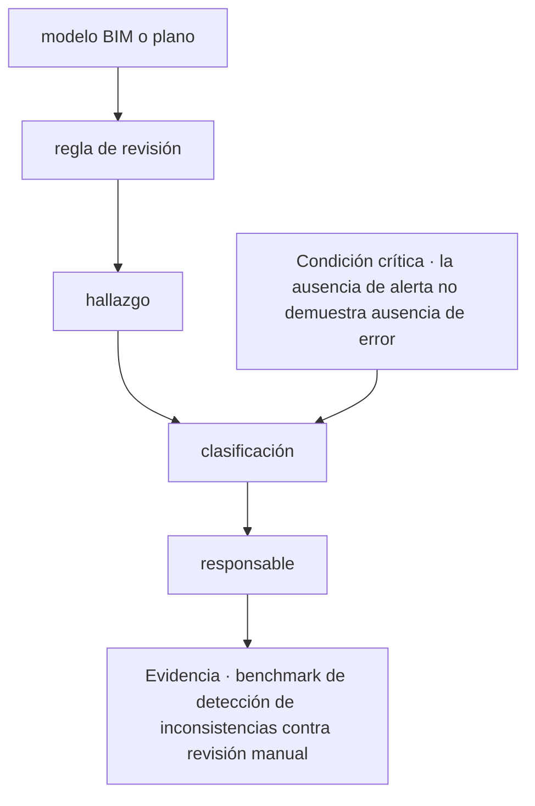
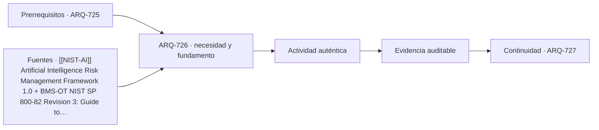

# ARQ-726 · IA en BIM, planos y detección de inconsistencias

**Parte 73 · Fase III · Profundización y especialización · Edición 2026.10.**

Material educativo independiente. Esta clase no sustituye formación acreditada, experiencia supervisada, encargo profesional, normativa vigente, cálculo firmado, permiso ni revisión de especialistas. Los datos del caso son didácticos y deben reemplazarse por antecedentes verificables antes de una aplicación real.

## Pregunta central

¿Cómo abordar ia en bim, planos y detección de inconsistencias y comprobar esta condición crítica: la ausencia de alerta no demuestra ausencia de error?

## Propósito, prerrequisitos y resultados de aprendizaje

La clase profundiza en **ia en bim, planos y detección de inconsistencias** para usar IA como sistema sujeto a propósito, procedencia, evaluación y supervisión humana en cada fase del activo. Recibe de `ARQ-725` un registro de decisiones, fuentes y pendientes. No basta con reconocer vocabulario: el estudiante debe transformar una pregunta en un procedimiento que otra persona pueda reconstruir, criticar y corregir.

Al terminar podrás:

1. **identificar** los datos, actores, escalas y límites que condicionan una decisión sobre ia en bim, planos y detección de inconsistencias;
2. **comparar** al menos dos alternativas con una función común y criterios no intercambiables;
3. **producir** una evidencia propia para el portafolio de Fase III;
4. **justificar** qué parte puede resolver arquitectura, qué requiere colaboración especializada y qué permanece abierta;
5. **revisar** la decisión cuando cambie un supuesto, una fuente, una necesidad o una condición de uso.

La evidencia de salida será un componente del **expediente de IA con datos, riesgos, pruebas, revisión humana y criterio de retiro** de la Parte 73.

## Conceptos y distinciones fundamentales

### Núcleo disciplinar de esta clase

Esta clase no trata el tema como una etiqueta. Su núcleo operativo articula **propósito, procedencia de datos, desempeño, sesgo, explicabilidad, supervisión, seguridad, trazabilidad y retiro**. Dentro de esa cadena, **ia en bim, planos y detección de inconsistencias** ocupa la posición 6 de la parte y ensaya una medición, cálculo, simulación o contraste apropiado. La pregunta decisiva es qué cambia en el proyecto cuando cambia una de esas entradas, cómo se observa el efecto y quién tiene autoridad para aceptar la consecuencia.

La secuencia propia de la clase es **modelo BIM o plano → regla de revisión → hallazgo → clasificación → responsable**. Su resultado concreto será **benchmark de detección de inconsistencias contra revisión manual**. La revisión debe comprobar que **la ausencia de alerta no demuestra ausencia de error**. Estas tres frases funcionan como guía de lectura: el texto explica la secuencia, el ejercicio construye la evidencia y la evaluación intenta refutar una conclusión demasiado amplia.

El expediente específico debe poder aplicarse a **un equipo que propone IA para revisar planos y priorizar mantenimiento, con falsos positivos que afectan decisiones y personas**. Cada elemento debe conservar escala, fecha, versión, responsable y relación con el producto acumulativo de la Parte 73. Cuando el dato no existe, se registra el método para obtenerlo; cuando una atribución corresponde a otra disciplina, se documenta la interfaz y el punto de coordinación.

Antes de producir, separa cuatro estados dentro de **ia en bim, planos y detección de inconsistencias**: el requisito que posee autoridad y versión; la preferencia que expresa un valor negociable; la hipótesis que permite avanzar y aún debe probarse; y la restricción que acota alternativas en este contexto. Escríbelos junto a **modelo BIM o plano**. Cuando uno cambie, recorre la secuencia y marca qué conclusiones dejan de ser válidas.

## Desarrollo paso a paso

### 1. Modelo bim o plano

Empieza sin dibujar una solución. Describe qué se observa en **ia en bim, planos y detección de inconsistencias**, quién lo experimenta y dónde termina el sistema que analizarás. El foco es **propósito**: registra una evidencia a favor, una señal que la contradiga y un vacío que todavía no puedes llenar. **la pregunta central** entrega el punto de partida; **regla de revisión** sólo puede comenzar cuando la escala, el periodo y las personas afectadas quedan visibles. Cierra este paso con un croquis o esquema de situación y una frase que pueda resultar falsa. Así, **modelo BIM o plano** abre una investigación en vez de decorar una decisión ya tomada.

### 2. Regla de revisión

Convierte **regla de revisión** en una mesa de clasificación. Una columna recibe datos confirmados; otra, requisitos con autoridad y versión; una tercera, hipótesis; y una cuarta, desconocidos. En **ia en bim, planos y detección de inconsistencias**, la variable que merece atención es **procedencia de datos**. Comprueba unidades, fechas y procedencia antes de agrupar. Luego elige dos elementos que suelen confundirse y explica la diferencia con un ejemplo del caso. El resultado debe permitir pasar de **modelo BIM o plano** a **hallazgo** sin cambiar silenciosamente una definición. Si algo no cabe en ninguna columna, no lo fuerces: convierte esa incomodidad en una pregunta.

### 3. Hallazgo

Ahora cambia de lenguaje. Representa **hallazgo** mediante el medio que mejor revele **desempeño**: planta para relaciones horizontales, sección para niveles y flujos, mapa para distribución, línea de tiempo para secuencias o diagrama para dependencias. En **ia en bim, planos y detección de inconsistencias**, cada trazo debe responder qué muestra y qué oculta. Anota escala, orientación, unidades y fuente junto a la figura. Superpone una segunda capa con dudas o conflictos; no los borres para limpiar la composición. Pide a otra persona que explique cómo **regla de revisión** se transforma en **clasificación** mirando sólo la gráfica. Lo que no pueda reconstruir señala la revisión necesaria.

### 4. Clasificación

Usa **clasificación** para explicar un mecanismo, no una coincidencia. Escribe una cadena breve: entrada → transformación → efecto → persona o sistema afectado. En **ia en bim, planos y detección de inconsistencias**, sigue especialmente **sesgo** y dibuja al menos un camino alternativo. Cambia una entrada y anticipa qué parte de **responsable** debería cambiar; después busca un caso que no obedezca esa expectativa. La explicación se acepta cuando distingue asociación, causa propuesta y límite de la evidencia. Si el salto desde **hallazgo** exige una pericia externa, formula la pregunta para esa especialidad y adjunta el antecedente que necesita para responder.

### 5. Responsable

En **responsable**, construye dos alternativas comparables para **ia en bim, planos y detección de inconsistencias**. Mantén constante la función principal y declara qué varía; si las fronteras no coinciden, corrígelas antes de puntuar. Evalúa **explicabilidad** con una medida y con una observación cualitativa, porque una cifra única puede esconder distribución, experiencia o riesgo. Incluye una condición que no pueda compensarse con ventajas en otros criterios. La salida hacia **benchmark de detección de inconsistencias contra revisión manual** debe conservar la opción descartada y el motivo. Después invierte una preferencia del encargo: si la elección no cambia, explica por qué; si cambia, identifica el supuesto que realmente gobernaba la decisión.

### Lo que une la secuencia

Los 5 pasos no son una receta universal. En esta clase ordenan una decisión sobre **ia en bim, planos y detección de inconsistencias** dentro de **Inteligencia artificial aplicada al ciclo de vida** y conducen a **benchmark de detección de inconsistencias contra revisión manual**. Pueden repetirse cuando aparece evidencia contradictoria, pero no intercambiarse sin explicación: saltar desde **modelo BIM o plano** hasta **responsable** ocultaría precisamente el razonamiento que la entrega debe enseñar. La secuencia se detiene cuando **la ausencia de alerta no demuestra ausencia de error** no puede demostrarse.

## Contexto histórico, social y profesional

El contexto de trabajo es **un equipo que propone IA para revisar planos y priorizar mantenimiento, con falsos positivos que afectan decisiones y personas**. Allí, el tema de ia en bim, planos y detección de inconsistencias no aparece como un problema aislado: se cruza con propósito, procedencia de datos, desempeño, sesgo, explicabilidad, supervisión, seguridad, trazabilidad y retiro. El estudiante debe preguntar quién definió cada categoría, quién falta en el registro y qué decisión histórica o institucional explica la situación actual. Una tecnología nueva sólo se incorpora cuando mejora una observación, una coordinación o una prueba identificable; su novedad no constituye evidencia.

En una práctica profesional, arquitectura puede formular el problema espacial, relacionar escalas, representar alternativas y coordinar el expediente. Para esta clase debe asignar autores y revisores a **regla de revisión**, **clasificación** y **benchmark de detección de inconsistencias contra revisión manual**. Cuando una conclusión dependa de cálculo, diagnóstico o atribución regulada de otra disciplina, se redacta la pregunta de coordinación, se entrega el antecedente necesario y se conserva la respuesta. Esa interfaz también es parte del proyecto.

## Método: de la observación a una decisión trazable

1. **Ensaya: modelo BIM o plano.** Declara la entrada, realiza una operación visible y entrega algo que pueda usarse en **regla de revisión**. Añade al margen la duda que todavía puede modificar el paso.
2. **Busca: regla de revisión.** Declara la entrada, realiza una operación visible y entrega algo que pueda usarse en **hallazgo**. Añade al margen la duda que todavía puede modificar el paso.
3. **Coordina: hallazgo.** Declara la entrada, realiza una operación visible y entrega algo que pueda usarse en **clasificación**. Añade al margen la duda que todavía puede modificar el paso.
4. **Verifica: clasificación.** Declara la entrada, realiza una operación visible y entrega algo que pueda usarse en **responsable**. Añade al margen la duda que todavía puede modificar el paso.
5. **Transfiere: responsable.** Declara la entrada, realiza una operación visible y entrega algo que pueda usarse en **benchmark de detección de inconsistencias contra revisión manual**. Añade al margen la duda que todavía puede modificar el paso.
6. **Intenta refutar el cierre.** Comprueba si **la ausencia de alerta no demuestra ausencia de error**; si la respuesta depende sólo de la apariencia del producto, vuelve al primer paso que no tenga evidencia.

La herramienta elegida debe permitir ejecutar esta secuencia, no reemplazarla. Para **ia en bim, planos y detección de inconsistencias**, anota entradas, unidades, versión y transformaciones; exporta un formato que otra persona pueda inspeccionar; y verifica **clasificación** por un medio independiente proporcional a su consecuencia. Si intervienen automatización o IA, conserva también la instrucción, el resultado original, la revisión humana y el motivo de cada corrección.

## Mapa visual de la decisión

El diagrama es específico de **ia en bim, planos y detección de inconsistencias**. Se lee de arriba abajo y permite localizar un salto. Si el expediente pasa del primer al último nodo sin documentar los pasos intermedios, la conclusión todavía no es reproducible. La condición crítica entra antes del cierre porque debe cambiar o detener la decisión, no aparecer como advertencia tardía.

## Caso trabajado: EXP-726

El caso se sitúa en **un equipo que propone IA para revisar planos y priorizar mantenimiento, con falsos positivos que afectan decisiones y personas**. El equipo debe abordar **ia en bim, planos y detección de inconsistencias** y entregar **benchmark de detección de inconsistencias contra revisión manual**. La primera versión salta desde **modelo BIM o plano** hasta **responsable**: presenta una respuesta terminada, pero no permite saber cómo se tomaron las decisiones intermedias.

La revisión devuelve el trabajo a **regla de revisión** y **hallazgo**. El equipo separa datos confirmados, hipótesis y desconocidos; identifica qué representación hace visible el mecanismo y asigna a una persona la comprobación de **clasificación**. Esa corrección cambia la evidencia: deja de ser una afirmación ilustrada y se convierte en un procedimiento que otra persona puede repetir.

Antes de cerrar, la crítica aplica la condición **“la ausencia de alerta no demuestra ausencia de error”**. Si no se satisface, la entrega permanece abierta aunque su presentación sea convincente. El resultado del caso EXP-726 es una versión revisada de **benchmark de detección de inconsistencias contra revisión manual**, acompañada por la objeción que produjo el cambio y por un asunto que todavía requiere investigación o revisión especializada.

## Práctica guiada

Construye una primera versión de **benchmark de detección de inconsistencias contra revisión manual** siguiendo los 5 pasos del diagrama. Bajo cada paso escribe una entrada, una operación y una salida. Marca con un signo de interrogación lo que todavía no conoces; no lo conviertas en cero, promedio o supuesto oculto.

Intercambia el trabajo con otra persona. Debe poder señalar dónde se comprueba **la ausencia de alerta no demuestra ausencia de error** y reconstruir la transición desde **hallazgo** hasta **responsable** sin explicación oral. Registra dos dudas de esa lectura y corrige al menos una. La primera versión, las objeciones y la versión revisada forman parte de la evidencia.

## Ejercicio autónomo

Aplica la secuencia **modelo BIM o plano → regla de revisión → hallazgo → clasificación → responsable** a otro contexto, escala o grupo de personas. Produce **benchmark de detección de inconsistencias contra revisión manual**, una versión inicial y una revisada. Explica qué se mantuvo, qué cambió y por qué los parámetros del caso trabajado no podían copiarse.

**Evidencia mínima de ia en bim, planos y detección de inconsistencias:** benchmark de detección de inconsistencias contra revisión manual; diagrama de **modelo BIM o plano → regla de revisión → hallazgo → clasificación → responsable**; demostración de que **la ausencia de alerta no demuestra ausencia de error**; y registro de una revisión que haya cambiado el resultado. Guarda el expediente en `evidence/ARQ-726/evidencia.md` y enlázalo desde tu portafolio.

## Errores frecuentes y cómo corregirlos

- **Fallo crítico de esta clase:** La ausencia de alerta no demuestra ausencia de error. En **ia en bim, planos y detección de inconsistencias**, localiza el paso que no lo demuestra y vuelve a producir la evidencia.
- **Comenzar por responsable:** muestra una respuesta sin explicar cómo se llegó a ella. Recupera **modelo BIM o plano** y conserva las decisiones intermedias.
- **Tratar regla de revisión como trámite:** deja sin fundamento lo que sigue. Escribe su entrada, su operación y una salida que otra persona pueda revisar.
- **Entregar benchmark de detección de inconsistencias contra revisión manual sin procedencia:** una evidencia sin fecha, escala, autor o fuente pierde alcance. Completa esos cuatro campos junto al producto.
- **Copiar parámetros del caso:** la forma del método puede transferirse, pero sus valores deben volver a medirse en cada contexto.
- **Ocultar la objeción:** registra la crítica que produjo un cambio; una versión perfecta desde el inicio impide evaluar el proceso.

## Evaluación y criterios de aceptación

La evidencia se acepta cuando:

1. produce **benchmark de detección de inconsistencias contra revisión manual** y responde explícitamente a la pregunta central;
2. diferencia datos, requisitos, hipótesis, preferencias y desconocidos;
3. compara alternativas con función y fronteras equivalentes o justifica la diferencia;
4. permite reconstruir al menos una comprobación, incluidas unidades, versión y fuente;
5. conserva una condición crítica fuera de cualquier promedio compensatorio;
6. identifica responsabilidades y no atribuye al estudiante competencias profesionales reguladas;
7. incluye revisión sustantiva entre dos versiones y explica la consecuencia;
8. demuestra que **la ausencia de alerta no demuestra ausencia de error** y enlaza la evidencia con `ARQ-727`.

La rúbrica común permite comparar el avance del programa; estos criterios deciden la aceptación de **benchmark de detección de inconsistencias contra revisión manual**. Una presentación convincente permanece pendiente cuando **la ausencia de alerta no demuestra ausencia de error** no puede comprobarse o la fuente utilizada no sostiene la conclusión.

## Autoevaluación, recuperación y reflexión crítica

Sin mirar el texto, reconstruye la secuencia **modelo BIM o plano → regla de revisión → hallazgo → clasificación → responsable** y nombra la evidencia que produce cada transición. Explica por qué **la ausencia de alerta no demuestra ausencia de error**. Si no puedes localizar esa comprobación en tu entrega, vuelve al diagrama y sustituye una afirmación vaga por una operación observable.

Para recuperar **ia en bim, planos y detección de inconsistencias**, vuelve 24–48 horas después y dibuja de memoria **modelo BIM o plano → regla de revisión → … → responsable**. Aplícala a otro actor o escala y marca en otro color los parámetros que tuviste que volver a investigar. Cierra preguntando quién recibe el beneficio de **benchmark de detección de inconsistencias contra revisión manual**, quién asume su costo, quién queda fuera de sus datos y quién podrá corregirla más adelante.

**Conexión siguiente:** `ARQ-727` reutiliza la matriz, la representación y el registro de cambios. Lleva la evidencia, no las cifras del caso.

<!-- pedagogia-2026:inicio -->
## Decisión pedagógica y posición curricular

### Por qué existe

Esta clase existe para resolver una necesidad concreta del recorrido: ¿Cómo abordar ia en bim, planos y detección de inconsistencias y comprobar esta condición crítica: la ausencia de alerta no demuestra ausencia de error?

### Por qué está exactamente aquí

Ocupa el lugar 6 de la Parte 73. Se estudia después de ARQ-725 · Distribución espacial, optimización y explicabilidad porque usa esa base para responder «¿Cómo abordar ia en bim, planos y detección de inconsistencias y comprobar esta condición crítica: la ausencia de alerta no demuestra ausencia de error?». Se ubica antes de ARQ-727 · IA en costos, planificación y control de obra porque la evidencia producida aquí debe estar disponible para ese paso.

- **Prerrequisitos:** `ARQ-725`
- **Capacidad que introduce:** La clase profundiza en ia en bim, planos y detección de inconsistencias para usar IA como sistema sujeto a propósito, procedencia, evaluación y supervisión humana en cada fase del activo. Recibe de ARQ-725 un registro de decisiones, fuentes y pendientes. No basta con reconocer vocabulario: el estudiante debe transformar una pregunta en un procedimiento que otra persona pueda reconstruir, criticar y corregir.
- **Clases o experiencias que dependen de ella:** `ARQ-727`

El diagrama permite comprobar una relación que el texto lineal oculta con facilidad: esta clase recibe capacidades previas, toma decisiones apoyadas por fuentes, exige una experiencia y produce evidencia que habilita trabajo posterior. No representa un procedimiento de obra.

## Resultado observable, evidencia y evaluación

1. Identificar y delimitar las condiciones necesarias para responder la pregunta central de ia en bim, planos y detección de inconsistencias.
2. Producir y comprobar la evidencia declarada por la clase: La clase profundiza en ia en bim, planos y detección de inconsistencias para usar IA como sistema sujeto a propósito, procedencia, evaluación y supervisión humana en cada fase del activo. Recibe de ARQ-725 un registro de decisiones, fuentes y pendientes. No basta con reconocer vocabulario: el estudiante debe transformar una pregunta en un procedimiento que otra persona pueda reconstruir, criticar y corregir.
3. Justificar una decisión de ia en bim, planos y detección de inconsistencias mediante fuentes, supuestos, alternativas y límites explícitos.

## Actividad, evidencia y criterio de aceptación

**Actividad:** Construye una primera versión de benchmark de detección de inconsistencias contra revisión manual siguiendo los 5 pasos del diagrama. Bajo cada paso escribe una entrada, una operación y una salida. Marca con un signo de interrogación lo que todavía no conoces; no lo conviertas en cero, promedio o supuesto oculto.

**Evidencia mínima:** La clase profundiza en ia en bim, planos y detección de inconsistencias para usar IA como sistema sujeto a propósito, procedencia, evaluación y supervisión humana en cada fase del activo. Recibe de ARQ-725 un registro de decisiones, fuentes y pendientes. No basta con reconocer vocabulario: el estudiante debe transformar una pregunta en un procedimiento que otra persona pueda reconstruir, criticar y corregir.

**Archivo sugerido:** `evidence/ARQ-726/evidencia.md`.

**Criterio de aceptación:** la entrega se acepta cuando:

- La entrega responde explícitamente a la pregunta: ¿Cómo abordar ia en bim, planos y detección de inconsistencias y comprobar esta condición crítica: la ausencia de alerta no demuestra ausencia de error?
- La actividad conserva las fronteras del caso y permite reconstruir el procedimiento: Construye una primera versión de benchmark de detección de inconsistencias contra revisión manual siguiendo los 5 pasos del diagrama. Bajo cada paso escribe una entrada, una operación y una salida. Marca con un signo de interrogación lo que todavía no conoces; no lo conviertas en cero, promedio o supuesto oculto.
- Cada afirmación externa puede seguirse hasta una fuente, su alcance consultado y su límite.
- La evidencia deja disponible una entrada comprobable para ARQ-727.
- - Fallo crítico de esta clase: La ausencia de alerta no demuestra ausencia de error. En ia en bim, planos y detección de inconsistencias , localiza el paso que no lo demuestra y vuelve a producir la evidencia.

La [rúbrica común](../../docs/RUBRICA_COMUN.md) complementa estos criterios; no los reemplaza. Una entrega puede superar un promedio y continuar pendiente si oculta una condición crítica.

## Trazabilidad de las decisiones

| # | Decisión o fundamento | Fuente utilizada | Aplicación y límite en esta clase |
|---:|---|---|---|
| 1 | Gobernar, mapear, medir y gestionar riesgos de sistemas de inteligencia artificial. | [[[NIST-AI]] Artificial Intelligence Risk Management Framework 1.0](https://www.nist.gov/itl/ai-risk-management-framework) | Consulta: página o documento oficial identificado en el enlace. Límite: Marco voluntario y general; no certifica herramientas, resultados ni cumplimiento sectorial o local. Fecha de |
| 2 | Riesgos y controles para tecnología operacional y sistemas ciberfísicos. | [BMS-OT NIST SP 800-82 Revision 3: Guide to Operational Technology…](https://csrc.nist.gov/pubs/sp/800/82/r3/final) | Consulta: página o documento oficial identificado en el enlace. Límite: Guía estadounidense de ciberseguridad; debe adaptarse al activo, amenaza, contrato y regulación aplicables. Fecha de |

La tabla permite auditar las relaciones; la explicación, el caso y la práctica de la clase siguen siendo la documentación principal.

## Autoevaluación, recuperación y continuidad

### Errores diagnósticos

Antes de avanzar, comprueba si puedes reconstruir cada resultado sin mirar la solución, señalar qué evidencia lo sostiene y nombrar una condición que obligaría a revisar tu decisión. Conserva la primera versión, la objeción recibida y la revisión.

**Conexión siguiente:** La continuidad inmediata es ARQ-727 · IA en costos, planificación y control de obra; conserva el método y vuelve a verificar datos y límites.
<!-- pedagogia-2026:fin -->

## Fuentes y alcance de uso

### [[NIST-AI]] Artificial Intelligence Risk Management Framework 1.0

National Institute of Standards and Technology. [https://www.nist.gov/itl/ai-risk-management-framework](https://www.nist.gov/itl/ai-risk-management-framework)

**Consulta:** página o documento oficial identificado en el enlace. **Apoyo:** Gobernar, mapear, medir y gestionar riesgos de sistemas de inteligencia artificial. **Límite:** Marco voluntario y general; no certifica herramientas, resultados ni cumplimiento sectorial o local. **Fecha de consulta:** 6 de octubre de 2026.

### [[NIST-OT]] NIST SP 800-82 Revision 3: Guide to Operational Technology Security

National Institute of Standards and Technology. [https://csrc.nist.gov/pubs/sp/800/82/r3/final](https://csrc.nist.gov/pubs/sp/800/82/r3/final)

**Consulta:** página o documento oficial identificado en el enlace. **Apoyo:** Riesgos y controles para tecnología operacional y sistemas ciberfísicos. **Límite:** Guía estadounidense de ciberseguridad; debe adaptarse al activo, amenaza, contrato y regulación aplicables. **Fecha de consulta:** 6 de octubre de 2026.
