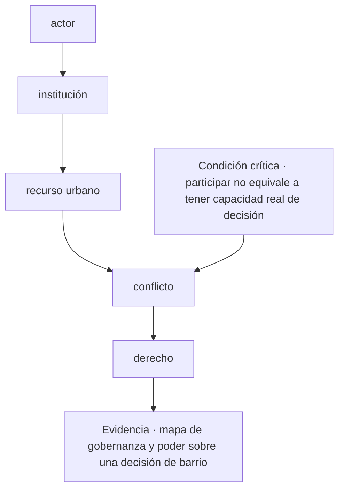
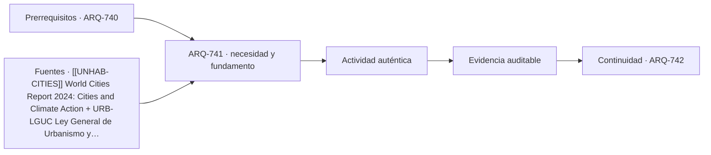

# ARQ-741 · Gobernanza urbana, poder y derecho a la ciudad

**Parte 75 · Fase III · Profundización y especialización · Edición 2026.10.**

Material educativo independiente. Esta clase no sustituye formación acreditada, experiencia supervisada, encargo profesional, normativa vigente, cálculo firmado, permiso ni revisión de especialistas. Los datos del caso son didácticos y deben reemplazarse por antecedentes verificables antes de una aplicación real.

## Pregunta central

¿Cómo abordar gobernanza urbana, poder y derecho a la ciudad y comprobar esta condición crítica: participar no equivale a tener capacidad real de decisión?

## Propósito, prerrequisitos y resultados de aprendizaje

La clase profundiza en **gobernanza urbana, poder y derecho a la ciudad** para relacionar decisiones espaciales con instituciones, mercados, derechos y experiencias sin reducir la ciudad a indicadores. Recibe de `ARQ-740` un registro de decisiones, fuentes y pendientes. No basta con reconocer vocabulario: el estudiante debe transformar una pregunta en un procedimiento que otra persona pueda reconstruir, criticar y corregir.

Al terminar podrás:

1. **identificar** los datos, actores, escalas y límites que condicionan una decisión sobre gobernanza urbana, poder y derecho a la ciudad;
2. **comparar** al menos dos alternativas con una función común y criterios no intercambiables;
3. **producir** una evidencia propia para el portafolio de Fase III;
4. **justificar** qué parte puede resolver arquitectura, qué requiere colaboración especializada y qué permanece abierta;
5. **revisar** la decisión cuando cambie un supuesto, una fuente, una necesidad o una condición de uso.

La evidencia de salida será un componente del **diagnóstico urbano con datos, participación, alternativas y efectos distributivos** de la Parte 75.

## Conceptos y distinciones fundamentales

### Núcleo disciplinar de esta clase

Esta clase no trata el tema como una etiqueta. Su núcleo operativo articula **institución, suelo, mercado, derecho, experiencia cotidiana, dato, participación, distribución de beneficios y desplazamiento**. Dentro de esa cadena, **gobernanza urbana, poder y derecho a la ciudad** ocupa la posición 1 de la parte y delimita el problema y las variables que pertenecen al sistema. La pregunta decisiva es qué cambia en el proyecto cuando cambia una de esas entradas, cómo se observa el efecto y quién tiene autoridad para aceptar la consecuencia.

La secuencia propia de la clase es **actor → institución → recurso urbano → conflicto → derecho**. Su resultado concreto será **mapa de gobernanza y poder sobre una decisión de barrio**. La revisión debe comprobar que **participar no equivale a tener capacidad real de decisión**. Estas tres frases funcionan como guía de lectura: el texto explica la secuencia, el ejercicio construye la evidencia y la evaluación intenta refutar una conclusión demasiado amplia.

El expediente específico debe poder aplicarse a **un plan de regeneración alrededor de transporte público que aumenta acceso y valor del suelo, pero puede desplazar residentes y cuidados**. Cada elemento debe conservar escala, fecha, versión, responsable y relación con el producto acumulativo de la Parte 75. Cuando el dato no existe, se registra el método para obtenerlo; cuando una atribución corresponde a otra disciplina, se documenta la interfaz y el punto de coordinación.

Antes de producir, separa cuatro estados dentro de **gobernanza urbana, poder y derecho a la ciudad**: el requisito que posee autoridad y versión; la preferencia que expresa un valor negociable; la hipótesis que permite avanzar y aún debe probarse; y la restricción que acota alternativas en este contexto. Escríbelos junto a **actor**. Cuando uno cambie, recorre la secuencia y marca qué conclusiones dejan de ser válidas.

## Desarrollo paso a paso

### 1. Actor

Empieza sin dibujar una solución. Describe qué se observa en **gobernanza urbana, poder y derecho a la ciudad**, quién lo experimenta y dónde termina el sistema que analizarás. El foco es **institución**: registra una evidencia a favor, una señal que la contradiga y un vacío que todavía no puedes llenar. **la pregunta central** entrega el punto de partida; **institución** sólo puede comenzar cuando la escala, el periodo y las personas afectadas quedan visibles. Cierra este paso con un croquis o esquema de situación y una frase que pueda resultar falsa. Así, **actor** abre una investigación en vez de decorar una decisión ya tomada.

### 2. Institución

Convierte **institución** en una mesa de clasificación. Una columna recibe datos confirmados; otra, requisitos con autoridad y versión; una tercera, hipótesis; y una cuarta, desconocidos. En **gobernanza urbana, poder y derecho a la ciudad**, la variable que merece atención es **suelo**. Comprueba unidades, fechas y procedencia antes de agrupar. Luego elige dos elementos que suelen confundirse y explica la diferencia con un ejemplo del caso. El resultado debe permitir pasar de **actor** a **recurso urbano** sin cambiar silenciosamente una definición. Si algo no cabe en ninguna columna, no lo fuerces: convierte esa incomodidad en una pregunta.

### 3. Recurso urbano

Ahora cambia de lenguaje. Representa **recurso urbano** mediante el medio que mejor revele **mercado**: planta para relaciones horizontales, sección para niveles y flujos, mapa para distribución, línea de tiempo para secuencias o diagrama para dependencias. En **gobernanza urbana, poder y derecho a la ciudad**, cada trazo debe responder qué muestra y qué oculta. Anota escala, orientación, unidades y fuente junto a la figura. Superpone una segunda capa con dudas o conflictos; no los borres para limpiar la composición. Pide a otra persona que explique cómo **institución** se transforma en **conflicto** mirando sólo la gráfica. Lo que no pueda reconstruir señala la revisión necesaria.

### 4. Conflicto

Usa **conflicto** para explicar un mecanismo, no una coincidencia. Escribe una cadena breve: entrada → transformación → efecto → persona o sistema afectado. En **gobernanza urbana, poder y derecho a la ciudad**, sigue especialmente **derecho** y dibuja al menos un camino alternativo. Cambia una entrada y anticipa qué parte de **derecho** debería cambiar; después busca un caso que no obedezca esa expectativa. La explicación se acepta cuando distingue asociación, causa propuesta y límite de la evidencia. Si el salto desde **recurso urbano** exige una pericia externa, formula la pregunta para esa especialidad y adjunta el antecedente que necesita para responder.

### 5. Derecho

En **derecho**, construye dos alternativas comparables para **gobernanza urbana, poder y derecho a la ciudad**. Mantén constante la función principal y declara qué varía; si las fronteras no coinciden, corrígelas antes de puntuar. Evalúa **experiencia cotidiana** con una medida y con una observación cualitativa, porque una cifra única puede esconder distribución, experiencia o riesgo. Incluye una condición que no pueda compensarse con ventajas en otros criterios. La salida hacia **mapa de gobernanza y poder sobre una decisión de barrio** debe conservar la opción descartada y el motivo. Después invierte una preferencia del encargo: si la elección no cambia, explica por qué; si cambia, identifica el supuesto que realmente gobernaba la decisión.

### Lo que une la secuencia

Los 5 pasos no son una receta universal. En esta clase ordenan una decisión sobre **gobernanza urbana, poder y derecho a la ciudad** dentro de **Política urbana, datos, vivienda y justicia espacial** y conducen a **mapa de gobernanza y poder sobre una decisión de barrio**. Pueden repetirse cuando aparece evidencia contradictoria, pero no intercambiarse sin explicación: saltar desde **actor** hasta **derecho** ocultaría precisamente el razonamiento que la entrega debe enseñar. La secuencia se detiene cuando **participar no equivale a tener capacidad real de decisión** no puede demostrarse.

## Contexto histórico, social y profesional

El contexto de trabajo es **un plan de regeneración alrededor de transporte público que aumenta acceso y valor del suelo, pero puede desplazar residentes y cuidados**. Allí, el tema de gobernanza urbana, poder y derecho a la ciudad no aparece como un problema aislado: se cruza con institución, suelo, mercado, derecho, experiencia cotidiana, dato, participación, distribución de beneficios y desplazamiento. El estudiante debe preguntar quién definió cada categoría, quién falta en el registro y qué decisión histórica o institucional explica la situación actual. Una tecnología nueva sólo se incorpora cuando mejora una observación, una coordinación o una prueba identificable; su novedad no constituye evidencia.

En una práctica profesional, arquitectura puede formular el problema espacial, relacionar escalas, representar alternativas y coordinar el expediente. Para esta clase debe asignar autores y revisores a **institución**, **conflicto** y **mapa de gobernanza y poder sobre una decisión de barrio**. Cuando una conclusión dependa de cálculo, diagnóstico o atribución regulada de otra disciplina, se redacta la pregunta de coordinación, se entrega el antecedente necesario y se conserva la respuesta. Esa interfaz también es parte del proyecto.

## Método: de la observación a una decisión trazable

1. **Delimita: actor.** Declara la entrada, realiza una operación visible y entrega algo que pueda usarse en **institución**. Añade al margen la duda que todavía puede modificar el paso.
2. **Ordena: institución.** Declara la entrada, realiza una operación visible y entrega algo que pueda usarse en **recurso urbano**. Añade al margen la duda que todavía puede modificar el paso.
3. **Dibuja: recurso urbano.** Declara la entrada, realiza una operación visible y entrega algo que pueda usarse en **conflicto**. Añade al margen la duda que todavía puede modificar el paso.
4. **Explica: conflicto.** Declara la entrada, realiza una operación visible y entrega algo que pueda usarse en **derecho**. Añade al margen la duda que todavía puede modificar el paso.
5. **Compara: derecho.** Declara la entrada, realiza una operación visible y entrega algo que pueda usarse en **mapa de gobernanza y poder sobre una decisión de barrio**. Añade al margen la duda que todavía puede modificar el paso.
6. **Intenta refutar el cierre.** Comprueba si **participar no equivale a tener capacidad real de decisión**; si la respuesta depende sólo de la apariencia del producto, vuelve al primer paso que no tenga evidencia.

La herramienta elegida debe permitir ejecutar esta secuencia, no reemplazarla. Para **gobernanza urbana, poder y derecho a la ciudad**, anota entradas, unidades, versión y transformaciones; exporta un formato que otra persona pueda inspeccionar; y verifica **conflicto** por un medio independiente proporcional a su consecuencia. Si intervienen automatización o IA, conserva también la instrucción, el resultado original, la revisión humana y el motivo de cada corrección.

## Mapa visual de la decisión

El diagrama es específico de **gobernanza urbana, poder y derecho a la ciudad**. Se lee de arriba abajo y permite localizar un salto. Si el expediente pasa del primer al último nodo sin documentar los pasos intermedios, la conclusión todavía no es reproducible. La condición crítica entra antes del cierre porque debe cambiar o detener la decisión, no aparecer como advertencia tardía.

## Caso trabajado: EXP-741

El caso se sitúa en **un plan de regeneración alrededor de transporte público que aumenta acceso y valor del suelo, pero puede desplazar residentes y cuidados**. El equipo debe abordar **gobernanza urbana, poder y derecho a la ciudad** y entregar **mapa de gobernanza y poder sobre una decisión de barrio**. La primera versión salta desde **actor** hasta **derecho**: presenta una respuesta terminada, pero no permite saber cómo se tomaron las decisiones intermedias.

La revisión devuelve el trabajo a **institución** y **recurso urbano**. El equipo separa datos confirmados, hipótesis y desconocidos; identifica qué representación hace visible el mecanismo y asigna a una persona la comprobación de **conflicto**. Esa corrección cambia la evidencia: deja de ser una afirmación ilustrada y se convierte en un procedimiento que otra persona puede repetir.

Antes de cerrar, la crítica aplica la condición **“participar no equivale a tener capacidad real de decisión”**. Si no se satisface, la entrega permanece abierta aunque su presentación sea convincente. El resultado del caso EXP-741 es una versión revisada de **mapa de gobernanza y poder sobre una decisión de barrio**, acompañada por la objeción que produjo el cambio y por un asunto que todavía requiere investigación o revisión especializada.

## Práctica guiada

Construye una primera versión de **mapa de gobernanza y poder sobre una decisión de barrio** siguiendo los 5 pasos del diagrama. Bajo cada paso escribe una entrada, una operación y una salida. Marca con un signo de interrogación lo que todavía no conoces; no lo conviertas en cero, promedio o supuesto oculto.

Intercambia el trabajo con otra persona. Debe poder señalar dónde se comprueba **participar no equivale a tener capacidad real de decisión** y reconstruir la transición desde **recurso urbano** hasta **derecho** sin explicación oral. Registra dos dudas de esa lectura y corrige al menos una. La primera versión, las objeciones y la versión revisada forman parte de la evidencia.

## Ejercicio autónomo

Aplica la secuencia **actor → institución → recurso urbano → conflicto → derecho** a otro contexto, escala o grupo de personas. Produce **mapa de gobernanza y poder sobre una decisión de barrio**, una versión inicial y una revisada. Explica qué se mantuvo, qué cambió y por qué los parámetros del caso trabajado no podían copiarse.

**Evidencia mínima de gobernanza urbana, poder y derecho a la ciudad:** mapa de gobernanza y poder sobre una decisión de barrio; diagrama de **actor → institución → recurso urbano → conflicto → derecho**; demostración de que **participar no equivale a tener capacidad real de decisión**; y registro de una revisión que haya cambiado el resultado. Guarda el expediente en `evidence/ARQ-741/evidencia.md` y enlázalo desde tu portafolio.

## Errores frecuentes y cómo corregirlos

- **Fallo crítico de esta clase:** Participar no equivale a tener capacidad real de decisión. En **gobernanza urbana, poder y derecho a la ciudad**, localiza el paso que no lo demuestra y vuelve a producir la evidencia.
- **Comenzar por derecho:** muestra una respuesta sin explicar cómo se llegó a ella. Recupera **actor** y conserva las decisiones intermedias.
- **Tratar institución como trámite:** deja sin fundamento lo que sigue. Escribe su entrada, su operación y una salida que otra persona pueda revisar.
- **Entregar mapa de gobernanza y poder sobre una decisión de barrio sin procedencia:** una evidencia sin fecha, escala, autor o fuente pierde alcance. Completa esos cuatro campos junto al producto.
- **Copiar parámetros del caso:** la forma del método puede transferirse, pero sus valores deben volver a medirse en cada contexto.
- **Ocultar la objeción:** registra la crítica que produjo un cambio; una versión perfecta desde el inicio impide evaluar el proceso.

## Evaluación y criterios de aceptación

La evidencia se acepta cuando:

1. produce **mapa de gobernanza y poder sobre una decisión de barrio** y responde explícitamente a la pregunta central;
2. diferencia datos, requisitos, hipótesis, preferencias y desconocidos;
3. compara alternativas con función y fronteras equivalentes o justifica la diferencia;
4. permite reconstruir al menos una comprobación, incluidas unidades, versión y fuente;
5. conserva una condición crítica fuera de cualquier promedio compensatorio;
6. identifica responsabilidades y no atribuye al estudiante competencias profesionales reguladas;
7. incluye revisión sustantiva entre dos versiones y explica la consecuencia;
8. demuestra que **participar no equivale a tener capacidad real de decisión** y enlaza la evidencia con `ARQ-742`.

La rúbrica común permite comparar el avance del programa; estos criterios deciden la aceptación de **mapa de gobernanza y poder sobre una decisión de barrio**. Una presentación convincente permanece pendiente cuando **participar no equivale a tener capacidad real de decisión** no puede comprobarse o la fuente utilizada no sostiene la conclusión.

## Autoevaluación, recuperación y reflexión crítica

Sin mirar el texto, reconstruye la secuencia **actor → institución → recurso urbano → conflicto → derecho** y nombra la evidencia que produce cada transición. Explica por qué **participar no equivale a tener capacidad real de decisión**. Si no puedes localizar esa comprobación en tu entrega, vuelve al diagrama y sustituye una afirmación vaga por una operación observable.

Para recuperar **gobernanza urbana, poder y derecho a la ciudad**, vuelve 24–48 horas después y dibuja de memoria **actor → institución → … → derecho**. Aplícala a otro actor o escala y marca en otro color los parámetros que tuviste que volver a investigar. Cierra preguntando quién recibe el beneficio de **mapa de gobernanza y poder sobre una decisión de barrio**, quién asume su costo, quién queda fuera de sus datos y quién podrá corregirla más adelante.

**Conexión siguiente:** `ARQ-742` reutiliza la matriz, la representación y el registro de cambios. Lleva la evidencia, no las cifras del caso.

<!-- pedagogia-2026:inicio -->
## Decisión pedagógica y posición curricular

### Por qué existe

Esta clase existe para resolver una necesidad concreta del recorrido: ¿Cómo abordar gobernanza urbana, poder y derecho a la ciudad y comprobar esta condición crítica: participar no equivale a tener capacidad real de decisión?

### Por qué está exactamente aquí

Abre la Parte 75 porque plantea primero el problema «¿Cómo abordar gobernanza urbana, poder y derecho a la ciudad y comprobar esta condición crítica: participar no equivale a tener capacidad real de decisión?». La transición desde ARQ-740 · Prototipo 1:1: fabricar, medir, corregir y documentar conserva métodos de evidencia y límites, pero no traslada parámetros del bloque anterior. Establece la pregunta y el producto base que ARQ-742 · Política de suelo, captura de valor y regulación desarrollará a continuación.

- **Prerrequisitos:** `ARQ-740`
- **Capacidad que introduce:** La clase profundiza en gobernanza urbana, poder y derecho a la ciudad para relacionar decisiones espaciales con instituciones, mercados, derechos y experiencias sin reducir la ciudad a indicadores. Recibe de ARQ-740 un registro de decisiones, fuentes y pendientes. No basta con reconocer vocabulario: el estudiante debe transformar una pregunta en un procedimiento que otra persona pueda reconstruir, criticar y corregir.
- **Clases o experiencias que dependen de ella:** `ARQ-742`

El diagrama permite comprobar una relación que el texto lineal oculta con facilidad: esta clase recibe capacidades previas, toma decisiones apoyadas por fuentes, exige una experiencia y produce evidencia que habilita trabajo posterior. No representa un procedimiento de obra.

## Resultado observable, evidencia y evaluación

1. Identificar y delimitar las condiciones necesarias para responder la pregunta central de gobernanza urbana, poder y derecho a la ciudad.
2. Producir y comprobar la evidencia declarada por la clase: La clase profundiza en gobernanza urbana, poder y derecho a la ciudad para relacionar decisiones espaciales con instituciones, mercados, derechos y experiencias sin reducir la ciudad a indicadores. Recibe de ARQ-740 un registro de decisiones, fuentes y pendientes. No basta con reconocer vocabulario: el estudiante debe transformar una pregunta en un procedimiento que otra persona pueda reconstruir, criticar y corregir.
3. Justificar una decisión de gobernanza urbana, poder y derecho a la ciudad mediante fuentes, supuestos, alternativas y límites explícitos.

## Actividad, evidencia y criterio de aceptación

**Actividad:** Construye una primera versión de mapa de gobernanza y poder sobre una decisión de barrio siguiendo los 5 pasos del diagrama. Bajo cada paso escribe una entrada, una operación y una salida. Marca con un signo de interrogación lo que todavía no conoces; no lo conviertas en cero, promedio o supuesto oculto.

**Evidencia mínima:** La clase profundiza en gobernanza urbana, poder y derecho a la ciudad para relacionar decisiones espaciales con instituciones, mercados, derechos y experiencias sin reducir la ciudad a indicadores. Recibe de ARQ-740 un registro de decisiones, fuentes y pendientes. No basta con reconocer vocabulario: el estudiante debe transformar una pregunta en un procedimiento que otra persona pueda reconstruir, criticar y corregir.

**Archivo sugerido:** `evidence/ARQ-741/evidencia.md`.

**Criterio de aceptación:** la entrega se acepta cuando:

- La entrega responde explícitamente a la pregunta: ¿Cómo abordar gobernanza urbana, poder y derecho a la ciudad y comprobar esta condición crítica: participar no equivale a tener capacidad real de decisión?
- La actividad conserva las fronteras del caso y permite reconstruir el procedimiento: Construye una primera versión de mapa de gobernanza y poder sobre una decisión de barrio siguiendo los 5 pasos del diagrama. Bajo cada paso escribe una entrada, una operación y una salida. Marca con un signo de interrogación lo que todavía no conoces; no lo conviertas en cero, promedio o supuesto oculto.
- Cada afirmación externa puede seguirse hasta una fuente, su alcance consultado y su límite.
- La evidencia deja disponible una entrada comprobable para ARQ-742.
- - Fallo crítico de esta clase: Participar no equivale a tener capacidad real de decisión. En gobernanza urbana, poder y derecho a la ciudad , localiza el paso que no lo demuestra y vuelve a producir la evidencia.

La [rúbrica común](../../docs/RUBRICA_COMUN.md) complementa estos criterios; no los reemplaza. Una entrega puede superar un promedio y continuar pendiente si oculta una condición crítica.

## Trazabilidad de las decisiones

| # | Decisión o fundamento | Fuente utilizada | Aplicación y límite en esta clase |
|---:|---|---|---|
| 1 | Relación entre urbanización, desigualdad, acción climática, vivienda e infraestructura. | [[[UNHAB-CITIES]] World Cities Report 2024: Cities and Climate Action](https://unhabitat.org/world-cities-report-2024-cities-and-climate-action) | Consulta: página o documento oficial identificado en el enlace. Límite: Informe global; sus tendencias no sustituyen datos locales, participación ni instrumentos territoriales vigentes. Fecha de |
| 2 | Marco legal chileno para planificación urbana, urbanización y construcción. | [URB-LGUC Ley General de Urbanismo y Construcciones: texto consolidado…](https://www.bcn.cl/leychile/navegar?idNorma=13560) | Consulta: página o documento oficial identificado en el enlace. Límite: Debe comprobarse texto vigente, aplicabilidad, reglamentos, instrumentos y pronunciamientos para cada caso real. Fecha de |

La tabla permite auditar las relaciones; la explicación, el caso y la práctica de la clase siguen siendo la documentación principal.

## Autoevaluación, recuperación y continuidad

### Errores diagnósticos

Antes de avanzar, comprueba si puedes reconstruir cada resultado sin mirar la solución, señalar qué evidencia lo sostiene y nombrar una condición que obligaría a revisar tu decisión. Conserva la primera versión, la objeción recibida y la revisión.

**Conexión siguiente:** La continuidad inmediata es ARQ-742 · Política de suelo, captura de valor y regulación; conserva el método y vuelve a verificar datos y límites.
<!-- pedagogia-2026:fin -->

## Fuentes y alcance de uso

### [[UNHAB-CITIES]] World Cities Report 2024: Cities and Climate Action

UN-Habitat. [https://unhabitat.org/world-cities-report-2024-cities-and-climate-action](https://unhabitat.org/world-cities-report-2024-cities-and-climate-action)

**Consulta:** página o documento oficial identificado en el enlace. **Apoyo:** Relación entre urbanización, desigualdad, acción climática, vivienda e infraestructura. **Límite:** Informe global; sus tendencias no sustituyen datos locales, participación ni instrumentos territoriales vigentes. **Fecha de consulta:** 6 de octubre de 2026.

### [[CL-LGUC]] Ley General de Urbanismo y Construcciones — texto consolidado

Biblioteca del Congreso Nacional de Chile. [https://www.bcn.cl/leychile/navegar?idNorma=13560](https://www.bcn.cl/leychile/navegar?idNorma=13560)

**Consulta:** página o documento oficial identificado en el enlace. **Apoyo:** Marco legal chileno para planificación urbana, urbanización y construcción. **Límite:** Debe comprobarse texto vigente, aplicabilidad, reglamentos, instrumentos y pronunciamientos para cada caso real. **Fecha de consulta:** 6 de octubre de 2026.
