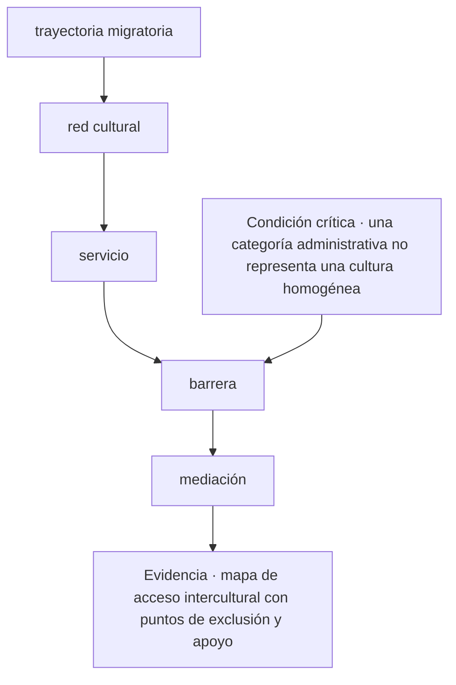
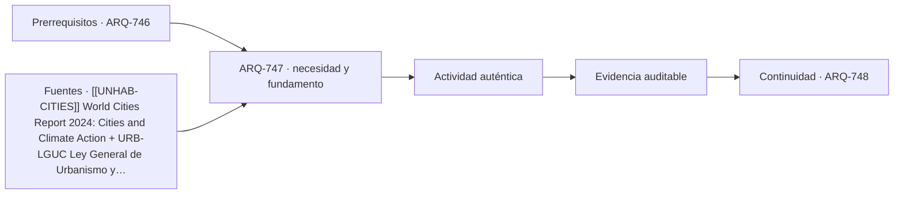

# ARQ-747 · Migración, interculturalidad y acceso a servicios

**Parte 75 · Fase III · Profundización y especialización · Edición 2026.10.**

Material educativo independiente. Esta clase no sustituye formación acreditada, experiencia supervisada, encargo profesional, normativa vigente, cálculo firmado, permiso ni revisión de especialistas. Los datos del caso son didácticos y deben reemplazarse por antecedentes verificables antes de una aplicación real.

## Pregunta central

¿Cómo abordar migración, interculturalidad y acceso a servicios y comprobar esta condición crítica: una categoría administrativa no representa una cultura homogénea?

## Propósito, prerrequisitos y resultados de aprendizaje

La clase profundiza en **migración, interculturalidad y acceso a servicios** para relacionar decisiones espaciales con instituciones, mercados, derechos y experiencias sin reducir la ciudad a indicadores. Recibe de `ARQ-746` un registro de decisiones, fuentes y pendientes. No basta con reconocer vocabulario: el estudiante debe transformar una pregunta en un procedimiento que otra persona pueda reconstruir, criticar y corregir.

Al terminar podrás:

1. **identificar** los datos, actores, escalas y límites que condicionan una decisión sobre migración, interculturalidad y acceso a servicios;
2. **comparar** al menos dos alternativas con una función común y criterios no intercambiables;
3. **producir** una evidencia propia para el portafolio de Fase III;
4. **justificar** qué parte puede resolver arquitectura, qué requiere colaboración especializada y qué permanece abierta;
5. **revisar** la decisión cuando cambie un supuesto, una fuente, una necesidad o una condición de uso.

La evidencia de salida será un componente del **diagnóstico urbano con datos, participación, alternativas y efectos distributivos** de la Parte 75.

## Conceptos y distinciones fundamentales

### Núcleo disciplinar de esta clase

Esta clase no trata el tema como una etiqueta. Su núcleo operativo articula **institución, suelo, mercado, derecho, experiencia cotidiana, dato, participación, distribución de beneficios y desplazamiento**. Dentro de esa cadena, **migración, interculturalidad y acceso a servicios** ocupa la posición 7 de la parte y busca fallos, sesgos, incertidumbres y efectos no deseados. La pregunta decisiva es qué cambia en el proyecto cuando cambia una de esas entradas, cómo se observa el efecto y quién tiene autoridad para aceptar la consecuencia.

La secuencia propia de la clase es **trayectoria migratoria → red cultural → servicio → barrera → mediación**. Su resultado concreto será **mapa de acceso intercultural con puntos de exclusión y apoyo**. La revisión debe comprobar que **una categoría administrativa no representa una cultura homogénea**. Estas tres frases funcionan como guía de lectura: el texto explica la secuencia, el ejercicio construye la evidencia y la evaluación intenta refutar una conclusión demasiado amplia.

El expediente específico debe poder aplicarse a **un plan de regeneración alrededor de transporte público que aumenta acceso y valor del suelo, pero puede desplazar residentes y cuidados**. Cada elemento debe conservar escala, fecha, versión, responsable y relación con el producto acumulativo de la Parte 75. Cuando el dato no existe, se registra el método para obtenerlo; cuando una atribución corresponde a otra disciplina, se documenta la interfaz y el punto de coordinación.

El título nombra un campo, pero una clase necesita una decisión. En migración, interculturalidad y acceso a servicios conviene separar el **objeto observado**, la **representación** que construimos de él, el **método** usado para examinarlo y la **conclusión** que ese método permite sostener. Una imagen detallada puede provenir de datos débiles; un modelo preciso puede responder una pregunta irrelevante; una fuente autorizada puede quedar fuera de contexto. La calidad empieza cuando esas capas permanecen visibles.

También deben distinguirse **requisito**, **preferencia**, **hipótesis** y **restricción**. Un requisito tiene una autoridad, una versión y una condición de aplicación. Una preferencia expresa valor o intención y puede entrar en conflicto con otras. Una hipótesis permite avanzar provisionalmente y necesita una prueba. Una restricción delimita el espacio de soluciones, pero puede cambiar cuando cambia el sitio, el presupuesto, la tecnología o el acuerdo entre actores. Mezclarlas produce decisiones que parecen cerradas antes de estarlo.

La profundidad no consiste en acumular términos. Consiste en explicar relaciones causales: qué entrada modifica qué resultado, a través de qué mecanismo, con qué incertidumbre y para quién. En esta clase se usa la secuencia **pregunta → evidencia → alternativa → prueba → decisión → seguimiento**. Si falta una etapa, debe registrarse como pendiente y asignarse a una persona o disciplina capaz de resolverla.

## Contexto histórico, social y profesional

Las prácticas asociadas a migración, interculturalidad y acceso a servicios cambian con los instrumentos, las instituciones y las expectativas sociales. La disponibilidad de modelos digitales, sensores o automatización puede ampliar lo observable, pero también desplaza trabajo, crea dependencias y concentra decisiones en datos o plataformas que no siempre son transparentes. La historia del campo se lee como transformación de problemas, responsabilidades y medios, no como una sucesión inevitable de herramientas.

En la práctica profesional, una decisión rara vez pertenece a una sola persona. El arquitecto puede formular el problema espacial, coordinar interfaces, representar alternativas y conservar el registro. Especialistas, comunidades, autoridades, constructores, operadores y mandantes aportan evidencia diferente. Coordinar significa declarar quién origina un dato, quién lo revisa, quién decide y qué modificación obliga a reabrir el expediente. No significa asumir atribuciones reguladas de otras disciplinas.

## Método: de la observación a una decisión trazable

1. **Delimitar.** Escribe la pregunta, el usuario o servicio afectado, la escala, el horizonte temporal y la jurisdicción.
2. **Inventariar.** Separa antecedentes confirmados, datos por medir, supuestos de trabajo, preferencias y restricciones.
3. **Representar.** Elige planta, sección, mapa, diagrama, modelo, tabla o prototipo según la relación que necesitas comprobar.
4. **Comparar.** Mantén igual la función de las alternativas; si cambian las fronteras, explica el cambio antes de puntuar.
5. **Probar.** Define una observación, cálculo, simulación, revisión o ensayo y anticipa qué resultado refutaría la hipótesis.
6. **Decidir.** Vincula la elección con evidencia y conserva las alternativas descartadas junto con la razón.
7. **Revisar.** Establece responsable, fecha, condición de reapertura y destino de la evidencia en operación o investigación.

Este método evita que la herramienta se convierta en autoridad. Una simulación, render, modelo o respuesta automática es una representación condicionada por entradas y reglas. Debe verificarse por un medio independiente proporcional al riesgo. Para consecuencias críticas, la revisión humana y especializada forma parte del sistema y no es una nota al pie.

## Mapa visual de la decisión

El diagrama es específico de **migración, interculturalidad y acceso a servicios**. Se lee de arriba abajo y permite localizar un salto. Si el expediente pasa del primer al último nodo sin documentar los pasos intermedios, la conclusión todavía no es reproducible. La condición crítica entra antes del cierre porque debe cambiar o detener la decisión, no aparecer como advertencia tardía.

## Caso trabajado: EXP-747

El caso se sitúa en **un plan de regeneración alrededor de transporte público que aumenta acceso y valor del suelo, pero puede desplazar residentes y cuidados**. El equipo debe abordar **migración, interculturalidad y acceso a servicios** y entregar **mapa de acceso intercultural con puntos de exclusión y apoyo**. La primera versión salta desde **trayectoria migratoria** hasta **mediación**: presenta una respuesta terminada, pero no permite saber cómo se tomaron las decisiones intermedias.

La revisión devuelve el trabajo a **red cultural** y **servicio**. El equipo separa datos confirmados, hipótesis y desconocidos; identifica qué representación hace visible el mecanismo y asigna a una persona la comprobación de **barrera**. Esa corrección cambia la evidencia: deja de ser una afirmación ilustrada y se convierte en un procedimiento que otra persona puede repetir.

Antes de cerrar, la crítica aplica la condición **“una categoría administrativa no representa una cultura homogénea”**. Si no se satisface, la entrega permanece abierta aunque su presentación sea convincente. El resultado del caso EXP-747 es una versión revisada de **mapa de acceso intercultural con puntos de exclusión y apoyo**, acompañada por la objeción que produjo el cambio y por un asunto que todavía requiere investigación o revisión especializada.

## Práctica guiada

Construye una primera versión de **mapa de acceso intercultural con puntos de exclusión y apoyo** siguiendo los 5 pasos del diagrama. Bajo cada paso escribe una entrada, una operación y una salida. Marca con un signo de interrogación lo que todavía no conoces; no lo conviertas en cero, promedio o supuesto oculto.

Intercambia el trabajo con otra persona. Debe poder señalar dónde se comprueba **una categoría administrativa no representa una cultura homogénea** y reconstruir la transición desde **servicio** hasta **mediación** sin explicación oral. Registra dos dudas de esa lectura y corrige al menos una. La primera versión, las objeciones y la versión revisada forman parte de la evidencia.

## Ejercicio autónomo

Aplica la secuencia **trayectoria migratoria → red cultural → servicio → barrera → mediación** a otro contexto, escala o grupo de personas. Produce **mapa de acceso intercultural con puntos de exclusión y apoyo**, una versión inicial y una revisada. Explica qué se mantuvo, qué cambió y por qué los parámetros del caso trabajado no podían copiarse.

**Evidencia mínima:** definición del problema, diagrama específico, producto reproducible, comprobación de la condición crítica y registro de revisión. Guarda el resultado en `evidence/ARQ-747/evidencia.md` y enlázalo desde tu portafolio.

## Errores frecuentes y cómo corregirlos

- **Fallo crítico de esta clase:** Una categoría administrativa no representa una cultura homogénea. Corrige localizando el paso que falta en la secuencia y vuelve a producir la evidencia.
- **Nombrar sin explicar:** una lista de conceptos no muestra mecanismos. Corrige dibujando relaciones y describiendo causa, consecuencia y límite.
- **Comparar fronteras distintas:** dos alternativas no responden a la misma función. Normaliza primero o declara la diferencia.
- **Confundir precisión con exactitud:** más decimales, polígonos o detalle visual no reparan un dato inadecuado.
- **Forzar lo desconocido a cero:** conserva el estado pendiente y decide cómo se resolverá.
- **Promediar una condición crítica:** seguridad, derechos o cumplimiento no desaparecen dentro de un puntaje total.
- **Citar sin alcance:** identifica documento, versión, sección consultada, función en la clase y límite.
- **Delegar el juicio:** software, IA o una guía apoyan el proceso; la responsabilidad y la validación deben permanecer asignadas.
- **Cerrar sin operación:** incorpora mantenimiento, accesibilidad, actualización y aprendizaje posterior.

## Evaluación y criterios de aceptación

La evidencia se acepta cuando:

1. produce **mapa de acceso intercultural con puntos de exclusión y apoyo** y responde explícitamente a la pregunta central;
2. diferencia datos, requisitos, hipótesis, preferencias y desconocidos;
3. compara alternativas con función y fronteras equivalentes o justifica la diferencia;
4. permite reconstruir al menos una comprobación, incluidas unidades, versión y fuente;
5. conserva una condición crítica fuera de cualquier promedio compensatorio;
6. identifica responsabilidades y no atribuye al estudiante competencias profesionales reguladas;
7. incluye revisión sustantiva entre dos versiones y explica la consecuencia;
8. demuestra que **una categoría administrativa no representa una cultura homogénea** y enlaza la evidencia con `ARQ-748`.

La rúbrica común complementa estos criterios. Una presentación convincente permanece pendiente si no supera una condición crítica o si la fuente no permite sostener la conclusión.

## Autoevaluación, recuperación y reflexión crítica

Sin mirar el texto, reconstruye la secuencia **trayectoria migratoria → red cultural → servicio → barrera → mediación** y nombra la evidencia que produce cada transición. Explica por qué **una categoría administrativa no representa una cultura homogénea**. Si no puedes localizar esa comprobación en tu entrega, vuelve al diagrama y sustituye una afirmación vaga por una operación observable.

Para recuperar el aprendizaje, repite el ejercicio 24–48 horas después con otra escala o actor. Compara qué elementos del método se transfieren y qué parámetros deben volver a investigarse. Cierra con una reflexión breve: ¿quién recibe el beneficio, quién asume el costo, quién queda fuera de los datos y quién podrá corregir la decisión más adelante?

**Conexión siguiente:** `ARQ-748` reutiliza la matriz, la representación y el registro de cambios. Lleva la evidencia, no las cifras del caso.

<!-- pedagogia-2026:inicio -->
## Decisión pedagógica y posición curricular

### Por qué existe

Esta clase existe para resolver una necesidad concreta del recorrido: ¿Cómo abordar migración, interculturalidad y acceso a servicios y comprobar esta condición crítica: una categoría administrativa no representa una cultura homogénea?

### Por qué está exactamente aquí

Ocupa el lugar 7 de la Parte 75. Se estudia después de ARQ-746 · Género, cuidados y movilidad cotidiana porque usa esa base para responder «¿Cómo abordar migración, interculturalidad y acceso a servicios y comprobar esta condición crítica: una categoría administrativa no representa una cultura homogénea?». Se ubica antes de ARQ-748 · Datos urbanos, privacidad y sesgos de medición porque la evidencia producida aquí debe estar disponible para ese paso.

- **Prerrequisitos:** `ARQ-746`
- **Capacidad que introduce:** La clase profundiza en migración, interculturalidad y acceso a servicios para relacionar decisiones espaciales con instituciones, mercados, derechos y experiencias sin reducir la ciudad a indicadores. Recibe de ARQ-746 un registro de decisiones, fuentes y pendientes. No basta con reconocer vocabulario: el estudiante debe transformar una pregunta en un procedimiento que otra persona pueda reconstruir, criticar y corregir.
- **Clases o experiencias que dependen de ella:** `ARQ-748`

El diagrama permite comprobar una relación que el texto lineal oculta con facilidad: esta clase recibe capacidades previas, toma decisiones apoyadas por fuentes, exige una experiencia y produce evidencia que habilita trabajo posterior. No representa un procedimiento de obra.

## Resultado observable, evidencia y evaluación

1. Identificar y delimitar las condiciones necesarias para responder la pregunta central de migración, interculturalidad y acceso a servicios.
2. Producir y comprobar la evidencia declarada por la clase: La clase profundiza en migración, interculturalidad y acceso a servicios para relacionar decisiones espaciales con instituciones, mercados, derechos y experiencias sin reducir la ciudad a indicadores. Recibe de ARQ-746 un registro de decisiones, fuentes y pendientes. No basta con reconocer vocabulario: el estudiante debe transformar una pregunta en un procedimiento que otra persona pueda reconstruir, criticar y corregir.
3. Justificar una decisión de migración, interculturalidad y acceso a servicios mediante fuentes, supuestos, alternativas y límites explícitos.

## Actividad, evidencia y criterio de aceptación

**Actividad:** Construye una primera versión de mapa de acceso intercultural con puntos de exclusión y apoyo siguiendo los 5 pasos del diagrama. Bajo cada paso escribe una entrada, una operación y una salida. Marca con un signo de interrogación lo que todavía no conoces; no lo conviertas en cero, promedio o supuesto oculto.

**Evidencia mínima:** La clase profundiza en migración, interculturalidad y acceso a servicios para relacionar decisiones espaciales con instituciones, mercados, derechos y experiencias sin reducir la ciudad a indicadores. Recibe de ARQ-746 un registro de decisiones, fuentes y pendientes. No basta con reconocer vocabulario: el estudiante debe transformar una pregunta en un procedimiento que otra persona pueda reconstruir, criticar y corregir.

**Archivo sugerido:** `evidence/ARQ-747/evidencia.md`.

**Criterio de aceptación:** la entrega se acepta cuando:

- La entrega responde explícitamente a la pregunta: ¿Cómo abordar migración, interculturalidad y acceso a servicios y comprobar esta condición crítica: una categoría administrativa no representa una cultura homogénea?
- La actividad conserva las fronteras del caso y permite reconstruir el procedimiento: Construye una primera versión de mapa de acceso intercultural con puntos de exclusión y apoyo siguiendo los 5 pasos del diagrama. Bajo cada paso escribe una entrada, una operación y una salida. Marca con un signo de interrogación lo que todavía no conoces; no lo conviertas en cero, promedio o supuesto oculto.
- Cada afirmación externa puede seguirse hasta una fuente, su alcance consultado y su límite.
- La evidencia deja disponible una entrada comprobable para ARQ-748.
- - Fallo crítico de esta clase: Una categoría administrativa no representa una cultura homogénea. Corrige localizando el paso que falta en la secuencia y vuelve a producir la evidencia.

La [rúbrica común](../../docs/RUBRICA_COMUN.md) complementa estos criterios; no los reemplaza. Una entrega puede superar un promedio y continuar pendiente si oculta una condición crítica.

## Trazabilidad de las decisiones

| # | Decisión o fundamento | Fuente utilizada | Aplicación y límite en esta clase |
|---:|---|---|---|
| 1 | Relación entre urbanización, desigualdad, acción climática, vivienda e infraestructura. | [[[UNHAB-CITIES]] World Cities Report 2024: Cities and Climate Action](https://unhabitat.org/world-cities-report-2024-cities-and-climate-action) | Consulta: página o documento oficial identificado en el enlace. Límite: Informe global; sus tendencias no sustituyen datos locales, participación ni instrumentos territoriales vigentes. Fecha de |
| 2 | Marco legal chileno para planificación urbana, urbanización y construcción. | [URB-LGUC Ley General de Urbanismo y Construcciones: texto consolidado…](https://www.bcn.cl/leychile/navegar?idNorma=13560) | Consulta: página o documento oficial identificado en el enlace. Límite: Debe comprobarse texto vigente, aplicabilidad, reglamentos, instrumentos y pronunciamientos para cada caso real. Fecha de |

La tabla permite auditar las relaciones; la explicación, el caso y la práctica de la clase siguen siendo la documentación principal.

## Autoevaluación, recuperación y continuidad

### Errores diagnósticos

Antes de avanzar, comprueba si puedes reconstruir cada resultado sin mirar la solución, señalar qué evidencia lo sostiene y nombrar una condición que obligaría a revisar tu decisión. Conserva la primera versión, la objeción recibida y la revisión.

**Conexión siguiente:** La continuidad inmediata es ARQ-748 · Datos urbanos, privacidad y sesgos de medición; conserva el método y vuelve a verificar datos y límites.
<!-- pedagogia-2026:fin -->

## Fuentes y alcance de uso

### [[UNHAB-CITIES]] World Cities Report 2024: Cities and Climate Action

UN-Habitat. [https://unhabitat.org/world-cities-report-2024-cities-and-climate-action](https://unhabitat.org/world-cities-report-2024-cities-and-climate-action)

**Consulta:** página o documento oficial identificado en el enlace. **Apoyo:** Relación entre urbanización, desigualdad, acción climática, vivienda e infraestructura. **Límite:** Informe global; sus tendencias no sustituyen datos locales, participación ni instrumentos territoriales vigentes. **Fecha de consulta:** 6 de octubre de 2026.

### [[CL-LGUC]] Ley General de Urbanismo y Construcciones — texto consolidado

Biblioteca del Congreso Nacional de Chile. [https://www.bcn.cl/leychile/navegar?idNorma=13560](https://www.bcn.cl/leychile/navegar?idNorma=13560)

**Consulta:** página o documento oficial identificado en el enlace. **Apoyo:** Marco legal chileno para planificación urbana, urbanización y construcción. **Límite:** Debe comprobarse texto vigente, aplicabilidad, reglamentos, instrumentos y pronunciamientos para cada caso real. **Fecha de consulta:** 6 de octubre de 2026.
