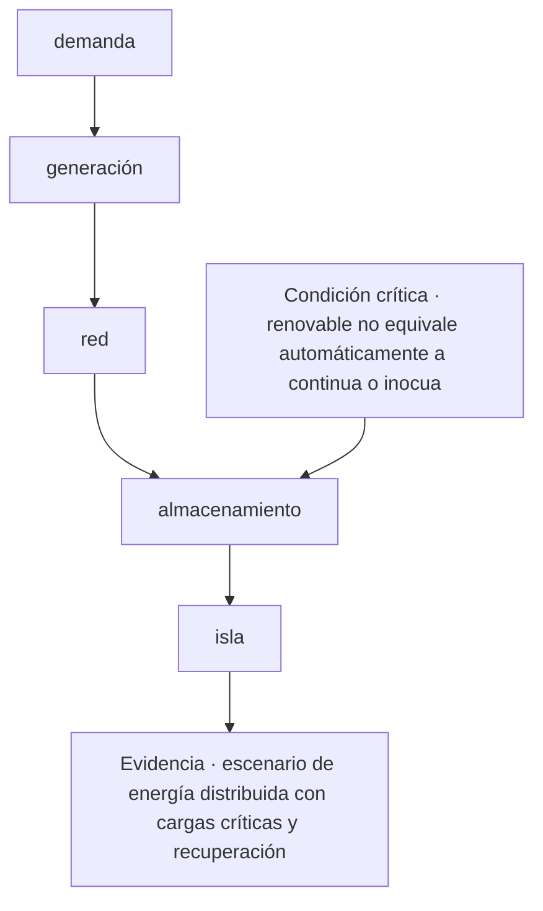
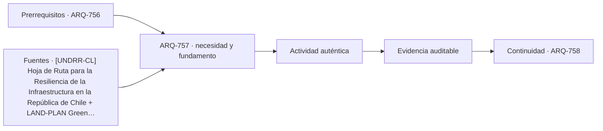

# ARQ-757 · Energía, almacenamiento y generación distribuida

**Parte 76 · Fase III · Profundización y especialización · Edición 2026.10.**

Material educativo independiente. Esta clase no sustituye formación acreditada, experiencia supervisada, encargo profesional, normativa vigente, cálculo firmado, permiso ni revisión de especialistas. Los datos del caso son didácticos y deben reemplazarse por antecedentes verificables antes de una aplicación real.

## Pregunta central

¿Cómo abordar energía, almacenamiento y generación distribuida y comprobar esta condición crítica: renovable no equivale automáticamente a continua o inocua?

## Propósito, prerrequisitos y resultados de aprendizaje

La clase profundiza en **energía, almacenamiento y generación distribuida** para leer infraestructuras como servicios interdependientes que articulan territorio, operación, mantenimiento y equidad. Recibe de `ARQ-756` un registro de decisiones, fuentes y pendientes. No basta con reconocer vocabulario: el estudiante debe transformar una pregunta en un procedimiento que otra persona pueda reconstruir, criticar y corregir.

Al terminar podrás:

1. **identificar** los datos, actores, escalas y límites que condicionan una decisión sobre energía, almacenamiento y generación distribuida;
2. **comparar** al menos dos alternativas con una función común y criterios no intercambiables;
3. **producir** una evidencia propia para el portafolio de Fase III;
4. **justificar** qué parte puede resolver arquitectura, qué requiere colaboración especializada y qué permanece abierta;
5. **revisar** la decisión cuando cambie un supuesto, una fuente, una necesidad o una condición de uso.

La evidencia de salida será un componente del **estrategia territorial de servicio con dependencias, fases y continuidad** de la Parte 76.

## Conceptos y distinciones fundamentales

### Núcleo disciplinar de esta clase

Esta clase no trata el tema como una etiqueta. Su núcleo operativo articula **servicio, demanda, capacidad, dependencia, redundancia, accesibilidad, mantenimiento, gobernanza y recuperación**. Dentro de esa cadena, **energía, almacenamiento y generación distribuida** ocupa la posición 7 de la parte y busca fallos, sesgos, incertidumbres y efectos no deseados. La pregunta decisiva es qué cambia en el proyecto cuando cambia una de esas entradas, cómo se observa el efecto y quién tiene autoridad para aceptar la consecuencia.

La secuencia propia de la clase es **demanda → generación → red → almacenamiento → isla**. Su resultado concreto será **escenario de energía distribuida con cargas críticas y recuperación**. La revisión debe comprobar que **renovable no equivale automáticamente a continua o inocua**. Estas tres frases funcionan como guía de lectura: el texto explica la secuencia, el ejercicio construye la evidencia y la evaluación intenta refutar una conclusión demasiado amplia.

El expediente específico debe poder aplicarse a **una interrupción regional que combina agua, energía, telecomunicaciones y transporte y obliga a priorizar servicios críticos**. Cada elemento debe conservar escala, fecha, versión, responsable y relación con el producto acumulativo de la Parte 76. Cuando el dato no existe, se registra el método para obtenerlo; cuando una atribución corresponde a otra disciplina, se documenta la interfaz y el punto de coordinación.

Antes de producir, separa cuatro estados dentro de **energía, almacenamiento y generación distribuida**: el requisito que posee autoridad y versión; la preferencia que expresa un valor negociable; la hipótesis que permite avanzar y aún debe probarse; y la restricción que acota alternativas en este contexto. Escríbelos junto a **demanda**. Cuando uno cambie, recorre la secuencia y marca qué conclusiones dejan de ser válidas.

## Desarrollo paso a paso

### 1. Demanda

Empieza sin dibujar una solución. Describe qué se observa en **energía, almacenamiento y generación distribuida**, quién lo experimenta y dónde termina el sistema que analizarás. El foco es **servicio**: registra una evidencia a favor, una señal que la contradiga y un vacío que todavía no puedes llenar. **la pregunta central** entrega el punto de partida; **generación** sólo puede comenzar cuando la escala, el periodo y las personas afectadas quedan visibles. Cierra este paso con un croquis o esquema de situación y una frase que pueda resultar falsa. Así, **demanda** abre una investigación en vez de decorar una decisión ya tomada.

### 2. Generación

Convierte **generación** en una mesa de clasificación. Una columna recibe datos confirmados; otra, requisitos con autoridad y versión; una tercera, hipótesis; y una cuarta, desconocidos. En **energía, almacenamiento y generación distribuida**, la variable que merece atención es **demanda**. Comprueba unidades, fechas y procedencia antes de agrupar. Luego elige dos elementos que suelen confundirse y explica la diferencia con un ejemplo del caso. El resultado debe permitir pasar de **demanda** a **red** sin cambiar silenciosamente una definición. Si algo no cabe en ninguna columna, no lo fuerces: convierte esa incomodidad en una pregunta.

### 3. Red

Ahora cambia de lenguaje. Representa **red** mediante el medio que mejor revele **capacidad**: planta para relaciones horizontales, sección para niveles y flujos, mapa para distribución, línea de tiempo para secuencias o diagrama para dependencias. En **energía, almacenamiento y generación distribuida**, cada trazo debe responder qué muestra y qué oculta. Anota escala, orientación, unidades y fuente junto a la figura. Superpone una segunda capa con dudas o conflictos; no los borres para limpiar la composición. Pide a otra persona que explique cómo **generación** se transforma en **almacenamiento** mirando sólo la gráfica. Lo que no pueda reconstruir señala la revisión necesaria.

### 4. Almacenamiento

Usa **almacenamiento** para explicar un mecanismo, no una coincidencia. Escribe una cadena breve: entrada → transformación → efecto → persona o sistema afectado. En **energía, almacenamiento y generación distribuida**, sigue especialmente **dependencia** y dibuja al menos un camino alternativo. Cambia una entrada y anticipa qué parte de **isla** debería cambiar; después busca un caso que no obedezca esa expectativa. La explicación se acepta cuando distingue asociación, causa propuesta y límite de la evidencia. Si el salto desde **red** exige una pericia externa, formula la pregunta para esa especialidad y adjunta el antecedente que necesita para responder.

### 5. Isla

En **isla**, construye dos alternativas comparables para **energía, almacenamiento y generación distribuida**. Mantén constante la función principal y declara qué varía; si las fronteras no coinciden, corrígelas antes de puntuar. Evalúa **redundancia** con una medida y con una observación cualitativa, porque una cifra única puede esconder distribución, experiencia o riesgo. Incluye una condición que no pueda compensarse con ventajas en otros criterios. La salida hacia **escenario de energía distribuida con cargas críticas y recuperación** debe conservar la opción descartada y el motivo. Después invierte una preferencia del encargo: si la elección no cambia, explica por qué; si cambia, identifica el supuesto que realmente gobernaba la decisión.

### Lo que une la secuencia

Los 5 pasos no son una receta universal. En esta clase ordenan una decisión sobre **energía, almacenamiento y generación distribuida** dentro de **Redes territoriales e infraestructura pública** y conducen a **escenario de energía distribuida con cargas críticas y recuperación**. Pueden repetirse cuando aparece evidencia contradictoria, pero no intercambiarse sin explicación: saltar desde **demanda** hasta **isla** ocultaría precisamente el razonamiento que la entrega debe enseñar. La secuencia se detiene cuando **renovable no equivale automáticamente a continua o inocua** no puede demostrarse.

## Contexto histórico, social y profesional

El contexto de trabajo es **una interrupción regional que combina agua, energía, telecomunicaciones y transporte y obliga a priorizar servicios críticos**. Allí, el tema de energía, almacenamiento y generación distribuida no aparece como un problema aislado: se cruza con servicio, demanda, capacidad, dependencia, redundancia, accesibilidad, mantenimiento, gobernanza y recuperación. El estudiante debe preguntar quién definió cada categoría, quién falta en el registro y qué decisión histórica o institucional explica la situación actual. Una tecnología nueva sólo se incorpora cuando mejora una observación, una coordinación o una prueba identificable; su novedad no constituye evidencia.

En una práctica profesional, arquitectura puede formular el problema espacial, relacionar escalas, representar alternativas y coordinar el expediente. Para esta clase debe asignar autores y revisores a **generación**, **almacenamiento** y **escenario de energía distribuida con cargas críticas y recuperación**. Cuando una conclusión dependa de cálculo, diagnóstico o atribución regulada de otra disciplina, se redacta la pregunta de coordinación, se entrega el antecedente necesario y se conserva la respuesta. Esa interfaz también es parte del proyecto.

## Método: de la observación a una decisión trazable

1. **Busca: demanda.** Declara la entrada, realiza una operación visible y entrega algo que pueda usarse en **generación**. Añade al margen la duda que todavía puede modificar el paso.
2. **Coordina: generación.** Declara la entrada, realiza una operación visible y entrega algo que pueda usarse en **red**. Añade al margen la duda que todavía puede modificar el paso.
3. **Verifica: red.** Declara la entrada, realiza una operación visible y entrega algo que pueda usarse en **almacenamiento**. Añade al margen la duda que todavía puede modificar el paso.
4. **Transfiere: almacenamiento.** Declara la entrada, realiza una operación visible y entrega algo que pueda usarse en **isla**. Añade al margen la duda que todavía puede modificar el paso.
5. **Delimita: isla.** Declara la entrada, realiza una operación visible y entrega algo que pueda usarse en **escenario de energía distribuida con cargas críticas y recuperación**. Añade al margen la duda que todavía puede modificar el paso.
6. **Intenta refutar el cierre.** Comprueba si **renovable no equivale automáticamente a continua o inocua**; si la respuesta depende sólo de la apariencia del producto, vuelve al primer paso que no tenga evidencia.

La herramienta elegida debe permitir ejecutar esta secuencia, no reemplazarla. Para **energía, almacenamiento y generación distribuida**, anota entradas, unidades, versión y transformaciones; exporta un formato que otra persona pueda inspeccionar; y verifica **almacenamiento** por un medio independiente proporcional a su consecuencia. Si intervienen automatización o IA, conserva también la instrucción, el resultado original, la revisión humana y el motivo de cada corrección.

## Mapa visual de la decisión

El diagrama es específico de **energía, almacenamiento y generación distribuida**. Se lee de arriba abajo y permite localizar un salto. Si el expediente pasa del primer al último nodo sin documentar los pasos intermedios, la conclusión todavía no es reproducible. La condición crítica entra antes del cierre porque debe cambiar o detener la decisión, no aparecer como advertencia tardía.

## Caso trabajado: EXP-757

El caso se sitúa en **una interrupción regional que combina agua, energía, telecomunicaciones y transporte y obliga a priorizar servicios críticos**. El equipo debe abordar **energía, almacenamiento y generación distribuida** y entregar **escenario de energía distribuida con cargas críticas y recuperación**. La primera versión salta desde **demanda** hasta **isla**: presenta una respuesta terminada, pero no permite saber cómo se tomaron las decisiones intermedias.

La revisión devuelve el trabajo a **generación** y **red**. El equipo separa datos confirmados, hipótesis y desconocidos; identifica qué representación hace visible el mecanismo y asigna a una persona la comprobación de **almacenamiento**. Esa corrección cambia la evidencia: deja de ser una afirmación ilustrada y se convierte en un procedimiento que otra persona puede repetir.

Antes de cerrar, la crítica aplica la condición **“renovable no equivale automáticamente a continua o inocua”**. Si no se satisface, la entrega permanece abierta aunque su presentación sea convincente. El resultado del caso EXP-757 es una versión revisada de **escenario de energía distribuida con cargas críticas y recuperación**, acompañada por la objeción que produjo el cambio y por un asunto que todavía requiere investigación o revisión especializada.

## Práctica guiada

Construye una primera versión de **escenario de energía distribuida con cargas críticas y recuperación** siguiendo los 5 pasos del diagrama. Bajo cada paso escribe una entrada, una operación y una salida. Marca con un signo de interrogación lo que todavía no conoces; no lo conviertas en cero, promedio o supuesto oculto.

Intercambia el trabajo con otra persona. Debe poder señalar dónde se comprueba **renovable no equivale automáticamente a continua o inocua** y reconstruir la transición desde **red** hasta **isla** sin explicación oral. Registra dos dudas de esa lectura y corrige al menos una. La primera versión, las objeciones y la versión revisada forman parte de la evidencia.

## Ejercicio autónomo

Aplica la secuencia **demanda → generación → red → almacenamiento → isla** a otro contexto, escala o grupo de personas. Produce **escenario de energía distribuida con cargas críticas y recuperación**, una versión inicial y una revisada. Explica qué se mantuvo, qué cambió y por qué los parámetros del caso trabajado no podían copiarse.

**Evidencia mínima de energía, almacenamiento y generación distribuida:** escenario de energía distribuida con cargas críticas y recuperación; diagrama de **demanda → generación → red → almacenamiento → isla**; demostración de que **renovable no equivale automáticamente a continua o inocua**; y registro de una revisión que haya cambiado el resultado. Guarda el expediente en `evidence/ARQ-757/evidencia.md` y enlázalo desde tu portafolio.

## Errores frecuentes y cómo corregirlos

- **Fallo crítico de esta clase:** Renovable no equivale automáticamente a continua o inocua. En **energía, almacenamiento y generación distribuida**, localiza el paso que no lo demuestra y vuelve a producir la evidencia.
- **Comenzar por isla:** muestra una respuesta sin explicar cómo se llegó a ella. Recupera **demanda** y conserva las decisiones intermedias.
- **Tratar generación como trámite:** deja sin fundamento lo que sigue. Escribe su entrada, su operación y una salida que otra persona pueda revisar.
- **Entregar escenario de energía distribuida con cargas críticas y recuperación sin procedencia:** una evidencia sin fecha, escala, autor o fuente pierde alcance. Completa esos cuatro campos junto al producto.
- **Copiar parámetros del caso:** la forma del método puede transferirse, pero sus valores deben volver a medirse en cada contexto.
- **Ocultar la objeción:** registra la crítica que produjo un cambio; una versión perfecta desde el inicio impide evaluar el proceso.

## Evaluación y criterios de aceptación

La evidencia se acepta cuando:

1. produce **escenario de energía distribuida con cargas críticas y recuperación** y responde explícitamente a la pregunta central;
2. diferencia datos, requisitos, hipótesis, preferencias y desconocidos;
3. compara alternativas con función y fronteras equivalentes o justifica la diferencia;
4. permite reconstruir al menos una comprobación, incluidas unidades, versión y fuente;
5. conserva una condición crítica fuera de cualquier promedio compensatorio;
6. identifica responsabilidades y no atribuye al estudiante competencias profesionales reguladas;
7. incluye revisión sustantiva entre dos versiones y explica la consecuencia;
8. demuestra que **renovable no equivale automáticamente a continua o inocua** y enlaza la evidencia con `ARQ-758`.

La rúbrica común permite comparar el avance del programa; estos criterios deciden la aceptación de **escenario de energía distribuida con cargas críticas y recuperación**. Una presentación convincente permanece pendiente cuando **renovable no equivale automáticamente a continua o inocua** no puede comprobarse o la fuente utilizada no sostiene la conclusión.

## Autoevaluación, recuperación y reflexión crítica

Sin mirar el texto, reconstruye la secuencia **demanda → generación → red → almacenamiento → isla** y nombra la evidencia que produce cada transición. Explica por qué **renovable no equivale automáticamente a continua o inocua**. Si no puedes localizar esa comprobación en tu entrega, vuelve al diagrama y sustituye una afirmación vaga por una operación observable.

Para recuperar **energía, almacenamiento y generación distribuida**, vuelve 24–48 horas después y dibuja de memoria **demanda → generación → … → isla**. Aplícala a otro actor o escala y marca en otro color los parámetros que tuviste que volver a investigar. Cierra preguntando quién recibe el beneficio de **escenario de energía distribuida con cargas críticas y recuperación**, quién asume su costo, quién queda fuera de sus datos y quién podrá corregirla más adelante.

**Conexión siguiente:** `ARQ-758` reutiliza la matriz, la representación y el registro de cambios. Lleva la evidencia, no las cifras del caso.

<!-- pedagogia-2026:inicio -->
## Decisión pedagógica y posición curricular

### Por qué existe

Esta clase existe para resolver una necesidad concreta del recorrido: ¿Cómo abordar energía, almacenamiento y generación distribuida y comprobar esta condición crítica: renovable no equivale automáticamente a continua o inocua?

### Por qué está exactamente aquí

Ocupa el lugar 7 de la Parte 76. Se estudia después de ARQ-756 · Abastecimiento, saneamiento y drenaje a escala territorial porque usa esa base para responder «¿Cómo abordar energía, almacenamiento y generación distribuida y comprobar esta condición crítica: renovable no equivale automáticamente a continua o inocua?». Se ubica antes de ARQ-758 · Residuos, recuperación de recursos y localización porque la evidencia producida aquí debe estar disponible para ese paso.

- **Prerrequisitos:** `ARQ-756`
- **Capacidad que introduce:** La clase profundiza en energía, almacenamiento y generación distribuida para leer infraestructuras como servicios interdependientes que articulan territorio, operación, mantenimiento y equidad. Recibe de ARQ-756 un registro de decisiones, fuentes y pendientes. No basta con reconocer vocabulario: el estudiante debe transformar una pregunta en un procedimiento que otra persona pueda reconstruir, criticar y corregir.
- **Clases o experiencias que dependen de ella:** `ARQ-758`

El diagrama permite comprobar una relación que el texto lineal oculta con facilidad: esta clase recibe capacidades previas, toma decisiones apoyadas por fuentes, exige una experiencia y produce evidencia que habilita trabajo posterior. No representa un procedimiento de obra.

## Resultado observable, evidencia y evaluación

1. Identificar y delimitar las condiciones necesarias para responder la pregunta central de energía, almacenamiento y generación distribuida.
2. Producir y comprobar la evidencia declarada por la clase: La clase profundiza en energía, almacenamiento y generación distribuida para leer infraestructuras como servicios interdependientes que articulan territorio, operación, mantenimiento y equidad. Recibe de ARQ-756 un registro de decisiones, fuentes y pendientes. No basta con reconocer vocabulario: el estudiante debe transformar una pregunta en un procedimiento que otra persona pueda reconstruir, criticar y corregir.
3. Justificar una decisión de energía, almacenamiento y generación distribuida mediante fuentes, supuestos, alternativas y límites explícitos.

## Actividad, evidencia y criterio de aceptación

**Actividad:** Construye una primera versión de escenario de energía distribuida con cargas críticas y recuperación siguiendo los 5 pasos del diagrama. Bajo cada paso escribe una entrada, una operación y una salida. Marca con un signo de interrogación lo que todavía no conoces; no lo conviertas en cero, promedio o supuesto oculto.

**Evidencia mínima:** La clase profundiza en energía, almacenamiento y generación distribuida para leer infraestructuras como servicios interdependientes que articulan territorio, operación, mantenimiento y equidad. Recibe de ARQ-756 un registro de decisiones, fuentes y pendientes. No basta con reconocer vocabulario: el estudiante debe transformar una pregunta en un procedimiento que otra persona pueda reconstruir, criticar y corregir.

**Archivo sugerido:** `evidence/ARQ-757/evidencia.md`.

**Criterio de aceptación:** la entrega se acepta cuando:

- La entrega responde explícitamente a la pregunta: ¿Cómo abordar energía, almacenamiento y generación distribuida y comprobar esta condición crítica: renovable no equivale automáticamente a continua o inocua?
- La actividad conserva las fronteras del caso y permite reconstruir el procedimiento: Construye una primera versión de escenario de energía distribuida con cargas críticas y recuperación siguiendo los 5 pasos del diagrama. Bajo cada paso escribe una entrada, una operación y una salida. Marca con un signo de interrogación lo que todavía no conoces; no lo conviertas en cero, promedio o supuesto oculto.
- Cada afirmación externa puede seguirse hasta una fuente, su alcance consultado y su límite.
- La evidencia deja disponible una entrada comprobable para ARQ-758.
- - Fallo crítico de esta clase: Renovable no equivale automáticamente a continua o inocua. En energía, almacenamiento y generación distribuida , localiza el paso que no lo demuestra y vuelve a producir la evidencia.

La [rúbrica común](../../docs/RUBRICA_COMUN.md) complementa estos criterios; no los reemplaza. Una entrega puede superar un promedio y continuar pendiente si oculta una condición crítica.

## Trazabilidad de las decisiones

| # | Decisión o fundamento | Fuente utilizada | Aplicación y límite en esta clase |
|---:|---|---|---|
| 1 | Dependencias, gobernanza y continuidad de servicios de infraestructura en Chile. | [[UNDRR-CL] Hoja de Ruta para la Resiliencia de la Infraestructura en…](https://www.undrr.org/es/publication/hoja-de-ruta-para-la-resiliencia-de-la-infraestructura-en-la-republica-de-chile) | Consulta: página o documento oficial identificado en el enlace. Límite: Hoja de ruta estratégica; no reemplaza diseño de ingeniería, evaluación de amenaza ni decisión de autoridad. Fecha de |
| 2 | Planificación, diseño e implementación de infraestructura verde para gestión de agua. | [LAND-PLAN Green Infrastructure Planning, Design, and Implementation](https://www.epa.gov/green-infrastructure/green-infrastructure-planning-design-and-implementation) | Consulta: página o documento oficial identificado en el enlace. Límite: Referencia estadounidense; clima, suelo, operación, permisos y desempeño deben verificarse localmente. Fecha de |

La tabla permite auditar las relaciones; la explicación, el caso y la práctica de la clase siguen siendo la documentación principal.

## Autoevaluación, recuperación y continuidad

### Errores diagnósticos

Antes de avanzar, comprueba si puedes reconstruir cada resultado sin mirar la solución, señalar qué evidencia lo sostiene y nombrar una condición que obligaría a revisar tu decisión. Conserva la primera versión, la objeción recibida y la revisión.

**Conexión siguiente:** La continuidad inmediata es ARQ-758 · Residuos, recuperación de recursos y localización; conserva el método y vuelve a verificar datos y límites.
<!-- pedagogia-2026:fin -->

## Fuentes y alcance de uso

### [[UNDRR-INFRA]] Hoja de Ruta para la Resiliencia de la Infraestructura en la República de Chile

Oficina de las Naciones Unidas para la Reducción del Riesgo de Desastres. [https://www.undrr.org/es/publication/hoja-de-ruta-para-la-resiliencia-de-la-infraestructura-en-la-republica-de-chile](https://www.undrr.org/es/publication/hoja-de-ruta-para-la-resiliencia-de-la-infraestructura-en-la-republica-de-chile)

**Consulta:** página o documento oficial identificado en el enlace. **Apoyo:** Dependencias, gobernanza y continuidad de servicios de infraestructura en Chile. **Límite:** Hoja de ruta estratégica; no reemplaza diseño de ingeniería, evaluación de amenaza ni decisión de autoridad. **Fecha de consulta:** 6 de octubre de 2026.

### [[EPA-GI]] Green Infrastructure Planning, Design, and Implementation

U.S. Environmental Protection Agency. [https://www.epa.gov/green-infrastructure/green-infrastructure-planning-design-and-implementation](https://www.epa.gov/green-infrastructure/green-infrastructure-planning-design-and-implementation)

**Consulta:** página o documento oficial identificado en el enlace. **Apoyo:** Planificación, diseño e implementación de infraestructura verde para gestión de agua. **Límite:** Referencia estadounidense; clima, suelo, operación, permisos y desempeño deben verificarse localmente. **Fecha de consulta:** 6 de octubre de 2026.
