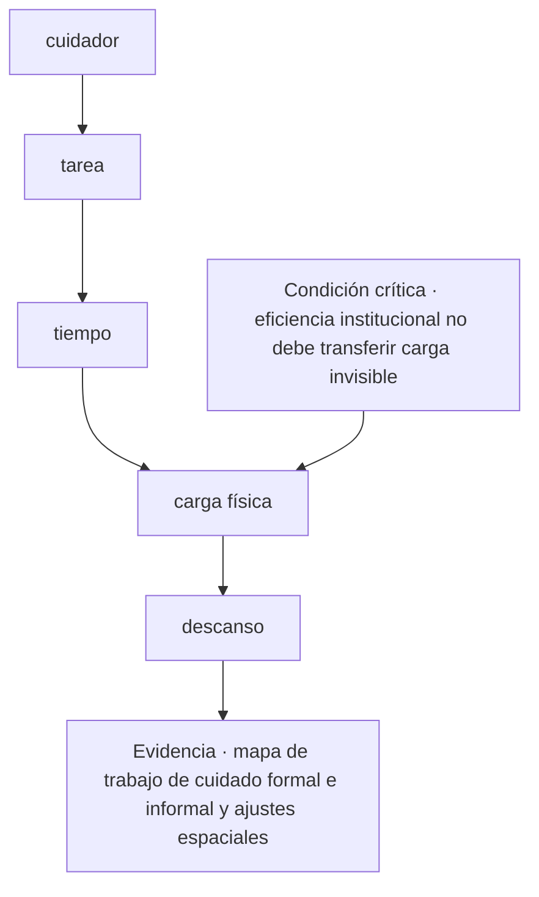
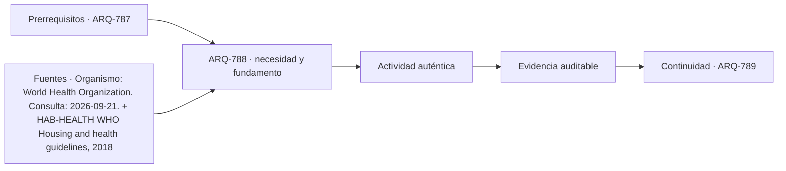

# ARQ-788 · Arquitectura para personas sin hogar y transición

**Parte 79 · Fase III · Profundización y especialización · Edición 2026.10.**

Material educativo independiente. Esta clase no sustituye formación acreditada, experiencia supervisada, encargo profesional, normativa vigente, cálculo firmado, permiso ni revisión de especialistas. Los datos del caso son didácticos y deben reemplazarse por antecedentes verificables antes de una aplicación real.

## Pregunta central

¿Cómo abordar arquitectura para personas sin hogar y transición y comprobar esta condición crítica: eficiencia institucional no debe transferir carga invisible?

## Propósito, prerrequisitos y resultados de aprendizaje

La clase profundiza en **arquitectura para personas sin hogar y transición** para proyectar entornos que sostengan capacidades diversas, redes de cuidado y salud a lo largo del tiempo. Recibe de `ARQ-787` un registro de decisiones, fuentes y pendientes. No basta con reconocer vocabulario: el estudiante debe transformar una pregunta en un procedimiento que otra persona pueda reconstruir, criticar y corregir.

Al terminar podrás:

1. **identificar** los datos, actores, escalas y límites que condicionan una decisión sobre arquitectura para personas sin hogar y transición;
2. **comparar** al menos dos alternativas con una función común y criterios no intercambiables;
3. **producir** una evidencia propia para el portafolio de Fase III;
4. **justificar** qué parte puede resolver arquitectura, qué requiere colaboración especializada y qué permanece abierta;
5. **revisar** la decisión cuando cambie un supuesto, una fuente, una necesidad o una condición de uso.

La evidencia de salida será un componente del **proyecto de cuidado evaluado con personas, escenarios y cadena completa de accesibilidad** de la Parte 79.

## Conceptos y distinciones fundamentales

### Núcleo disciplinar de esta clase

Esta clase no trata el tema como una etiqueta. Su núcleo operativo articula **capacidad, autonomía, apoyo, percepción, orientación, privacidad, cuidado, evacuación, participación y cambio temporal**. Dentro de esa cadena, **arquitectura para personas sin hogar y transición** ocupa la posición 8 de la parte y coordina actores, responsabilidades, interfaces y documentación. La pregunta decisiva es qué cambia en el proyecto cuando cambia una de esas entradas, cómo se observa el efecto y quién tiene autoridad para aceptar la consecuencia.

La secuencia propia de la clase es **cuidador → tarea → tiempo → carga física → descanso**. Su resultado concreto será **mapa de trabajo de cuidado formal e informal y ajustes espaciales**. La revisión debe comprobar que **eficiencia institucional no debe transferir carga invisible**. Estas tres frases funcionan como guía de lectura: el texto explica la secuencia, el ejercicio construye la evidencia y la evaluación intenta refutar una conclusión demasiado amplia.

El expediente específico debe poder aplicarse a **un entorno residencial y comunitario compartido por infancia, personas mayores, neurodivergentes y redes formales e informales de cuidado**. Cada elemento debe conservar escala, fecha, versión, responsable y relación con el producto acumulativo de la Parte 79. Cuando el dato no existe, se registra el método para obtenerlo; cuando una atribución corresponde a otra disciplina, se documenta la interfaz y el punto de coordinación.

Antes de producir, separa cuatro estados dentro de **arquitectura para personas sin hogar y transición**: el requisito que posee autoridad y versión; la preferencia que expresa un valor negociable; la hipótesis que permite avanzar y aún debe probarse; y la restricción que acota alternativas en este contexto. Escríbelos junto a **cuidador**. Cuando uno cambie, recorre la secuencia y marca qué conclusiones dejan de ser válidas.

## Desarrollo paso a paso

### 1. Cuidador

Empieza sin dibujar una solución. Describe qué se observa en **arquitectura para personas sin hogar y transición**, quién lo experimenta y dónde termina el sistema que analizarás. El foco es **capacidad**: registra una evidencia a favor, una señal que la contradiga y un vacío que todavía no puedes llenar. **la pregunta central** entrega el punto de partida; **tarea** sólo puede comenzar cuando la escala, el periodo y las personas afectadas quedan visibles. Cierra este paso con un croquis o esquema de situación y una frase que pueda resultar falsa. Así, **cuidador** abre una investigación en vez de decorar una decisión ya tomada.

### 2. Tarea

Convierte **tarea** en una mesa de clasificación. Una columna recibe datos confirmados; otra, requisitos con autoridad y versión; una tercera, hipótesis; y una cuarta, desconocidos. En **arquitectura para personas sin hogar y transición**, la variable que merece atención es **autonomía**. Comprueba unidades, fechas y procedencia antes de agrupar. Luego elige dos elementos que suelen confundirse y explica la diferencia con un ejemplo del caso. El resultado debe permitir pasar de **cuidador** a **tiempo** sin cambiar silenciosamente una definición. Si algo no cabe en ninguna columna, no lo fuerces: convierte esa incomodidad en una pregunta.

### 3. Tiempo

Ahora cambia de lenguaje. Representa **tiempo** mediante el medio que mejor revele **apoyo**: planta para relaciones horizontales, sección para niveles y flujos, mapa para distribución, línea de tiempo para secuencias o diagrama para dependencias. En **arquitectura para personas sin hogar y transición**, cada trazo debe responder qué muestra y qué oculta. Anota escala, orientación, unidades y fuente junto a la figura. Superpone una segunda capa con dudas o conflictos; no los borres para limpiar la composición. Pide a otra persona que explique cómo **tarea** se transforma en **carga física** mirando sólo la gráfica. Lo que no pueda reconstruir señala la revisión necesaria.

### 4. Carga física

Usa **carga física** para explicar un mecanismo, no una coincidencia. Escribe una cadena breve: entrada → transformación → efecto → persona o sistema afectado. En **arquitectura para personas sin hogar y transición**, sigue especialmente **percepción** y dibuja al menos un camino alternativo. Cambia una entrada y anticipa qué parte de **descanso** debería cambiar; después busca un caso que no obedezca esa expectativa. La explicación se acepta cuando distingue asociación, causa propuesta y límite de la evidencia. Si el salto desde **tiempo** exige una pericia externa, formula la pregunta para esa especialidad y adjunta el antecedente que necesita para responder.

### 5. Descanso

En **descanso**, construye dos alternativas comparables para **arquitectura para personas sin hogar y transición**. Mantén constante la función principal y declara qué varía; si las fronteras no coinciden, corrígelas antes de puntuar. Evalúa **orientación** con una medida y con una observación cualitativa, porque una cifra única puede esconder distribución, experiencia o riesgo. Incluye una condición que no pueda compensarse con ventajas en otros criterios. La salida hacia **mapa de trabajo de cuidado formal e informal y ajustes espaciales** debe conservar la opción descartada y el motivo. Después invierte una preferencia del encargo: si la elección no cambia, explica por qué; si cambia, identifica el supuesto que realmente gobernaba la decisión.

### Lo que une la secuencia

Los 5 pasos no son una receta universal. En esta clase ordenan una decisión sobre **arquitectura para personas sin hogar y transición** dentro de **Salud, cuidados, diversidad y cambio demográfico** y conducen a **mapa de trabajo de cuidado formal e informal y ajustes espaciales**. Pueden repetirse cuando aparece evidencia contradictoria, pero no intercambiarse sin explicación: saltar desde **cuidador** hasta **descanso** ocultaría precisamente el razonamiento que la entrega debe enseñar. La secuencia se detiene cuando **eficiencia institucional no debe transferir carga invisible** no puede demostrarse.

## Contexto histórico, social y profesional

El contexto de trabajo es **un entorno residencial y comunitario compartido por infancia, personas mayores, neurodivergentes y redes formales e informales de cuidado**. Allí, el tema de arquitectura para personas sin hogar y transición no aparece como un problema aislado: se cruza con capacidad, autonomía, apoyo, percepción, orientación, privacidad, cuidado, evacuación, participación y cambio temporal. El estudiante debe preguntar quién definió cada categoría, quién falta en el registro y qué decisión histórica o institucional explica la situación actual. Una tecnología nueva sólo se incorpora cuando mejora una observación, una coordinación o una prueba identificable; su novedad no constituye evidencia.

En una práctica profesional, arquitectura puede formular el problema espacial, relacionar escalas, representar alternativas y coordinar el expediente. Para esta clase debe asignar autores y revisores a **tarea**, **carga física** y **mapa de trabajo de cuidado formal e informal y ajustes espaciales**. Cuando una conclusión dependa de cálculo, diagnóstico o atribución regulada de otra disciplina, se redacta la pregunta de coordinación, se entrega el antecedente necesario y se conserva la respuesta. Esa interfaz también es parte del proyecto.

## Método: de la observación a una decisión trazable

1. **Coordina: cuidador.** Declara la entrada, realiza una operación visible y entrega algo que pueda usarse en **tarea**. Añade al margen la duda que todavía puede modificar el paso.
2. **Verifica: tarea.** Declara la entrada, realiza una operación visible y entrega algo que pueda usarse en **tiempo**. Añade al margen la duda que todavía puede modificar el paso.
3. **Transfiere: tiempo.** Declara la entrada, realiza una operación visible y entrega algo que pueda usarse en **carga física**. Añade al margen la duda que todavía puede modificar el paso.
4. **Delimita: carga física.** Declara la entrada, realiza una operación visible y entrega algo que pueda usarse en **descanso**. Añade al margen la duda que todavía puede modificar el paso.
5. **Ordena: descanso.** Declara la entrada, realiza una operación visible y entrega algo que pueda usarse en **mapa de trabajo de cuidado formal e informal y ajustes espaciales**. Añade al margen la duda que todavía puede modificar el paso.
6. **Intenta refutar el cierre.** Comprueba si **eficiencia institucional no debe transferir carga invisible**; si la respuesta depende sólo de la apariencia del producto, vuelve al primer paso que no tenga evidencia.

La herramienta elegida debe permitir ejecutar esta secuencia, no reemplazarla. Para **arquitectura para personas sin hogar y transición**, anota entradas, unidades, versión y transformaciones; exporta un formato que otra persona pueda inspeccionar; y verifica **carga física** por un medio independiente proporcional a su consecuencia. Si intervienen automatización o IA, conserva también la instrucción, el resultado original, la revisión humana y el motivo de cada corrección.

## Mapa visual de la decisión

El diagrama es específico de **arquitectura para personas sin hogar y transición**. Se lee de arriba abajo y permite localizar un salto. Si el expediente pasa del primer al último nodo sin documentar los pasos intermedios, la conclusión todavía no es reproducible. La condición crítica entra antes del cierre porque debe cambiar o detener la decisión, no aparecer como advertencia tardía.

## Caso trabajado: EXP-788

El caso se sitúa en **un entorno residencial y comunitario compartido por infancia, personas mayores, neurodivergentes y redes formales e informales de cuidado**. El equipo debe abordar **arquitectura para personas sin hogar y transición** y entregar **mapa de trabajo de cuidado formal e informal y ajustes espaciales**. La primera versión salta desde **cuidador** hasta **descanso**: presenta una respuesta terminada, pero no permite saber cómo se tomaron las decisiones intermedias.

La revisión devuelve el trabajo a **tarea** y **tiempo**. El equipo separa datos confirmados, hipótesis y desconocidos; identifica qué representación hace visible el mecanismo y asigna a una persona la comprobación de **carga física**. Esa corrección cambia la evidencia: deja de ser una afirmación ilustrada y se convierte en un procedimiento que otra persona puede repetir.

Antes de cerrar, la crítica aplica la condición **“eficiencia institucional no debe transferir carga invisible”**. Si no se satisface, la entrega permanece abierta aunque su presentación sea convincente. El resultado del caso EXP-788 es una versión revisada de **mapa de trabajo de cuidado formal e informal y ajustes espaciales**, acompañada por la objeción que produjo el cambio y por un asunto que todavía requiere investigación o revisión especializada.

## Práctica guiada

Construye una primera versión de **mapa de trabajo de cuidado formal e informal y ajustes espaciales** siguiendo los 5 pasos del diagrama. Bajo cada paso escribe una entrada, una operación y una salida. Marca con un signo de interrogación lo que todavía no conoces; no lo conviertas en cero, promedio o supuesto oculto.

Intercambia el trabajo con otra persona. Debe poder señalar dónde se comprueba **eficiencia institucional no debe transferir carga invisible** y reconstruir la transición desde **tiempo** hasta **descanso** sin explicación oral. Registra dos dudas de esa lectura y corrige al menos una. La primera versión, las objeciones y la versión revisada forman parte de la evidencia.

## Ejercicio autónomo

Aplica la secuencia **cuidador → tarea → tiempo → carga física → descanso** a otro contexto, escala o grupo de personas. Produce **mapa de trabajo de cuidado formal e informal y ajustes espaciales**, una versión inicial y una revisada. Explica qué se mantuvo, qué cambió y por qué los parámetros del caso trabajado no podían copiarse.

**Evidencia mínima de arquitectura para personas sin hogar y transición:** mapa de trabajo de cuidado formal e informal y ajustes espaciales; diagrama de **cuidador → tarea → tiempo → carga física → descanso**; demostración de que **eficiencia institucional no debe transferir carga invisible**; y registro de una revisión que haya cambiado el resultado. Guarda el expediente en `evidence/ARQ-788/evidencia.md` y enlázalo desde tu portafolio.

## Errores frecuentes y cómo corregirlos

- **Fallo crítico de esta clase:** Eficiencia institucional no debe transferir carga invisible. En **arquitectura para personas sin hogar y transición**, localiza el paso que no lo demuestra y vuelve a producir la evidencia.
- **Comenzar por descanso:** muestra una respuesta sin explicar cómo se llegó a ella. Recupera **cuidador** y conserva las decisiones intermedias.
- **Tratar tarea como trámite:** deja sin fundamento lo que sigue. Escribe su entrada, su operación y una salida que otra persona pueda revisar.
- **Entregar mapa de trabajo de cuidado formal e informal y ajustes espaciales sin procedencia:** una evidencia sin fecha, escala, autor o fuente pierde alcance. Completa esos cuatro campos junto al producto.
- **Copiar parámetros del caso:** la forma del método puede transferirse, pero sus valores deben volver a medirse en cada contexto.
- **Ocultar la objeción:** registra la crítica que produjo un cambio; una versión perfecta desde el inicio impide evaluar el proceso.

## Evaluación y criterios de aceptación

La evidencia se acepta cuando:

1. produce **mapa de trabajo de cuidado formal e informal y ajustes espaciales** y responde explícitamente a la pregunta central;
2. diferencia datos, requisitos, hipótesis, preferencias y desconocidos;
3. compara alternativas con función y fronteras equivalentes o justifica la diferencia;
4. permite reconstruir al menos una comprobación, incluidas unidades, versión y fuente;
5. conserva una condición crítica fuera de cualquier promedio compensatorio;
6. identifica responsabilidades y no atribuye al estudiante competencias profesionales reguladas;
7. incluye revisión sustantiva entre dos versiones y explica la consecuencia;
8. demuestra que **eficiencia institucional no debe transferir carga invisible** y enlaza la evidencia con `ARQ-789`.

La rúbrica común permite comparar el avance del programa; estos criterios deciden la aceptación de **mapa de trabajo de cuidado formal e informal y ajustes espaciales**. Una presentación convincente permanece pendiente cuando **eficiencia institucional no debe transferir carga invisible** no puede comprobarse o la fuente utilizada no sostiene la conclusión.

## Autoevaluación, recuperación y reflexión crítica

Sin mirar el texto, reconstruye la secuencia **cuidador → tarea → tiempo → carga física → descanso** y nombra la evidencia que produce cada transición. Explica por qué **eficiencia institucional no debe transferir carga invisible**. Si no puedes localizar esa comprobación en tu entrega, vuelve al diagrama y sustituye una afirmación vaga por una operación observable.

Para recuperar **arquitectura para personas sin hogar y transición**, vuelve 24–48 horas después y dibuja de memoria **cuidador → tarea → … → descanso**. Aplícala a otro actor o escala y marca en otro color los parámetros que tuviste que volver a investigar. Cierra preguntando quién recibe el beneficio de **mapa de trabajo de cuidado formal e informal y ajustes espaciales**, quién asume su costo, quién queda fuera de sus datos y quién podrá corregirla más adelante.

**Conexión siguiente:** `ARQ-789` reutiliza la matriz, la representación y el registro de cambios. Lleva la evidencia, no las cifras del caso.

<!-- pedagogia-2026:inicio -->
## Decisión pedagógica y posición curricular

### Por qué existe

Esta clase existe para resolver una necesidad concreta del recorrido: ¿Cómo abordar arquitectura para personas sin hogar y transición y comprobar esta condición crítica: eficiencia institucional no debe transferir carga invisible?

### Por qué está exactamente aquí

Ocupa el lugar 8 de la Parte 79. Se estudia después de ARQ-787 · Baños, higiene y cuidados dignos porque usa esa base para responder «¿Cómo abordar arquitectura para personas sin hogar y transición y comprobar esta condición crítica: eficiencia institucional no debe transferir carga invisible?». Se ubica antes de ARQ-789 · Refugios, emergencia y reunificación familiar porque la evidencia producida aquí debe estar disponible para ese paso.

- **Prerrequisitos:** `ARQ-787`
- **Capacidad que introduce:** La clase profundiza en arquitectura para personas sin hogar y transición para proyectar entornos que sostengan capacidades diversas, redes de cuidado y salud a lo largo del tiempo. Recibe de ARQ-787 un registro de decisiones, fuentes y pendientes. No basta con reconocer vocabulario: el estudiante debe transformar una pregunta en un procedimiento que otra persona pueda reconstruir, criticar y corregir.
- **Clases o experiencias que dependen de ella:** `ARQ-789`

El diagrama permite comprobar una relación que el texto lineal oculta con facilidad: esta clase recibe capacidades previas, toma decisiones apoyadas por fuentes, exige una experiencia y produce evidencia que habilita trabajo posterior. No representa un procedimiento de obra.

## Resultado observable, evidencia y evaluación

1. Identificar y delimitar las condiciones necesarias para responder la pregunta central de arquitectura para personas sin hogar y transición.
2. Producir y comprobar la evidencia declarada por la clase: La clase profundiza en arquitectura para personas sin hogar y transición para proyectar entornos que sostengan capacidades diversas, redes de cuidado y salud a lo largo del tiempo. Recibe de ARQ-787 un registro de decisiones, fuentes y pendientes. No basta con reconocer vocabulario: el estudiante debe transformar una pregunta en un procedimiento que otra persona pueda reconstruir, criticar y corregir.
3. Justificar una decisión de arquitectura para personas sin hogar y transición mediante fuentes, supuestos, alternativas y límites explícitos.

## Actividad, evidencia y criterio de aceptación

**Actividad:** Construye una primera versión de mapa de trabajo de cuidado formal e informal y ajustes espaciales siguiendo los 5 pasos del diagrama. Bajo cada paso escribe una entrada, una operación y una salida. Marca con un signo de interrogación lo que todavía no conoces; no lo conviertas en cero, promedio o supuesto oculto.

**Evidencia mínima:** La clase profundiza en arquitectura para personas sin hogar y transición para proyectar entornos que sostengan capacidades diversas, redes de cuidado y salud a lo largo del tiempo. Recibe de ARQ-787 un registro de decisiones, fuentes y pendientes. No basta con reconocer vocabulario: el estudiante debe transformar una pregunta en un procedimiento que otra persona pueda reconstruir, criticar y corregir.

**Archivo sugerido:** `evidence/ARQ-788/evidencia.md`.

**Criterio de aceptación:** la entrega se acepta cuando:

- La entrega responde explícitamente a la pregunta: ¿Cómo abordar arquitectura para personas sin hogar y transición y comprobar esta condición crítica: eficiencia institucional no debe transferir carga invisible?
- La actividad conserva las fronteras del caso y permite reconstruir el procedimiento: Construye una primera versión de mapa de trabajo de cuidado formal e informal y ajustes espaciales siguiendo los 5 pasos del diagrama. Bajo cada paso escribe una entrada, una operación y una salida. Marca con un signo de interrogación lo que todavía no conoces; no lo conviertas en cero, promedio o supuesto oculto.
- Cada afirmación externa puede seguirse hasta una fuente, su alcance consultado y su límite.
- La evidencia deja disponible una entrada comprobable para ARQ-789.
- - Fallo crítico de esta clase: Eficiencia institucional no debe transferir carga invisible. En arquitectura para personas sin hogar y transición , localiza el paso que no lo demuestra y vuelve a producir la evidencia.

La [rúbrica común](../../docs/RUBRICA_COMUN.md) complementa estos criterios; no los reemplaza. Una entrega puede superar un promedio y continuar pendiente si oculta una condición crítica.

## Trazabilidad de las decisiones

| # | Decisión o fundamento | Fuente utilizada | Aplicación y límite en esta clase |
|---:|---|---|---|
| 1 | Participación de personas mayores y dimensiones de entornos favorables al envejecimiento. | [Organismo: World Health Organization. Consulta: 2026-09-21.](https://www.who.int/publications/i/item/9789241547307) | Consulta: página o documento oficial identificado en el enlace. Límite: Guía global; no representa por sí sola a una comunidad ni fija parámetros dimensionales locales. Fecha de |
| 2 | Relación entre condiciones de vivienda y resultados relevantes para la salud. | [HAB-HEALTH WHO Housing and health guidelines, 2018](https://www.who.int/publications/i/item/9789241550376) | Consulta: página o documento oficial identificado en el enlace. Límite: Guía sanitaria global; no reemplaza diagnóstico, norma de edificación ni evaluación específica de un hogar. Fecha de |

La tabla permite auditar las relaciones; la explicación, el caso y la práctica de la clase siguen siendo la documentación principal.

## Autoevaluación, recuperación y continuidad

### Errores diagnósticos

Antes de avanzar, comprueba si puedes reconstruir cada resultado sin mirar la solución, señalar qué evidencia lo sostiene y nombrar una condición que obligaría a revisar tu decisión. Conserva la primera versión, la objeción recibida y la revisión.

**Conexión siguiente:** La continuidad inmediata es ARQ-789 · Refugios, emergencia y reunificación familiar; conserva el método y vuelve a verificar datos y límites.
<!-- pedagogia-2026:fin -->

## Fuentes y alcance de uso

### [[WHO-AGE]] Global age-friendly cities: a guide

World Health Organization. [https://www.who.int/publications/i/item/9789241547307](https://www.who.int/publications/i/item/9789241547307)

**Consulta:** página o documento oficial identificado en el enlace. **Apoyo:** Participación de personas mayores y dimensiones de entornos favorables al envejecimiento. **Límite:** Guía global; no representa por sí sola a una comunidad ni fija parámetros dimensionales locales. **Fecha de consulta:** 6 de octubre de 2026.

### [[WHO-HOUSING]] WHO Housing and health guidelines

World Health Organization. [https://www.who.int/publications/i/item/9789241550376](https://www.who.int/publications/i/item/9789241550376)

**Consulta:** página o documento oficial identificado en el enlace. **Apoyo:** Relación entre condiciones de vivienda y resultados relevantes para la salud. **Límite:** Guía sanitaria global; no reemplaza diagnóstico, norma de edificación ni evaluación específica de un hogar. **Fecha de consulta:** 6 de octubre de 2026.
