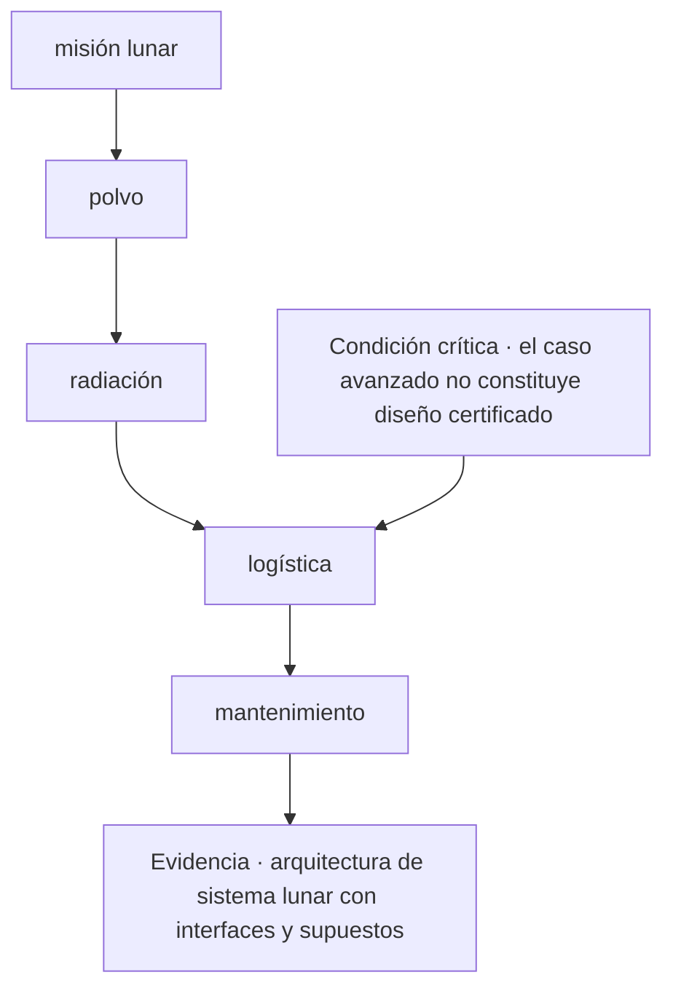
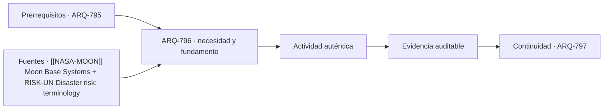

# ARQ-796 · Sistemas cerrados de agua, aire, energía y residuos

**Parte 80 · Fase III · Profundización y especialización · Edición 2026.10.**

Material educativo independiente. Esta clase no sustituye formación acreditada, experiencia supervisada, encargo profesional, normativa vigente, cálculo firmado, permiso ni revisión de especialistas. Los datos del caso son didácticos y deben reemplazarse por antecedentes verificables antes de una aplicación real.

## Pregunta central

¿Cómo abordar sistemas cerrados de agua, aire, energía y residuos y comprobar esta condición crítica: el caso avanzado no constituye diseño certificado?

## Propósito, prerrequisitos y resultados de aprendizaje

La clase profundiza en **sistemas cerrados de agua, aire, energía y residuos** para transferir fundamentos terrestres a condiciones extremas sin convertir especulación en certeza técnica. Recibe de `ARQ-795` un registro de decisiones, fuentes y pendientes. No basta con reconocer vocabulario: el estudiante debe transformar una pregunta en un procedimiento que otra persona pueda reconstruir, criticar y corregir.

Al terminar podrás:

1. **identificar** los datos, actores, escalas y límites que condicionan una decisión sobre sistemas cerrados de agua, aire, energía y residuos;
2. **comparar** al menos dos alternativas con una función común y criterios no intercambiables;
3. **producir** una evidencia propia para el portafolio de Fase III;
4. **justificar** qué parte puede resolver arquitectura, qué requiere colaboración especializada y qué permanece abierta;
5. **revisar** la decisión cuando cambie un supuesto, una fuente, una necesidad o una condición de uso.

La evidencia de salida será un componente del **proyecto final interdisciplinario con misión, interfaces, pruebas, operación y defensa** de la Parte 80.

## Conceptos y distinciones fundamentales

### Núcleo disciplinar de esta clase

Esta clase no trata el tema como una etiqueta. Su núcleo operativo articula **misión, ambiente extremo, soporte vital, logística, autonomía, redundancia, reparación, factor humano y transferencia terrestre**. Dentro de esa cadena, **sistemas cerrados de agua, aire, energía y residuos** ocupa la posición 6 de la parte y ensaya una medición, cálculo, simulación o contraste apropiado. La pregunta decisiva es qué cambia en el proyecto cuando cambia una de esas entradas, cómo se observa el efecto y quién tiene autoridad para aceptar la consecuencia.

La secuencia propia de la clase es **misión lunar → polvo → radiación → logística → mantenimiento**. Su resultado concreto será **arquitectura de sistema lunar con interfaces y supuestos**. La revisión debe comprobar que **el caso avanzado no constituye diseño certificado**. Estas tres frases funcionan como guía de lectura: el texto explica la secuencia, el ejercicio construye la evidencia y la evaluación intenta refutar una conclusión demasiado amplia.

El expediente específico debe poder aplicarse a **un hábitat remoto que debe sostener vida y trabajo durante una interrupción logística sin confundir analogía terrestre con certificación espacial**. Cada elemento debe conservar escala, fecha, versión, responsable y relación con el producto acumulativo de la Parte 80. Cuando el dato no existe, se registra el método para obtenerlo; cuando una atribución corresponde a otra disciplina, se documenta la interfaz y el punto de coordinación.

Antes de producir, separa cuatro estados dentro de **sistemas cerrados de agua, aire, energía y residuos**: el requisito que posee autoridad y versión; la preferencia que expresa un valor negociable; la hipótesis que permite avanzar y aún debe probarse; y la restricción que acota alternativas en este contexto. Escríbelos junto a **misión lunar**. Cuando uno cambie, recorre la secuencia y marca qué conclusiones dejan de ser válidas.

## Desarrollo paso a paso

### 1. Misión lunar

Empieza sin dibujar una solución. Describe qué se observa en **sistemas cerrados de agua, aire, energía y residuos**, quién lo experimenta y dónde termina el sistema que analizarás. El foco es **misión**: registra una evidencia a favor, una señal que la contradiga y un vacío que todavía no puedes llenar. **la pregunta central** entrega el punto de partida; **polvo** sólo puede comenzar cuando la escala, el periodo y las personas afectadas quedan visibles. Cierra este paso con un croquis o esquema de situación y una frase que pueda resultar falsa. Así, **misión lunar** abre una investigación en vez de decorar una decisión ya tomada.

### 2. Polvo

Convierte **polvo** en una mesa de clasificación. Una columna recibe datos confirmados; otra, requisitos con autoridad y versión; una tercera, hipótesis; y una cuarta, desconocidos. En **sistemas cerrados de agua, aire, energía y residuos**, la variable que merece atención es **ambiente extremo**. Comprueba unidades, fechas y procedencia antes de agrupar. Luego elige dos elementos que suelen confundirse y explica la diferencia con un ejemplo del caso. El resultado debe permitir pasar de **misión lunar** a **radiación** sin cambiar silenciosamente una definición. Si algo no cabe en ninguna columna, no lo fuerces: convierte esa incomodidad en una pregunta.

### 3. Radiación

Ahora cambia de lenguaje. Representa **radiación** mediante el medio que mejor revele **soporte vital**: planta para relaciones horizontales, sección para niveles y flujos, mapa para distribución, línea de tiempo para secuencias o diagrama para dependencias. En **sistemas cerrados de agua, aire, energía y residuos**, cada trazo debe responder qué muestra y qué oculta. Anota escala, orientación, unidades y fuente junto a la figura. Superpone una segunda capa con dudas o conflictos; no los borres para limpiar la composición. Pide a otra persona que explique cómo **polvo** se transforma en **logística** mirando sólo la gráfica. Lo que no pueda reconstruir señala la revisión necesaria.

### 4. Logística

Usa **logística** para explicar un mecanismo, no una coincidencia. Escribe una cadena breve: entrada → transformación → efecto → persona o sistema afectado. En **sistemas cerrados de agua, aire, energía y residuos**, sigue especialmente **logística** y dibuja al menos un camino alternativo. Cambia una entrada y anticipa qué parte de **mantenimiento** debería cambiar; después busca un caso que no obedezca esa expectativa. La explicación se acepta cuando distingue asociación, causa propuesta y límite de la evidencia. Si el salto desde **radiación** exige una pericia externa, formula la pregunta para esa especialidad y adjunta el antecedente que necesita para responder.

### 5. Mantenimiento

En **mantenimiento**, construye dos alternativas comparables para **sistemas cerrados de agua, aire, energía y residuos**. Mantén constante la función principal y declara qué varía; si las fronteras no coinciden, corrígelas antes de puntuar. Evalúa **autonomía** con una medida y con una observación cualitativa, porque una cifra única puede esconder distribución, experiencia o riesgo. Incluye una condición que no pueda compensarse con ventajas en otros criterios. La salida hacia **arquitectura de sistema lunar con interfaces y supuestos** debe conservar la opción descartada y el motivo. Después invierte una preferencia del encargo: si la elección no cambia, explica por qué; si cambia, identifica el supuesto que realmente gobernaba la decisión.

### Lo que une la secuencia

Los 5 pasos no son una receta universal. En esta clase ordenan una decisión sobre **sistemas cerrados de agua, aire, energía y residuos** dentro de **Entornos extremos, autonomía y proyecto interdisciplinario final** y conducen a **arquitectura de sistema lunar con interfaces y supuestos**. Pueden repetirse cuando aparece evidencia contradictoria, pero no intercambiarse sin explicación: saltar desde **misión lunar** hasta **mantenimiento** ocultaría precisamente el razonamiento que la entrega debe enseñar. La secuencia se detiene cuando **el caso avanzado no constituye diseño certificado** no puede demostrarse.

## Contexto histórico, social y profesional

El contexto de trabajo es **un hábitat remoto que debe sostener vida y trabajo durante una interrupción logística sin confundir analogía terrestre con certificación espacial**. Allí, el tema de sistemas cerrados de agua, aire, energía y residuos no aparece como un problema aislado: se cruza con misión, ambiente extremo, soporte vital, logística, autonomía, redundancia, reparación, factor humano y transferencia terrestre. El estudiante debe preguntar quién definió cada categoría, quién falta en el registro y qué decisión histórica o institucional explica la situación actual. Una tecnología nueva sólo se incorpora cuando mejora una observación, una coordinación o una prueba identificable; su novedad no constituye evidencia.

En una práctica profesional, arquitectura puede formular el problema espacial, relacionar escalas, representar alternativas y coordinar el expediente. Para esta clase debe asignar autores y revisores a **polvo**, **logística** y **arquitectura de sistema lunar con interfaces y supuestos**. Cuando una conclusión dependa de cálculo, diagnóstico o atribución regulada de otra disciplina, se redacta la pregunta de coordinación, se entrega el antecedente necesario y se conserva la respuesta. Esa interfaz también es parte del proyecto.

## Método: de la observación a una decisión trazable

1. **Ensaya: misión lunar.** Declara la entrada, realiza una operación visible y entrega algo que pueda usarse en **polvo**. Añade al margen la duda que todavía puede modificar el paso.
2. **Busca: polvo.** Declara la entrada, realiza una operación visible y entrega algo que pueda usarse en **radiación**. Añade al margen la duda que todavía puede modificar el paso.
3. **Coordina: radiación.** Declara la entrada, realiza una operación visible y entrega algo que pueda usarse en **logística**. Añade al margen la duda que todavía puede modificar el paso.
4. **Verifica: logística.** Declara la entrada, realiza una operación visible y entrega algo que pueda usarse en **mantenimiento**. Añade al margen la duda que todavía puede modificar el paso.
5. **Transfiere: mantenimiento.** Declara la entrada, realiza una operación visible y entrega algo que pueda usarse en **arquitectura de sistema lunar con interfaces y supuestos**. Añade al margen la duda que todavía puede modificar el paso.
6. **Intenta refutar el cierre.** Comprueba si **el caso avanzado no constituye diseño certificado**; si la respuesta depende sólo de la apariencia del producto, vuelve al primer paso que no tenga evidencia.

La herramienta elegida debe permitir ejecutar esta secuencia, no reemplazarla. Para **sistemas cerrados de agua, aire, energía y residuos**, anota entradas, unidades, versión y transformaciones; exporta un formato que otra persona pueda inspeccionar; y verifica **logística** por un medio independiente proporcional a su consecuencia. Si intervienen automatización o IA, conserva también la instrucción, el resultado original, la revisión humana y el motivo de cada corrección.

## Mapa visual de la decisión

El diagrama es específico de **sistemas cerrados de agua, aire, energía y residuos**. Se lee de arriba abajo y permite localizar un salto. Si el expediente pasa del primer al último nodo sin documentar los pasos intermedios, la conclusión todavía no es reproducible. La condición crítica entra antes del cierre porque debe cambiar o detener la decisión, no aparecer como advertencia tardía.

## Caso trabajado: EXP-796

El caso se sitúa en **un hábitat remoto que debe sostener vida y trabajo durante una interrupción logística sin confundir analogía terrestre con certificación espacial**. El equipo debe abordar **sistemas cerrados de agua, aire, energía y residuos** y entregar **arquitectura de sistema lunar con interfaces y supuestos**. La primera versión salta desde **misión lunar** hasta **mantenimiento**: presenta una respuesta terminada, pero no permite saber cómo se tomaron las decisiones intermedias.

La revisión devuelve el trabajo a **polvo** y **radiación**. El equipo separa datos confirmados, hipótesis y desconocidos; identifica qué representación hace visible el mecanismo y asigna a una persona la comprobación de **logística**. Esa corrección cambia la evidencia: deja de ser una afirmación ilustrada y se convierte en un procedimiento que otra persona puede repetir.

Antes de cerrar, la crítica aplica la condición **“el caso avanzado no constituye diseño certificado”**. Si no se satisface, la entrega permanece abierta aunque su presentación sea convincente. El resultado del caso EXP-796 es una versión revisada de **arquitectura de sistema lunar con interfaces y supuestos**, acompañada por la objeción que produjo el cambio y por un asunto que todavía requiere investigación o revisión especializada.

## Práctica guiada

Construye una primera versión de **arquitectura de sistema lunar con interfaces y supuestos** siguiendo los 5 pasos del diagrama. Bajo cada paso escribe una entrada, una operación y una salida. Marca con un signo de interrogación lo que todavía no conoces; no lo conviertas en cero, promedio o supuesto oculto.

Intercambia el trabajo con otra persona. Debe poder señalar dónde se comprueba **el caso avanzado no constituye diseño certificado** y reconstruir la transición desde **radiación** hasta **mantenimiento** sin explicación oral. Registra dos dudas de esa lectura y corrige al menos una. La primera versión, las objeciones y la versión revisada forman parte de la evidencia.

## Ejercicio autónomo

Aplica la secuencia **misión lunar → polvo → radiación → logística → mantenimiento** a otro contexto, escala o grupo de personas. Produce **arquitectura de sistema lunar con interfaces y supuestos**, una versión inicial y una revisada. Explica qué se mantuvo, qué cambió y por qué los parámetros del caso trabajado no podían copiarse.

**Evidencia mínima de sistemas cerrados de agua, aire, energía y residuos:** arquitectura de sistema lunar con interfaces y supuestos; diagrama de **misión lunar → polvo → radiación → logística → mantenimiento**; demostración de que **el caso avanzado no constituye diseño certificado**; y registro de una revisión que haya cambiado el resultado. Guarda el expediente en `evidence/ARQ-796/evidencia.md` y enlázalo desde tu portafolio.

## Errores frecuentes y cómo corregirlos

- **Fallo crítico de esta clase:** El caso avanzado no constituye diseño certificado. En **sistemas cerrados de agua, aire, energía y residuos**, localiza el paso que no lo demuestra y vuelve a producir la evidencia.
- **Comenzar por mantenimiento:** muestra una respuesta sin explicar cómo se llegó a ella. Recupera **misión lunar** y conserva las decisiones intermedias.
- **Tratar polvo como trámite:** deja sin fundamento lo que sigue. Escribe su entrada, su operación y una salida que otra persona pueda revisar.
- **Entregar arquitectura de sistema lunar con interfaces y supuestos sin procedencia:** una evidencia sin fecha, escala, autor o fuente pierde alcance. Completa esos cuatro campos junto al producto.
- **Copiar parámetros del caso:** la forma del método puede transferirse, pero sus valores deben volver a medirse en cada contexto.
- **Ocultar la objeción:** registra la crítica que produjo un cambio; una versión perfecta desde el inicio impide evaluar el proceso.

## Evaluación y criterios de aceptación

La evidencia se acepta cuando:

1. produce **arquitectura de sistema lunar con interfaces y supuestos** y responde explícitamente a la pregunta central;
2. diferencia datos, requisitos, hipótesis, preferencias y desconocidos;
3. compara alternativas con función y fronteras equivalentes o justifica la diferencia;
4. permite reconstruir al menos una comprobación, incluidas unidades, versión y fuente;
5. conserva una condición crítica fuera de cualquier promedio compensatorio;
6. identifica responsabilidades y no atribuye al estudiante competencias profesionales reguladas;
7. incluye revisión sustantiva entre dos versiones y explica la consecuencia;
8. demuestra que **el caso avanzado no constituye diseño certificado** y enlaza la evidencia con `ARQ-797`.

La rúbrica común permite comparar el avance del programa; estos criterios deciden la aceptación de **arquitectura de sistema lunar con interfaces y supuestos**. Una presentación convincente permanece pendiente cuando **el caso avanzado no constituye diseño certificado** no puede comprobarse o la fuente utilizada no sostiene la conclusión.

## Autoevaluación, recuperación y reflexión crítica

Sin mirar el texto, reconstruye la secuencia **misión lunar → polvo → radiación → logística → mantenimiento** y nombra la evidencia que produce cada transición. Explica por qué **el caso avanzado no constituye diseño certificado**. Si no puedes localizar esa comprobación en tu entrega, vuelve al diagrama y sustituye una afirmación vaga por una operación observable.

Para recuperar **sistemas cerrados de agua, aire, energía y residuos**, vuelve 24–48 horas después y dibuja de memoria **misión lunar → polvo → … → mantenimiento**. Aplícala a otro actor o escala y marca en otro color los parámetros que tuviste que volver a investigar. Cierra preguntando quién recibe el beneficio de **arquitectura de sistema lunar con interfaces y supuestos**, quién asume su costo, quién queda fuera de sus datos y quién podrá corregirla más adelante.

**Conexión siguiente:** `ARQ-797` reutiliza la matriz, la representación y el registro de cambios. Lleva la evidencia, no las cifras del caso.

<!-- pedagogia-2026:inicio -->
## Decisión pedagógica y posición curricular

### Por qué existe

Esta clase existe para resolver una necesidad concreta del recorrido: ¿Cómo abordar sistemas cerrados de agua, aire, energía y residuos y comprobar esta condición crítica: el caso avanzado no constituye diseño certificado?

### Por qué está exactamente aquí

Ocupa el lugar 6 de la Parte 80. Se estudia después de ARQ-795 · Construcción autónoma y mantenimiento remoto porque usa esa base para responder «¿Cómo abordar sistemas cerrados de agua, aire, energía y residuos y comprobar esta condición crítica: el caso avanzado no constituye diseño certificado?». Se ubica antes de ARQ-797 · Hábitat lunar: misión, polvo, radiación y logística porque la evidencia producida aquí debe estar disponible para ese paso.

- **Prerrequisitos:** `ARQ-795`
- **Capacidad que introduce:** La clase profundiza en sistemas cerrados de agua, aire, energía y residuos para transferir fundamentos terrestres a condiciones extremas sin convertir especulación en certeza técnica. Recibe de ARQ-795 un registro de decisiones, fuentes y pendientes. No basta con reconocer vocabulario: el estudiante debe transformar una pregunta en un procedimiento que otra persona pueda reconstruir, criticar y corregir.
- **Clases o experiencias que dependen de ella:** `ARQ-797`

El diagrama permite comprobar una relación que el texto lineal oculta con facilidad: esta clase recibe capacidades previas, toma decisiones apoyadas por fuentes, exige una experiencia y produce evidencia que habilita trabajo posterior. No representa un procedimiento de obra.

## Resultado observable, evidencia y evaluación

1. Identificar y delimitar las condiciones necesarias para responder la pregunta central de sistemas cerrados de agua, aire, energía y residuos.
2. Producir y comprobar la evidencia declarada por la clase: La clase profundiza en sistemas cerrados de agua, aire, energía y residuos para transferir fundamentos terrestres a condiciones extremas sin convertir especulación en certeza técnica. Recibe de ARQ-795 un registro de decisiones, fuentes y pendientes. No basta con reconocer vocabulario: el estudiante debe transformar una pregunta en un procedimiento que otra persona pueda reconstruir, criticar y corregir.
3. Justificar una decisión de sistemas cerrados de agua, aire, energía y residuos mediante fuentes, supuestos, alternativas y límites explícitos.

## Actividad, evidencia y criterio de aceptación

**Actividad:** Construye una primera versión de arquitectura de sistema lunar con interfaces y supuestos siguiendo los 5 pasos del diagrama. Bajo cada paso escribe una entrada, una operación y una salida. Marca con un signo de interrogación lo que todavía no conoces; no lo conviertas en cero, promedio o supuesto oculto.

**Evidencia mínima:** La clase profundiza en sistemas cerrados de agua, aire, energía y residuos para transferir fundamentos terrestres a condiciones extremas sin convertir especulación en certeza técnica. Recibe de ARQ-795 un registro de decisiones, fuentes y pendientes. No basta con reconocer vocabulario: el estudiante debe transformar una pregunta en un procedimiento que otra persona pueda reconstruir, criticar y corregir.

**Archivo sugerido:** `evidence/ARQ-796/evidencia.md`.

**Criterio de aceptación:** la entrega se acepta cuando:

- La entrega responde explícitamente a la pregunta: ¿Cómo abordar sistemas cerrados de agua, aire, energía y residuos y comprobar esta condición crítica: el caso avanzado no constituye diseño certificado?
- La actividad conserva las fronteras del caso y permite reconstruir el procedimiento: Construye una primera versión de arquitectura de sistema lunar con interfaces y supuestos siguiendo los 5 pasos del diagrama. Bajo cada paso escribe una entrada, una operación y una salida. Marca con un signo de interrogación lo que todavía no conoces; no lo conviertas en cero, promedio o supuesto oculto.
- Cada afirmación externa puede seguirse hasta una fuente, su alcance consultado y su límite.
- La evidencia deja disponible una entrada comprobable para ARQ-797.
- - Fallo crítico de esta clase: El caso avanzado no constituye diseño certificado. En sistemas cerrados de agua, aire, energía y residuos , localiza el paso que no lo demuestra y vuelve a producir la evidencia.

La [rúbrica común](../../docs/RUBRICA_COMUN.md) complementa estos criterios; no los reemplaza. Una entrega puede superar un promedio y continuar pendiente si oculta una condición crítica.

## Trazabilidad de las decisiones

| # | Decisión o fundamento | Fuente utilizada | Aplicación y límite en esta clase |
|---:|---|---|---|
| 1 | Arquitectura de sistemas, operaciones, logística, autonomía y desafíos ambientales para presencia lunar sostenida. | [[[NASA-MOON]] Moon Base Systems](https://www.nasa.gov/moonbase-systems/) | Consulta: página o documento oficial identificado en el enlace. Límite: Material de programa espacial; se estudia como caso avanzado y no desplaza competencias terrestres fundamentales. Fecha de |
| 2 | Vocabulario de amenaza, exposición, vulnerabilidad y capacidad. | [RISK-UN Disaster risk: terminology](https://www.undrr.org/terminology/disaster-risk) | Consulta: página o documento oficial identificado en el enlace. Límite: La terminología ordena el análisis; no produce por sí sola un mapa, cálculo o certificación de seguridad. Fecha de |

La tabla permite auditar las relaciones; la explicación, el caso y la práctica de la clase siguen siendo la documentación principal.

## Autoevaluación, recuperación y continuidad

### Errores diagnósticos

Antes de avanzar, comprueba si puedes reconstruir cada resultado sin mirar la solución, señalar qué evidencia lo sostiene y nombrar una condición que obligaría a revisar tu decisión. Conserva la primera versión, la objeción recibida y la revisión.

**Conexión siguiente:** La continuidad inmediata es ARQ-797 · Hábitat lunar: misión, polvo, radiación y logística; conserva el método y vuelve a verificar datos y límites.
<!-- pedagogia-2026:fin -->

## Fuentes y alcance de uso

### [[NASA-MOON]] Moon Base Systems

National Aeronautics and Space Administration. [https://www.nasa.gov/moonbase-systems/](https://www.nasa.gov/moonbase-systems/)

**Consulta:** página o documento oficial identificado en el enlace. **Apoyo:** Arquitectura de sistemas, operaciones, logística, autonomía y desafíos ambientales para presencia lunar sostenida. **Límite:** Material de programa espacial; se estudia como caso avanzado y no desplaza competencias terrestres fundamentales. **Fecha de consulta:** 6 de octubre de 2026.

### [[UNDRR-RISK]] Disaster risk terminology

Oficina de las Naciones Unidas para la Reducción del Riesgo de Desastres. [https://www.undrr.org/terminology/disaster-risk](https://www.undrr.org/terminology/disaster-risk)

**Consulta:** página o documento oficial identificado en el enlace. **Apoyo:** Vocabulario de amenaza, exposición, vulnerabilidad y capacidad. **Límite:** La terminología ordena el análisis; no produce por sí sola un mapa, cálculo o certificación de seguridad. **Fecha de consulta:** 6 de octubre de 2026.
