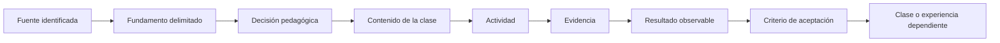

# Auditoría pedagógica y trazabilidad de decisiones

> **Alcance histórico.** Esta auditoría documenta la consolidación del núcleo ARQ-001–680. La edición 2026.10 extendió el mismo contrato verificable a ARQ-681–800; sus conteos actuales se publican en [Estado verificable](ESTADO_VERIFICABLE.md) y las decisiones de ampliación en el [Informe de integración 2026.10](INFORME_INTEGRACION_2026-10.md).

**Corte verificable:** 28 de septiembre de 2026  
**Principio rector:** **Una clase no es solo un tema: es una decisión sustentada.**

## 1. Diagnóstico inicial

El repositorio ya contenía 680 clases redactadas, preguntas centrales, prácticas, fuentes, límites y un sitio navegable. Sin embargo, la capa añadida en la revisión anterior confundía **presencia documental** con **justificación pedagógica**. El archivo `scripts/apply_pedagogy.py` asignaba el mismo tipo, evidencia, errores, rúbrica y diagrama a grupos completos definidos por número de parte. La clase cambiaba de título, pero la razón de su existencia y de su posición no quedaba demostrada.

La medición reproducible separa ahora ambos estados:

| Medida | Resultado inicial |
|---|---:|
| Clases con pregunta, actividad, evidencia, errores y fuentes | 680/680 |
| Clases con ancla bibliográfica dentro del desarrollo | 620/680 |
| Contratos de decisión revisados en profundidad | 0/680 |
| Mayor reutilización de un mismo bloque generado | 270 clases |
| Títulos exactamente duplicados después de normalizar | 0 |

La conclusión es deliberadamente incómoda: **680 secciones presentes no equivalen a 680 decisiones justificadas**. La cobertura estructural se conserva como línea base; la revisión de fondo se cuenta aparte.

## 2. Problemas encontrados

1. La frase rectora aparecía en el README, pero el sistema verificaba encabezados y no la cadena necesidad → fundamento → fuente → actividad → evidencia → continuidad.
2. Los README de las partes enumeraban preguntas y resultados, pero no explicaban por qué cada clase ocupaba su lugar.
3. La bibliografía central permitía localizar usos, pero no vinculaba necesariamente una fuente con la decisión de incluir o secuenciar una clase.
4. El diagrama común mostraba un ciclo abstracto aplicable a casi cualquier asignatura; no hacía visible la dependencia curricular concreta.
5. La rúbrica común sustituía de hecho criterios de aceptación específicos.
6. “Continuidad” podía quedar satisfecha por una palabra o una frase general, sin identificar clases dependientes.
7. La documentación anterior afirmaba paridad aplicada con la referencia antes de distinguir estructura, profundidad y calidad editorial.
8. La clase final ARQ-680 era sensiblemente más breve y menos trazable que varias clases intermedias, una inversión de la progresión esperada.

## 3. Análisis de `modern-cybersecurity-program`

Se inspeccionó la revisión `d558bc26a01d89f2288f47c26d8b718e924b17bd`, con 360 clases, 20 partes y 381 archivos `README.md` bajo `classes/`. Se revisaron su portada, índice, partes inicial, intermedia y final, cinco clases representativas, registro de fuentes, generadores, validadores y workflows.

### Casos representativos

| Caso | Qué funciona | Qué no se debe copiar |
|---|---|---|
| Clase 001, fundamentos | narrativa causal, resultados verificables, dos diagramas interpretados, laboratorio guiado, reto con aceptación, errores y navegación | la anatomía exacta no es obligatoria para todas las disciplinas |
| Clase 150, ransomware | relaciona causa, decisión, consecuencia y práctica; el diagrama está explicado | la lista final de referencias no siempre identifica qué afirmación exacta sustenta |
| Clase 221, responsabilidad cloud | criterio explícito de dominio y fuentes oficiales anotadas | el lenguaje de proveedores no se transfiere a arquitectura |
| Clase 240, práctica SCA | teoría y laboratorio ejecutable convergen en una evidencia verificable | contiene al menos una cifra amplia cuya fuente no queda localizada en la afirmación |
| Clase 360, cierre | intenta integrar y cerrar la ruta | usa verbos vagos, repite evidencia genérica, contiene un glosario mecánico y un rótulo de diagrama deteriorado |

La referencia funciona mejor cuando el README de una parte explica clase por clase la progresión y cuando una clase integra explicación, práctica, criterios, errores y navegación. También demuestra un riesgo importante: una plantilla extensa puede degradarse en contenido mecánico. Por eso se adopta su **función documental**, no su superficie.

## 4. Patrones reutilizables identificados

- README de parte como argumento de progresión, no solamente índice.
- Resultado observable unido a una evidencia y a una condición de aceptación.
- Explicación causal antes de la actividad.
- Práctica reproducible o experiencia auténtica adecuada al dominio.
- Errores frecuentes usados como diagnóstico.
- Navegación hacia conocimientos previos y posteriores.
- Registro bibliográfico offline determinista y actualización de vigencia separada de CI.
- Validación de estructura, navegación, UTF-8, enlaces, generación y fuentes.
- Diagramas interpretados en el texto.
- Auditoría por unidades representativas antes de multiplicar el patrón.

## 5. Patrones descartados o limitados

- **Plantilla idéntica para toda clase:** descartada; produce cumplimiento mecánico.
- **Laboratorio ejecutable obligatorio:** adaptado a observación, cálculo, expediente, maqueta, simulación o crítica según la clase.
- **CTF, herramientas ofensivas, certificaciones y aplicación móvil:** ajenos al dominio.
- **Cuota uniforme de palabras o diagramas:** descartada; profundidad y visualización dependen de la decisión.
- **Referencia final sin mapeo:** insuficiente; una fuente debe declarar qué decisión apoya y con qué límite.
- **Control de red obligatorio en cada CI:** descartado por fragilidad; la vigencia externa requiere un proceso separado y fechado.

## 6. Estructura documental propuesta y probada

Cada contrato revisado contiene:

1. necesidad educativa o profesional;
2. razón de la posición exacta;
3. prerrequisitos identificados;
4. capacidad que introduce;
5. clases o experiencias dependientes;
6. resultados con verbos observables;
7. actividad auténtica;
8. evidencia mínima;
9. criterios de aceptación específicos;
10. decisión → fuente → aplicación → límite;
11. conexión narrativa con lo siguiente.

El desarrollo principal de la clase permanece intacto como narrativa. La matriz sirve para auditarlo y nunca lo sustituye.

## 7. Clases piloto revisadas

| Clase | Perfil de prueba | Decisión central | Salida verificable |
|---|---|---|---|
| ARQ-001 | inicial y conceptual | definir arquitectura como sistema antes de representar partes aisladas | mapa de ciclo de vida y registro de cinco decisiones |
| ARQ-240 | intermedia y cuantitativa | comparar impacto por servicio, no por una cifra sin frontera | inventario normalizado, sensibilidad y conclusión limitada |
| ARQ-350 | normativa e interdisciplinaria | separar documento, vigencia, aplicabilidad, evidencia y autoridad | matriz normativa y registro de cambios |
| ARQ-540 | avanzada y práctica | integrar una terminal por cadenas, interfaces y fases | expediente con áreas, flujos, alternativas y pendientes |
| ARQ-680 | final e integradora | defender una decisión y permitir reconstruirla en ambos sentidos | dossier, matriz bidireccional, cambios y acta de objeciones |

Los contratos canónicos están en `data/pedagogical-decisions.json`. El generador inserta su contenido en la clase; no intenta inferirlo desde el título.

### Extensión al programa completo

Después de comprobar los pilotos, el patrón se extendió a las 680 clases desde cinco entradas de verdad de cada documento: pregunta, resultado, práctica, fuentes y vecindad curricular. El manifiesto `data/pedagogical-decisions-generated.json` conserva las 680 cadenas y `scripts/build_pedagogical_decisions.py --check` demuestra que no están desincronizadas.

| Control posterior | Resultado |
|---|---:|
| Cadenas específicas | 680/680 |
| Clases sin contrato | 0 |
| Pilotos editoriales manuales preservados | 5 |
| Mayor repetición literal de un bloque completo | 1 |
| Títulos normalizados duplicados | 0 |

El generador no usa el título como única entrada ni asigna una justificación por “tipo de parte”. Reconstruye el problema y la evidencia declarados por la clase, extrae prerrequisitos explícitos, localiza fuentes del registro central y contrasta clases vecinas y referencias posteriores. El [estándar obligatorio](ESTANDAR_DOCUMENTACION_CLASE.md) define qué debe revisarse cuando esa síntesis se modifica.

## 8. Decisiones pedagógicas justificadas

- ARQ-001 no tiene prerrequisito: crea el marco con que se interpretará el resto.
- ARQ-240 cierra sistemas cementicios porque necesita composición, dosificación, exposición y reparación antes de comparar impacto.
- ARQ-350 cierra sismorresistencia porque la lectura normativa necesita un modelo previo del fenómeno y prepara la lectura jurídica posterior.
- ARQ-540 cierra aeropuertos porque integra nueve clases de subsistemas y prepara comparaciones de nodos de transporte.
- ARQ-680 sigue a ARQ-679 porque primero se aprende a transferir mecanismos sin copiar parámetros y sólo entonces se defiende una síntesis.

Cada afirmación está desarrollada en el contrato y en la clase correspondiente; esta lista es un resumen, no su sustituto.

## 9. Fuentes utilizadas y jerarquía

Los pilotos priorizan organismos oficiales y estándares: UNESCO–UIA, BCN/LeyChile, UNDRR, ISO, FAA, ICAO, DGAC, NIST/FEMA y NASA. NRMCA se usa como fuente técnica sectorial para EPD y materiales cementicios, con su alcance declarado. Una ficha pública de ISO sólo respalda la existencia y el alcance público del estándar; no se presenta como lectura integral ni como cumplimiento.

El registro bibliográfico global conserva título, autoridad, localizador, fecha cuando consta, tipo, uso, alcance y límite. Los contratos añaden la relación que faltaba: **qué decisión pedagógica sostiene cada identificador de fuente**.

## 10. Trazabilidad fuente → clase y retorno



El recorrido inverso se comprueba comenzando por un criterio de aceptación y regresando por evidencia, actividad, contenido, decisión, fundamento y fuente. El validador falla si un contrato piloto cita un identificador que no aparece en las fuentes de su clase.

## 11. Visualizaciones incorporadas

Las 680 clases sustituyen el ciclo genérico por un diagrama de dependencias específico: prerrequisitos y fuentes convergen en la decisión; la decisión conduce a actividad, evidencia y continuidad. Este gráfico se mantiene porque muestra simultáneamente dos entradas y una salida curricular que resultarían difíciles de comparar en un párrafo. Los cinco pilotos recibieron además revisión editorial manual profunda. No se añadió otro diagrama cuando la narrativa o una tabla ya resolvían la relación.

## 12. Registro de cambios y consecuencias

| Problema | Evidencia | Decisión | Archivo | Modificación | Consecuencia esperada |
|---|---|---|---|---|---|
| bloque genérico por familia | hasta 270 clases compartían una misma firma | sustituir la clasificación por contratos específicos | `data/pedagogical-decisions-generated.json` | 680 cadenas reproducibles; cinco conservan revisión manual profunda | cada clase expone una necesidad y una evidencia propias sin ocultar el nivel de revisión |
| generador infería desde título/parte | `lesson_kind(part)` decidía la capa pedagógica | reconstruir desde pregunta, resultado, prerrequisitos, práctica, retroalimentación, fuentes y vecindad | `scripts/build_pedagogical_decisions.py` y `scripts/apply_pedagogy.py` | generador determinista y publicación de los 680 contratos | una justificación ya no puede proceder sólo del nombre o del número de parte |
| no existía un estándar editorial único | los requisitos estaban dispersos entre README, plantillas y validadores | declarar un protocolo obligatorio de creación, revisión y aceptación | `docs/ESTANDAR_DOCUMENTACION_CLASE.md` y `CONTRIBUTING.md` | anatomía narrativa, jerarquía de fuentes, metadatos, estados y lista de aceptación | autores y revisores aplican el mismo criterio verificable |
| índices decorativos | los README de parte enumeraban clases pero no justificaban el recorrido | publicar diez síntesis de decisión y sus transiciones por parte | `scripts/generate_curriculum_docs.py` y `classes/parte-*/README.md` | 68 índices documentan 10/10 cadenas | la progresión puede auditarse por bloque sin reemplazar la lectura de cada clase |
| referencias sin decisión visible | la bibliografía trazaba uso, pero no siempre qué decisión respaldaba | unir fundamento, fuente, aplicación y límite dentro de cada clase | `scripts/audit_pedagogical_traceability.py` y `classes/parte-*/ARQ-*.md` | trazabilidad visible en 680/680 clases | una fuente ausente o una localización desincronizada rompe CI |
| estado documental difícil de verificar | el README podía afirmar cobertura sin demostrar sincronía | separar fuente de verdad, salida generada y límite abierto | `README.md`, `docs/ESTADO_VERIFICABLE.md` y `.github/workflows/ci.yml` | cifras auditadas y gates `--check` | la portada distingue cobertura, revisión manual y revisión externa pendiente |
| documentación profesional poco visible en Pages | el método quedaba enterrado entre archivos del repositorio | publicar estándar, auditoría, catálogo y estado en el portal | `scripts/build_site.py` y `site/` | páginas HTML navegables y enlazadas desde la portada | el lector puede comprobar el método sin conocer la estructura interna del repositorio |
| cierre débil | ARQ-680 tenía tres fichas mínimas | ampliar uso, aplicación, límite y anclas | `classes/parte-68/ARQ-680.md` | referencias contextualizadas | defensa final reconstruible |

## 13. Validaciones

Comandos canónicos:

```bash
python scripts/audit_pedagogical_traceability.py --json
python scripts/generate_curriculum_docs.py --check
python scripts/apply_pedagogy.py --check
python scripts/build_bibliography.py --check
python scripts/validate_repo.py
python scripts/build_site.py
python scripts/validate_repo.py
```

El nuevo gate comprueba esquema, estado de revisión, longitud mínima de explicaciones, identificadores curriculares, verbos observables, fundamentos, fuentes declaradas, títulos duplicados y cobertura global medida.

## 14. Problemas pendientes

- Las **680/680 clases** tienen cadena específica de necesidad, posición, prerrequisitos, resultados, actividad, evidencia, fuentes y continuidad. Cinco conservan revisión editorial manual profunda; la revisión externa por especialistas continúa separada.
- **59 clases** no contienen todavía una ancla de fuente dentro del desarrollo, aunque sí poseen sección bibliográfica.
- La vigencia y disponibilidad en red de las URLs requiere una comprobación separada; CI valida offline el registro, no la verdad externa del enlace.
- Los 68 README de parte explican las diez decisiones y transiciones; la calidad de esas relaciones debe seguir contrastándose durante futuras revisiones disciplinares.
- Las similitudes conceptuales requieren revisión humana; la ausencia de títulos idénticos no demuestra ausencia de contenido duplicado.

Estos pendientes son alcance editorial real, no errores ocultos por una cifra de cobertura.

## 15. Antes y después

**Antes:** “Tipo de clase: conceptual”, una evidencia común por categoría, un diagrama pregunta → método → transferencia y tres preguntas reutilizadas.

**Después en ARQ-001:** se explica por qué inaugura el currículo, se declaran cinco dependencias, tres resultados observables, cuatro decisiones enlazadas a fuentes, una actividad concreta y cuatro condiciones de aceptación.

**Antes en ARQ-680:** la lista de tres fuentes sólo declaraba “uso y límite” en dos líneas y el cierre dependía de una rúbrica común.

**Después:** cada fuente aparece en la afirmación que apoya, registra organismo, fecha, consulta, aplicación y límite; la clase exige una matriz bidireccional, versiones y acta de objeciones, y conecta explícitamente con EST-08.

## Regla de cierre

Una clase se marca `corpus-reviewed` cuando la cadena fue reconstruida desde su texto completo, práctica, fuentes y vecindad y superó los controles automáticos. Sólo se marca como piloto de **revisión editorial manual profunda** cuando además una revisión crítica puede defender cada componente del contrato. Añadir texto, una fila o una URL no basta para ninguno de los dos estados.
